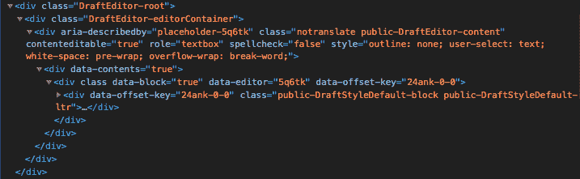
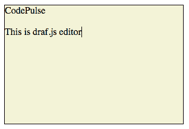

# 如何设置 Draft.js 编辑器的样式

> 原文：<https://dev.to/tumee/how-to-style-draft-js-editor-3da2>

在这篇文章中，我们将看看如何设计 Draft.js 编辑器组件的样式。我们将使编辑器多行，可滚动，并添加背景和边框样式。Draft.js 本身没有为编辑器提供任何默认样式，因此编辑器的样式完全留给了用户。然而，可能有点不清楚如何设计 Draft.js 编辑器的样式，所以这是我们将在这篇文章中学习的内容。

你可以在我的在线课程中了解更多关于 Draft.js 的信息，你可以免费获得(限时优惠)！[阅读更多](https://tuomokankaanpaa.com/blog/rich-text-editing-in-react-with-draft-js-course/)。

# Style Draft.js 编辑器

让我们首先创建一个非常基本的编辑器组件。我将使用显示在 [Draft.js docs](https://draftjs.org/docs/getting-started.html#usage) 中的文件。

```
class MyEditor extends React.Component {
  constructor(props) {
    super(props);
    this.state = {editorState: EditorState.createEmpty()};
    this.onChange = (editorState) => this.setState({editorState});
  }
  render() {
    return (
        <Editor editorState={this.state.editorState} onChange={this.onChange} />
    );
  }
} 
```

<svg width="20px" height="20px" viewBox="0 0 24 24" class="highlight-action crayons-icon highlight-action--fullscreen-on"><title>Enter fullscreen mode</title></svg> <svg width="20px" height="20px" viewBox="0 0 24 24" class="highlight-action crayons-icon highlight-action--fullscreen-off"><title>Exit fullscreen mode</title></svg>

现在，如果我们渲染这个组件，我们可以看到它基本上是一个没有任何边框的文本输入(我们真的看不到它)，它只有一行。这很少是我们想要的。因此，让我们用开发工具来检查它，以便更好地了解如何设计它。

[](https://res.cloudinary.com/practicaldev/image/fetch/s--t1FUcNEf--/c_limit%2Cf_auto%2Cfl_progressive%2Cq_auto%2Cw_880/https://thepracticaldev.s3.amazonaws.com/i/a6d982u6n5dlelz9ixfo.png) 
从 dev-tools 中我们可以看到有三个 div，它们有以下类:DraftEditor-root、DraftEditor-editorContainer 和 public-DraftEditor-content。我们可以用 CSS 将这三个类作为目标，以便对编辑器进行样式化。

假设我们希望我们的编辑器的高度为 200 像素，宽度为 300 像素。我们也希望它有黑色边框和米色背景。这就是它看起来的样子。

[](https://res.cloudinary.com/practicaldev/image/fetch/s--ndDoHUMy--/c_limit%2Cf_auto%2Cfl_progressive%2Cq_auto%2Cw_880/https://thepracticaldev.s3.amazonaws.com/i/5e4c2744w3obb2bm6pl2.png) 
我们需要给`DraftEditor-root`元素添加`border`、`background-color`、`height`和`width`属性。我们还应该为它添加`overflow-y: auto`，这样编辑器就可以滚动了。但是如果我们这样做，可写区域仍然是一行的高度。所以我们仍然需要做的是用类`DraftEditor-editorContainer`和`public-DraftEditor-content`将`height: 100%`添加到元素中。我们可以将这些样式添加到 styles.css 文件中，如下所示。

```
div.DraftEditor-root {
  border: 1px solid #000;
  background-color: beige;
  height: 200px;
  width: 300px;
  overflow-y: auto;
}
div.DraftEditor-editorContainer,
div.public-DraftEditor-content {
  height: 100%;
} 
```

<svg width="20px" height="20px" viewBox="0 0 24 24" class="highlight-action crayons-icon highlight-action--fullscreen-on"><title>Enter fullscreen mode</title></svg> <svg width="20px" height="20px" viewBox="0 0 24 24" class="highlight-action crayons-icon highlight-action--fullscreen-off"><title>Exit fullscreen mode</title></svg>

最后，让我们导入 styles.css 以便应用样式。

```
import './styles.css'; 
```

<svg width="20px" height="20px" viewBox="0 0 24 24" class="highlight-action crayons-icon highlight-action--fullscreen-on"><title>Enter fullscreen mode</title></svg> <svg width="20px" height="20px" viewBox="0 0 24 24" class="highlight-action crayons-icon highlight-action--fullscreen-off"><title>Exit fullscreen mode</title></svg>

[这里的](https://3kgxs.codesandbox.io/)是完整组件的 codesandbox。下面是我做这个例子的视频。

[https://www.youtube.com/embed/u3R5M1mqF-s](https://www.youtube.com/embed/u3R5M1mqF-s)

# 结论

设计 Draft.js 编辑器的样式与设计任何其他 html 元素的样式没有什么不同。诀窍在于，您需要理解什么样的 Draft.js 编辑器组件呈现给 DOM，然后正确地将呈现的元素作为目标。正如我们所看到的，基本的样式可以通过将编辑器组件呈现给 DOM 的三个元素作为目标来完成。

# TL；速度三角形定位法(dead reckoning)

[这里的](https://3kgxs.codesandbox.io/)是这个例子的 codesandbox。通过定位以下三个类来设计编辑器的样式:DraftEditor-root、DraftEditor-editorContainer 和 public-DraftEditor-content。

也记得订阅我的时事通讯，关注关于现代 web 开发的最新新闻和帖子。我也为时事通讯订阅者分享独家的提示和技巧！可以在这里订阅[。](http://tuomokankaanpaa.com/newsletter)

* * *

*最初发布于 2019 年 6 月 16 日[tuomokankaanpaa.com](https://tuomokankaanpaa.com/blog/how-to-style-draft-js-editor/)。*