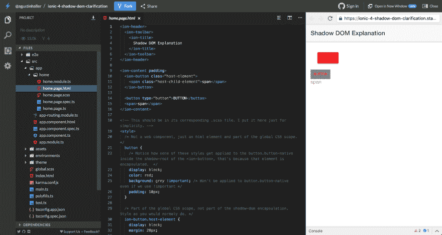
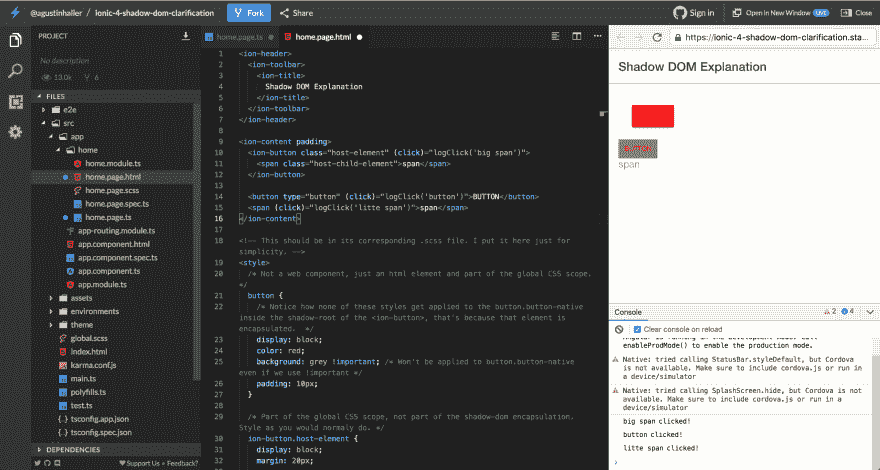
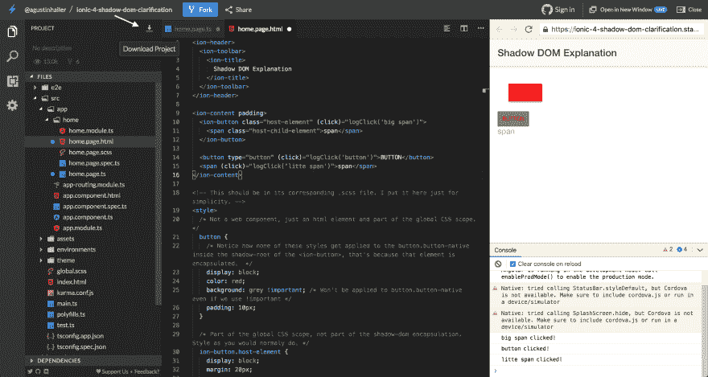
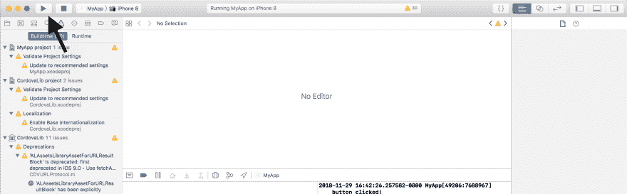
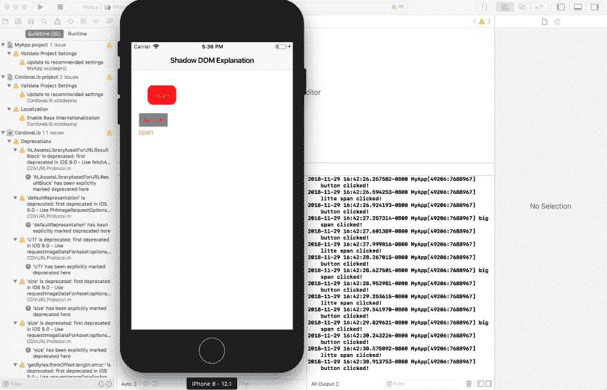

# 离子愚蠢简单。

> 原文：<https://dev.to/gpynes/ionic-stupid-simple-51a7>

# 入门前

这是我发现的一种快速简单的方法，可以让您在自己的设备上构建一个混合应用程序。这绝不是“最好”的方式，但该死的是它简单而快速地开始。我认为随着最近出现的所有工具，应用程序开发的未来看起来非常令人兴奋。还有！如果你有其他你喜欢的非常好的跨平台设置，我应该看看。请在下面留下评论，这样我就可以看看了！

# 先决条件+免责声明

**免责声明**
我将在 mac 上构建这个，对于 ios，我不熟悉 windows 和 android，所以不确定这个教程如何移植到他们身上。如果在你尝试的时候出现了差异，我很乐意听到它，并了解更多我不太熟悉的系统！

**你需要的东西**
本教程需要在你的机器上本地安装[节点](//nodejs.org)和 [xcode](https://developer.apple.com/xcode/) 。

# 入门！！

## 叠闪

我现在最喜欢的新技术工具之一是 [stackblitz](https://stackblitz.com) 它是一个很棒的工具，可以快速完成概念验证或与他人分享错误。它是高度可配置的，并且带有已经设置好的最常见的开发环境。为了这个教程，我在 stackblitz 上搜索了一个已经制作好的 [ionic](https://ionicframework.com/) 项目，我们可以在这个教程中使用它。点击此[链接](https://stackblitz.com/edit/ionic-4-shadow-dom-clarification)打开项目。

应该是这样的:
[](https://res.cloudinary.com/practicaldev/image/fetch/s--csPZdeiZ--/c_limit%2Cf_auto%2Cfl_progressive%2Cq_auto%2Cw_880/https://thepracticaldev.s3.amazonaws.com/i/oknhcp5gvoesz6kp7bbk.png)

## 做一些编辑

这个项目没有任何实际的功能，所以我想添加点击听众。

打开`src/app/home/home.page.html`文件，替换`<ion-content>`标签如下:

```
<ion-content padding>
  <ion-button class="host-element" (click)="logClick('big span')">
    <span class="host-child-element">span</span>
  </ion-button>

  <button type="button" (click)="logClick('button')">BUTTON</button>
  <span (click)="logClick('litte span')">span</span>
</ion-content> 
```

然后在`src/app/home/home.page.ts`文件中把这个日志方法添加到`HomePage`类中:

```
 logClick = (msg) => console.log(msg, 'clicked!') 
```

Stackblitz 应该会为您热重装，这样您只需点击按钮，就可以看到如下日志消息:
[](https://res.cloudinary.com/practicaldev/image/fetch/s--AF17p9Lr--/c_limit%2Cf_auto%2Cfl_progressive%2Cq_auto%2Cw_880/https://thepracticaldev.s3.amazonaws.com/i/gbotx0gdyqgwf12mqqbe.png)

# 在设备上获取

好了，我们能够在浏览器中编辑一些代码，并在同一个页面中看到实时结果，开发人员的生活非常美好！但是如何把它从浏览器下载到实际的手机上呢？这其实也很简单。

## 下载代码。

首先，通过点击 stackblitz 菜单左上角的 download 按钮下载代码。
[T3】](https://res.cloudinary.com/practicaldev/image/fetch/s--IQ7c5_Bd--/c_limit%2Cf_auto%2Cfl_progressive%2Cq_auto%2Cw_880/https://thepracticaldev.s3.amazonaws.com/i/x96wer3ixdsuh4a40nop.png)

下载后，导航到新下载的项目并运行:

`npm i`安装所有依赖项
`npm i -D cordova @ionic/ng-toolkit`将 cordova 和 ionic 的工具安装到项目中进行构建。

现在只需运行:
`npx ionic cordova build ios`即可构建到 ios 的项目。

如果您得到如下所示的错误:

```
chunk {cordova} cordova.js, cordova.js.map (cordova) 76.3 kB  [rendered]
chunk {main} main.js, main.js.map (main) 653 bytes [initial] [rendered]
chunk {polyfills} polyfills.js, polyfills.js.map (polyfills) 92.4 kB [initial] [rendered]
chunk {runtime} runtime.js, runtime.js.map (runtime) 6.08 kB [entry] [rendered]
chunk {styles} styles.js, styles.js.map (styles) 67.2 kB [initial] [rendered]

ERROR in node_modules/@ionic/core/dist/types/components.d.ts(5565,13): error TS2320: Interface 'HTMLIonInputElement' cannot simultaneously extend types 'IonInput' and 'HTMLStencilElement'.
  Named property 'focus' of types 'IonInput' and 'HTMLStencilElement' are not identical.
node_modules/@ionic/core/dist/types/components.d.ts(5811,13): error TS2320: Interface 'HTMLIonSearchbarElement' cannot simultaneously extend types 'IonSearchbar' and 'HTMLStencilElement'.
  Named property 'focus' of types 'IonSearchbar' and 'HTMLStencilElement' are not identical.
node_modules/@ionic/core/dist/types/components.d.ts(5907,13): error TS2320: Interface 'HTMLIonTextareaElement' cannot simultaneously extend types 'IonTextarea' and 'HTMLStencilElement'.
  Named property 'focus' of types 'IonTextarea' and 'HTMLStencilElement' are not identical.
node_modules/@ionic/core/dist/types/utils/overlays-interface.d.ts(37,52): error TS2344: Type 'HTMLIonModalElement' does not satisfy the constraint 'Required<ModalOptions<ComponentRef>>'.
  Types of property 'componentProps' are incompatible.
    Type 'unknown' is not assignable to type '{ [key: string]: any; }'.
node_modules/@ionic/core/dist/types/utils/overlays-interface.d.ts(37,248): error TS2344: Type 'HTMLIonPopoverElement' does not satisfy the constraint 'Required<PopoverOptions<ComponentRef>>'.
  Types of property 'componentProps' are incompatible.
    Type 'unknown' is not assignable to type '{ [key: string]: any; }'.

[ERROR] An error occurred while running subprocess ng.

        ng run app:ionic-cordova-build --platform=ios exited with exit code 1.

        Re-running this command with the --verbose flag may provide more information.
Computers-MacBook-Pro:ionic-4-shadow-dom-clarification (2) computer$ 
```

下面继续，否则直接跳到[这里](#running-it)。

在每一行上面添加`// @ts-ignode`:
`node_modules/@ionic/core/dist/types/component.d.ts:5565`

`node_modules/@ionic/core/dist/types/component.d.ts:5811`

`node_modules/@ionic/core/dist/types/component.d.ts:5907`

`node_modules/@ionic/core/dist/types/utils/overlays-interface.d.ts:37`

**请注意，当您添加每个`// @ts-ignore`时，它将添加到其下每个错误的行数**

大概是这样的:
`component.d.ts`

```
...
 // @ts-ignore
  interface HTMLIonInputElement extends Components.IonInput, HTMLStencilElement {}
...
  // @ts-ignore
  interface HTMLIonSearchbarElement extends Components.IonSearchbar, HTMLStencilElement {}
...
...
  // @ts-ignore
  interface HTMLIonTextareaElement extends Components.IonTextarea, HTMLStencilElement {}
... 
```

`overlays-interface.d.ts`

```
...
// @ts-ignore
export declare type HTMLOverlaysElement = Conforms<HTMLIonModalElement, ModalOptions> | Conforms<HTMLIonToastElement, ToastOptions> | Conforms<HTMLIonActionSheetElement, ActionSheetOptions> | Conforms<HTMLIonAlertElement, AlertOptions> | Conforms<HTMLIonPopoverElement, PopoverOptions> | Conforms<HTMLIonPickerElement, PickerOptions> | Conforms<HTMLIonLoadingElement, LoadingOptions>;
... 
```

排除了这些类型错误后，再次运行构建:
`npx ionic cordova build ios`
，就可以开始了。

## 奔跑吧！

太棒了。因此，项目已经安装和建立，现在让我们在模拟器上运行它。在 xcode 中打开项目:

```
open platforms/ios/MyApp.xcodeproj/ 
```

项目准备就绪后，单击 play 按钮，您应该会看到应用程序在 ios 模拟器上构建并运行。

[](https://res.cloudinary.com/practicaldev/image/fetch/s--qb2LsgNp--/c_limit%2Cf_auto%2Cfl_progressive%2Cq_auto%2Cw_880/https://thepracticaldev.s3.amazonaws.com/i/jd07wdtmfcqq2srz7hxa.png)

如果你点击按钮，你应该可以在 xcode 的调试控制台中看到日志。

[](https://res.cloudinary.com/practicaldev/image/fetch/s--VVNColG3--/c_limit%2Cf_auto%2Cfl_progressive%2Cq_auto%2Cw_880/https://thepracticaldev.s3.amazonaws.com/i/tgt5g1o5293qej59vg35.png)

# 搞定！！

算是吧。这并不是非常困难或要求很高的应用程序，但是开发一个在线热重装应用程序，然后在设备上本地构建它的想法很容易就让我兴奋起来！对我来说，开发期间的反馈时间快多了。我希望你喜欢并从中学习到一些东西，如果你有任何问题或更好的建议，请在下面的评论中留下。编码快乐！