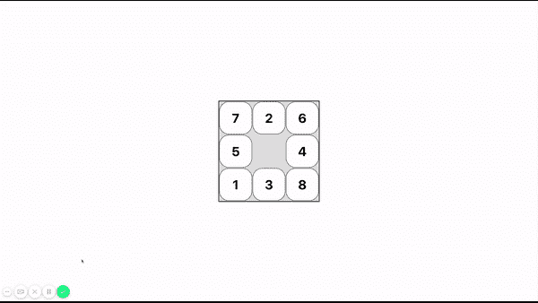

# Solving 8 puzzle problem using A* algorithm

> 原文：[https://dev.to/kaxi1993/solving-8-puzzle-problem-using-a-algorithm-1683](https://dev.to/kaxi1993/solving-8-puzzle-problem-using-a-algorithm-1683)

This is a **react** web app which solves 8 Puzzle problem using A* algorithm. Maybe someone will find this project useful for his university homework.

See the github repo below 👇

##  [ kaxi1993 ](https://github.com/kaxi1993) / [8puzzle](https://github.com/kaxi1993/8puzzle) 

### Solving 8 puzzle problem using A* algorithm

<article class="markdown-body entry-content container-lg" itemprop="text">

# 8 Puzzle

React web app which solves **8 Puzzle** problem using A* algorithm

## Visualization

[](https://camo.githubusercontent.com/932ff6f136419d3673e6237edbae1c70486e1f68/687474703a2f2f6b617869313939332e6769746875622e696f2f696d616765732f70726f6a656374732f3870757a7a6c652f67616d652e676966)

## Installation

```
git clone https://github.com/kaxi1993/8puzzle.git
```

```
cd 8puzzle
```

```
npm i
```

```
npm start
```

</article>

[View on GitHub](https://github.com/kaxi1993/8puzzle)