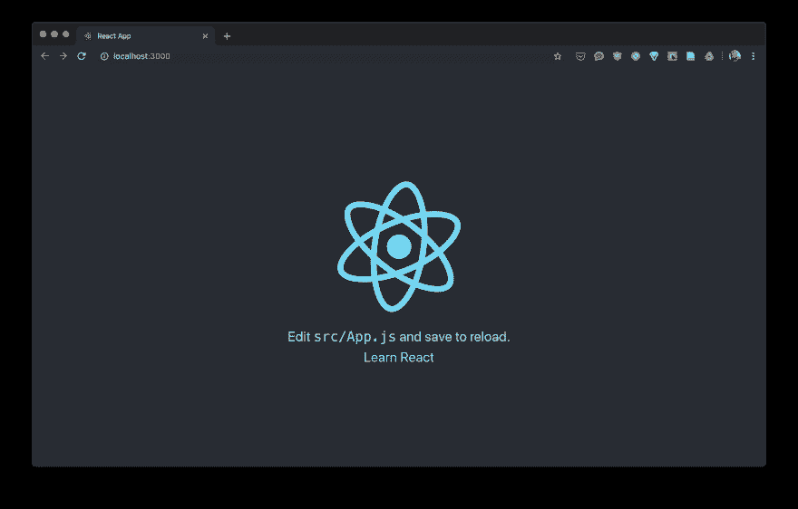
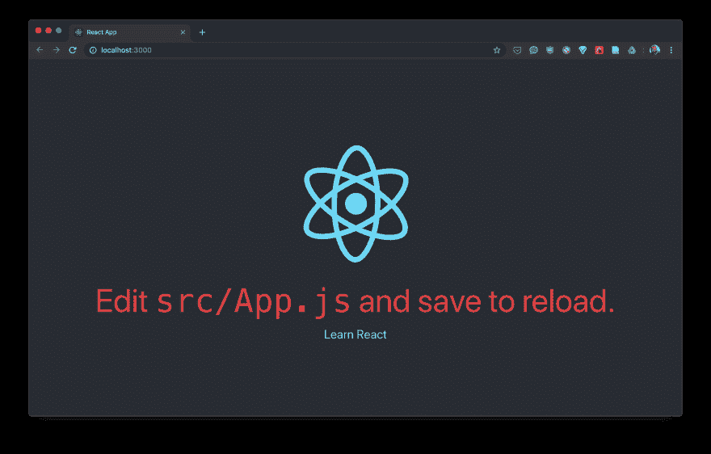
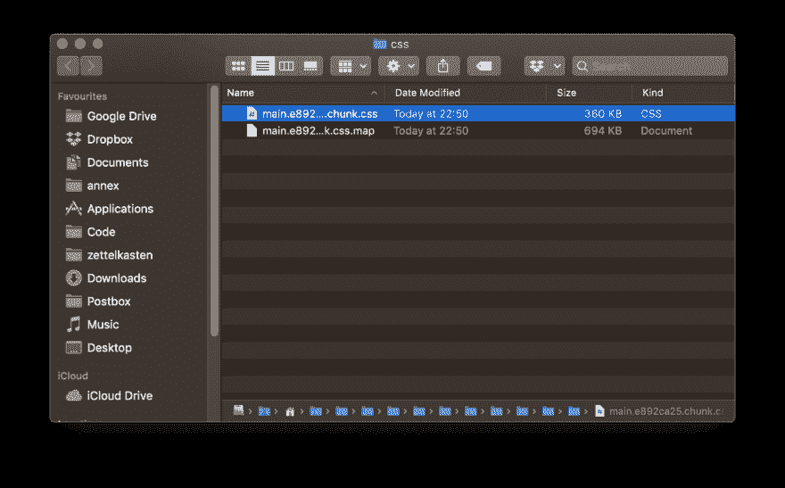
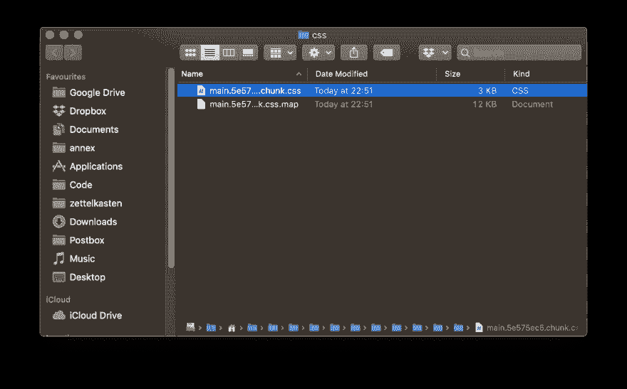

# 创建-反应-应用麻省理工学院顺风 CSS

> 原文：<https://dev.to/openmedi/create-react-app-mit-tailwind-css-11go>

*taiwindcss 是一个 CSS 库，您可以通过简单地添加类来设置其组件的样式。与 z 不同。b . bootstrap 追求的是提供简单构建块的理念，而不是像 Buttons 这样的整个 UI 元素。*

tailwindcss 提供了经过协调的实用程序类(可以合理地构建在一起的 CSS 类)，您可以根据自己的需要构建这些类并满足 UI 要求。与手动编写的 CSS 相比，这是一个稍微方便的构建组，它还包括 z。b .帮助构建 re pserver 设计。如果 CSS 是手工艺品，那么泰国风 CSS 就像乐高玩具一样。但与实际乐高不同的是，我们仍然可以根据自己的意愿定制积木。

本文旨在介绍在 create-react 应用程序中初始设置 tailwind css(和 PurgeCSS)。

## 通过

create-react app(CRA)是许多 react 项目的良好起点，特别是从 DX(开发人员经验)的角度来看，因为该工具降低了我们对 Babel、Webpack 和其他一些东西的配置。此外，它还可以降低视觉复杂性，因为它可以隐藏最初不需要关注的配置。这使我们能够完全集中精力编写自己编写的代码。此外，使用 cra 创建的应用程序的依赖关系可以通过更新单个依赖关系(即反应脚本)保持最新。

我们希望得到这款优秀的 dx。当我们集成 tailwindcss 时，应该尽可能“侵入性最小”。您还可以“弹出”使用 cra 创建的项目，即显示内部配置文件，但您将失去 cra 的主要优势:降低了光学复杂度，现在还必须自行管理和更新构成 React 应用程序的所有依赖项(Webpack、Babel、esint……)。

泰风 CSS 不是一个太小的库。gzip 仍为 58.8 kb。我们不太可能需要每一类腰围风。因此，最好在发货之前删除多馀的 CSS。Tailwind CSS 本身推荐 PurgeCSS 来解决这些问题，我们也希望将 purgecss 与 cra 一起使用。

## 安装依存关系

purgecss 和 tailwindcss 足以满足我们的要求。因为我们不需要在开发过程中同时运行，所以我们将模块作为 Dev 依赖项进行安装。

```
npm i -D tailwindcss purgecss 
```

## 设置尾风 css

为了使用泰风，我们需要一个 CSS 文件，该文件通过“`@tailwind`指令将实际的 CSS 类包含在我们的应用程序中。

为此，我们将在“`src`”目录中创建一个包含以下内容的 tailwind . src . css 文件:

```
@tailwind base;
@tailwind components;
@tailwind utilities; 
```

我们将使用 tailwind cli 将它们转换为实际 CSS。

我们将随后创建的文件与实际的 CSS 规则合并到我们的“`index.js`”中:

```
import './tailwind.css'; 
```

此外，我们还创建了一个风配置文件，在本文中将不再对其进行自定义，但是，如果将来要更改颜色、字体等，我们已经创建了基础。

我们在终端上的应用程序根目录中调用以下命令:

```
npx tailwindcss init 
```

然后，我们在根目录中找到一个文件`tailwind.config.js`，其内容如下:

```
module.exports = {
  theme: {
    extend: {}
  },
  variants: {},
  plugins: []
} 
```

## 大清

purgecss 还需要一个配置文件。它的名称为`purgecss.config.js`，必须在 purgecss 本身中创建。它应包含以下内容:

```
module.exports = { content: ['src/**.js'], css: ['src/tailwind.css'] }; 
```

对于 purgecss，我们将配置指定要检查哪些内容(`tailwind.css` ( `css`)中的类使用情况。然后，将删除 tailwind.css 中的所有其它 CSS 类。

## 设置 npm 脚本

在`package.json`中，我们将 scripts 点调整如下:

```
"scripts":  {  "start":  "react-scripts start",  "build":  "npm run css && react-scripts build",  "css":  "npm run tailwind && npm run purgecss",  "purgecss":  "purgecss -c purgecss.config.js -o src",  "tailwind":  "tailwind build src/tailwind.src.css -c tailwind.config.js -o src/tailwind.css"  }, 
```

*   start -这只是常用的 cra start 脚本
*   build -在此，我们运行 css 脚本(如下所示)并附加 CRA build 脚本
*   css -这将执行尾部风，然后执行 purgecss 脚本(& g)
*   purgecss -使用 src 文件夹中的我们的配置运行 purgecss cli
*   taiwind-此脚本使用我们的配置运行 tailwind cli(我们必须先运行一次，然后才能开始实际开发)

## 顺风 CSS ausprobieren

现在可以很容易地看到泰国风 CSS 的工作原理。首先，我们启动 cra 的 Dev 服务器:

```
npm run start 
```

[](https://res.cloudinary.com/practicaldev/image/fetch/s--Ax3gVfEs--/c_limit%2Cf_auto%2Cfl_progressive%2Cq_auto%2Cw_880/https://thepracticaldev.s3.amazonaws.com/i/grtv4bty533xpk1siep6.png)

现在，让我们更改 z。b .旋转反应标志下文字的大小和颜色:

```
import React from 'react';
import logo from './logo.svg';
import './App.css';

function App() {
  return (
    <div className="App">
      <header className="App-header">
        
        <p className="text-red-600 text-6xl">
          Edit <code>src/App.js</code> and save to reload.
        </p>
        <a
          className="App-link"
          href="https://reactjs.org"
          target="_blank"
          rel="noopener noreferrer"
        >
          Learn React
        </a>
      </header>
    </div>
  );
}

export default App; 
```

正如您在 p 元素中看到的，我们只添加了两个 CSS 类:

[](https://res.cloudinary.com/practicaldev/image/fetch/s--srwGSiSd--/c_limit%2Cf_auto%2Cfl_progressive%2Cq_auto%2Cw_880/https://thepracticaldev.s3.amazonaws.com/i/g89lt7g1366bn8mm3aec.png)

## PurgeCSS ausprobieren

最简单的方法是通过比较所提供的 CSS 文件的大小来节省不必要的 CSS。因此，我们将在 package.json 中添加另一个脚本:

```
"build:nopurge":  "npm run tailwind && react-scripts build", 
```

这就是我们在没有 purgeCSS 的情况下构建简单定制的 cra 应用程序的结果:

[](https://res.cloudinary.com/practicaldev/image/fetch/s--7fNeciEu--/c_limit%2Cf_auto%2Cfl_progressive%2Cq_auto%2Cw_880/https://thepracticaldev.s3.amazonaws.com/i/jcrl2i5kks4oiejnux16.png)

和他的版本一起采购

[](https://res.cloudinary.com/practicaldev/image/fetch/s--u6LeDEH4--/c_limit%2Cf_auto%2Cfl_progressive%2Cq_auto%2Cw_880/https://thepracticaldev.s3.amazonaws.com/i/7qohzuzqjicuzkij0o4a.png)

这里还有一个香草建筑，没有尾翼风，也没有土豆泥：

[](https://res.cloudinary.com/practicaldev/image/fetch/s--exh3P3KZ--/c_limit%2Cf_auto%2Cfl_progressive%2Cq_auto%2Cw_880/https://thepracticaldev.s3.amazonaws.com/i/c1rp7jdzdoq2pn86yiyp.png)

360kb 与 3kb 之间的差异已经很大(很明显:我们实际使用的腰围越多，随后还将提供更多 CSS。

## 结论

值得一提的是，引入 tailwind 和 PurgeCSS 并不太困难，它允许使用非常流行的 CSS 实用程序 First 框架设计应用程序，而无需运行我们的应用程序。

## 参考文献

*   创建-反应-应用
    *   [Github 回购](https://github.com/facebook/create-react-app)
    *   多库
*   采购
    *   多库
*   顺风 CSS
    *   多库