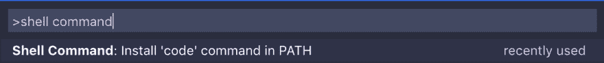

# 开发人员工作环境初学者指南(第 2 部分)

> 原文：<https://dev.to/ikey2244/beginner-s-guide-to-a-developer-work-environment-part-2-22ga>

终于开始写第 2 部分了！抱歉耽误了我的朋友。如果您还没有阅读第 1 部分，这里有一个链接:[https://dev . to/ikey 2244/初学者指南-开发人员-工作-环境-第 1 部分-ibk](https://dev.to/ikey2244/beginner-s-guide-to-a-developer-work-environment-part-1-ibk)

下面是我在日常生活中如何使用第 1 部分中的工具。

### 1。Xcode

我使用它的频率:从不

安装这个只是为了确保我们的 MAC 安装正确。如果你正在做一个 IOS 开发，这就是你要与之互动的东西。

通用工作流:无

### 2。公司自产自用

我使用它的频率:偶尔

不一定要用家酿。这是一件美好的事情。它使得安装应用程序和工具等变得非常容易。

我有时会用自制软件在后台运行服务器/数据库。例如，我可能有一个 MongoDB 数据库运行在 Homebrew 上。可能看起来像这样。

1.  已安装的 mongoDB
2.  运行命令`brew services start mongodb`

差不多就是这样。

### 3。ZSH(哦，我的天)

我使用它的频率:每天

所以从技术上来说，我每天都用这个，但是如果你真的用你的 Iterm，你就是在用 ZSH。ZSH 再一次提供了一个与你的终端交互的好方法。制表完成/建议等。

### 2。Iterm

我使用它的频率:每天

我日常使用的常用命令:

`mkdir`创建新文件夹

**例:** `mkdir code`新建一个名为“代码”的文件夹

`cd`代表“更改目录”。

**例如:**你刚刚创建了一个名为“代码”的新文件夹。为了进入那个文件夹，你必须键入`cd code`并按回车键。然后，您将进入该目录。

`..`允许您在目录中向上移动。

**举例:**你在一个名为`code/my-sick-project`的目录下。现在，您只想进入`code`目录。通过点击`..`，你将在目录中上移，从而进入`code`文件夹。

列出一个目录/文件夹中的所有内容。

`touch your-file-name`创建新文件。

**示例:** `touch index.html`在你的项目中新建一个名为 index.html 的 html 文件。

`clear`清除控制台(只清除您以前做过的事情)

⌘ + d 向终端添加另一个窗口。

**附注:**当你第一次打开你的终端时，你很可能会看到一个类似这样的符号~这只是表明你在电脑的主目录中。如果你在你的终端上运行命令`pwd`，你会看到你当前所在的目录。如果你迷路了，这会很有帮助。

**常用工作流程:**

1.  未清项目
2.  运行命令`mkdir new-project`
3.  通过键入`cd new-project`将`cd`添加到该项目中
4.  `touch index.html`在项目中创建新的 index.html 文件。
5.  运行命令`code .`(这将打开 VS 代码。我们稍后会谈到这一点)。

**临时演员:**

在你的终端中点击 ctrl + r 将会弹出一个对你之前运行的所有命令的搜索！如果您忘记了要运行什么命令，这将非常有用。假设您只记得命令的第一部分。例如，你记得`touch`但不知道下一步该做什么。在你的终端中按 Ctrl + r 键并输入`touch`,这将调出你最后一次输入的命令并显示你做了什么。

### 3。Visual Studio 代码

我使用它的频率:每天

在 Iterm 部分，我提到了通过在 VS 代码打开的目录中运行这个命令来运行这个命令`code .`，你可以开始编辑文件。这在创建新项目时非常有用！

下面是你如何做到这一点:

1.  开放 VS 代码。
2.  按⌘ + ⇧(shift 键)+ p:这将打开命令调板
3.  在命令面板中输入“shell 命令”,它会显示类似这样的内容
4.  在此选项上按 enter 键
5.  就是这样！

现在进入您在 Iterm 中创建的项目或创建一个新目录(这将是一个很好的做法),运行命令`code .` VS 代码应该会打开，您应该会在文件浏览器的左侧看到您的项目的名称。

链接到更多相关信息:[https://code.visualstudio.com/docs/setup/mac](https://code.visualstudio.com/docs/setup/mac)

可以想象，如果你必须手动做所有的事情，编程将会非常困难。幸运的是 VS code 给了我们大量的热键和快捷键，让我们的生活变得更加轻松！我们去看看。

我以前用 Atom(另一个类似 VS code 的代码编辑器)。我仍然爱 Atom，但是 VS 代码已经俘获了我的心。重新学习 VS 代码的热键会很痛苦。幸运的是，VS 代码有一个名为“Atom Keymap”的扩展，它从 Atom 中提取所有热键，并为 VS 代码设置它们。太棒了。

你实际上并不需要这个，但是如果你想使用我的热键，你将需要这个扩展:[https://marketplace.visualstudio.com/items?itemName = ms-vs code . atom-key bindings](https://marketplace.visualstudio.com/items?itemName=ms-vscode.atom-keybindings)。

点击此图标进行安装。  并搜索原子键图。点击安装按钮，你应该有它。

**我日常使用的常用热键:**

1.  复制++ c
2.  粘贴++ v
3.  剪切⌘ + x
4.  删除单行代码⌘ + ⇧(shift 键)+ k
5.  重复突出显示的代码⌘ + ⇧(shift 键)+ d
6.  按住⌘命令键并点按以拥有多个光标。[https://code . visual studio . com/docs/get started/tips-and-tricks # _ editing-hacks](https://code.visualstudio.com/docs/getstarted/tips-and-tricks#_editing-hacks)
7.  撤消⌘ + z
8.  重做⌘ + ⇧
9.  在您的项目⌘ + p 中搜索文件
10.  ⌘ +右箭头线尾
11.  ⌘ +左箭头行首
12.  ⌘ +上箭头第一行代码
13.  ⌘ +向下箭头最后一行代码
14.  同时按住⌘ + ⇧(shift 键)+箭头键将突出显示与方向对应的代码行。
15.  词与词之间跳跃。按住 alt 键，同时使用箭头跳到每个单词。

不用说有很多热键。希望这个列表能让你开始工作。要获得完整的列表，请查阅 Atom Keybindings 扩展中的文档。

#### 把它变漂亮

开箱即用的 VS 代码相当难看。让我们把它变漂亮！！

我真的很喜欢 https://marketplace.visualstudio.com/items?的 Palenight 主题 itemName = whizkydee . material-pale night-theme

**安装它**

1.  点击图标
2.  搜索夜色主题
3.  安装
4.  再装
5.  令人惊叹

有很多不同的主题。把它变成你自己的！对你的编辑器感到舒服真的很重要。

那都是乡亲们！！希望这能帮助一些新来者。如果您看到任何错误或有任何批评，请告诉我。欢迎大家指正。:)记住每个人在某方面都是初学者，所以不要因为不知道某件事而难过。提问，经常失败。那是变好的唯一方法。