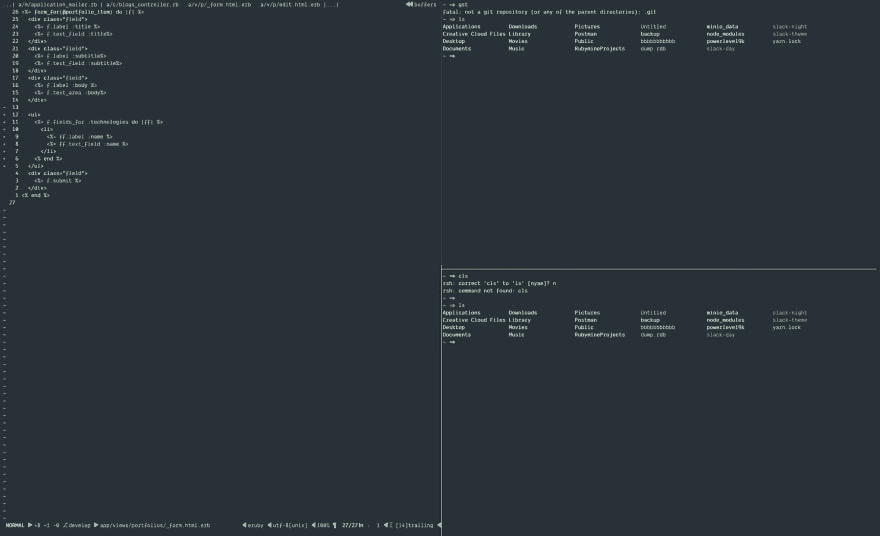

# 设置 Vim、Tmux、iTerm 和 Oh-my-Zsh。更好的工作流程

> 原文：<https://dev.to/danielshow/setting-up-vim-tmux-iterm-and-oh-my-zsh-5e51>

[](https://res.cloudinary.com/practicaldev/image/fetch/s--EjMDEumE--/c_limit%2Cf_auto%2Cfl_progressive%2Cq_auto%2Cw_880/https://cdn-images-1.medium.com/max/2600/1%2AJkrehnEox6EhKCmYjEriFA.png)

很多人总是问我是如何推销我的终端的，有些人甚至称我为怪人，因为我使用 VIM，而他们使用 VSCode。

*VScode 很酷，你用 Git 像个领主但是你知道 Git 是怎么工作的吗，可以写命令吗？有些人甚至忘记了如何使用 Git，因为 VScode 让一切都变得简单了。我不喜欢简单的事情。我住在终点站。😂*

我将解释我安装的所有库以及它们的用途。我是一个 macOS 用户，所以我使用 brew 来安装我的软件包。

**使用的工具:**

*   iTerm
*   精力
*   Tmux
*   Oh-my-Zsh

**iTerm**

iTerm 是 macOS 默认终端的替代品。有了 iTerm，你可以把你的终端分成不同的大小，搜索文本和使用复制粘贴。您还可以在 iTerm 中使用自定义字体和主题。在 macOS 上安装 iTerm:

```
$ brew cask install iterm2 
```

现在，请放弃您的默认终端，开始使用 iTerm。我已经几年没有使用默认的终端了。

**VIM**

Vim 不需要任何解释，但值得一试。vim 让我更有效率，有了 VIM，我可以使用不同的插件让我工作得更快。

Vim 预装在 MacOs 上，但是如果你没有它，你可以通过在你的终端上运行这段代码来安装它。这个命令将安装 vim 并覆盖系统 VIM 和 path。

```
$ brew install vim --with-override-system-vi 
```

要学习 vim 的基础知识，我建议，最好的方法是首先学习使用 vimtutor 的基本命令，然后继续添加插件来解决您在学习过程中发现的任何棘手问题。例如，如果您发现您将需要一个像 VSCode 提供的文件树，那么通过搜索它，您将找到关于 NERDTREE 的信息。

TMUX
Tmux 是一个终端多路复用器:它可以在一个屏幕上创建、访问和控制多个终端。

Tmux 的一大优势是你可以脱离屏幕，继续在后台运行，然后再重新连接。

有了 TMUX，你可以将你的终端分成不同的块，运行服务器、vim、redis-server 等。

要在 iTerm 上安装 Tmux，请键入:

```
$ brew install tmux 
```

哦-我-Zsh

Oh-my-zsh 是一个开源插件，它可以让你添加主题、字体和定制你的终端。它有很多插件，可以让你作为开发者的工作效率提高 10 倍。使用以下命令安装它:

```
$ brew install zsh
$ sh -c "$(curl -fsSL https://raw.githubusercontent.com/robbyrussell/oh-my-zsh/master/tools/install.sh)" 
```

我在 oh-my-zsh 上使用的一个插件是自动暗示。它为您的终端启用自动完成功能。

...

让你的终端和我的一样美丽😅，我将分享我的机顶盒设置，并解释如何配置您的终端。在使用我的设置之前，请确保您已经安装了 Tmux、oh-my-zsh 和 Vim。

使用我的设置，你可以分屏，一部分写代码，另一部分写终端。开发人员甚至会称你为黑客，因为你很可能会喜欢终端。

[](https://res.cloudinary.com/practicaldev/image/fetch/s--Ut53xjbp--/c_limit%2Cf_auto%2Cfl_progressive%2Cq_auto%2Cw_880/https://cdn-images-1.medium.com/max/2400/1%2Ak4jhqHwrt6U_MZVcYcoRTA.png)

你可以在这里分叉我的盒子设置库[。](https://github.com/Danielshow/BoxSetting)

**第一步:**

我用 Vundle 作为我的插件管理器。安装 Vundle:

```
$ git clone https://github.com/VundleVim/Vundle.vim.git ~/.vim/bundle/Vundle.vim 
```

第二步:

克隆我的机器设置并将文件复制到您的根路径。

```
$ git clone https://github.com/Danielshow/BoxSetting
$ cd BoxSetting 
```

第三步:

将所有文件复制到您的根路径

复制文件:

```
$ cp tmux.conf ~/.tmux.conf
$ cp vimrc ~/.vimrc
$ cp zshrc ~/.zshrc 
```

复制完所有文件后，打开 vim，键入`:`输入命令。键入 PluginInstall 安装所有插件。

享受你的超级终端🎉。

我是[丹尼尔秀](https://twitter.com/d_showWorld)。