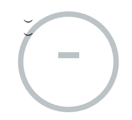
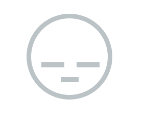

# 带有 HTML 和 CSS 的悲伤表情动画

> 原文：<https://dev.to/pixmy/sad-emoji-animation-with-html-and-css-744>

你好！

今天我们要制作一个简单的动画。我们要开始做一张严肃的脸“-_-”，然后转化成悲伤的“T_T”。

以下是最终结果:

[https://codepen.io/Pixmy/embed/GMEyGy?height=600&default-tab=result&embed-version=2](https://codepen.io/Pixmy/embed/GMEyGy?height=600&default-tab=result&embed-version=2)

让我们从将 html 添加到 codepen 或. HTML 文件开始。

```
<div class='container'>
  <div class='tear1 tear'></div>
  <div class='tear2 tear'></div>
  <div class='face'>
      <div class='eyebrow'>︶</div>
      <div class='eyebrow'>︶</div>
      <div class='eye'></div>
      <div class='eye'></div>
      <div class='mouth'></div>
  </div>
</div> 
```

我为每个 div 添加了描述性的类，以便于阅读。

现在我们的 HTML 已经准备好了，让我们继续将主容器垂直和水平居中

```
.container{
  margin: auto;
  position: absolute;
  top: 50%; left: 50%;
  transform: translate(-50%,-50%);
} 
```

在这之后，我们可以从脸和嘴开始。我们的表情符号脸将是 150x150，边界半径为 50%，以形成一个完美的圆，我们还可以添加一个相对位置，因为脸将是我们其他组件的主要容器。对于嘴巴，让我们制作一个高 10px，宽 35px 的矩形，通过添加“margin:0 auto”将元素居中，并添加任何您想要的背景颜色，在这种情况下，我们将使用灰色(#bdc3c7)。为了正确定位我们的表情符号嘴，我们需要添加一个页边距，以便在眼睛和嘴之间创造空间。

```
.face{
  width:150px;
  height:150px;
  border: 9px solid #bdc3c7;
  border-radius:50%;
  position:relative;
  z-index:9999;
}

.mouth{
  height:10px;
  width:35px;
  margin: 0 auto;
  margin-top: 15px;
  background-color:#bdc3c7;
} 
```

你现在应该看到一些非常丑陋的东西:

[](https://res.cloudinary.com/practicaldev/image/fetch/s--8uxtzAA8--/c_limit%2Cf_auto%2Cfl_progressive%2Cq_auto%2Cw_880/https://thepracticaldev.s3.amazonaws.com/i/qy8spw6xegzqvl2wmybi.png)

让我们现在制造眼泪。在我们的 HTML 中，我们为“tear1”和“tear2”添加了一个名为“tear”的公共类，这里我们将添加两者共有的 css，背景颜色、高度、宽度、位置和上限值。

```
.tear{
  position:absolute;
  background-color: #3498db;
  height:0px;
  width:45px;
  top:62px;
} 
```

为什么身高用 0px？这是因为我们要激活这个值，我们的起点需要在 0px。

现在让我们为每个裂口添加正确的位置和一个边界半径，这样裂口就不会超过面的限制。

```
.tear1{
  left:29px;
  border-bottom-left-radius:50%;
}

.tear2{
  left:98px;
  border-bottom-right-radius:50%;
} 
```

在这一点上，你会看到同样的事情，因为我们还没有添加我们的动画，但在添加动画之前，我们需要将我们的表情眼睛和眉毛放在正确的位置。

为了简单起见，我们将使用这个角色“︶”作为我们的眉毛，但是现在我们将隐藏这个角色，因为在我们添加悲伤表情动画之前，它将一直显示。让我们也旋转表情符号的眉毛，让它看起来更悲伤。

```
.eye{
  height:10px;
  width:45px;
  background-color:#bdc3c7;
  display:inline-block;
  margin-left:20px;
  margin-top:20px;
}

.eyebrow{
  width:30px;
  font-size:40px;
  font-weight:bold;
  color:#bdc3c7;
  display:inline-block;
  margin-left:27px;
  margin-top: 10px;
  opacity:0;
}

.eyebrow:nth-child(1){
  transform:rotate(-20deg);
}

.eyebrow:nth-child(2){
  transform:rotate(20deg);
} 
```

现在我们都准备好添加动画了，你现在应该有一张严肃的脸了:

[](https://res.cloudinary.com/practicaldev/image/fetch/s--W9KWyU1q--/c_limit%2Cf_auto%2Cfl_progressive%2Cq_auto%2Cw_880/https://thepracticaldev.s3.amazonaws.com/i/k8d2cnfakoqamd01znfi.png)

为了制作嘴部动画，我们将使用高度、宽度、边框半径、边框和上边距进行定位。

```
@keyframes mouth{
  10%{height:30px;width:25px; border:6px solid black;border-radius:50%;margin-top:-8px;}
  50%{height:30px;width:25px; border:6px solid black;border-radius:50%;margin-top:-8px;}
  60%{height:10px;width:35px;border-radius:0%;border:none;margin-top:15px;}
} 
```

现在我们已经创建了第一个动画，我们要将其他动画同步到这个动画。

```
 @keyframes cry{
  10%{transform:translateY(-34px);background-color:black;}
  50%{transform:translateY(-34px);background-color:black;}
  60%{background-color:#bdc3c7;transform:translateY(0px);}
}

@keyframes eyebrow{
  10%{opacity:1;color:black;}
  50%{opacity:1;color:black;}
  60%{opacity:0;}
}

@keyframes face{
  10%{border-color:black;}
  50%{border-color:black;}
  60%{border-color:#bdc3c7;}
}

@keyframes tear{
  10%{height:96px;}
  50%{height:96px;}
  52%{height:0px;}
} 
```

现在我们只需要将动画设置为相应的 div，我们将设置一个动画延迟，以便在开始时有几秒钟的严肃表情。

```
 .face{
  animation: face 7s infinite;
  animation-delay:2s;
}

.mouth{
  animation: mouth 7s infinite;
  animation-delay:2s;
}

.tear{
  animation: tear 7s infinite;
  animation-delay:2s;
}

.eye{
  animation: cry 7s infinite;
  animation-delay:2s;
}

.eyebrow{
  animation: eyebrow 7s infinite;
  animation-delay:2s;
} 
```

现在你已经准备好了！