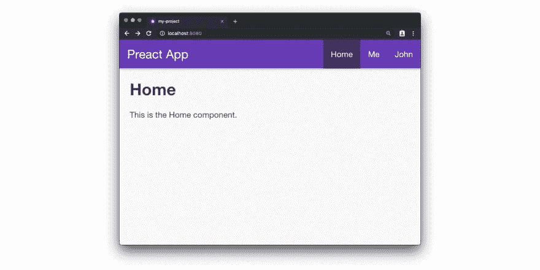
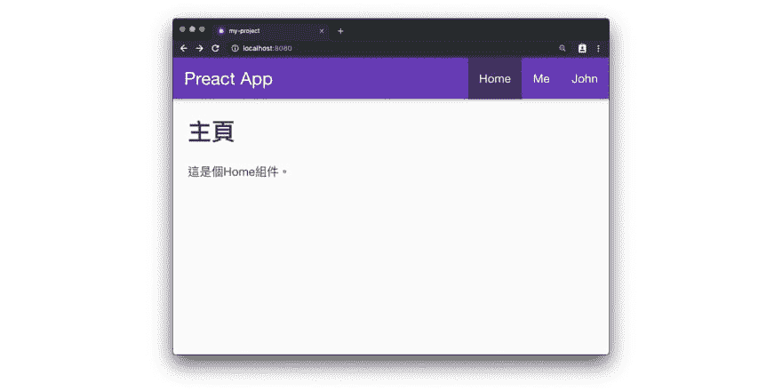
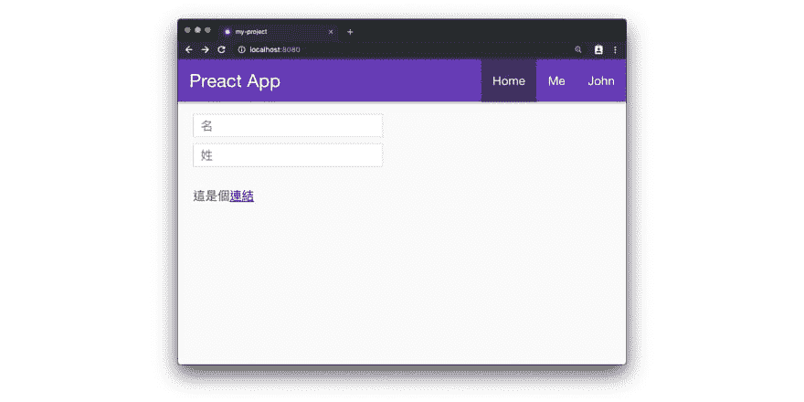
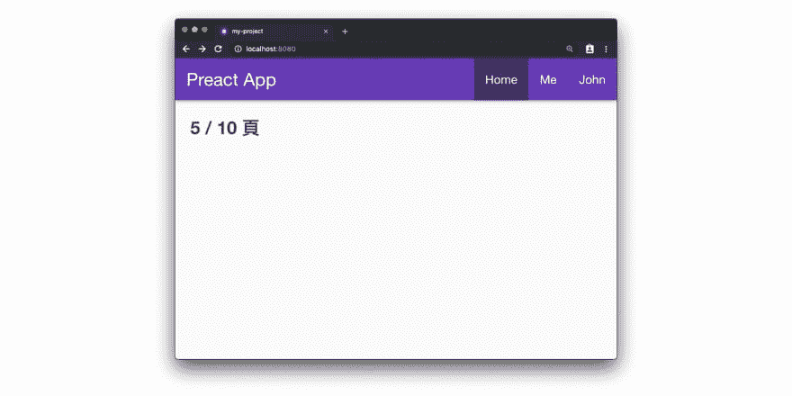
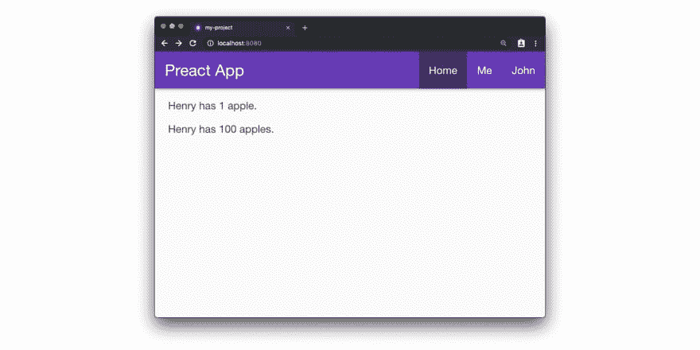
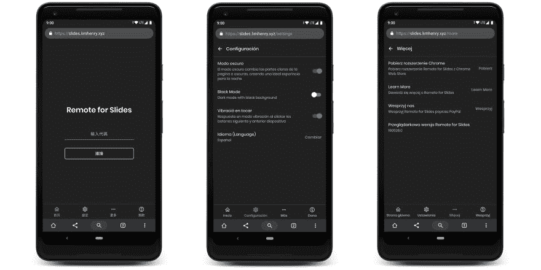

# How to internationalize (i18n) your Preact project

> 原文：<https://dev.to/henrylim96/i18n-preact-3pie>

🇺🇸英文版(英文版):[https://dev . to/henrylim 96/how-to-add-international ization-i18n-to-your-preact-application-5gd 6](https://dev.to/henrylim96/how-to-add-internationalization-i18n-to-your-preact-application-5gd6)

* * *

## What is internationalization (i18n)?

> Internationalization, also known as i18n, means that there are 18 letters between I and N. Internationalization refers to modifying the software to meet the language, regional differences and technical needs of the target market.

In this article, we will use [Preact-i18n](https://github.com/synacor/preact-i18n) to internationalize your preact project.

* * *

## Step 1: Set up Preact CLI and create a new project.

> Note: If you are already familiar with Preact, you can skip to the next step.

If you haven't installed Preact CLI on your computer, please use the following command to install Preact CLI. This requires Node.js version 6.x or above for CLI.

`$ npm install -g preact-cli`

When you have successfully installed Preact CLI into your computer, we will use the following command to create a project named `my-project`. In this project, we will use the `default` template.

`$ preact create default my-project`

After that, you can use the following command to start the local test server.

`$ cd my-project && npm run start`

At this time, we need to open our browser and go to `http://localhost:8080`, and you will see something like this:

[](https://res.cloudinary.com/practicaldev/image/fetch/s--zainKUDk--/c_limit%2Cf_auto%2Cfl_progressive%2Cq_auto%2Cw_880/https://thepracticaldev.s3.amazonaws.com/i/kk6nzdsfzs4nzrlpahvx.jpg)

## Step 2: Install preact-18n

We will use the following command to install `preact-i18n` into your project.

`$ npm install --save preact-i18n`

`preact-i18n` is very easy to use. More importantly, this `preact-i18n` occupies less than 1.3kb after gzip.

## Step 3: Create a definition file

When you have installed `preact-i18n` into your project, we will create a definition file. We will store the words and sentences we want to translate in this JSON file.

We will store this definition file in `src/i18n/zh-tw.json`.

```
{  "home":  {  "title":  "主頁",  "text":  "這是個 Home 組件。"  }  } 
```

Enter fullscreen mode Exit fullscreen mode

## 步驟 4:導入英特尔提供商及定义文件

Next, we will open `app.js` from `src/components`. We will import `IntlProvider` and `definition` files into this file.

```
import { IntlProvider } from 'preact-i18n';
import definition from '../i18n/zh-tw.json'; 
```

Enter fullscreen mode Exit fullscreen mode

## Step 5: Put IntlProvider in the highest level component in the project.

Then, we will put `<IntlProvider>` in the highest level component of the project, which is our `app.js`. In this way, we can read the `definition` file in any component of this Preact project.

```
render() {
  return(
    <IntlProvider definition={definition}>
      <div id="app" />
    </IntlProvider>
  );
} 
```

Enter fullscreen mode Exit fullscreen mode

At this time, the content of your `app.js` file should be similar to the following example:

```
import { h, Component } from 'preact';
import { Router } from 'preact-router';
import Header from './header';
import Home from '../routes/home';
import Profile from '../routes/profile';
// 導入 IntlProvider 及 definition 文件。
import { IntlProvider } from 'preact-i18n';
import definition from '../i18n/zh-tw.json';
export default class App extends Component {

 handleRoute = e => {
  this.currentUrl = e.url;
 };
render() {
  return (
   // 把 <IntlProvider> 放在項目中最高層級的組件
   <IntlProvider definition={definition}>
    <div id="app">
     <Header />
     <Router onChange={this.handleRoute}>
      <Home path="/" />
      <Profile path="/profile/" user="me" />
      <Profile path="/profile/:user" />
     </Router>
    </div>
   </IntlProvider>
  );
 }
} 
```

Enter fullscreen mode Exit fullscreen mode

## Step 6: Use Text to display the translated character string.

We were one step away from success. In the following example, we will translate all the words in the homepage (`src/routes/home/index.js`). Now, we just need to change the word in the webpage to `<Text>`. Therefore, we will add `<Text>` to `<h1>` and `<p>`.

```
import { Text } from 'preact-i18n';
const Home = () => ( 
  <div> 
    <h1> 
      <Text id="home.title">Home</Text> 
    </h1> 
    <p> 
      <Text id="home.text">This is the Home component.</Text> 
    </p> 
  </div> 
); 
export default Home; 
```

Enter fullscreen mode Exit fullscreen mode

[](https://res.cloudinary.com/practicaldev/image/fetch/s--asW3wf_K--/c_limit%2Cf_auto%2Cfl_progressive%2Cq_auto%2Cw_880/https://thepracticaldev.s3.amazonaws.com/i/vsgnzsjx6bdg25inkuvj.jpg)

## Backup text

In order to avoid the blank space in the webpage, we should enter the backup text in `<Text>`. If `preact-i18n` can't find the relevant words or sentences in your `definition`, then `preact-i18n` will use the backup words you just entered in `<Text>…</Text>`.

```
<Text id="unknown.definition">This is a fallback text.</Text>
// 這將會渲染: "This is a fallback text." 
```

Enter fullscreen mode Exit fullscreen mode

## 方位词和标记文本

If you want to translate the text in HTML attributes (such as `placeholder=""` or `title=""`, etc.), you should use `<Localizer>` instead of `<Text>`.

On the contrary, if you want to use HTML Markup in your translated words or sentences, you must use `<MarkupText>`. `<MarkupText>` will render the translated text or sentence in a [T2】 tag.

In the following example, we will add a few more lines of code to our `definition` file. `first_name` and `last_name`, which will be used in the example of `<Localizer>`. And we will use `link` for the example in `<MarkupText>`.

```
{  "first_name":  "名",  "last_name":  "姓",  "link":  "這是個<a href='https://www.google.com'>連結</a>"  } 
```

Enter fullscreen mode Exit fullscreen mode

Before you update the content in the homepage (`src/routes/home/index.js`), remember to import `Localizer` and `MarkupText` into this page:

```
import { Text, Localizer, MarkupText } from 'preact-i18n';
const Home = () => ( 
  <div> 
    <Localizer> 
      <input placeholder={<Text id="first_name" />} /> 
    </Localizer> 
    <Localizer> 
      <input placeholder={<Text id="last_name" />} /> 
    </Localizer> 
    <MarkupText id="link"> 
      This is a <a href="https://www.google.com">link</a>
    </MarkupText>
  </div>
);
export default Home; 
```

Enter fullscreen mode Exit fullscreen mode

[](https://res.cloudinary.com/practicaldev/image/fetch/s---wJtsmtp--/c_limit%2Cf_auto%2Cfl_progressive%2Cq_auto%2Cw_880/https://thepracticaldev.s3.amazonaws.com/i/opgth3dzvj3mqknojxha.jpg)

## 模板(模板化)

If you want to inject some custom strings into your definition, you can do so by using the `fields` attribute.

First, we need to update our definition file. In our definition file, we need to change the characters that we want to be replaced by custom strings into placeholders like `{{count}}` or `{{total}}`.

```
{  "page":  "{{count}} / {{total}} 頁"  } 
```

Enter fullscreen mode Exit fullscreen mode

After that, we need to add `fields` attribute to our `<Text />`. Therefore, your code should look like the following:

```
import { Text } from 'preact-i18n'; 
const Home = () => ( 
  <div>
    <h2> 
      <Text id="page" fields={{ count: 5, total: 10 }}>
         5 / 10 Pages
      </Text> 
    </h2> 
  </div> 
); 
export default Home; 
```

Enter fullscreen mode Exit fullscreen mode

[](https://res.cloudinary.com/practicaldev/image/fetch/s--h29051AW--/c_limit%2Cf_auto%2Cfl_progressive%2Cq_auto%2Cw_880/https://thepracticaldev.s3.amazonaws.com/i/heuay1pm410dxt5e7jbk.jpg)

## 复数(多元化)

If the language you want to translate is plural (for example, English: apple/apples), you can use one of the following methods to put the translated words and sentences into your definition file.

*   `"key": { "singular":"apple", "plural":"apples" }`
*   `"key": { "none":"no apples", "one":"apple", "many":"apples" }`
*   `"key": ["apples", "apple"]`

In the following example, we will combine the template with the plural example. But before that, we need to update our definition file:

```
{  "apple":  {  "singular":  "Henry has {{count}} apple.",  "plural":"Henry has {{count}} apples."  }  } 
```

Enter fullscreen mode Exit fullscreen mode

Next, we will paste the following code into `src/routes/home/index.js`:

```
import { Text } from 'preact-i18n'; 
const Home = () => ( 
  <div> 
    <p> 
      <Text id="apple" plural={1} fields={{ count: 1 }} /> 
    </p> 
    <p> 
      <Text id="apple" plural={100} fields={{ count: 100 }} /> 
    </p> 
  </div> 
); 
export default Home; 
```

Enter fullscreen mode Exit fullscreen mode

[](https://res.cloudinary.com/practicaldev/image/fetch/s--L3VpQWt0--/c_limit%2Cf_auto%2Cfl_progressive%2Cq_auto%2Cw_880/https://thepracticaldev.s3.amazonaws.com/i/rqvabjs585uxp2ywggpm.jpg)

According to the above steps, you can use templates and plural numbers in your Preact project.

* * *

## Dynamically import the definition file

In reality, you will set the language of the web page according to the user's choice.

You can use the language of the browser _ through `navigator.language`), or let the user change the language manually.

However, in order to avoid importing unnecessary definition files, we can use `import()` to import definition files dynamically. In this way, we will only import the definition file required by the language selected by the user.

```
import { Component } from 'preact'; 
import { IntlProvider } from 'preact-i18n'; 
import defaultDefinition from '../i18n/zh-tw.json'; 
export default class App extends Component { 
  state = { 
    definition: defaultDefinition 
  } 
  changeLanguage = (lang) => { 
    // 我們可以使用這個函數來更換語言
    import(`../i18n/${lang}.json`) 
      .then(definition => this.setState({ definition })); 
  }; 
  render({ }, { definition }) { 
    return ( 
      <IntlProvider definition={definition}> 
        <div id="app" /> 
      </IntlProvider> 
    ); 
  } 
} 
```

Enter fullscreen mode Exit fullscreen mode

According to the above example, we can use this function: `this.changeLanguage("zh-TW")` to import the definition file and change the language of the web page.

* * *

## Who is using preact-i18n?

My own amateur project: Remote for Slides, is using `preact-i18n`.

Remote for Slides is a progressive web application (PWA)+Chrome extender. This allows users to remotely control Google presentations on any device. It's time to say goodbye to the expensive page turning pen.

The Remote for Slides progressive web application supports up to 8 languages, including English, traditional Chinese, simplified Chinese, Catalan, Spanish, French, Polish, and Euskera.

In this project, I also used the method of "dynamically importing definition files" that I just mentioned. This can prevent the application from importing some unused definition files. This will improve the application performance.

In addition, the Remote for Slides progressive network application will automatically set the language. The application will be based on the language of the visitor (`navigator.language`), or the parameter (ie: [s.limhenry.xyz/? in the URL. HL = zh-tw](https://slides.limhenry.xyz/?hl=zh-tw) ) to change the language. Of course, the user can also change the language from [setting](https://slides.limhenry.xyz/settings/language) .

[](https://res.cloudinary.com/practicaldev/image/fetch/s--vTEJ6cEX--/c_limit%2Cf_auto%2Cfl_progressive%2Cq_auto%2Cw_880/https://thepracticaldev.s3.amazonaws.com/i/wxgg59lyyisatdza3pgl.jpg)

You can learn more about Remote for Slides here:

[](/henrylim96) [## 幻灯片远程会议，控制演示文稿幻灯片的新方法

### Henry Lim Apr 2 ' 192 分钟阅读

#pwa #web #android #googleslides](/henrylim96/meet-remote-for-slides-a-new-way-to-control-your-presentation-slides-1o7n)

* * *

## More resources

*   [preact-i18n](https://github.com/synacor/preact-i18n)
*   [预测客户端](https://github.com/preactjs/preact-cli)
*   [预先行动](https://preactjs.com/)