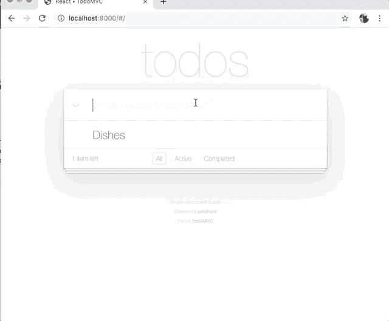

# 向 React Todo 应用程序添加加密货币支付(或者我如何让我的孩子做家务)

> 原文：<https://dev.to/blankey1337/adding-cryptocurrency-payments-to-a-react-todo-app-or-how-i-got-my-kids-to-do-their-chores-4k9a>

让我们假设我有一个懒惰的孩子，他对金钱激励反应很好。在本教程中，我们将构建一个 React Todo 应用程序，每当任务从 Todo 列表中标记为完成时，该应用程序都会发送加密货币付款。当我们完成时，应用程序看起来应该是这样的:

[](https://res.cloudinary.com/practicaldev/image/fetch/s--OqkIdKls--/c_limit%2Cf_auto%2Cfl_progressive%2Cq_66%2Cw_880/https://thepracticaldev.s3.amazonaws.com/i/ppv6nr7vfel1rmed8ug5.gif)

我们可以按照以下步骤构建上面的应用程序:

1.  克隆 todo-react 应用程序
2.  生成钱包地址
3.  每当任务完成时发送加密

# 第一步:克隆 todo-react 应用

启动你的终端，去 GitHub，找到一个好的 Todo 应用程序(我选了这个)，然后克隆到你的机器上。

```
git clone https://github.com/tastejs/todomvc.git 
```

将目录更改为 react-todo 示例。

```
cd todomvc/examples/react 
```

安装所有依赖项。

```
npm install 
```

启动用于本地开发的 web 服务器。

```
python -m SimpleHTTPServer 
```

打开浏览器进入`localhost:8000`，你应该会看到这个应用程序。

# 第二步:生成钱包地址

为了在任务完成时发送加密，我们需要一个地址。但首先，我们需要选择一种加密货币。在本教程中，我们将使用 Burstcoin，因为它易于使用并且有良好的文档库。

为了让这个应用程序工作，发送者(我)和接收者(我无心的孩子)都需要一个钱包地址。发送者的钱包也需要有一些突发在里面发送。

[下载一个突发钱包](https://www.burst-coin.org/download-wallet)或[使用一个在线钱包](https://wallet1.burst-team.us:2083)生成一些钱包地址，并用突发填充其中一个。爆裂在[几个交易所](https://www.burst-coin.org/exchanges)上市。一定要记下你的密码。

在这个例子中，我们将使用在 http://testnet.getburst.net:6876 运行的 TestNet 来创建我们的账户，这样我们就不用花任何钱了。如果你需要一些测试脉冲，请联系 Discord，有人会给你一些。

# 第三步:每当任务完成时发送加密

这是教程的核心，但可以分解为以下步骤:

## [T3 安装`@burstjs/core`和`@burstjs/crypto`](#install-raw-burstjscore-endraw-and-raw-burstjscrypto-endraw-)

在`index.html`中，在`</body>`之前添加这两个脚本标签，以分别引入@burstjs/core 和@burstjs/crypto 作为`b$`和`b$crypto`。

```
<script src='https://cdn.jsdelivr.net/npm/@burstjs/core/dist/burstjs.min.js'></script>
<script src='https://cdn.jsdelivr.net/npm/@burstjs/crypto/dist/burstjs.crypto.min.js'></script> 
```

## [T3 给`app.jsx`增加一个`sendBurst`功能](#add-a-raw-sendburst-endraw-function-to-raw-appjsx-endraw-)

```
sendBurst: function() {

    const api = b$.composeApi({
        nodeHost: "http://testnet.getburst.net:6876",
        apiRootUrl: "/burst"
    });

    const recipientAddress = 'BURST-WQJC-854G-2LQT-8T8EA';

    const senderPassphrase = 'password123'; // BURST-9CVF-6DTE-ST5Q-GTDYA

    const keys = b$crypto.generateMasterKeys(senderPassphrase);

    return api.transaction.sendMoney({
        // NOTE: amountNQT is actually in burst
        amountNQT: '1',
        feeNQT: '0.08',
        deadline: 24 * 60, // 24 hours
        type: 1
        }, keys.publicKey, keys.signPrivateKey, recipientAddress);

}, 
```

让我们一行一行地看看这段代码在做什么。

首先，我们创建一个名为`sendBurst`的函数。

```
sendBurst: function() { 
```

然后，我们告诉 BurstJS 我们要和哪个 Burst API 节点对话。毕竟，我们必须以某种方式将交易提交给区块链。在这种情况下，我们向运行在 getburst.net 上的 TestNet 发送 Burst。

```
const api = b$.composeApi({
    nodeHost: "http://testnet.getburst.net:6876",
    apiRootUrl: "/burst"
}); 
```

接下来，我们创建一个变量来存储我们的收件人(在这个例子中，我的忘恩负义的孩子)的地址。

```
const recipientAddress = 'BURST-WQJC-854G-2LQT-8T8EA'; 
```

然后，我们创建一个变量来将密码存储到我的钱包中(这是您的 12 个单词的密码)。注意:这仅用于演示目的——不要在源代码中使用密码！

```
const senderPassphrase = 'password123'; // BURST-9CVF-6DTE-ST5Q-GTDYA 
```

接下来，我们从我的密码短语中生成一些帐户密钥。

```
const keys = b$crypto.generateMasterKeys(senderPassphrase); 
```

最后，我们从 BurstJS 事务 API 调用`sendMoney`函数。

```
return api.transaction.sendMoney({
    // NOTE: amountNQT is actually in burst
    amountNQT: '1',
    feeNQT: '0.08',
    deadline: 24 * 60, // 24 hours
    type: 1
    }, keys.publicKey, keys.signPrivateKey, recipientAddress); 
```

注意:BurstJS 在将已签名的事务广播到网络之前，会在本地对事务进行签名。这意味着您的私钥永远不会通过网络发送。

然后我们关闭函数。`sendBurst`函数到此为止。

## 更新`toggle`功能

```
toggle: function (todoToToggle) {
    if (!todoToToggle.completed) {
        this.sendBurst().then((response) => {
            console.log(response);
            this.props.model.toggle(todoToToggle);
        });
    } else {
        this.props.model.toggle(todoToToggle);
    }
}, 
```

在这段代码中，我们首先检查用户是否将任务标记为已完成，因为如果用户取消检查之前完成的任务，我们不想发送付款。

```
if (!todoToToggle.completed) { 
```

如果任务被标记为已完成，我们用一个`.then()`处理程序调用`this.sendBurst()`来更新项目，如果突发被成功发送的话。

```
this.sendBurst().then((response) => {
    console.log(response);
    this.props.model.toggle(todoToToggle);
}); 
```

有了它，您应该能够在任何时候将任务标记为完成时发送突发。

# 结论

通过几个简单的步骤，我们克隆了一个 todo 应用程序，并添加了每当任务被标记为完成时发送加密事务的功能。

在现实世界中，我们会向用户显示一些成功消息，如果失败，则显示一条失败消息。就是这样，祝你黑客生涯愉快！

在 GitHub 上查看源代码:[https://github.com/blankey1337/react-crypto-todo](https://github.com/blankey1337/react-crypto-todo)

查看此演示中的事务:[http://explorer . testnet . burst . dev true . net/tx/2321852862536159906](http://explorer.testnet.burst.devtrue.net/tx/2321852862536159906)

## 🍻给戴夫买杯啤酒

[@ blankey 1337](https://dev.to/blankey1337)BURST-HT4V-8H5E-es S5-223 sb