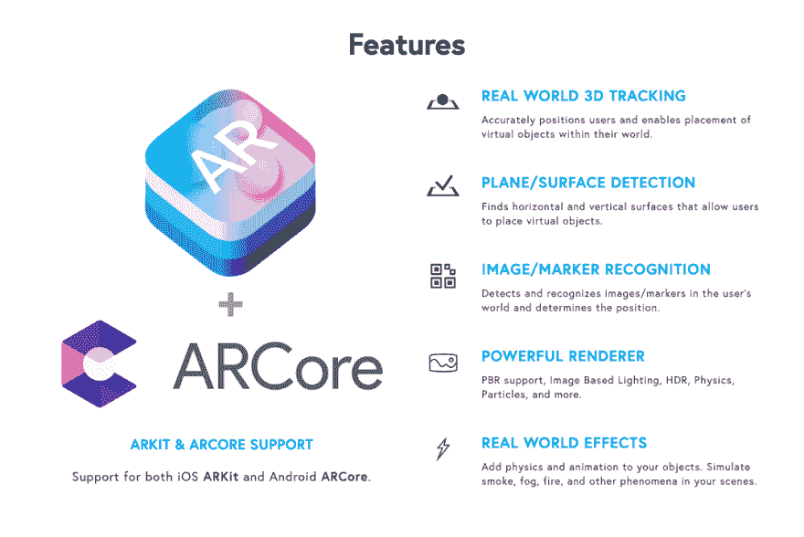
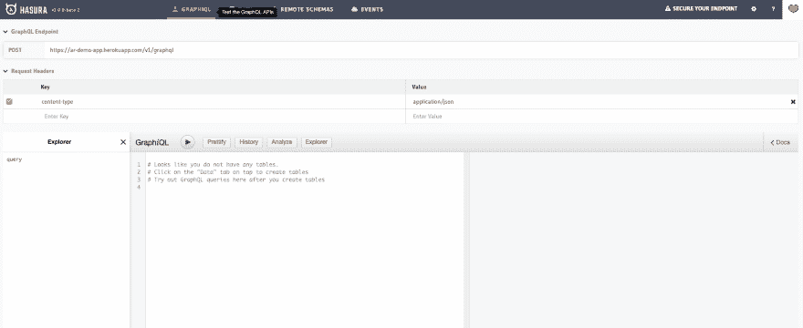
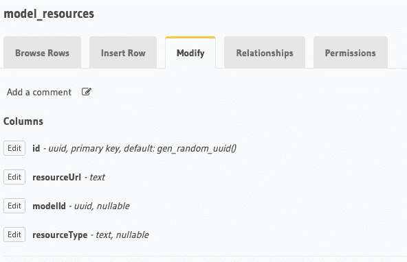
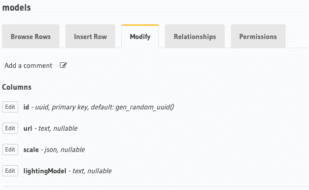
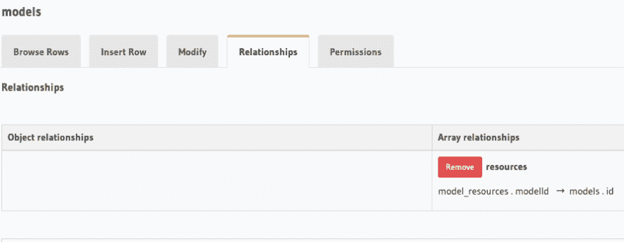
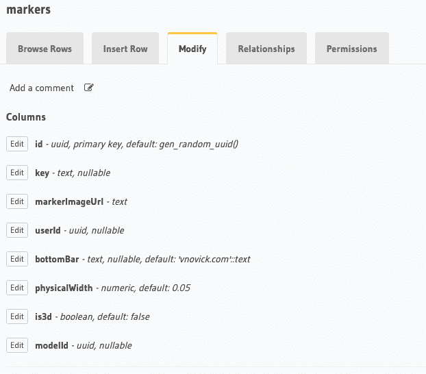
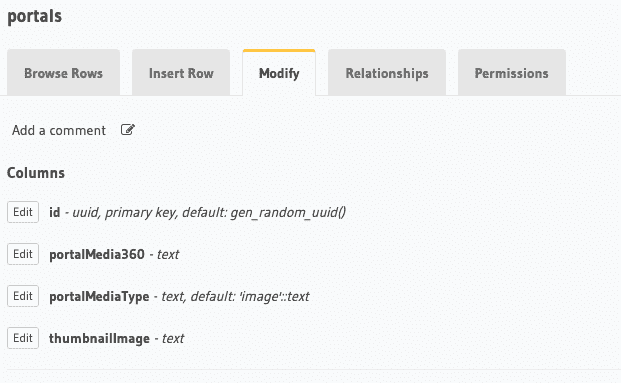
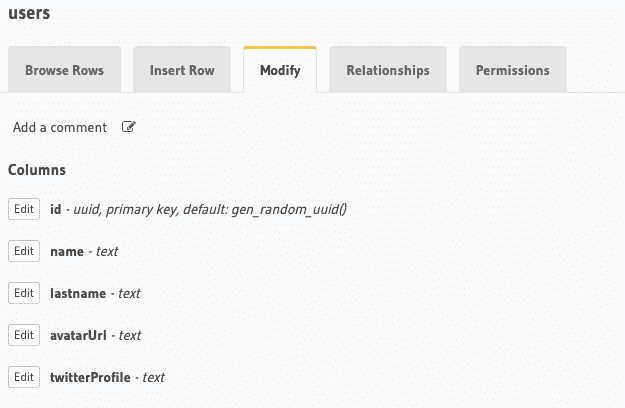
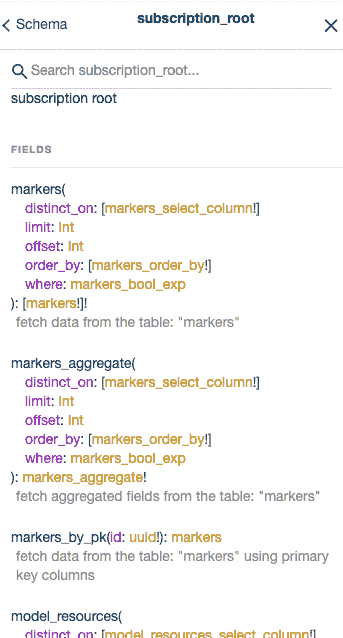

# 在 React Native 中构建 AR 应用，由 GraphQL 使用 Hasura 提供支持

> 原文：<https://dev.to/hasurahq/building-ar-apps-in-react-native-powered-by-graphql-using-hasura-h9m>

现实 2.0。这是最近半年我倾向于称之为增强现实的方式。这是为什么呢？我真诚地相信，增强现实已经处于走出“噱头”技术领域的阶段，并进入了企业认真考虑为消费者增加增强现实体验的阶段。基于位置的 AR、休闲游戏、零售、房地产。你说吧。AR 还没有在我们的智能眼镜或“黑镜型”隐形眼镜中准备好，但在 ARKit 和 ARCore 的帮助下，我们已经在手机上实现了它。

# 工作原理

现在，如果你不熟悉后者，arKit 和 ARCore 分别是苹果和谷歌的框架，将 AR 技术引入任何现代手机。简而言之，它具有基本的环境理解和运动跟踪功能，使开发人员不仅可以在现实世界中渲染 3d 内容，还可以将其“锚定”到已识别的表面。例如，对准你的手机摄像头，你可以将你的办公桌识别为一个表面，并在其上渲染一个 3d 模型。酷的部分是因为当你在模型周围走动时的运动跟踪，它看起来就在你渲染它的物理世界的同一个点上。它可以让您创建各种体验，将现实世界的背景带入您的应用程序，反之亦然。

# React Native 是移动应用的未来

React Native 近年来彻底改变了移动应用程序的创建体验，自然地，专门从事 React Native 的开发人员需要 ARKit 和 ARCore 解决方案。通常，创建 AR 解决方案的标准是使用 Unity3d 游戏引擎，通过非常简单的工作流程创建 AR 应用程序。开发人员可以获得出色的可视化编辑器，在那里他们可以处理 3d 内容，他们编写的代码可以跨平台兼容 iOS 和 Android。

那么如果你需要在现有的 React 原生 app 中嵌入 AR 内容呢？或者，如果 AR 只是用 React Native 编写的更广泛的应用程序的一部分呢？有几种解决方案。在这篇博客文章中，我们将讨论如何将 Unity 内容嵌入到我们的 React 原生应用程序中，这也是可能的，但使用 React 组件开发简单的 AR 体验。我们将通过一个叫做 ViroReact 的框架来实现

# 在 Viro 中创建 AR 内容。

ViroReact 为您提供了由 ARKit 和 ARCore 支持的渲染引擎，并提供了一系列 React 组件和事件，您可以使用它们来布局 AR 应用程序。除此之外，它还具有下图中描述的所有功能。

[](https://res.cloudinary.com/practicaldev/image/fetch/s--9ojJr9UB--/c_limit%2Cf_auto%2Cfl_progressive%2Cq_auto%2Cw_880/https://thepracticaldev.s3.amazonaws.com/i/adkna9cholgiflqfu1f1.png)

## 入门

要开始，你需要去 Viro 网站注册获得一个 API 密钥。按照[快速入门指南](https://docs.viromedia.com/docs/quick-start)开始使用简单的 Hello World 应用程序。

一言以蔽之，会像跑步一样简单。

```
npm install -g react-viro-cli
react-viro init MyAwesomeApp 
```

<svg width="20px" height="20px" viewBox="0 0 24 24" class="highlight-action crayons-icon highlight-action--fullscreen-on"><title>Enter fullscreen mode</title></svg> <svg width="20px" height="20px" viewBox="0 0 24 24" class="highlight-action crayons-icon highlight-action--fullscreen-off"><title>Exit fullscreen mode</title></svg>

当你这样做，你将有一个基本的应用程序，你可以使用病毒测试床应用程序运行。您需要将 API 密钥添加到 App.js 文件中

或者，如果你想在你的设备上运行它，你可以运行`./setup-ide.sh`——这个脚本将为 iOS、Android 或者两者设置你的开发环境。你可以在这里[阅读更多关于 Xcode 或 Android 的](https://docs.viromedia.com/docs/starting-a-new-viro-project-1)，在这里[阅读](https://docs.viromedia.com/docs/installing-viro-android)

## 积木

任何 AR 场景的第一个也是最重要的构建块是`<ViroARSceneNavigator>`组件。这个组件是您传递 apiKey 和传递`initialScene` prop 的组件。看看这个例子:

```
 <ViroARSceneNavigator 
        apiKey="1839C275-6929-45AF-B638-EF2DEE44C1D9"
        numberOfTrackedImages={this.props.numberOfTrackedImages || 1}
        initialScene={{
          scene: this.props.navigation.state.params.screenType === "portal" ? ARPortalsScene: MarkerScreen,
          passProps: this.props.navigation.state.params
        }}
      /> 
```

<svg width="20px" height="20px" viewBox="0 0 24 24" class="highlight-action crayons-icon highlight-action--fullscreen-on"><title>Enter fullscreen mode</title></svg> <svg width="20px" height="20px" viewBox="0 0 24 24" class="highlight-action crayons-icon highlight-action--fullscreen-off"><title>Exit fullscreen mode</title></svg>

这里我们将指定一个 AR 屏幕为`ARPortalsScene`场景或`MarkerScreen`。基本上，我们将创造这种体验:

[https://www.youtube.com/embed/q7EdpvFbU94](https://www.youtube.com/embed/q7EdpvFbU94)

标记屏幕是我们识别标记并以轻微动画显示每个标记的文本数据的屏幕。入口屏幕是自我描述的，是一个你可以看到虚拟世界入口的地方，从那里你仍然可以看到我们的真实世界。

### 传送门

让我们实际上从门户场景开始。在加载入口之前，你已经看到了一个灰色的四边形渲染在地面上。这个四边形基本上是通过使用`ViroARPlaneSelector`组件创建的，它给了我们选择一个**识别的**表面的能力，当它被选择时，这个组件将在表面上呈现它的孩子。

因此呈现门户的代码将如下所示:

```
<ViroARPlaneSelector dragType="FixedToWorld">
   <ViroPortalScene passable={true} dragType="FixedDistance" onDrag={()=>{}}>
      <ViroPortal scale={[.5, .5, .5]}>
          <Viro3DObject onLoadStart={() => { alert("Loading portal") }}
              source={require('../res/portal_wood_frame.vrx')}
              resources={[require('../res/portal_wood_frame_diffuse.png'),
                                    require('../res/portal_wood_frame_normal.png'),
                                    require('../res/portal_wood_frame_specular.png')]}
              type="VRX"
          />
       </ViroPortal>
       <Viro360Image source={{ uri: data.portals_by_pk.portalMedia360 }} />
   </ViroPortalScene>
</ViroARPlaneSelector> 
```

<svg width="20px" height="20px" viewBox="0 0 24 24" class="highlight-action crayons-icon highlight-action--fullscreen-on"><title>Enter fullscreen mode</title></svg> <svg width="20px" height="20px" viewBox="0 0 24 24" class="highlight-action crayons-icon highlight-action--fullscreen-off"><title>Exit fullscreen mode</title></svg>

如您所见，我们使用 Viro 提供的助手组件来加载`.fbx`模型(`.vrx`是通过 Viro 压缩脚本传递的`FBX`格式扩展)和 360°图像(也可以是视频)

### 标记

标记将使用`ViroARImageMarker`辅助组件为每个标记渲染特定数据。代码如下所示。

```
 return (
                <ViroARImageMarker target={"businessCard"} 
                  onAnchorFound={
                    () => this.setState({
                        runAnimation: true
                    })}
                >
                <ViroNode key="card" onTouch={() => alert("twitter")}>
                  <ViroNode 
                    opacity={0} position={[0, -0.02, 0]} 
                    animation={{
                      name:'animateImage', 
                      run: this.state.runAnimation 
                      }}
                  >
                    <ViroFlexView 
                        rotation={[-90, 0, 0]}
                        height={0.03} 
                        width={0.05}
                        style={styles.card} 
                    >
                      <ViroFlexView 
                        style={styles.cardWrapper} 
                      >
                        <ViroImage
                          height={0.015}
                          width={0.015}
                          style={styles.image}
                          source={{uri: markerData.user.avatarUrl}}
                        />
                        <ViroText 
                          textClipMode="None"
                          text={`${markerData.user.name}  ${markerData.user.lastname}`}
                          scale={[.015, .015, .015]}
                          style={styles.textStyle}
                        />
                      </ViroFlexView>
                      <ViroFlexView 
                        style={styles.subText} 
                      >
                        <ViroText 
                          width={0.01}
                          height={0.01}
                          textAlign="left"
                          textClipMode="None"
                          text={`@${markerData.user.twitterProfile}`}
                          scale={[.01, .01, .01]}
                          style={styles.textStyle}
                        />
                        <ViroAnimatedImage
                          height={0.01}
                          width={0.01}
                          loop={true}
                          source={require('../res/tweet.gif')}
                        />
                      </ViroFlexView>
                    </ViroFlexView>
                  </ViroNode>  
                  <ViroNode opacity={0} position={[0, 0, 0]} 
                    animation={{
                      name:'animateViro', 
                      run: this.state.runAnimation 
                    }}
                  >
                    { markerData.bottomBar && <ViroText text={markerData.bottomBar}
                      rotation={[-90, 0, 0]}
                      scale={[.01, .01, .01]}
                      style={styles.textStyle}
                  /> }
                  </ViroNode>
                </ViroNode>
                </ViroARImageMarker> 
```

<svg width="20px" height="20px" viewBox="0 0 24 24" class="highlight-action crayons-icon highlight-action--fullscreen-on"><title>Enter fullscreen mode</title></svg> <svg width="20px" height="20px" viewBox="0 0 24 24" class="highlight-action crayons-icon highlight-action--fullscreen-off"><title>Exit fullscreen mode</title></svg>

在这里，您可以看到我们使用了一系列其他组件，如用于内容分组的 ViroNode 和 ViroFlexView，因此我们可以使用 flexbox 在 AR 世界中布局文本。我们也有创造滑动动画等。

# 数据呢

您可能已经注意到我们没有硬编码的值，事实上，实际数据来自使用 Hasura 自动生成的 GraphQL API。

## Hasura GraphQL

如果这是你第一次听说 Hasura，我强烈建议你看看这篇关于它的博文

> 弗拉迪米尔·诺维克[@弗拉迪米尔诺维克](https://dev.to/vladimirnovick)我刚刚发布了毫不费力的实时 GraphQL API 与无服务器业务逻辑运行在任何云[link.medium.com/DET666lI3T](https://t.co/qr5UNZTGYJ)上午 11:47-05 2019 年 2 月[](https://twitter.com/intent/tweet?in_reply_to=1092751461824585728)[](https://twitter.com/intent/retweet?tweet_id=1092751461824585728)[](https://twitter.com/intent/like?tweet_id=1092751461824585728)

简而言之，Hasura 可以从您的 Postgres DB 自动生成 GraphQL API，无论是新的还是现有的；它为您的数据、graphql api、auth、访问控制、业务逻辑等提供了令人印象深刻的管理控制台。它为您提供了添加业务逻辑的各种选项，无论您是喜欢更同步的方法，还是准备向前迈进，为您的现代应用程序使用 [3factor.app](//3factor.app) 架构。您可以在此阅读有关添加业务逻辑的更多信息:

液体错误:内部

因此，对我们来说至关重要的是，在我们的 AR 世界中也获得实时数据。让我们从创建后端开始

## 用 Hasura 创建后端

前往 [hasura.io](https://hasura.io) 并使用任何你喜欢的部署引擎的方法。我会用 Heroku。部署引擎后，我将看到一个空的 Hasura 控制台，我们将在那里开始添加数据

[](https://res.cloudinary.com/practicaldev/image/fetch/s--YQ9zndnk--/c_limit%2Cf_auto%2Cfl_progressive%2Cq_auto%2Cw_880/https://thepracticaldev.s3.amazonaws.com/i/9jucljsgrgt1y00pwmgo.png)

转到“数据”选项卡，让我们创建以下表格:

*   model_resources -将保存 3d 模型的资源(纹理等)

[](https://res.cloudinary.com/practicaldev/image/fetch/s--OsQvJcW6--/c_limit%2Cf_auto%2Cfl_progressive%2Cq_auto%2Cw_880/https://thepracticaldev.s3.amazonaws.com/i/49ty407fo9ax6i5ehsvl.png)

*   模型-将持有 3d 模型对象的网址，缩放，照明模型，并将有一个模型 _ 资源表的关系

[](https://res.cloudinary.com/practicaldev/image/fetch/s--0ZTHPjmN--/c_limit%2Cf_auto%2Cfl_progressive%2Cq_auto%2Cw_880/https://thepracticaldev.s3.amazonaws.com/i/70kswbrzrb8fzj3ilez0.png)
[T6】](https://res.cloudinary.com/practicaldev/image/fetch/s--gHM-N5h8--/c_limit%2Cf_auto%2Cfl_progressive%2Cq_auto%2Cw_880/https://thepracticaldev.s3.amazonaws.com/i/lbghammuaukwhp5xmwx8.png)

*   标记——将为我们的标记保存数据，并将与用户和模型表建立关系

[](https://res.cloudinary.com/practicaldev/image/fetch/s--EBQaC28t--/c_limit%2Cf_auto%2Cfl_progressive%2Cq_auto%2Cw_880/https://thepracticaldev.s3.amazonaws.com/i/aasbnz2dov9u2z2i08r0.png)
[T6】](https://res.cloudinary.com/practicaldev/image/fetch/s--QejYZeNT--/c_limit%2Cf_auto%2Cfl_progressive%2Cq_auto%2Cw_880/https://thepracticaldev.s3.amazonaws.com/i/092wchjhe8l5j1zutdh9.png)

*   门户——将为我们的门户保存数据

[](https://res.cloudinary.com/practicaldev/image/fetch/s--t2O7pE3V--/c_limit%2Cf_auto%2Cfl_progressive%2Cq_auto%2Cw_880/https://thepracticaldev.s3.amazonaws.com/i/prz3efqm1d044lqsoueq.png)

*   用户-我们将在这个应用程序中有一个虚拟登录，但你可以通过查看以下博客帖子来实现正确的身份验证:

> 弗拉迪米尔·诺维克[@弗拉迪米尔诺维克](https://dev.to/vladimirnovick)最近很多人问我关于用 [@HasuraHQ](https://twitter.com/HasuraHQ) 认证的事情。看看我一个月前写的一篇博文。[dev.to/hasurahq/hasur…](https://t.co/iU5ptWKYTd)2019 年 5 月 19 日下午 12:59[](https://twitter.com/intent/tweet?in_reply_to=1130095758554882049)[](https://twitter.com/intent/retweet?tweet_id=1130095758554882049)

[](https://res.cloudinary.com/practicaldev/image/fetch/s--cYTrXOYp--/c_limit%2Cf_auto%2Cfl_progressive%2Cq_auto%2Cw_880/https://thepracticaldev.s3.amazonaws.com/i/p7cmv5v3xg1u4smejiz6.png)

在您在新创建的引擎中设置所有这些之后，Hasura 将为您自动生成 GraphQL API，包括我们将在 AR 应用程序中使用的真正高性能的订阅。

[](https://res.cloudinary.com/practicaldev/image/fetch/s--oENFYDE3--/c_limit%2Cf_auto%2Cfl_progressive%2Cq_auto%2Cw_880/https://thepracticaldev.s3.amazonaws.com/i/v2upicgy1do6lj2yb5n4.png)

## 设置您的客户端

现在是时候进入我们的 Viro 应用程序了，实际上，删除我们所有的示例内容，开始用 GraphQL 创建基本的 React 原生应用程序。如果你是 React Native 和 GraphQL 的新手，我强烈建议查看 React Native 上的 [learn.hasura.io](//learn.hasura.io) 教程。

我们在`App.js`中的`AppScreen`代码将从仅仅是病毒样本变成类似这样的东西:

```
 const mkWsLink = (uri) => {
  const splitUri = uri.split('//');
  const subClient = new SubscriptionClient(
    'wss://' + splitUri[1],
    { reconnect: true }
  );
  return new WebSocketLink(subClient);
}

const wsLink = mkWsLink(GRAPHQL_ENDPOINT)
const httpLink = new HttpLink({ uri: GRAPHQL_ENDPOINT });
const link = split(
  // split based on operation type
  ({ query }) => {
    const { kind, operation } = getMainDefinition(query);
    return kind === 'OperationDefinition' && operation === 'subscription';
  },
  wsLink,
  httpLink
);

// Creating a client instance
const client = new ApolloClient({
  link,
  cache: new InMemoryCache({
    addTypename: false
  })
});

export default class AppScreen extends React.Component {
  render() {
    return(
      <ApolloProvider client={client}>
        <RootNavigator
          client={client}
          session={this.props.sessionInfo}
        />
      </ApolloProvider>
    )
  }
} 
```

<svg width="20px" height="20px" viewBox="0 0 24 24" class="highlight-action crayons-icon highlight-action--fullscreen-on"><title>Enter fullscreen mode</title></svg> <svg width="20px" height="20px" viewBox="0 0 24 24" class="highlight-action crayons-icon highlight-action--fullscreen-off"><title>Exit fullscreen mode</title></svg>

如您所见，我们有`ApolloProvider`将我们的 apollo 客户端设置在 React 上下文上，因此稍后可以通过`Subscription`组件访问它。

## 导航

让我们来看看我们的`RootNavigator`

```
 const AppStack = createBottomTabNavigator({
  Markers: createStackNavigator({ 
    Home: Home, 
    ARScreen: ARScreen 
  }),
  Portals: createStackNavigator({ 
    Portals: PortalsList, 
    ARPortalScreen: ARScreen 
  })
});
const AuthStack = createStackNavigator({ SignIn: SignIn }); 

export default createAppContainer(createSwitchNavigator(
  {
    AuthLoading: AuthLoadingScreen,
    App: AppStack,
    Auth: AuthStack,
    Upload
  },
  {
    initialRouteName: 'AuthLoading',
  }
)); 
```

<svg width="20px" height="20px" viewBox="0 0 24 24" class="highlight-action crayons-icon highlight-action--fullscreen-on"><title>Enter fullscreen mode</title></svg> <svg width="20px" height="20px" viewBox="0 0 24 24" class="highlight-action crayons-icon highlight-action--fullscreen-off"><title>Exit fullscreen mode</title></svg>

正如你在这里看到的，我们的初始屏幕将是授权加载屏幕，但`Markers`选项卡和`Portals`选项卡都将有一个堆栈，该堆栈将有一个带有标记/门户和`ARScreen`列表的纯反应本地屏幕。

我们之前已经见过一个屏幕，但它看起来是这样的:

```
 getARView() {
    return this.state.arEnabled ? (
      <ViroARSceneNavigator 
        apiKey=API_KEY
        numberOfTrackedImages={this.props.numberOfTrackedImages || 1}
        initialScene={{
          scene: this.props.navigation.state.params.screenType === "portal" ? ARPortalsScene: MarkerScreen,
          passProps: this.props.navigation.state.params
        }}
      />
    ) : null
  }

  render() {
    return (
      <SafeAreaView style={styles.container}>
        {this.getARView()}
        <View style={styles.bottomTab}>
          <Button text="Go Back" onPress={this._goBack} />
        </View>
      </SafeAreaView>
    )
  } 
```

<svg width="20px" height="20px" viewBox="0 0 24 24" class="highlight-action crayons-icon highlight-action--fullscreen-on"><title>Enter fullscreen mode</title></svg> <svg width="20px" height="20px" viewBox="0 0 24 24" class="highlight-action crayons-icon highlight-action--fullscreen-off"><title>Exit fullscreen mode</title></svg>

## 订阅在 AR 和移动世界都有效

现在我们剩下要做的唯一一件事就是前往我们的 MarkerScreen.js，用 Subscription 包装我们的 Marker。`MarkerScreen`渲染函数看起来是这样的:

```
 render() {
    return (
      <ViroARScene onTrackingUpdated={this._onInitialized} >
      <ViroDirectionalLight color="#777777"
        direction={[0, -1, -2]}
        shadowOrthographicPosition={[0, 8, -5]}
        shadowOrthographicSize={10}
        shadowNearZ={2}
        shadowFarZ={9}
        lightInfluenceBitMask={2}
        castsShadow={true} 
      />
        { this.state.isTracking ? this.getNoTrackingUI() : this.getARScene()}

      </ViroARScene>
    );
  } 
```

<svg width="20px" height="20px" viewBox="0 0 24 24" class="highlight-action crayons-icon highlight-action--fullscreen-on"><title>Enter fullscreen mode</title></svg> <svg width="20px" height="20px" viewBox="0 0 24 24" class="highlight-action crayons-icon highlight-action--fullscreen-off"><title>Exit fullscreen mode</title></svg>

基本上，我们将我们的场景包装在`ViroARScene`组件中，以利用 ViroReact 和 ARKit/ARCore 框架带来 AR 功能。
我们之前已经看到了标记代码的样子，所以现在剩下唯一要做的就是用订阅
来包装它

```
const MARKER_DETAILS = gql`
subscription fetchMarker($markerId: uuid!) {
  markers_by_pk(id: $markerId) {
    user {
      name
      lastname,
      twitterProfile,
      avatarUrl
    }
    bottomBar
  }
}
`;

getARScene() {
    return (
      <ViroNode>
          <Subscription subscription={MARKER_DETAILS} variables={{ markerId: this.props.id }}>
            {({loading, error, data }) => {
              if (error) {
                alert("Error", "Could not fetch marker");
                return null;
              }

              if (loading) {
                return (
                  <LoadingComponent text="Loading Marker" />
                )
              }

              const markerData = data.markers_by_pk
              if (this.props.is3d) {
                return this.render3d()
              }
              return (
                <ViroARImageMarker target={"businessCard"} 
                  onAnchorFound={
                    () => this.setState({
                        runAnimation: true
                    })}
                >

// rest of marker code 
```

<svg width="20px" height="20px" viewBox="0 0 24 24" class="highlight-action crayons-icon highlight-action--fullscreen-on"><title>Enter fullscreen mode</title></svg> <svg width="20px" height="20px" viewBox="0 0 24 24" class="highlight-action crayons-icon highlight-action--fullscreen-off"><title>Exit fullscreen mode</title></svg>

结果将如下所示:

[https://www.youtube.com/embed/bDy1Nw4_M88](https://www.youtube.com/embed/bDy1Nw4_M88)

# 总结

正如你在这篇博文中看到的，向 React Native 添加 AR 内容并不是一门火箭科学，只要对 3d 环境有基本的了解，就可以很容易地完成。这种 AR 内容可以类似地连接到 GraphQL API，作为常规的 React 本机应用程序。Hasura 会让这一步变得非常简单明了。

我没有涵盖这个示例应用程序的所有代码，但它可以在这里[找到](https://github.com/vnovick/data-driven-ar-demo)供您检查。
在过去的几个月里，我还就这个主题做了几次演讲，展示了这个演示应用，并解释了更多关于 AR 部件的内容，所以请查看 DevDays Europe 的一次演讲:

[https://www.youtube.com/embed/QCOmOROWbAU](https://www.youtube.com/embed/QCOmOROWbAU)

幻灯片可在[这里](https://slides.com/vladimirnovick/data-driven-ar)获得

如果你想了解更多关于 AR 和 GraphQL 组合的信息，我将在 [Chain React 2019](https://infinite.red/ChainReactConf) 大会上讲授 AR 和 GraphQL 研讨会，因此如果你对这方面的更多指导实践经验感兴趣，欢迎你获得门票。

在结束这篇博文之前，最后说明一下，我或 Hasura.io 团队的某人每周都会在[twitch.tv/hasurahq](//twitch.tv/hasurahq)上传一些很酷的东西，并上传到我们的 [Youtube 频道](https://www.youtube.com/c/hasurahq)，所以请确保您了解我们接下来的活动。例如，昨天，我流式传输了我们刚刚看到的同一个 AR 应用程序的详细代码概述。

如果你有任何问题，你可以通过填写我网站上的联系表格来联系我:[vnovick.com](https://vnovick.com)或者在推特上给我发 DM[@ VladimirNovick](https://twitter.com/VladimirNovick)