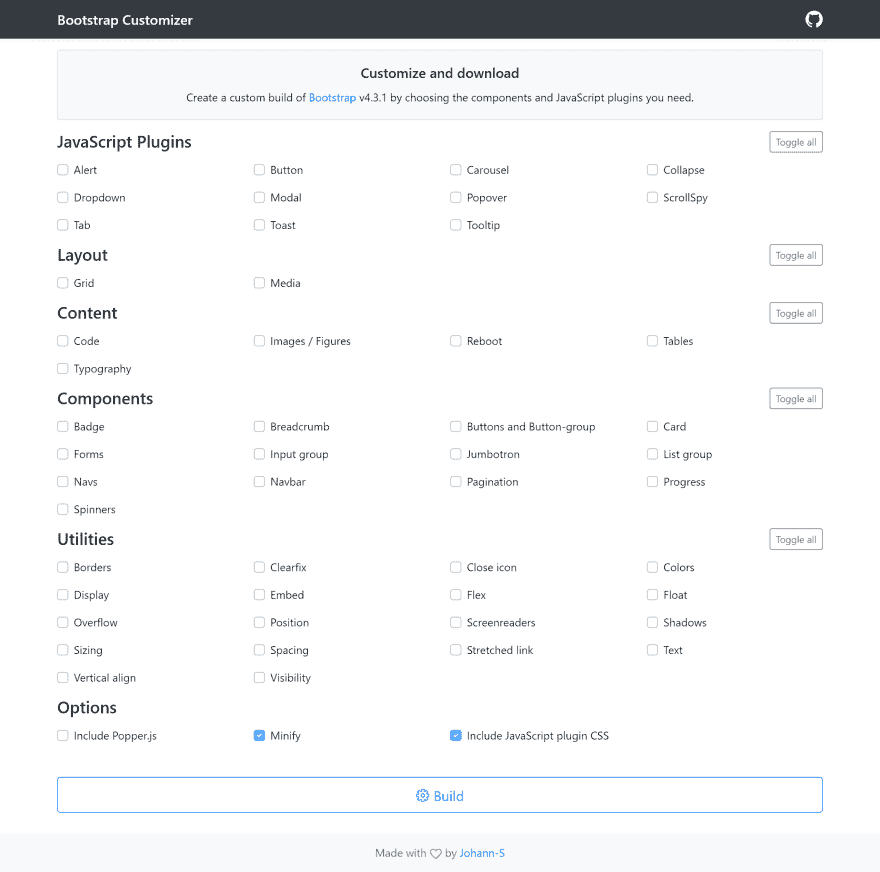

# 引导程序 4 定制程序

> 原文：<https://dev.to/jservoire/bootstrap-4-customizer-360a>

大家好，这是我第一次在这里写作，所以请善待我惊人的英语水平😄

## [bs-定制器](https://johann-s.github.io/bs-customizer/)

这是一个我们为构建 Bootstrap 4 的定制版本而做的项目。

这个想法来自于 [Bootstrap 3 定制器](https://getbootstrap.com/docs/3.4/customize/)，因为我看到许多 Bootstrap 用户要求 Bootstrap 4 定制器。

[bs-customizer](https://johann-s.github.io/bs-customizer/) 允许你做几件事:

*   选择您需要的组件和 JavaScript 插件
*   缩小生成的版本
*   正在内部导入 [Popper.js](https://popper.js.org/)

使用这个简单的工具，您将能够通过减小引导的大小来优化您的引导构建。

我希望你会喜欢它！