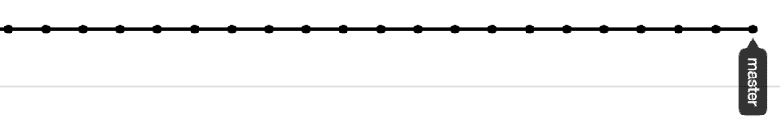
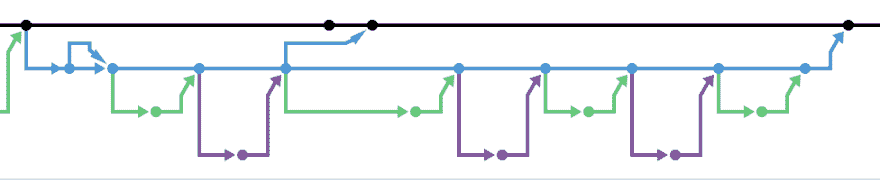
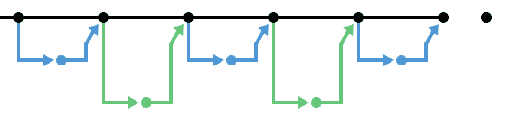
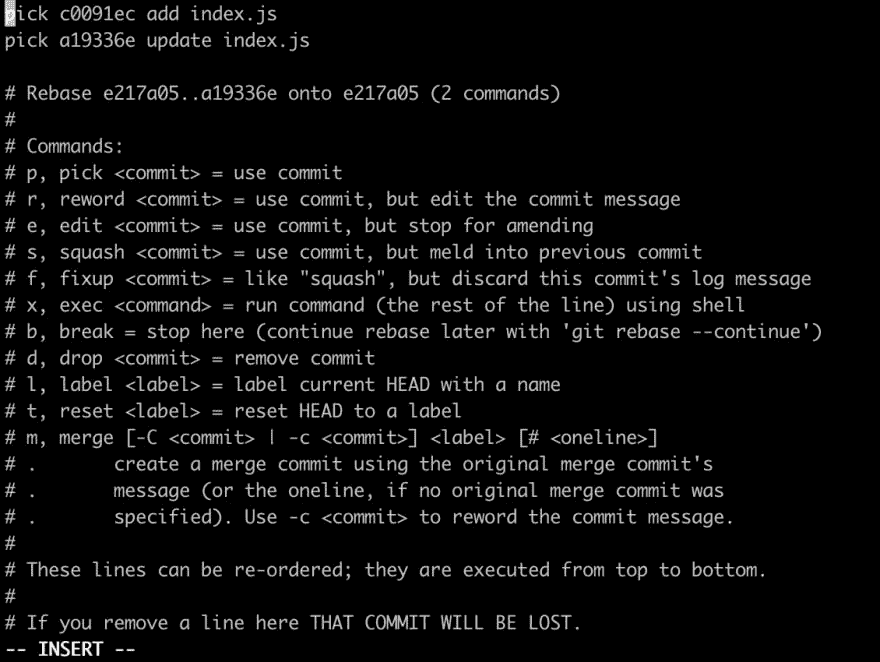
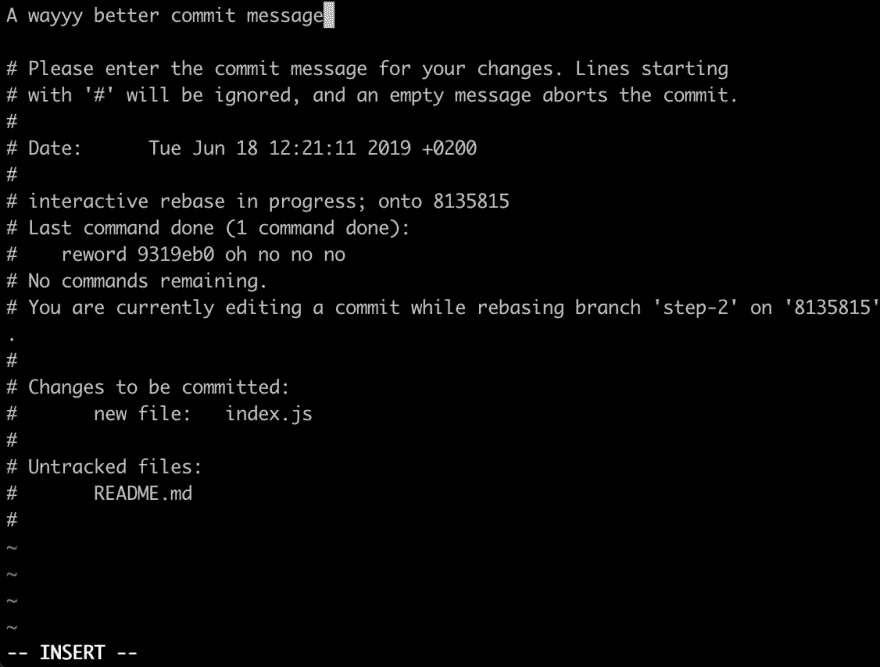
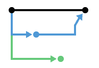
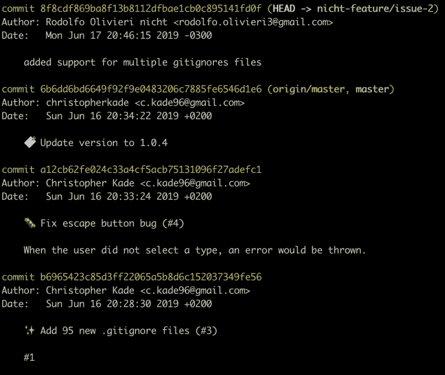
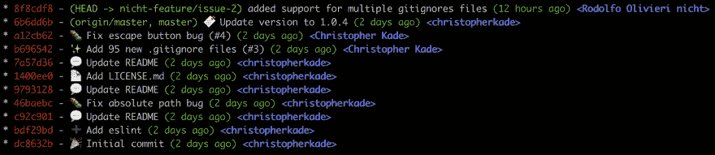

# 收起你的饭桶游戏，清理你的历史

> 原文：<https://dev.to/christopherkade/up-your-git-game-and-clean-up-your-history-4j3j>

> 这篇文章的目标读者是想学习如何使用 rebase 等命令的人&学习一些技巧来获得更好的 Git 体验。

好了，让我们先来看看我在 Github 上的第一批项目的 Git 历史:

[](https://res.cloudinary.com/practicaldev/image/fetch/s--2RYXlv9K--/c_limit%2Cf_auto%2Cfl_progressive%2Cq_auto%2Cw_880/https://thepracticaldev.s3.amazonaws.com/i/7vpkyr2vbo9ua1ymfmiy.png)

> 哦

[](https://res.cloudinary.com/practicaldev/image/fetch/s--pmfzFqsE--/c_limit%2Cf_auto%2Cfl_progressive%2Cq_auto%2Cw_880/https://thepracticaldev.s3.amazonaws.com/i/21t7daye6xhkfhnnzc1v.png)

> 哦不不不不

[](https://res.cloudinary.com/practicaldev/image/fetch/s--K-e4m2ym--/c_limit%2Cf_auto%2Cfl_progressive%2Cq_auto%2Cw_880/https://thepracticaldev.s3.amazonaws.com/i/a68jim387s5o3v224dlr.png)

> 哦，上帝，我做了什么

既然我已经自嘲过了，那就来看看我现在的大部分项目是什么样子的吧😄

[](https://res.cloudinary.com/practicaldev/image/fetch/s--DDz4XrYO--/c_limit%2Cf_auto%2Cfl_progressive%2Cq_auto%2Cw_880/https://thepracticaldev.s3.amazonaws.com/i/66wi8w9kdgl8x6m6ru4o.png)

> 哦，好多了

如果你不知道这意味着什么，让我简单解释一下:

这是您在 Github 上的 Git 历史的表示，意味着您在项目的分支上所做的提交。

> 你可以通过导航到一个项目的“Insights”选项卡，然后转到左侧的“Network”选项卡来查看你自己的项目。

黑色条代表我的`master`分支，每个交替的蓝色&绿色条是单独的分支。

正如你在最近和更好的历史上看到的，它们交替地被合并到 master 中，创建了这个编写代码的好流程&合并它(这是一直被推荐的，而不是累积拉请求)。

那么，怎样才能有更干净的历史呢？让我们回顾一下真实的用例。

以下是我们今天要讲的内容(确保按顺序完成每个部分):

*   [重置基础](#the-magic-of-git-rebase)
    *   [修复提交](#example-1-fixing-up-a-commit-with-rebase)
    *   [放弃提交](#example-2-dropping-a-commit)
    *   [重命名提交](#example-3-rewording-a-commit)
    *   [在主设备上重设基础](#example-4-rebasing-on-master)
*   [获得更好的 git 日志](#bonus-a-better-git-log)

## `git rebase`的魔力

[正式文件](https://git-scm.com/docs/git-rebase)

Git rebase 让你按照自己的意愿重塑历史。将其视为在给定分支上操作提交列表的一种方式。例如，您可以完全放弃提交(基本上是在 git 的深渊中与它们说再见)，重命名它们(重写您的提交消息)，将它们压缩到其他提交中(这有助于隐藏那些做了诸如添加分号之类的小事的提交，您真的不想在您的历史中看到它们)以及许多其他事情。

### 通过实践学习

去下面的[项目](https://github.com/christopherkade/up-your-git-game)我为这个场合，**叉它**让我们开始吧。

分叉基本上是为你自己创建一个我的项目的副本，你可以毫无问题地摆弄它！为此，请单击右上角的叉按钮:

[](https://res.cloudinary.com/practicaldev/image/fetch/s--xuQVRsSq--/c_limit%2Cf_auto%2Cfl_progressive%2Cq_auto%2Cw_880/https://thepracticaldev.s3.amazonaws.com/i/1plindfnefqldmifa3b3.png)

然后，克隆您分叉的存储库。

## 示例 1:用 rebase 修复提交

**场景**:您提交了不值得提交的东西，或者您想在发出拉请求之前将分支上的提交次数减少到一次。

*   从`master`分支，创建一个新分支。

*   创建一个新文件，它的内容并不重要。

*   将新文件提交到您分支。

```
git add index.js
git commit -m "add index.js" 
```

<svg width="20px" height="20px" viewBox="0 0 24 24" class="highlight-action crayons-icon highlight-action--fullscreen-on"><title>Enter fullscreen mode</title></svg> <svg width="20px" height="20px" viewBox="0 0 24 24" class="highlight-action crayons-icon highlight-action--fullscreen-off"><title>Exit fullscreen mode</title></svg>

*   更新文件中的内容

*   使用诸如“update index.js”的消息再次提交

*   运行`git log`，如你所见，我们现在有 2 次提交

我们现在想要将`update`提交到`add`提交中，因为这个小变化不值得提交。

为此，我们将使用`git rebase`的**交互**模式，这让我们可以通过一个漂亮的界面来应用重新基础。

*   像这样运行 rebase 命令:

```
git rebase -i HEAD~2 
```

<svg width="20px" height="20px" viewBox="0 0 24 24" class="highlight-action crayons-icon highlight-action--fullscreen-on"><title>Enter fullscreen mode</title></svg> <svg width="20px" height="20px" viewBox="0 0 24 24" class="highlight-action crayons-icon highlight-action--fullscreen-off"><title>Exit fullscreen mode</title></svg>

`HEAD~2`表示从分支(头部)上的最后一次提交开始，往回 2 次提交。如果我们想要操作更多的提交，我们可以将值更改到最右边。

你现在应该有一个类似这样的界面:

[](https://res.cloudinary.com/practicaldev/image/fetch/s--ZHl4upUS--/c_limit%2Cf_auto%2Cfl_progressive%2Cq_auto%2Cw_880/https://thepracticaldev.s3.amazonaws.com/i/h4po6e92b0icvrpki9sz.png)

不要惊慌，这只在顶部显示了您正在更改的两个提交，以及它们下面的可用命令。

默认情况下，rebase 接口使用 Vim，要写入，只需按下 **i** 键。您现在处于**“插入”**模式。因为我们想修复第一个提交中的第二个提交，我们所要做的就是在它前面写`fixup`或`f`而不是`pick`。我们的`update index.js`提交现在将被压缩到`add index.js`中，但是只有`add index.js`的消息将被保留。

*   像这样更新第二行:

```
pick c0091ec add index.js
f a19336e update index.js 
```

<svg width="20px" height="20px" viewBox="0 0 24 24" class="highlight-action crayons-icon highlight-action--fullscreen-on"><title>Enter fullscreen mode</title></svg> <svg width="20px" height="20px" viewBox="0 0 24 24" class="highlight-action crayons-icon highlight-action--fullscreen-off"><title>Exit fullscreen mode</title></svg>

现在，我们要应用 rebase，按 **escape** 离开 **INSERT** 模式，按 **:** (冒号)并输入 **wq** 表示“写”和“退出”，按 **ENTER** 应用这些更改。冒号只允许您编写命令供 Vim 执行。

现在，您的控制台中应该会出现以下消息:

> 已成功重置和更新 refs/heads/{您的分行名称}。

检查你的`git log`，你现在有一个美丽和干净的承诺！

*   最后，强制推送到分支，以将 rebase 应用到远程服务器

```
git push origin {BRANCH-NAME} -f 
```

<svg width="20px" height="20px" viewBox="0 0 24 24" class="highlight-action crayons-icon highlight-action--fullscreen-on"><title>Enter fullscreen mode</title></svg> <svg width="20px" height="20px" viewBox="0 0 24 24" class="highlight-action crayons-icon highlight-action--fullscreen-off"><title>Exit fullscreen mode</title></svg>

`-f`是必不可少的，因为 rebase 会修改您的 git 历史，并且需要强制执行。

## 示例 2:删除提交

接下来的 2 个步骤将与第一个非常相似，因为你现在有工具来做任何类型的重置基础🎉

**场景**:您想要完全删除一个提交

我们将放弃之前所做的`add FILENAME`提交:

*   运行 rebase 命令

```
git rebase -i HEAD~1 
```

<svg width="20px" height="20px" viewBox="0 0 24 24" class="highlight-action crayons-icon highlight-action--fullscreen-on"><title>Enter fullscreen mode</title></svg> <svg width="20px" height="20px" viewBox="0 0 24 24" class="highlight-action crayons-icon highlight-action--fullscreen-off"><title>Exit fullscreen mode</title></svg>

*   在您希望删除的提交前添加一个`d`或`drop`。

[](https://res.cloudinary.com/practicaldev/image/fetch/s--SIDu_fHR--/c_limit%2Cf_auto%2Cfl_progressive%2Cq_auto%2Cw_880/https://thepracticaldev.s3.amazonaws.com/i/nl7wqia23khpgf7by6jf.png)

*   在您的 Vim 编辑器中运行`:wq`(并使用`git log`检查提交是否被丢弃)

*   不要忘记将它强制推送到你的远程服务器上😀

## 例 3:改写提交

非常相似，只有一点不同。

**场景**:您想要修复一个打字错误或者重写一个提交的标题或描述

*   创建随机提交

[](https://res.cloudinary.com/practicaldev/image/fetch/s--bdrYWOki--/c_limit%2Cf_auto%2Cfl_progressive%2Cq_auto%2Cw_880/https://thepracticaldev.s3.amazonaws.com/i/o88cmcyqj1596f52gyiy.png)

*   运行 rebase 命令

```
git rebase -i HEAD~1 
```

<svg width="20px" height="20px" viewBox="0 0 24 24" class="highlight-action crayons-icon highlight-action--fullscreen-on"><title>Enter fullscreen mode</title></svg> <svg width="20px" height="20px" viewBox="0 0 24 24" class="highlight-action crayons-icon highlight-action--fullscreen-off"><title>Exit fullscreen mode</title></svg>

*   在您希望改写的提交前添加一个`r`或`reword`(现在不需要编辑标题)。

*   在 Vim 编辑器中运行`:wq`。这将打开一个类似的编辑器，其中包含您希望改写的提交。

[](https://res.cloudinary.com/practicaldev/image/fetch/s--UFm8xGgP--/c_limit%2Cf_auto%2Cfl_progressive%2Cq_auto%2Cw_880/https://thepracticaldev.s3.amazonaws.com/i/ou14d5c0l0wisqix9wr2.png)

*   根据您的意愿更新提交的标题和描述，运行`:wq`就可以了！用`git log`检查是否应用了重新措辞

[](https://res.cloudinary.com/practicaldev/image/fetch/s--mljZRxHp--/c_limit%2Cf_auto%2Cfl_progressive%2Cq_auto%2Cw_880/https://thepracticaldev.s3.amazonaws.com/i/b1o6v4ichuc69ruig868.png)

*   不要忘记将它强制推送到你的远程服务器上😀

## 例 4:重定基准于`master`

> 这个例子不会在 Github 项目中重现，但是可以随意测试一下。

**场景**:您同时打开了多个 PRs(拉取请求)

[](https://res.cloudinary.com/practicaldev/image/fetch/s--CIIXBTSB--/c_limit%2Cf_auto%2Cfl_progressive%2Cq_auto%2Cw_880/https://thepracticaldev.s3.amazonaws.com/i/ja8pn2wr7pl39yhaxf76.png)

你合并了一个 PR，现在，你的第二个 PR 没有更新到`master`，哦不！

[](https://res.cloudinary.com/practicaldev/image/fetch/s--Zvhqonsf--/c_limit%2Cf_auto%2Cfl_progressive%2Cq_auto%2Cw_880/https://thepracticaldev.s3.amazonaws.com/i/bl9r2aajzi2384qa4f9n.png)

这种非常频繁的场景会让我们在`master`上改变第二个 PR 的基础，这样它就可以从第一个 PR 中合并出新的代码。

*   从您想要重设基础的分支(在我们的例子中，是第二个 PR 的分支)，运行以下命令:

```
git fetch 
```

<svg width="20px" height="20px" viewBox="0 0 24 24" class="highlight-action crayons-icon highlight-action--fullscreen-on"><title>Enter fullscreen mode</title></svg> <svg width="20px" height="20px" viewBox="0 0 24 24" class="highlight-action crayons-icon highlight-action--fullscreen-off"><title>Exit fullscreen mode</title></svg>

这将下载我们的分支机构应用 rebase 所需的所有引用。

*   然后，像这样执行 rebase:

```
git rebase origin/master 
```

<svg width="20px" height="20px" viewBox="0 0 24 24" class="highlight-action crayons-icon highlight-action--fullscreen-on"><title>Enter fullscreen mode</title></svg> <svg width="20px" height="20px" viewBox="0 0 24 24" class="highlight-action crayons-icon highlight-action--fullscreen-off"><title>Exit fullscreen mode</title></svg>

*   最后，运行一个`git push origin {MY-BRANCH} -f`将 rebase 应用到我们的远程服务器

[](https://res.cloudinary.com/practicaldev/image/fetch/s--t7sPAaAw--/c_limit%2Cf_auto%2Cfl_progressive%2Cq_auto%2Cw_880/https://thepracticaldev.s3.amazonaws.com/i/m220k16b638zl42xaqbo.png)

> 万岁！

## 奖金:更好的`git log`

你的`git log`太多了吗？

[](https://res.cloudinary.com/practicaldev/image/fetch/s--i_2X6XHX--/c_limit%2Cf_auto%2Cfl_progressive%2Cq_auto%2Cw_880/https://thepracticaldev.s3.amazonaws.com/i/pynf7hsq5tgdl43jr5ba.png)

你更愿意有一个开门见山、更好看的`git log`？

[](https://res.cloudinary.com/practicaldev/image/fetch/s--_li3IWKP--/c_limit%2Cf_auto%2Cfl_progressive%2Cq_auto%2Cw_880/https://thepracticaldev.s3.amazonaws.com/i/9k0v35fvzng378m4vftg.png)

不要再看了！下面是你如何实现它，在你的控制台中，粘贴以下内容:

```
git config --global alias.lg "log --color --graph --pretty=format:'%Cred%h%Creset -%C(yellow)%d%Creset %s %Cgreen(%cr) %C(bold blue)<%an>%Creset' --abbrev-commit" 
```

<svg width="20px" height="20px" viewBox="0 0 24 24" class="highlight-action crayons-icon highlight-action--fullscreen-on"><title>Enter fullscreen mode</title></svg> <svg width="20px" height="20px" viewBox="0 0 24 24" class="highlight-action crayons-icon highlight-action--fullscreen-off"><title>Exit fullscreen mode</title></svg>

现在您已经为`git log`创建了一个名为`git lg`的别名，它将显示之前显示的更好的输出。通过键入`git lg`(或`git lg -p`查看发生变化的行)来尝试一下。

> 感谢 [Coderwall](https://coderwall.com/p/euwpig/a-better-git-log) 给了这个✨奖金

## 论武力推行的危害&其他注意事项

正如 Nick Huanca 所提到的，在与团队合作时，强行推动可能是危险的:

[ ](/nickhuanca) [ Nick Huanca ](/nickhuanca) • [<time datetime="2019-06-18T15:57:14Z" class="date-short-year"> Jun 18 '19 </time> • Edited on <time datetime="2019-06-18T15:58:59Z" class="hidden m:inline-block date-no-year">Jun 18</time>](https://dev.to/nickhuanca/comment/c3d8) 

谢谢你的文章！这是一次很好的阅读/复习。因为观众是想升级他们的 git 游戏的人，我建议添加一些关于“强制推送”的危险的信息，也许可以参考[强制推送小心](https://thoughtbot.com/blog/git-push-force-with-lease)，它利用`--force-with-lease`这样人们就不会意外地覆盖团队推送。:)

另一件值得注意的事情可能是`git rebase --abort`如果事情在重定基数期间出乎意料地偏离了方向(冲突或其他奇怪/意想不到的行为)。很高兴知道，尤其是在开始时，如何安全地退出命令。

再次感谢！

所以另一种选择可能是`--force-with-lease`“允许一个人强制推送，而没有无意中覆盖其他人的工作的风险。只有当它与我们本地的远程跟踪分支具有相同的值时，它才会更新远程引用。[参考](https://thoughtbot.com/blog/git-push-force-with-lease)。尼克，谢谢你的提示！😄

你可能已经注意到，他还提到了`git rebase --abort`，这允许我们在中途停止重定基础，以防出现任何问题。因此，如果出于任何原因，你搞砸了你的 rebase，把它弄小一点`--abort`然后重新开始。

## 关闭思绪

学习如何使用 Git 可能是我们作为开发人员可以获得的最重要的技能之一。我希望你们中的一些人不会像我不久前一样害怕。

如果这篇文章有所帮助，请随时给它一个❤️🦄🔖并在 Twitter 上关注我。