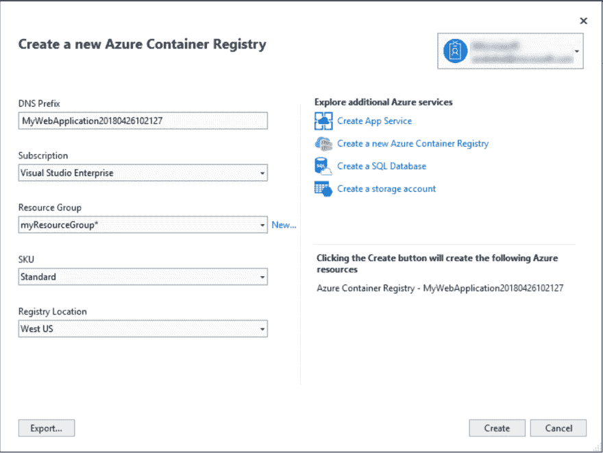

# 使用容器和 Visual Studio 实现 WCF 服务的现代化

> 原文：<https://dev.to/azure/modernizing-wcf-services-with-containers-and-visual-studio-531>

[](https://res.cloudinary.com/practicaldev/image/fetch/s--LrH4gFrJ--/c_limit%2Cf_auto%2Cfl_progressive%2Cq_auto%2Cw_880/http://tattoocoder.com/conteimg/2019/06/pablo--9-.png)

*[订阅每月简讯](https://azure.microsoft.com/resources/join-the-azure-developer-community/?WT.mc_id=devto-blog-shboyer)，其中有许多文章、文档、事件和事件，并寻找机会与其他在线和本地开发人员联系。*

长期搬家有很多原因。像 ASP.NET 和 WCF 这样的. NET 框架应用程序将 Webforms 转换成容器，然后再转换成容器，或者“使传统应用程序现代化”。

1.  devo PS——在容器中设置好应用程序后，构建一个 CI/CD 管道，以简化的方式构建应用程序并将其推送到云中。

2.  速度——除了 CI/CD 特性之外，对容器进行版本控制的能力、部署的简易性以及发生故障时的回滚都变得更加容易。

3.  利用其他云服务-添加应用洞察或日志记录、托管数据库服务和其他 PAAS 产品。

## 从哪里开始

[Visual Studio 2019](https://visualstudio.com/?WT.mc_id=devto-blog-shboyer) 在工作负载中内置了 Docker 工具。你需要为 Windows 安装 [Docker，并确保](https://docs.docker.com/docker-for-windows/) [Windows 容器](https://docs.docker.com/docker-for-windows/#switch-between-windows-and-linux-containers)被启用。

在 VS 2019 中打开你的 WCF 应用，右键点击项目文件，选择添加-> Docker 支持。

[](https://res.cloudinary.com/practicaldev/image/fetch/s--0obTzPfj--/c_limit%2Cf_auto%2Cfl_progressive%2Cq_auto%2Cw_880/http://tattoocoder.com/conteimg/2019/06/Screen-Shot-2019-06-11-at-2.36.28-PM.png)

Visual Studio 的 Docker 工具将检查应用程序，并为您的应用程序添加适当的 Docker 文件。

对于 WCF，以下 docker 文件将添加到您的解决方案中。

```
FROM mcr.microsoft.com/dotnet/framework/wcf:4.7.2-windowsservercore-ltsc2019  
ARG source  
WORKDIR /inetpub/wwwroot  
COPY ${source:-obj/Docker/publish} . 
```

<svg width="20px" height="20px" viewBox="0 0 24 24" class="highlight-action crayons-icon highlight-action--fullscreen-on"><title>Enter fullscreen mode</title></svg> <svg width="20px" height="20px" viewBox="0 0 24 24" class="highlight-action crayons-icon highlight-action--fullscreen-off"><title>Exit fullscreen mode</title></svg>

现在，当您运行您的应用程序时，从 Debug 菜单中选择“Docker ”, WCF 测试客户端将启动并添加服务的容器 url。

> 如果 WCF 测试客户端没有加载，请确保在 Visual Studio 2019 安装程序中选择了工作负载。

在查看`*csproj`文件时，您应该看到有新的条目可以用 F5 启动新的容器。

```
<DockerLaunchAction>LaunchWcfTestClient</DockerLaunchAction><DockerLaunchUrl>http://{ServiceIPAddress}/MyService.svc</DockerLaunchUrl> 
```

<svg width="20px" height="20px" viewBox="0 0 24 24" class="highlight-action crayons-icon highlight-action--fullscreen-on"><title>Enter fullscreen mode</title></svg> <svg width="20px" height="20px" viewBox="0 0 24 24" class="highlight-action crayons-icon highlight-action--fullscreen-off"><title>Exit fullscreen mode</title></svg>

WCF 客户端将启动并添加要测试的新容器 URL 端点，而不是`http://localhost...`。现在，所有断点和调试都将发生在容器内，因为调试器附加到容器，而不是本地机器主机。

## 构建 Docker 图像

当您单击“调试”或按 F5 时，Visual Studio 会在提取基础映像后为您的应用程序生成映像。这可能需要一些时间，因为这是一个 Windows 容器映像，压缩了大约 1.59 Gb。

如果您熟悉 Docker，您可能会尝试使用标准的`docker build`或`docker run`命令。但是，如果没有运行适当的 MSBuild 命令来生成适当的输出，则使用命令行将会失败。

我们必须首先使用 Visual Studio 或 MSBuild 构建 WCF 应用程序。VS 的 Docker 工具实际上在后台运行 MSBuild 命令来创建`obj/Docker/publish`文件夹，编译应用程序，并在运行`docker run`命令之前将输出复制到那里。

这对于我们迁移到 DevOps 场景非常重要。需要在命令行和 Azure DevOps 中运行的命令是:

```
msbuild /t:ContainerBuild /p:Configuration=Release 
```

<svg width="20px" height="20px" viewBox="0 0 24 24" class="highlight-action crayons-icon highlight-action--fullscreen-on"><title>Enter fullscreen mode</title></svg> <svg width="20px" height="20px" viewBox="0 0 24 24" class="highlight-action crayons-icon highlight-action--fullscreen-off"><title>Exit fullscreen mode</title></svg>

### 将图像推送到注册表中

给出一个项目名称，即`hellowcf`将产生一个名为`hellowcf:latest`的 docker 图像。从这里开始，您可能希望在将图像推送到注册表之前，用适当的版本号或其他标识符为图像添加**标签**。

例如，用 **buildId** 进行标记，并将其推送到 Azure 容器注册中心。

```
docker tag hellowcf:latest myregistry.azure.cr/hellowcf:1234

docker push myregistry.azure.cr/hellowcf:1234 
```

<svg width="20px" height="20px" viewBox="0 0 24 24" class="highlight-action crayons-icon highlight-action--fullscreen-on"><title>Enter fullscreen mode</title></svg> <svg width="20px" height="20px" viewBox="0 0 24 24" class="highlight-action crayons-icon highlight-action--fullscreen-off"><title>Exit fullscreen mode</title></svg>

### 使用 Visual Studio

Visual Studio 拥有丰富的 UI 来发布应用程序，容器也是如此。

发布对话框有选项用于[部署到容器注册中心(Azure 容器注册中心，Docker Hub，自定义)](https://docs.microsoft.com/visualstudio/containers/hosting-web-apps-in-docker?view=vs-2019&WT.mc_id=devto-blog-shboyer)或者[直接从 UI 部署构建的容器映像到 Azure 应用服务](https://docs.microsoft.com/visualstudio/containers/deploy-app-service?view=vs-2019&WT.mc_id=devto-blog-shboyer)。

[](https://res.cloudinary.com/practicaldev/image/fetch/s--75fdArO5--/c_limit%2Cf_auto%2Cfl_progressive%2Cq_auto%2Cw_880/https://docs.microsoft.com/visualstudio/containers/media/hosting-web-apps-in-docker/vs-acr-provisioning-dialog.png%3Fview%3Dvs-2019%26WT.mc_id%3Ddevto-blog-shboyer)

## 发布申请

在这个场景中，使用了一个 WCF 应用程序，但是它也可以是一个 ASP.NET web forms 应用程序或一个控制台服务。

对于 WCF 的应用程序来说，Windows Containers on AppService 是很好的第一步，如果你的架构中有很多组件需要立即启动；AKS - [Azure Kubernetes 服务](https://docs.microsoft.com/en-us/azure/aks/windows-container-cli)现在也支持 Windows 容器。

偶尔运行的控制台应用程序或服务，或在计时器上执行工作的服务，如 [Azure Container instances](https://docs.microsoft.com/azure/container-instances/?WT.mc_id=devto-blog-shboyer) 非常适合。

这里的要点是将您的长期稳定的应用程序放入一个容器中，而无需重写或重新构建解决方案，并且仍然可以利用云原生类型实践。

## 补充阅读

[部署现有的。作为 Windows 容器的网络应用程序](https://docs.microsoft.com/en-us/dotnet/standard/modernize-with-azure-and-containers/modernize-existing-apps-to-cloud-optimized/deploy-existing-net-apps-as-windows-containers)

来自[https://纹身编码者. com/moderning-wcf-services-with-containers-and-visual-studio/](https://tattoocoder.com/modernizing-wcf-services-with-containers-and-visual-studio/)的分享帖子