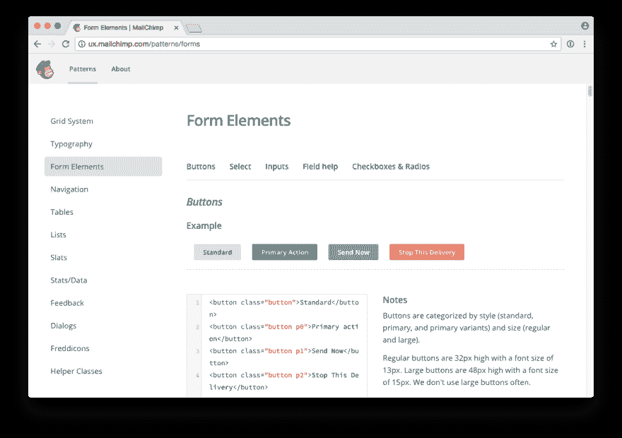
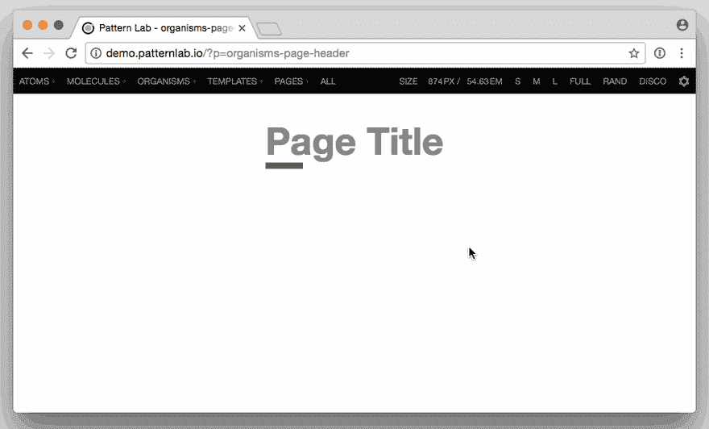
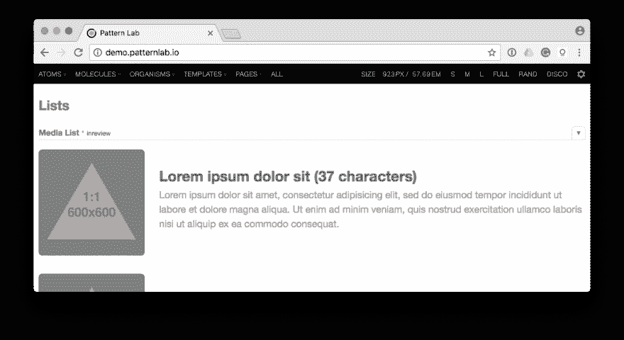
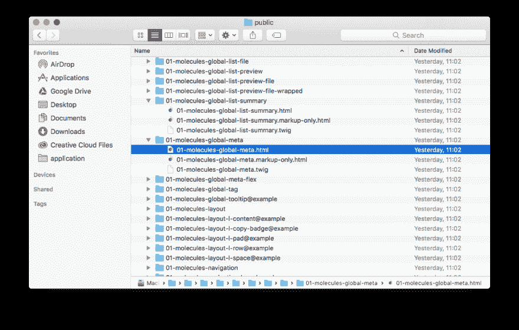
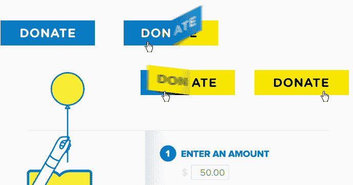
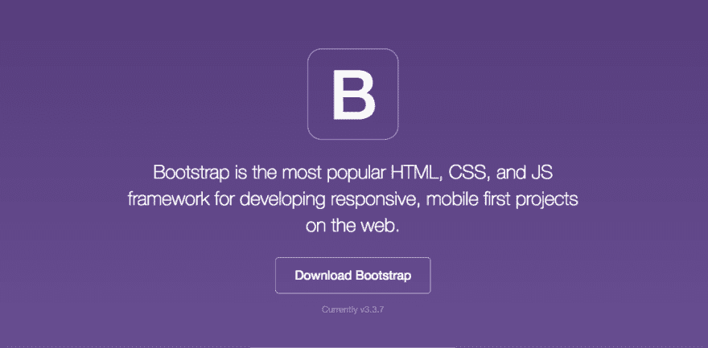

# Atomic design in practice: does it work?

> 原文：[https://dev.to/browserlondon/atomic-design-in-practice-does-it-work-1h3m](https://dev.to/browserlondon/atomic-design-in-practice-does-it-work-1h3m)

The web continues to evolve further and further away from its document-based heritage. Whereas we once thought of fixed-dimension ‘pages’, today we think of ‘systems’ that serve a variety of devices and users. The requirements of a growing ecosystem have necessitated [a change in workflow and methodology](https://www.browserlondon.com/blog/2018/12/11/continuous-development-web-design/). One popular approach is Brad Frost’s [Atomic Design](http://atomicdesign.bradfrost.com/).

Brad encourages the division of UI components into smaller ‘Lego bricks’ that continue to combine until they resemble the familiar page. You would start by identifying a feature (selecting users), then create a component which satisfies it (such as an interactive people-picker). This would, in turn, eventually reside within a template alongside other components which would make up the finished UI.

As Brad remarks:

> 'A well-crafted design system caters to the content that lives inside it, and well-crafted content is aware of how it’s presented in the context of a UI'

Instead of designing and building individual pages, Atomic Design focuses on the individual components needed in order to meet the demands of our application. The result of this is a [pattern library](https://www.browserlondon.com/blog/2015/02/02/application-design-are-pattern-libraries-the-new-deliverable/), a set of [reusable interface components](https://boagworld.com/design/pattern-library/) that document both behaviour and implementation.

<figure>

<figcaption>MailChimp’s Pattern Library, demonstrating various reusable components</figcaption>

</figure>

Conceptually this sounds great, enabling a cohesive design system and faster iteration. Yet how well does it work in practice?

## The Good

### Context

The larger an application gets, the harder it is to maintain a reliable mental model of the individual components that make it up. Do we already have a drop-down menu? Is this accordion in use? Why do we have 5 different button styles?

Atomic Design allows us to view an inventory of components separately from our application, while also letting us see patterns in the context they’ll be used:

<figure>

<figcaption>Viewing a component (the page header) in and out of context.</figcaption>

</figure>

By creating an interface inventory we can quickly identify existing design solutions to new problems while also ensuring they work in-app.

As Brad remarks:

> 'The parts of our designs influence the whole, and the whole influences the parts. The two are intertwined, and atomic design embraces this fact'

By encouraging this interplay between component and application, we end up with a far more consistent and robust UI.

### Separation of concerns

One of the great benefits we found when working with Atomic Design was the separation of concerns between the front-end design system and the production application. Since patterns are shared between the static pattern library and the live application (both use [Twig](https://twig.sensiolabs.org/)), new changes in markup or styles propagate through automatically.

The result is a ‘[living style guide](https://www.smashingmagazine.com/2016/05/creating-a-living-style-guide-case-study/)‘ that encourages a kind of reciprocity between the front-end UI and the production application. Components can be developed separately from the application, tested, then easily imported into a more realistic context to test their appropriateness in-situ. This is also extremely useful at the [start of the project](https://www.browserlondon.com/blog/2019/02/25/front-end-developer-project/), as it lets front-end development kick off without any reliance on back-end application logic or frameworks.

### Faster iteration

Once a set of patterns has been established it becomes far faster to build new pages (at least on the frontend). Instead of constantly reinventing solutions, modules can easily be reused across contexts to add new features and functionality.

<figure>

<figcaption>Often new features or pages can be built using existing components, such as this ‘media list’ which remains content-agnostic.</figcaption>

</figure>

Seeing an at-a-glance list of components makes it far easier to assess their appropriateness or identify opportunities for extension. This, in turn, makes it simpler to estimate the time it will take to implement new features since they can be easily matched against the existing inventory.

### Testing 1–2–3

At Browser we’re big fans of [Test-Driven-Development](https://www.browserlondon.com/services/design-development/), even on the frontend. Using a testing framework (such as [Jest](https://facebook.github.io/jest/)) ensures front-end components continue to behave as expected throughout development. Adopting an Atomic workflow makes this even easier since each pattern is designed to work (and therefore be tested) in complete isolation.

<figure>

<figcaption>A generated set of individual patterns ready for testing.</figcaption>

</figure>

Pattern library generators, such as [Pattern Lab](http://patternlab.io/), often generate a separate HTML file for each component, making it extremely easy to run against a testing framework.

## The Bad

### Isolation

Despite Brad’s suggestion to ‘loop back…to better address the real context’, we’ve found that pattern-based workflows can result in components that work better in isolation than within the finished product. Design in any form is about context, so achieving a balance between context-sensitive and context-agnostic can be challenging.

<figure>

<figcaption>An example of Dan Mall’s ‘element colleges’ that demonstrate early concepts for individual patterns. They look great, but how well do they work when within a realistic context?</figcaption>

</figure>

As soon as patterns are combined into layouts the temptation quickly becomes to use that as the reference point and avoid the individual (perhaps non-representative) pattern views. If you’re not careful it becomes very easy to slip back into a traditional ‘document’ based workflow (especially once the production application reaches maturity), even if the underlying structure is modular.

### Frankenstein’s atomic design monster

The re-use of patterns across various contexts is great for maintainability and consistency, yet it often encourages the (re)use of a pattern that isn’t fit for purpose. Having a toolkit of pre-made patterns makes it very tempting to cobble together a solution instead of devising something more appropriate from scratch.

Similarly, by creating patterns to be as contextually flexible as possible (and therefore maximize their re-use) you run the risk of them not being entirely right for *anything at all*.

<figure>

<figcaption>Frameworks such as Bootstrap suffer from a similar problem, trading uniqueness and careful consideration for development speed.</figcaption>

</figure>

This makes pattern reuse a double-edged sword. It’s far faster to iterate, but if you’re not careful the final result can be a compromise. It’s the same issue that plagues front-end frameworks such as [Bootstrap](http://getbootstrap.com/).

### Adaptability

Responsive websites use ‘media-queries’ to adjust themselves to the size of the user’s browser/device, but these are always in relation to the size of the device. Components have no knowledge of their own width, so all pattern changes must happen in response to the *page* size, which is particularly problematic if they’re going to be dropped into different containers. Until we get the fabled ‘[element-query](https://www.smashingmagazine.com/2016/07/how-i-ended-up-with-element-queries-and-how-you-can-use-them-today/)‘, this will continue to be a pain point.

<figure>

<figcaption>
There are attempts at creating ‘element queries’ with JavaScript, such as [EQCSS](http://elementqueries.com/), but while interesting these aren’t yet ready for production use.</figcaption>

</figure>

Images on responsively designed web pages suffer from a similar problem. In order to be effective, they need to be told how large they are in relation to the page size, not their parent. This means any pattern which uses bitmap images, such as photographs, needs to consider how it will handle switching contexts.

## Takeaways

Like many methodologies, Atomic Design can feel like a problematic trade-off. For every technological advantage gained (speed, consistency) there’s a workflow or process problem.

Brad remarks:

> 'Atomic design is not a linear process, but rather a mental model to help us think of our user interfaces as both a cohesive whole and a collection of parts at the same time'

This interplay is central to the process’s success but also presents its biggest challenge. Jumping between these mental models requires not only a technological shift but a fundamental change in the way we approach designing user interfaces.

However, the long-term value in creating a modular, reusable set of components is undoubtedly worth the overhead. Faster prototyping, easier scaling and a consistent design vocabulary combine to result in higher quality applications and a better overall user experience.

* * *

The post [Atomic design in practice: does it work?](https://www.browserlondon.com/blog/2017/04/25/atomic-design-in-practice-does-it-work/) appeared first on [Browser London](https://www.browserlondon.com).