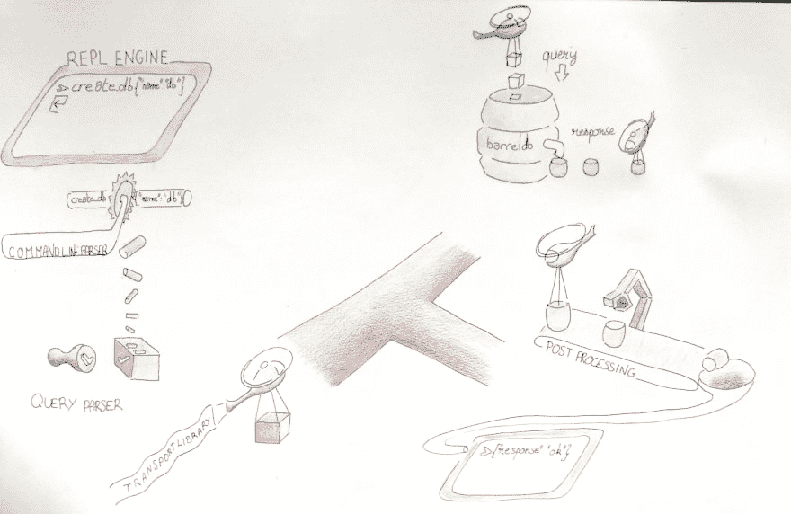

# 哈斯克尔之旅[第一部分]

> 原文：<https://dev.to/pmalhaire/an-haskell-trip-3f2d>

# 哈斯克尔之旅【第一部分】:askBarrel 的高级设计 barrelDB 的 REPL 客户

*   [简介](#introduction)
    *   [ask barrel 是什么？](#what-is-askbarrel-)
*   [一个基本的例子](#a-basic-example)
*   我从哪里开始？
*   [把它切成块](#cut-it-into-pieces)
    *   [强制](#mandatory)
    *   [必须有](#must-have)
*   [结论](#conclusion)

## 简介

披露者:这部分不是关于 haskell 的，这是项目的高层设计，如果你现在想要代码，去第二部分。

一年前，我为有趣的 barrelDB 的 repl 客户机创建了一个 POC。这是一个很受欢迎的项目，给了我探索 Haskell 基础知识的机会。

一年后，我在`C++`做了一个关于函数式编程的`ok but not great talk`。我学到了很多，看起来我对函数式编程的兴趣保持了下来。

我遇到了 barrelDB 的作者@benoic，他鼓励我把这个概念验证变成现实。我们讨论并确定了需要解决的问题。

### ask barrel 是什么？

`askBarrel`是一个 barrelDB 命令行客户端。

一个类似的项目是`postgres`的`psql`。

它的目标是能够获取和放置文档到`barrelDB`并获取关于`barrelDB`节点的信息。

## 一个基本例子

让我们把事情变得更具体。让我们创建一个数据库。

`Repl engine`向`Command line parser`提供输入字符串。

```
barrelDB >>> create_db { "name" : "my_db" } 
```

<svg width="20px" height="20px" viewBox="0 0 24 24" class="highlight-action crayons-icon highlight-action--fullscreen-on"><title>Enter fullscreen mode</title></svg> <svg width="20px" height="20px" viewBox="0 0 24 24" class="highlight-action crayons-icon highlight-action--fullscreen-off"><title>Exit fullscreen mode</title></svg>

`Command line parser`将命令分割成几部分，以供给`Query parser`。

| 命令 | 数据 |
| --- | --- |
| createdc | { "name" : "my_db" } |

`Query parser`检查提供给命令的数据的有效性，并向`Transport library`提供缓冲。

| 命令 | 支票 | 状态 |
| --- | --- | --- |
| createdc | 有名字 | -好的 |
| createdc | has 名称不为空 | -好的 |

`Transport library`将查询缓冲区发送给`DB`。

```
┌────────┬─────────────────────────┬─────────────────────────┬────────┬────────┐
│00000000│ 7b 20 6e 61 6d 65 20 3a ┊ 20 6d 79 5f 64 62 20 7d │{ name :┊ my_db }│
│00000010│ 0a                      ┊                         │_       ┊        │
└────────┴─────────────────────────┴─────────────────────────┴────────┴────────┘ 
```

<svg width="20px" height="20px" viewBox="0 0 24 24" class="highlight-action crayons-icon highlight-action--fullscreen-on"><title>Enter fullscreen mode</title></svg> <svg width="20px" height="20px" viewBox="0 0 24 24" class="highlight-action crayons-icon highlight-action--fullscreen-off"><title>Exit fullscreen mode</title></svg>

`Transport library`接收来自`DB`的响应缓冲，并将其发送给`Command line parser`。

```
┌────────┬─────────────────────────┬─────────────────────────┬────────┬────────┐
│00000000│ 7b 20 72 65 73 75 6c 74 ┊ 20 3a 20 6f 6b 20 7d 0a │{ result┊ : ok }_│
└────────┴─────────────────────────┴─────────────────────────┴────────┴────────┘ 
```

<svg width="20px" height="20px" viewBox="0 0 24 24" class="highlight-action crayons-icon highlight-action--fullscreen-on"><title>Enter fullscreen mode</title></svg> <svg width="20px" height="20px" viewBox="0 0 24 24" class="highlight-action crayons-icon highlight-action--fullscreen-off"><title>Exit fullscreen mode</title></svg>

`Command line parser` get 给出了对`Repl engine`的响应。

| 消息 | 数据 |
| --- | --- |
| 反应 | `{ "result" : "ok" }` |

`Repl engine`将响应写入外壳

```
{ "result" : "ok" } 
```

<svg width="20px" height="20px" viewBox="0 0 24 24" class="highlight-action crayons-icon highlight-action--fullscreen-on"><title>Enter fullscreen mode</title></svg> <svg width="20px" height="20px" viewBox="0 0 24 24" class="highlight-action crayons-icon highlight-action--fullscreen-off"><title>Exit fullscreen mode</title></svg>

[](https://res.cloudinary.com/practicaldev/image/fetch/s--f6PLydFV--/c_limit%2Cf_auto%2Cfl_progressive%2Cq_auto%2Cw_880/https://thepracticaldev.s3.amazonaws.com/i/rfbls0faqula548dy73l.png)

## 我从哪里开始？

这个项目有几个部分，为了能够做到这一点，我需要知道我从哪里开始。

让我们编写上一个例子中的步骤。

1.  从用户处获取查询`q`
2.  连接到数据库
3.  将`q`发送到数据库服务器
4.  从数据库服务器获取响应`r`
5.  将`r`写入外壳
6.  关闭程序

在大量使用敏捷的破坏性方法之后——我面临一个可怕的结论:
如果我不能和`DB server`交谈，这个项目就完蛋了。

第 3 步和第 4 步是开始，所以我要做的第一部分是...`Transport library`。

## 把它切成块

既然我们知道了我们将首先在哪里工作。对接下来的作品有个概念是很好的。
这份名单不会照原样照做。软件开发就是这样，计划好的不一定会发生。同时，在没有清晰计划的情况下编写代码是很危险的。让我们写下我们想要的片段，一个类在`mandatory`和`must have`中对其进行优先排序。

### 强制

```
1. Repl engine                   : interact with the shell
2. Command line parser           : parse written sentences to commands
3. Query parser                  : parse DB queries
4. Transport library             : sends and receive data from the DB server 
```

<svg width="20px" height="20px" viewBox="0 0 24 24" class="highlight-action crayons-icon highlight-action--fullscreen-on"><title>Enter fullscreen mode</title></svg> <svg width="20px" height="20px" viewBox="0 0 24 24" class="highlight-action crayons-icon highlight-action--fullscreen-off"><title>Exit fullscreen mode</title></svg>

### 必须有

```
1. Document reader               : read and validate input documents before sending them
2. Concurrency                   : allow several commands to run at the same time
3. Stream processing             : handle the case of stream
4. Post processing operations    : give the ability to do operations on the received documents 
```

<svg width="20px" height="20px" viewBox="0 0 24 24" class="highlight-action crayons-icon highlight-action--fullscreen-on"><title>Enter fullscreen mode</title></svg> <svg width="20px" height="20px" viewBox="0 0 24 24" class="highlight-action crayons-icon highlight-action--fullscreen-off"><title>Exit fullscreen mode</title></svg>

## 结论

在这第一篇文章中，我们了解了命令行客户端的基本设计。对于大多数开发人员(这意味着至少是我)来说，看不到一行代码是相当令人沮丧的，但是了解高层设计有助于避免陷入糟糕代码的阴影中。

[第 2 部分](//haskell_syntax.md)将是对`haskell`的介绍，重点介绍完成项目第一部分所需的概念:
`Transport library`。