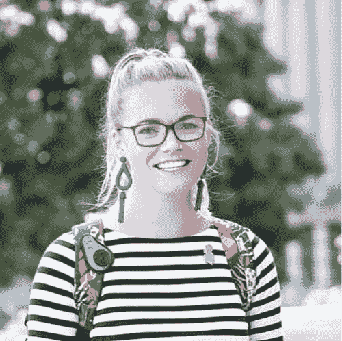

# 请求成为劳伦·李的导师

> 原文：<https://dev.to/samjarman/ask-for-and-be-a-mentor-with-lauren-lee-11pl>

Dev Chats 第二季又回来了！在这一系列中，我大约每周都会与一位出色的开发人员或技术人员交谈。你可以在这里阅读更多。如果你知道下一个我应该和谁聊天，请告诉我。

### 自我介绍！你是谁？你在哪里工作？

你好。我的名字是劳伦·李，我的科技之旅相当非传统或者说非传统。与我的许多同事和同龄人不同，我在成长过程中并没有摆弄或解构我们的家庭电脑，也没有在大学主修计算机科学。

相反，我学了人文学科，在大学里可能学了一门数学课，甚至在毕业后的头几年里住在伯利兹，教书，大部分时间都在潜水。后来，我在华盛顿州西雅图的一所学校教了 7 年英语/文学，并担任越野教练和田径教练，最终开始了学习编程的旅程。

2017 年，我有幸参加了 [Ada Developers Academy](https://www.adadevelopersacademy.org/) ，这是一个为期一年的免学费项目，在西雅图培训女性和性别多样化的人编写代码。现在，我是 GoDaddy 的一名技术产品经理，在那里我开始向一个为开发者优化工程流程的平台团队布道。我帮助团队采用一个框架，使机器学习、实验、个性化和移动优先开发变得非常简单，这真的非常有趣！

### 谁或什么让你进入了科技行业？

事实上，我爱上了编码，因为它搭建了桥梁。我指的不是两个互操作运行时之间的桥梁或类似的东西，而是它团结社区和培养同理心的能力。

几年前的夏天，当我还在教书的时候，我带着一群高中年龄的学生去赞比亚，我们和一所学校合作进行文化和技术交流。我们将带来捐赠的电脑，并向青少年教授基本的 HTML、CSS 和 JavaScript，然后他们将继续教授他们的同龄人，希望在全球就业市场中占据领先地位。

我在那里不是作为代码专家，而是作为我学生的导师。我本质上是情感上的支持者，而我的搭档和学生们则在实际的技术课程上进行同伴教学。

起初事情很艰难。我的学生和他们的赞比亚同龄人之间似乎有太多的文化差异，无法建立真正的联系。最初的课程失败了，因为它们之间没有任何联系。我想我的学生们，尽管他们为这次旅行做了充分的准备，但在国外的环境中还是感到紧张和不舒服。西雅图和赞比亚的学生都不知道如何打破他们之间存在的文化障碍。

一旦他们一起坐在电脑后面，一切都变了。他们开始朝着建立一个网站的共同目标合作，他们所有的恐惧和紧张逐渐消失了。我们的赞比亚当地语言 Nyanjan 变得更好，因为我们很快学会了创建网页所需的必要单词和短语。随着时间的推移，沟通障碍两边的学生都能够发现共同的共同点。他们发现了共同的兴趣、激情和特质:“哦，你也喜欢迷因？好吧，也给我降温。不如我们一起创建一个网站，专门为我们最喜欢的人服务！“这些共同点开始时很肤浅，很小，但很快就涵盖了丰富而复杂的话题，包括家庭、在学校的奋斗、个人关系、父母的压力等。因此，当他们开始形成真正的关系时，他们的课程扩展到了代码之外。

最终是编码提供了两个世界之间的桥梁。

代码提供了一种通用语言。它填补了空白。

因此，我爱上了科技和它给我们带来的无尽机遇，让我们可以讲述独特的故事，将生活永远联系在一起。

那次旅行后，我迷上了它，这并不奇怪。我必须学习更多。我回到家，开始在网上学习课程。几个月后，我发现了 Ada Developers Academy，这是我辞职前教的最后一个学年，我的未来致力于发现更多技术可以促进的不可思议的人类时刻。

### 教到理工大——有点变化！为什么？你觉得怎么样？

绝对是大变样！在我的最后一年，我觉得我已经准备好改变了。我渴望新的挑战。这听起来很不好说，但我意识到，比起给另一篇关于霍尔顿·考尔菲德虚伪的论文打分，我对这个夏天更感兴趣。我的学生应该得到更好的待遇。我很清楚，科技行业存在着巨大的性别差距，我觉得我有机会让我的学生感到骄傲。他们见证了我冒险，因为我这么晚才转行，尝试了一些看起来与我之前定义的不可能的事情相去甚远的事情。

我很幸运，因为作为一名教师，我学到的技能经常被证明对我作为工程师和 TPM 的角色很有帮助。

当然，在面试中有几次我会受益于更多的时间学习算法或 trie 遍历，但老实说，有*次甚至更多的*次我作为老师学到的经验被证明对解决我代码中的问题是至关重要的。您可能会惊讶，我经常能够将莎士比亚的抑扬格五音步与关于数据库迁移的水冷却器辩论联系起来！

因此，我最终感到非常自豪，因为我没有让所有的环境和自我怀疑的感觉阻止我实现学习编码的梦想。我开始认为这和做一名好老师一样重要——向我的学生证明，这个行业绝对有女性的一席之地，我们可以获得成功，我们属于这里，因此我每天都在努力成为#girlboss，为更多像我一样的人在这个行业找到一席之地创造空间。

### 给我们讲讲爱达书院，你是怎么找到体验的？你学到的最大的教训是什么？

Ada 是我曾经参与过的最不可思议的社区。他们的录取过程极其严格——每个队列都会收到数百份申请，一次只能接收 48 名学生。我觉得被录取真是太幸运了。六个月来，我们每天都在朝九晚五的课堂上，这比我以前参加过的学校(包括我的硕士)要多得多！他们将 4 年的计算机科学课程压缩到 6 个月的时间框架内。因此，这非常严格，但非常值得。

除了学习 web 开发的基础(Ruby、HTML/CSS、Ruby on Rails、JavaScript 和 React)，我们还花了大量时间为即将进入的行业做准备。在 Ada 的圈子里，因为我们都是职业改变者和行业新手，我们觉得在彼此面前失败是安全的，并从每一次失败中学习。但是我们知道这个行业不会这么宽容。而且它仍然是男性主导的，有时会感到不能容忍那些不同的人。因此，花时间讨论诸如如何:

*   确定盟友和导师

*   在面试雇主时问正确的问题

*   确定重视多样性的团队

*   认可这样一位经理，他将你之前的生活经历和非传统的技术道路视为一种优势，而不是一种贬低

*   最后，当一个人发现自己在一个有毒的团队中时，该怎么办

我很幸运，即使在毕业后，Ada 的社区仍然是我可用的资源。我经常在我们的 Slack 频道上，在这个行业的所有起伏中，我们继续相互支持。

我非常推荐这个项目，并且坚信任何感兴趣的人都应该申请！

### 西雅图在科技领域享有很高的声誉，那里有一些巨头——你觉得这个城市适合工作和生活吗？

西雅图是一个非常有活力的城市。就你的观点而言，是的，随着这些科技巨头继续增长(并且没有表现出放缓的迹象)，它肯定会受到科技兄弟、特斯拉和天文数字租金的影响。但这也意味着这是一个充满机遇、创新和激情的地方。

假设你在找工作。有足够多的聚会/黑客马拉松来建立联系，并在一周的每晚参加不同的聚会/黑客马拉松。在西雅图，你永远不需要花很长时间去寻找某人来练习面试或合作一个新项目的想法。每个角落都有一家新的创业公司，你走进咖啡店都会无意中听到关于某人新应用想法的对话。

科技现在是西雅图身份的核心。

除了这些大公司之外，我们还是一些非常棒的使命驱动型公司的所在地，比如 Code.org 和 T2。我喜欢这里有多少人致力于使这个行业多样化，使它成为一个更包容的工作场所，就像[铆工](https://www.theriveter.co/)，一个女性驱动的共同工作空间，也是从这里开始的！此外，有大量不同的组织志愿提供支持，授权和激励有兴趣了解更多技术的妇女和女孩，如 [ChickTech](https://chicktech.org/) 和[她正在编写的](https://shescoding.org/)。

最终，这是一个重视创新和前瞻性思维的城市，这是我永远重视的东西。

加分之处在于我们离山和海洋一样近，这里的大多数人都热衷于在户外度过所有的业余时间。我觉得自己很幸运，生活在这样一个地方，与大自然联系，从你的机器上拔掉插头是如此容易和有益。

### 迄今为止，在你的软件生涯中，你学到的最难的一课是什么？

我明白了，对于代码，你不可能什么都知道。有无数次，我对自己如此苛刻，因为我不知道会议中使用的每一个缩写，或者当我试图浏览一个新的代码库时感到完全无能。

我们经常给自己施加压力，让自己知道所有的事情，但是当涉及到技术时，这是不可能的。总会有新的语言、概念或设计系统需要学习。因此，我已经学会接受现实，外面有太多的未知。我已经采取了一种成长的心态，不再把无数我不知道的事情当作障碍或阻碍，而是当作我还没有学到的教训！

### 对于成功的软件职业生涯，你的第一条建议是什么？

请求并成为导师。

首先，不要害怕向你周围的杰出人士寻求支持、建议和指导。

在你的导师询问中要具体，这一点很重要。在你职业生涯的不同阶段有不同的导师是有好处的。我不相信任何事情都有单一的真相来源。我完全赞成为你自己建立一个“顾问委员会”——也就是说，创建一个你信任的团队，在寻求建议时听取他们所有的意见。

例如，在协商薪水时，我总是会去找某个特定的导师寻求帮助。另一次是当我对如何为自己辩护或获得晋升有疑问时。当我面对科技行业本身错综复杂的问题时，我完全知道该和谁谈。我有一个不同的导师，他知道作为你团队中唯一的女性是什么感觉，如果这是我最需要的，他会在那里倾听。而且因为我希望将来在 DevRel 中找到一个角色，所以我也有特定的导师帮助我找到那些机会。

要求一个人集所有这些类型的导师于一身将会是一件非常令人难以抗拒的事情，因此我发现最好把它分成许多部分。

此外，想起有多少人在我身边，相信并支持我，也不会有什么坏处，尤其是当我情绪低落的时候。

其次，当你觉得自己准备好了，就自己做一个导师。往往不需要太多。有时候，它只是在人们解决问题时充当他们的传声筒。这是关于让你自己对某人可用，并为他们创造一个安全的成长空间。

作为导师，我认为欢迎女性和不同性别的人进入这个行业非常重要。我们必须创造空间，让更多人加入进来，让他们茁壮成长并取得成功。作为倡导者，我们必须鼓励和支持他们，赞美他们，尤其是当他们面临自我怀疑的时候。我们必须尽自己的一份力量，尽可能地让这个行业变得积极和包容，从而帮助那些仍在学习和成长的人。

### 工作之外，你有什么爱好吗？你认为它们对你的科技事业有任何帮助吗？

绝对的。在我的生活中，我有很多爱好，并且一直在寻找新的爱好。我是大学的吉祥物(老虎奥斯华！)，我喜欢跑马拉松，最近对三项全能运动充满热情，我喜欢用 shrinky-dinks 制作珠宝和别针，并且通常总是在寻找新的方式来表达我的创造力。

我非常坚定地认为，这些热情中的大部分在我的技术职业生涯中帮助了我，因为它们给我的观点增加了层次或维度。我来自芝加哥，我在那里打冰球长大，我一直明白这就是为什么我现在喜欢成为团队中的一员。我也一直喜欢音乐剧、莎士比亚、即兴表演和表演。我现在明白了，这种激情和我对戏剧的天赋使我成为了一个更好的公众演讲者和会议主持人。

我已经了解到，冒名顶替综合症在我们很多人身上都存在，对我来说，很容易看到这样一个事实:我没有计算机科学学位，也没有在这个领域多年的工作经验。但是我已经花了很多时间来改变这种观点，把我所有的生活经历看作是成为一个更强大、更有吸引力的开发人员的属性。

因为最终这些激情和看似脱节的经历都是我带来的东西，事实上它们区分了我解决问题的技能。它们使我进行代码评审的方式多样化。他们帮助我在一家大公司的工程团队之外建立关系。他们提供了视角:有时我想，*天哪，我永远无法解决这 35 个合并冲突*，但随后我提醒自己，我曾经在我的冰球联盟中保持着最多罚分钟的记录，我告诉自己，我是绝对能够并且将会解决这些冲突的坏蛋！

### 对于那些想走和你相似道路的人，你有什么建议？

*   听听 CodeNewbie 的 [Base.cs](https://www.codenewbie.org/basecs) 对计算机科学原理的爆笑和平易近人的解释。

*   阅读 Sandi Metz 的 [*实用面向对象设计*](https://www.poodr.com/) 我早在 Ada 时就读过它，当解决问题和集思广益以降低我们团队的工程成本时，我会继续阅读它。

*   总的来说，我从社交和参加当地聚会和技术会议中获得了巨大的成功。它们非常适合让你沉浸在技术社区中，了解你周围的人正在做的很酷的项目。大多数会议都有奖学金机会，我真的从参加我职业生涯早期的那些会议中受益匪浅(查看我在参加我的第一次技术会议 RubyConf 时写的这篇文章，[这里](https://codeburst.io/31-thoughts-i-had-while-attending-my-first-rubyconf-as-an-opportunity-scholar-eaa5d886bac0))。

*   扩展最后一个想法，不仅仅是参加这些活动，志愿或提交 CFP 在这些活动中发言！说真的，如果你有一个令你兴奋的项目，或者最近遇到了一个特别有趣的问题，那就和全世界分享一下，做个演讲吧！

*   技术面试可能特别可怕。是的，有一大堆令人敬畏的资源，比如 Pramp.com 和 T2，可以帮助你做好准备。但是让我们现实一点。我不是第一个在白板问题上紧张和焦虑得差点晕过去的人！

在 Ada，当我们感到不安全或者甚至怀疑我们当初进入这个行业的决定时，我们互相写信提醒自己的价值、我们的编码能力和我们的力量。我将分享一个我认为我们在参加面试前都会受益的观点:

你不仅仅是面试官在白板前看到的那个人。你如何扭转一根弦永远不会反映出你是一个怎样的人。你永远不能忘记你也应该在这里的事实。你很重要，这个行业绝对有你的位置。

### 最后，做出你的大喊！你想让读者去看什么？

你可以在 Instagram 和 Twitter 上关注我的旅程 [@LoLoCoding](https://twitter.com/LoLoCoding) &在 Medium.com/@lolocoding[阅读我的更多内容](http://Medium.com/@lolocoding)