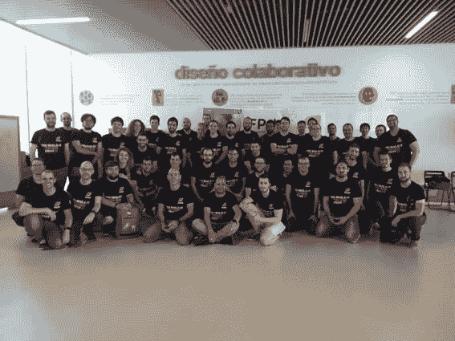
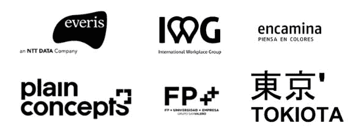
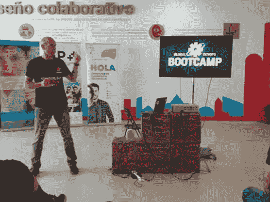
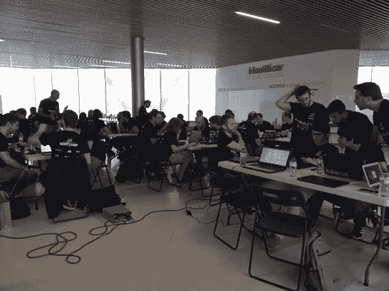
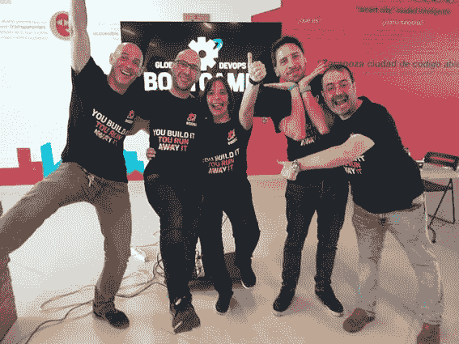
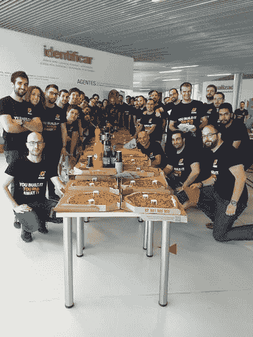
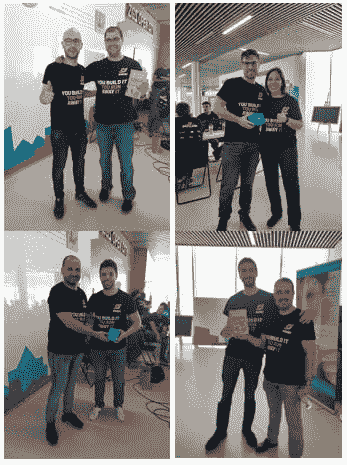

# DotNetters 举办的 2019 年萨拉戈萨全球 DevOps 训练营

> 原文：<https://dev.to/dotnetters/global-devops-bootcamp-zaragoza-2019-by-dotnetters-3ah2>

总结一下这次活动就是讲述与高度积极性、愿意学习和迎接挑战的团队在不同的星期六共享一天是多么美妙。

我们有赞助商，有挑战，有礼物种类，有很多同谋，有很多幻想，贪婪，工作，当然还有一些乐趣和错误的老鼠，这也是必要的。

这一天终于充满了良好的感觉、实现了期望、实现了目标，这一切都归功于许多人的辛勤工作，这些人使会议得以举行，我们的与会者使会议取得了最大的成绩，还有优秀的合作伙伴，他们也是会议的一个长处。

我们所有的出席者，两张我们所在的大家庭照□□！！

这是在萨拉戈萨举办的这一大型的[【global devotions bootcamp】](https://globaldevopsbootcamp.com/)的第二版，虽然自成立以来已经举办了三次，而且已经花了几个月的时间寻找赞助者，开发的空间，准备 t 恤衫，想出最好的礼物在我们的助手中抽签，最后，做了大量的工作

国家提案国:

、[【ever】、](https://www.everis.com/global/es)、[【tokiota】](http://tokiota.es/)、[【平原概念】](https://www.plainconcepts.com/)、[【fp++(圣瓦莱罗集团)](https://fpplusplus.gruposanvalero.es/)e[【iwg】](https://www.iwgplc.com/)

当地合作伙伴:

我们要特别感谢 eto pia，它为我们提供了一个极好的活动空间，其工作人员对我们的款待以及 [Pronet I.S.E.](http://grupo-pronet.com) 提供了美妙的早餐。

看到 8 支队伍在工作，分享知识，从上午 10 点至下午 5 点，完全协调一致地迎接挑战，这是令人兴奋的，我们以一场大屠杀结束了。

从全球组织和当地关键人物特别喜爱录制的第一段视频开始，我们从 Hugo Biarge 的西班牙语摘要开始，为活动提供了一个输出枪。

基调本地 por 雨果比亚日

雨果交出手枪后，我们告诉我们的助手们，为了迎接挑战，他们必须组织成团队，我们必须强调，他们表现得像组织严密的团队，在创纪录的时间里，他们已经组织好了一切准备就绪，可以开始了。

我们的调解人小组也值得一提，他们为我们的所有小组提供了一切支持。

GDBC 2019 活动主持人团队

建立工作队，由 Hugo Biarge、Javier Vela、verónica rivas 和 Roberto Sanz 提供全天支助。
每个工作队都有一份文件，向其解释各种挑战及其各自的执行方式
:对于每一项已完成的挑战，加上可以现场追踪的要点，还可以看到世界其他地区的观点。
吃完后再跑最后一圈，为了排成队，看到剩下的挑战，我们可以非常自豪地说，只剩下一队要完成。
在挑战和工作的同时，我们进行了 5 分钟的技术停留，以便在礼物之间抽签。
最后回顾，大家对活动、好的事物和我们可以改进的事物都表示了意见，对此非常欢迎，因为这种反馈使我们能够对每一个新的活动进行改进，因为明年。我们在等他们！！！

就像所有需要的事情一样我们留给回忆最好的时光。

吃饭的时候，大家都满意了，那是一个轻松愉快的时刻，分享的不仅仅是编程！！

我们的特许权获得者。

一天结束后，一个非常重要的事情是回顾事件

最后简要总结一下全球组织提供的一些细节:
地方组织和促进小组手册。
与整个基础设施一起应对挑战，使一切正常运转。
全球组织想做的任何事情的设计指南，t 恤，活动在社交媒体上的传播。
实时监测活动和世界领导人会议。
从第一分钟起，全程陪同。

全球提案国:

最后，请允许我说，这次活动结束后，我们大家都将有一个值得庆祝的假期，我们满怀希望地期待着明年的到来，9 月份我们将看到更多的活动、谈话和新的活力。

我们给你们留了几个链接:

*   本组织发布的所有挑战，在非商业性授权下开放源码创作共用:[【www . gdbc-challenges . com】](http://www.gdbc-challenges.com)
*   网页:[https://globaldevopsbootcamp.com](https://globaldevopsbootcamp.com)
*   推特:[https://twitter.com/gdevopsbc](https://twitter.com/gdevopsbc)
*   https://www.youtube.com/playlist?list = plcnpc 4 jnc 9 lbpr 65 gtrxmxyge 4 vkll 9 l

祝托德夏天愉快！！！