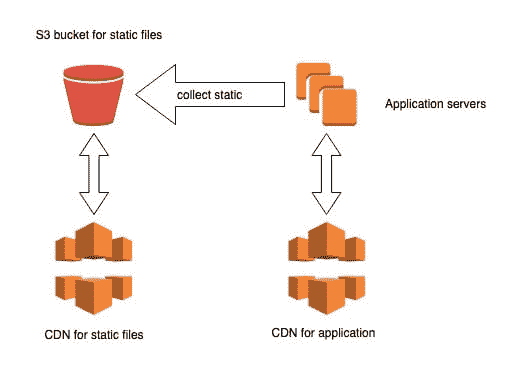
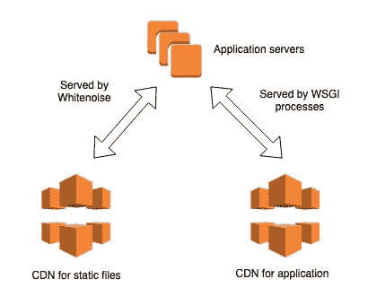

# Django 中的静态文件与媒体文件

> 原文：<https://dev.to/browniebroke/static-vs-media-files-in-django-2k1l>

Django 是用 Python 构建 Web 应用程序的一个很好的 Web 框架。它附带了很多电池，您很可能会在项目中的某个时候用到。当我开始的时候，我花了一些时间来区分其中的两个:静态文件和媒体文件。

在帮助了一些经验不足的人之后，我觉得我不是唯一陷入困惑的人，所以我希望在这篇文章中澄清他们的不同之处。

## TL；速度三角形定位法(dead reckoning)

静态文件是应用程序代码的一部分，而媒体是应用程序或应用程序用户生成的内容。

## 静态文件

静态文件由您需要安装的 [`staticfiles` app](https://docs.djangoproject.com/en/stable/ref/contrib/staticfiles/) 管理。它由几个构件组成，其中 3 个最重要的构件是:

*   存储类别
*   模板标签
*   `collectstatic`管理命令

这些组件协同工作，根据环境以或多或少优化的方式为资产提供服务。这可以使用以下设置进行更改:

*   `STATIC_ROOT`
*   `STATIC_URL`
*   `STATICFILES_DIRS`
*   `STATICFILES_STORAGE`

静态文件通常是代码的一部分，或者是依赖项代码的一部分。它们可能来自不同的地方，每个应用程序可能会提供自己的文件。它们通常保存在源代码控制中。例如，Django admin 附带了一些 javascript 和 CSS，它们存储在 Django 的 Github 库中[。](https://github.com/django/django/tree/master/django/contrib/admin/static/admin)

### 本地开发设置

在开发中，[静态文件的设置效率低下，为了方便起见进行了优化](https://docs.djangoproject.com/en/stable/ref/contrib/staticfiles/#static-file-development-view)。它基于一个视图，默认情况下，查看所有已安装的应用程序来查找静态文件。非常适合本地开发，但不适合生产。

### 生产设置

在生产中，查找文件是通过`collectstatic` admin 命令提前完成的，您应该在部署中运行该命令。在高层次上，该命令做的工作与开发视图非常相似，但主要区别是它在请求-响应周期之外运行，不会阻止用户访问您的网站。它将所有静态文件复制到一个位置，可以是另一个文件夹或另一台机器上的某个地方，这可能是在世界的另一个地方。

我的首选解决方案是 [`django-storages`](https://pypi.org/project/django-storages/) 。它附带了一个存储类，用于将文件保存到 AWS S3 中。我还会在前面添加一个 CDN 来帮助缓存更接近我的用户的资产。设置如下所示:

[](https://res.cloudinary.com/practicaldev/image/fetch/s--oKs6DB5J--/c_limit%2Cf_auto%2Cfl_progressive%2Cq_auto%2Cw_880/https://dev-to-uploads.s3.amazonaws.com/i/2igd881xs4y3nmxdv61h.jpg)

然而，几年前我已经切换到了[whiten noise](https://pypi.org/project/whitenoise/)，这导致了更简单的设置，并消除了对 S3 桶的需要，所有的主机都来自 Django 应用程序。无论如何，CDN 应该服务于大部分流量:

[](https://res.cloudinary.com/practicaldev/image/fetch/s--9z28ywFQ--/c_limit%2Cf_auto%2Cfl_progressive%2Cq_auto%2Cw_880/https://dev-to-uploads.s3.amazonaws.com/i/rfcxrc3l40l6j9hczmh3.jpg)

我仍然使用`django-storages`,但只用于媒体文件，这将我们带到下一部分…

## 媒体文件

[媒体文件](https://docs.djangoproject.com/en/stable/topics/files/)通常是指在 Django 项目的生命周期中，由用户上传或应用程序生成的文件。它们通常不存储在源代码控制中。

这可能是在管理中，用户在个人资料中设置的个人资料图片，一些私人文档或你的应用程序生成的订单的 PDF 收据。

基本上，任何进入`FileField`、`ImageField`等的东西都被归类为媒体存储。

默认情况下，文件存储在本地文件系统上，这里也有一些设置来配置行为:

*   `MEDIA_ROOT`
*   `MEDIA_URL`
*   `DEFAULT_FILE_STORAGE`

在一些生产环境中——例如，如果你在 Heroku 上运行你的应用程序——这个默认设置是不合适的。Heroku 有一个短暂的文件系统，这意味着每次应用程序更新时它都会被清除。这就是`django-storages`仍然有用和需要的地方。

如果您的应用程序是公共和私有媒体的混合，我建议为每种媒体定义单独的存储类，您可以在字段实例化中告诉使用哪个存储类:

```
class User:
    name = models.CharField()
    # public file
    profile_picture = models.ImageField(
        storage=PublicStorage()
    )
    # private file
    dbs_check_document = models.FileField(
        storage=PrivateStorage()
    ) 
```

`django-storages`库为各种主机提供商提供了几个后端，有很多选项可以定制它们，所以我不会详细介绍每一个，但这里有一个 AWS 的例子:

```
from storages.backends.s3boto3 import S3Boto3Storage

class PublicStorage(S3Boto3Storage):
    default_acl = 'public'
    file_overwrite = False
    bucket_name = 'my-public-bucket'

class PrivateStorage(S3Boto3Storage):
    default_acl = 'private'
    file_overwrite = False
    bucket_name = 'my-private-bucket' 
```

### 在本地和生产中使用不同的类

但是，上面的方法有一个问题:通过在 model 字段上定义您的存储类，这意味着它可能会在您的本地环境和生产之间共享，这可能不是您想要的。为了解决这个问题，我们可以使用工厂函数来使用本地文件系统或远程位置，这取决于一个设置:

```
def get_storage(storage_type):
    if settings.USE_REMOTE_STORAGE:
        storage_class = {
            'private': PrivateStorage,
            'public': PublicStorage,
        }[storage_type]
        return storage_class()
    return FileSystemStorage() 
```

这会将您的模型定义更改为:

```
class User:
    name = models.CharField()
    # public file
    profile_picture = models.ImageField(
        storage=get_storage('public')
    )
    # private file
    dbs_check_document = models.FileField(
        storage=get_storage('private')
    ) 
```

在现实世界中，这个助手可能会处理查询中的`KeyError`并返回`DEFAULT_FILE_STORAGE`。你也可以根据需要发明自定义设置。

## 安全顾虑

如果你决定对静态和媒体文件都使用`django-storages`,重要的是你要清楚的区分开来，你网站的用户不应该能够通过上传资源来覆盖你的静态资产！我喜欢为每种储物类型使用一个单独的 S3 桶。AWS 有许多选项来定制桶及其包含的对象的隐私，其他提供商也有类似的功能。

## 终注

虽然您的应用程序可能不使用媒体存储，但是静态文件更重要，任何合理的 Django 站点都需要它(至少对于管理员来说)。

我希望这篇文章有助于减少我经常看到的初学者的困惑。