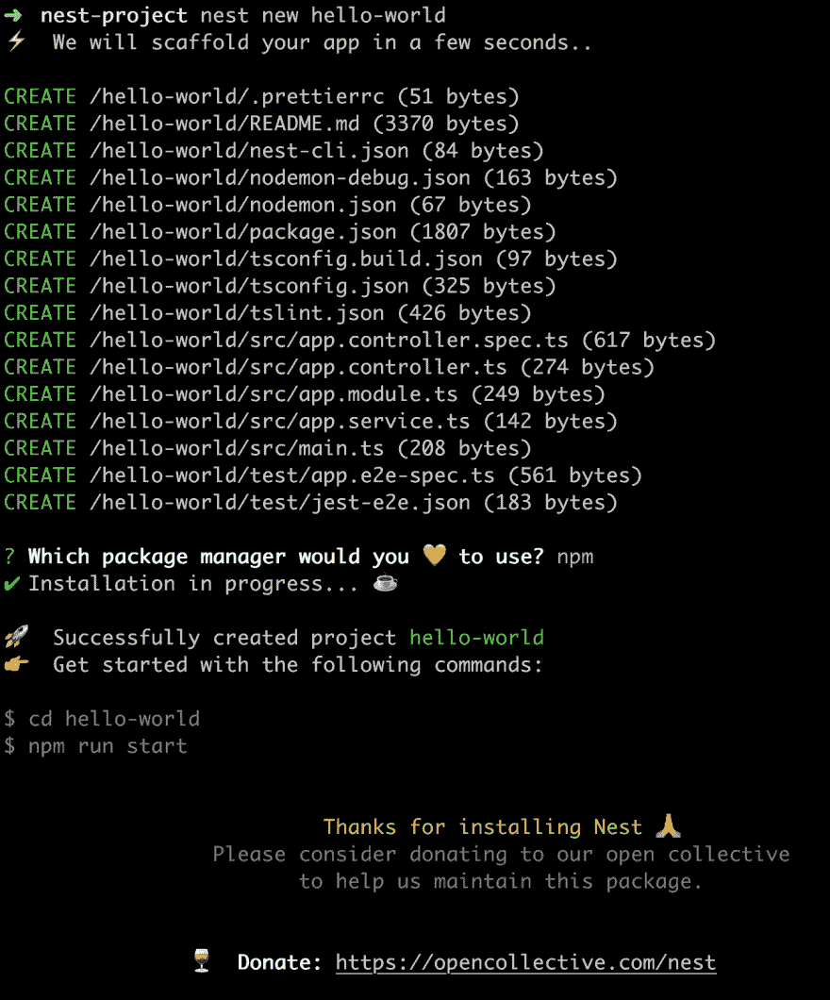
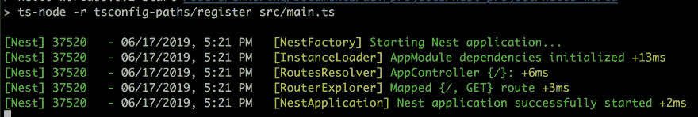
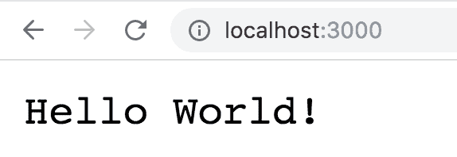
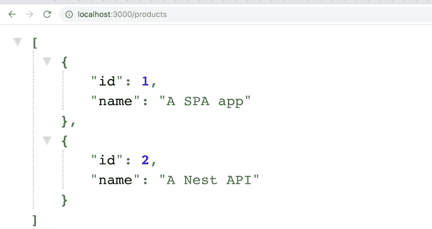

# 使用 Nest 和 Typescript 创建第一个 Node.js REST API

> 原文：<https://dev.to/itnext/nest-creating-a-rest-api-has-never-felt-so-good-4i1>

在 [Twitter](https://twitter.com/chris_noring) 上关注我，很乐意接受您对主题或改进的建议/Chris

> 一个渐进式 Node.js 框架，用于构建高效、可靠和可伸缩的服务器端应用程序。

在本文中，我们将看看 Nest 库。一个让编写 API 成为真正美好体验的库。如果你来自 Angular 世界，你肯定会认识到你所使用的概念，一个伟大的 CLI，当然还有 Typescript 的伟大用法。

请注意，它不是有棱角的，但非常接近，以最好的方式。

本文是 Nest 系列的一部分，因为我们不可能在一篇文章中涵盖所有内容。

我们将涵盖以下内容:

*   **为什么选择 Nest** ，让我们来看看*的推销词*以及让 Nest 成为你下一个 API 的真正好选择的特性
*   **你的第一个 CRUD 项目——涵盖基础知识**,让我们搭建一个项目，回顾一下基本结构

## 为什么要窝

让我们看看[主页](https://nestjs.com)上的销售宣传

*   **可扩展**，由于模块化架构，允许使用任何其他库
*   **多功能**，一个适应性强的生态系统，适用于各种服务器端应用
*   **渐进式**，利用最新的 JavaScript 特性、设计模式和成熟的解决方案

> 好吧，这听起来很棒，但是给我一些让我的同事惊叹的东西

它完全支持 TypeScript，但是如果您愿意，也可以使用纯 JavaScript。

它使用库`Express`和`Fastify`，但是如果需要的话也可以公开它们的 API。

> 听起来很有趣，告诉我更多

它附带了一个 CLI，因此您可以搭建项目以及添加工件。

> 那很好

最重要的是，你可以用 Jest 轻松地编写单元测试和 E2E 测试，还可以用它轻松地构建 GraphQL APIs

> 别说了，你在瞎编

不是真的，看看这个 [Nest 和 GraphQL](https://docs.nestjs.com/graphql/quick-start)

[](https://res.cloudinary.com/practicaldev/image/fetch/s--HfBgCh6_--/c_limit%2Cf_auto%2Cfl_progressive%2Cq_66%2Cw_880/https://thepracticaldev.s3.amazonaws.com/i/aczn9zsdqztjvieoutim.gif)

## 资源

我们将在本文中提到一些很棒的资源。如果你错过了我们提到的链接，在这里。

*   [官方文档页面](https://docs.nestjs.com/)官方文档页面是一个很好的开始页面。它涵盖了从基础到食谱的所有内容
*   [概述部分](https://docs.nestjs.com/first-steps)whol 概述部分是一个很好的阅读材料，它试图理解核心概念，您还可以使用 CLI 来搭建项目
*   [食谱](https://docs.nestjs.com/recipes)
    里面有很多好食谱。从如何使用不同的 ORM 到设置 Swagger(顺便说一句，这非常简单)

*   通过简单的 NPM 安装将 Nest 部署到无服务器的
    。

    *   然后看这里[部署 Azure 功能](https://docs.microsoft.com/en-us/azure/azure-functions/functions-create-first-function-vs-code?wt.mc_id=devto-blog-chnoring)。
    *   你将需要一个 Azure 帐户，[免费帐户 Azure 帐户](https://azure.microsoft.com/en-gb/free/?wt.mc_id=devto-blog-chnoring)

## 你的第一个项目——覆盖基础知识

那好吧。我们开始吧。在我们开始创建我们的第一个项目之前，我们需要 CLI 来创建和运行我们的项目和许多其他东西。我们可以使用以下命令轻松安装 CLI:

```
npm i -g @nestjs/cli 
```

接下来我们需要资助一个项目。那么让我们接下来做:

```
nest new hello-world 
```

您可以用自己选择的项目名称替换`hello-world`。

[](https://res.cloudinary.com/practicaldev/image/fetch/s--4xPuG8ke--/c_limit%2Cf_auto%2Cfl_progressive%2Cq_auto%2Cw_880/https://thepracticaldev.s3.amazonaws.com/i/6ct92xoanpppeyd9seai.png)

好吧，我们有很多文件。从上面的图片来看，我们似乎已经用`package.json`完成了 Node.js 项目，用 Jest 进行了一些测试，当然还有一堆看起来特定于 Nest 的工件，比如*控制器*、*模块*和*服务*。让我们仔细看看脚手架工程:

### 它是如何工作的？

在运行我们刚刚搭建的项目之前，让我们先仔细看看，以便理解生命周期。首先让我们看看`main.ts`。这是我们应用程序的入口。更确切地说，是`bootstrap()`方法通过运行代码
来启动一切

```
// main.ts

const app = await NestFactory.create(AppModule);
await app.listen(3000); 
```

好的，那么`NestFactory`调用实例化`AppModule`的`create()`，我们得到一个似乎在端口`3000`上监听的`app`实例。让我们去`AppModule`看看那里会发生什么:

```
//app.module.ts

@Module({
  imports: [],
  controllers: [AppController],
  providers: [AppService],
})
export class AppModule {} 
```

好的，我们似乎有一个由`@Module`装饰器装饰的类`AppModule`，它指定了一个控制器`AppController`和一个被归类为提供者`AppService`的东西。

> 所有这些是如何工作的？

控制器`AppController`响应一个路由请求，让我们看看它是如何设置的:

```
// app.controller.ts

@Controller()
export class AppController {
  constructor(private readonly appService: AppService) {}

  @Get()
  getHello(): string {
    return this.appService.getHello();
  }
} 
```

装饰器`@Get()`确保我们将某个 GET 请求映射到我们类的某个方法。在这种情况下，默认路由`/`将使用方法`getHello()`进行响应，该方法又调用`appService.getHello()`。来偷看一下`app.service.ts` :

```
// app.service.ts

import { Injectable } from '@nestjs/common';

@Injectable()
export class AppService {
  getHello(): string {
    return 'Hello World!';
  }
} 
```

这似乎是一个非常简单的类，有一个返回字符串的方法`getHello()`。

现在，让我们回到`app.controller.ts`。

从这里我们可以看到`appService`被注入到`AppController`的构造函数中，就像这样:

```
// excerpt from app.controller.ts

constructor(private readonly appService: AppService) {} 
```

> 它怎么知道如何做到这一点？

这里有两个答案:

1.  如果您将`Injectable()`装饰器添加到任何服务中，这意味着它可以被注入到其他工件中，比如控制器或服务。
2.  这就把我们带到了第二步。我们需要将所述服务添加到模块的`providers`数组中，以使 DI 机制工作。

> 哦？

是的，让我们试着通过添加新路线的动作来巩固这种理解。但在此之前，让我们开始这个项目，并证明它像我们所说的那样工作:

```
npm start 
```

[](https://res.cloudinary.com/practicaldev/image/fetch/s--39drAAdp--/c_limit%2Cf_auto%2Cfl_progressive%2Cq_auto%2Cw_880/https://thepracticaldev.s3.amazonaws.com/i/w1lfxplungmp2rqiuw7v.png)

现在，让我们来看看浏览器:

[](https://res.cloudinary.com/practicaldev/image/fetch/s--8hxV-Egy--/c_limit%2Cf_auto%2Cfl_progressive%2Cq_auto%2Cw_880/https://thepracticaldev.s3.amazonaws.com/i/d40vrfdmytxguen0c0bb.png)

### 添加路线

我们刚刚学会了搭建一个项目，也学会了运行同样的项目。我们认为我们已经对概念*模块*、*控制器*和*服务*有了很好的理解，但是没有什么比增加一条新的路线和增加我们需要的所有工件来使之成为可能更能巩固这些知识了。我们将执行以下操作:

我们将创建一条新路线`/products`，为此，我们需要执行以下步骤

1.  添加新服务
2.  添加一个新的控制器并注入我们的服务
3.  给去离子装置通电
4.  运行我们的应用程序并确保一切正常。

我们要做的第一件事是学习如何正确地使用 Nest 项目。现在我们运行`npm start`，它编译了我们的类型脚本代码，并在端口`3000`托管了我们的应用程序，但是在开发期间，我们可能想要一些可以监听变化并自动编译的东西。为此，让我们转而运行命令`npm run start:dev`，该命令监听更改并在需要时重新编译。

```
npm run start:dev 
```

[](https://res.cloudinary.com/practicaldev/image/fetch/s--YnMozrsv--/c_limit%2Cf_auto%2Cfl_progressive%2Cq_auto%2Cw_880/https://thepracticaldev.s3.amazonaws.com/i/a9n97emvkxf7catkxg2t.png)

注意，在我们开始使用上面的命令之前，让我们搭建所有需要的文件，然后我们可以运行上面的命令来处理特定的代码文件，我们希望我们的更改能够反映出来。

#### 创建服务

让我们创造我们的产品和服务。现在，让数据成为静态的，我们可以稍后再考虑添加 HTTP 调用。让我们用新的方式做事，使用命令行界面

```
nest generate service products 
```

或者更简短的版本

```
nest g s products 
```

[](https://res.cloudinary.com/practicaldev/image/fetch/s--VSHYcx9T--/c_limit%2Cf_auto%2Cfl_progressive%2Cq_auto%2Cw_880/https://thepracticaldev.s3.amazonaws.com/i/9oi2yvomfqk9lbxabmgi.png)

好了，打开文件`products/products.service.ts`。应该是这样的:

```
import { Injectable } from '@nestjs/common';

@Injectable()
export class ProductsService {} 
```

现在添加方法`getProducts()`，所以现在看起来像这样:

```
import { Injectable } from '@nestjs/common';

@Injectable()
export class ProductsService {
  getProducts() {
    return [{
      id: 1,
      name: 'A SPA app'
    },
    {
      id: 2,
      name: 'A Nest API'
    }]
  }
} 
```

#### 添加控制器

创建控制器的时间到了，接下来让我们开始吧。再次我们只是 CLI，像这样:

```
nest generate controller products 
```

或者，更简短的版本

```
nest g co products 
```

打开`products/products.controller` :

```
import { Controller } from '@nestjs/common';

@Controller('products')
export class ProductsController {} 
```

下一步是添加一个方法`getProducts()`并确保我们调用我们的服务，当然我们不要忘记用`@Get()`装饰器来装饰它。

您的代码现在应该是这样的:

```
import { Controller, Get } from '@nestjs/common';
import { ProductsService } from './products.service';

@Controller('products')
export class ProductsController {
  constructor(private productsService: ProductsService) {}

  @Get()
  getProducts() {
    return this.productsService.getProducts();
  }
} 
```

让我们试试这个:

```
npm run start:dev 
```

[](https://res.cloudinary.com/practicaldev/image/fetch/s--3jz9cLLS--/c_limit%2Cf_auto%2Cfl_progressive%2Cq_auto%2Cw_880/https://thepracticaldev.s3.amazonaws.com/i/1jmnsyacbw5lm8bibu3t.png)

上面我们可以看到我们的`/products`路线似乎是如何被添加的，并且`ProductsController`将对该路线上的任何请求做出响应。但是这怎么可能，我们没有对`app.module.ts`做任何事情来连接 DI，或者我们做了什么？

我们来看看`app.module.ts`:

[](https://res.cloudinary.com/practicaldev/image/fetch/s--nqTBkxxP--/c_limit%2Cf_auto%2Cfl_progressive%2Cq_auto%2Cw_880/https://thepracticaldev.s3.amazonaws.com/i/zmf8r8f0bpdmokwppylg.png)

从上面我们可以看到，`ProductsController`和`ProductsService`都分别被添加到了`controllers`和`providers`中。当我们生成控制器和服务时，CLI 为我们添加了它。

我们几乎忘记了在浏览器中运行我们的应用的一些东西，所以让我们这样做:

[](https://res.cloudinary.com/practicaldev/image/fetch/s--yMgJPphg--/c_limit%2Cf_auto%2Cfl_progressive%2Cq_auto%2Cw_880/https://thepracticaldev.s3.amazonaws.com/i/cfgbzz3crvqa0sx4ogua.png)

请注意，CLI 是强大的，它不仅可以创建必要的文件，还可以进行一些连接，但如果您不使用 CLI，请知道您需要做什么。

### 添加剩余的 CRUD 路线

好了，所以我们增加了一条路线来支持`/products`路线。众所周知，虽然我们需要更多的路线，如`POST`、`PUT`、`DELETE`和*通配符*路线等。

> 我们怎么把它们加起来？

很简单，我们只需要为每个人创建方法，并添加装饰器来支持它，就像这样:

```
// products.controller.ts

import { Controller, Get, Param, Post, Body, Put, Delete } from '@nestjs/common';
import { ProductsService } from './products.service';

interface ProductDto {
  id: string;
  name: string;
}

@Controller('products')
export class ProductsController {
  constructor(private productsService: ProductsService) {}

  @Get()
  getProducts() {
    return this.productsService.getProducts();
  }

  @Get(':id') 
  getProduct(@Param() params) {
    console.log('get a single product', params.id);
    return this.productsService.getProducts().filter(p => p.id == params.id);
  }

  @Post()
  createProduct(@Body() product: ProductDto) {
    console.log('create product', product);
    this.productsService.createProduct(product);
  }

  @Put()
  updateProduct(@Body() product: ProductDto) {
    console.log('update product', product);
    this.productsService.updateProduct(product);
  }

  @Delete()
  deleteProduct(@Body() product: ProductDto) {
    console.log('delete product', product.id);
    this.productsService.deleteProduct(product.id);
  }
} 
```

而`products.service.ts`现在看起来是这样的:

```
import { Injectable } from '@nestjs/common';

@Injectable()
export class ProductsService {
  products = [{
    id: 1,
    name: 'A SPA app'
  },
  {
    id: 2,
    name: 'A Nest API'
  }];

  getProducts() {
    return this.products;
  }

  createProduct(product) {
    this.products = [...this.products, {...product}];
  }

  updateProduct(product) {
    this.products = this.products.map(p => {
      if (p.id == product.id) {
        return { ...product};
      }
      return p;
    });
  }

  deleteProduct(id) {
    this.products = this.products.filter(p => p.id != id);
  }
} 
```

## 总结

希望您现在已经意识到了 Nest 的良好结构，以及创建 API、读取查询参数和主体以支持完整的 CRUD API 是多么容易。我们还引入了 CLI，它在生成您需要的代码方面是您最好的朋友，并确保您不需要考虑如何连接。

在我们的下一部分，我们将看看如何测试我们的代码，这是一个真正幸福的体验。敬请关注。