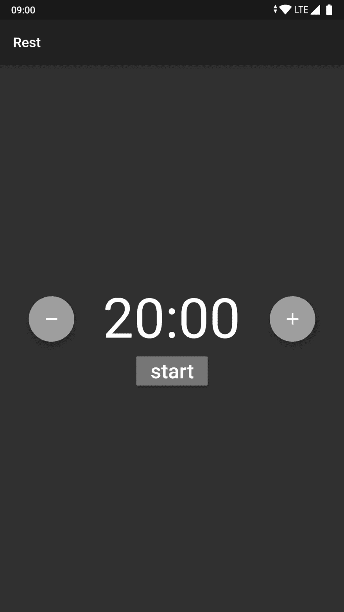

# Flutter:后台服务

> 原文：<https://dev.to/protium/flutter-background-services-19a4>

所以，是时候让我真正尝试一下 Flutter 了。我看了最近的开发者大会，我对 Flutter 的能力和未来的 Flutter (Web、Windows、Linux)感到惊讶。如果你想看一看那个会议，这里是 youtube 的链接。

## 背景

我从不尝试“你好世界”的东西，我只是用**【沉重】**的东西，这样我就可以看到我正在尝试的东西的**力量**、**利弊**。于是，我从我的*“百万富翁的想法”*列表中抓起一个想法，开始了我的旅程。

## app:休息

我将建立一个非常简单的应用程序，对我来说非常有用。我有由**梅尼埃病**引起的**耳鸣**(顺便说一句，如果你也有那种病，请留下评论)，因为有时候我睡觉时喜欢在手机上听一些背景音乐。**但是**我不想让手机整夜播放音乐。

## 正在研究

每次我有了一个很棒的想法，我都会用谷歌搜索一下。我不想重新发明轮子。这一次，我找到了一个可以完成这项工作的应用程序。问题是它经常会挂起或冻结。有时候应用程序的所有按钮都很糟糕。所以我决定继续做一个简单实用的 app。

## 我们开始吧

在任何代码之前，我警告你:**我在 Flutter 中可能和你一样是新手**。请自行研究。这一系列的帖子真是太棒了

[](/abraham) [## 动荡的一个月

### 亚伯拉罕·威廉姆斯 12 月 1 日 183 分钟阅读

#flutter #firebase #tutorial](/abraham/a-month-of-flutter-47c4)

有了扑镖的基础知识再继续看。

## MVP

对于我的应用程序，以及它的第一个版本，我想要一个漂亮的极简 UI 和简单的功能。我决定采用这些规格:

*   计时器持续时间从 5 分钟到 60 分钟不等
*   用户可以增加或减少 5 分钟的时间
*   它有一个启动/停止按钮

这就是结果
[](https://res.cloudinary.com/practicaldev/image/fetch/s--A60AqvPV--/c_limit%2Cf_auto%2Cfl_progressive%2Cq_auto%2Cw_880/https://thepracticaldev.s3.amazonaws.com/i/pkvf4zdpzu9mmogfak0t.png)

## App 服务:颤振方法调用

这个应用程序有一个倒计时器。我需要一个服务来保持计时器运行，并最终在它结束时关闭音乐。但是，这里是另一个应用程序失败的地方，当你关闭应用程序并再次打开时，你需要知道服务中运行的计时器的运行时间，这样你就可以更新状态并从那里开始显示当前时间。

我已经知道我必须编写一个 Android 服务，所以我做了一点研究，得到了我需要的东西。[颤振方法调用文件](https://flutter.dev/docs/development/platform-integration/platform-channels)

## 构建 Android 服务

首先，我们需要在我们的 android 清单中声明服务(*Android/app/src/main/Android manifest . XML*)

```
<service android:enabled="true" android:exported="true" android:name="dev.protium.rest.AppService" /> 
```

<svg width="20px" height="20px" viewBox="0 0 24 24" class="highlight-action crayons-icon highlight-action--fullscreen-on"><title>Enter fullscreen mode</title></svg> <svg width="20px" height="20px" viewBox="0 0 24 24" class="highlight-action crayons-icon highlight-action--fullscreen-off"><title>Exit fullscreen mode</title></svg>

现在我们需要编写服务。该服务需要满足这些规范:

### 1)它应该能够与主活动绑定一个连接

为此，让我们使用一个**活页夹**

```
private final IBinder binder = new AppServiceBinder();
public class AppServiceBinder extends Binder {
        AppService getService() {
            return  AppService.this;
        }
    }

@Override
public IBinder onBind(Intent intent) {
     return binder;
} 
```

<svg width="20px" height="20px" viewBox="0 0 24 24" class="highlight-action crayons-icon highlight-action--fullscreen-on"><title>Enter fullscreen mode</title></svg> <svg width="20px" height="20px" viewBox="0 0 24 24" class="highlight-action crayons-icon highlight-action--fullscreen-off"><title>Exit fullscreen mode</title></svg>

### 2)应根据需要启动、停止并获取当前秒数

这段代码与这篇文章无关，但你可以在文章末尾看到回购。

### 3)如果正在播放音乐，它应该暂停播放

如果你对如何在 android 设备上暂停音乐感到好奇，这就是诀窍

```
AudioManager am = (AudioManager) getSystemService(AUDIO_SERVICE);
if (am.isMusicActive()) {
  long eventtime = SystemClock.uptimeMillis();
  KeyEvent downEvent = new KeyEvent(eventtime, eventtime, KeyEvent.ACTION_DOWN, KeyEvent.KEYCODE_MEDIA_PAUSE, 0);
  am.dispatchMediaKeyEvent(downEvent);
  KeyEvent upEvent = new KeyEvent(eventtime, eventtime, KeyEvent.ACTION_UP, KeyEvent.KEYCODE_MEDIA_PAUSE, 0);
  am.dispatchMediaKeyEvent(upEvent);
} 
```

<svg width="20px" height="20px" viewBox="0 0 24 24" class="highlight-action crayons-icon highlight-action--fullscreen-on"><title>Enter fullscreen mode</title></svg> <svg width="20px" height="20px" viewBox="0 0 24 24" class="highlight-action crayons-icon highlight-action--fullscreen-off"><title>Exit fullscreen mode</title></svg>

魔法，对吧？

[](https://i.giphy.com/media/12NUbkX6p4xOO4/giphy.gif)

## 连接到服务

此时，你可能已经注意到交流是这样进行的

```
Android Service <-> Android Activity <-> Flutter App 
```

<svg width="20px" height="20px" viewBox="0 0 24 24" class="highlight-action crayons-icon highlight-action--fullscreen-on"><title>Enter fullscreen mode</title></svg> <svg width="20px" height="20px" viewBox="0 0 24 24" class="highlight-action crayons-icon highlight-action--fullscreen-off"><title>Exit fullscreen mode</title></svg>

### 从活动中连接

这很简单

```
private void connectToService() {
        if (!serviceConnected) {
            Intent service = new Intent(this, AppService.class);
            startService(service);
            bindService(service, connection, Context.BIND_AUTO_CREATE);
        } else {
            Log.i(TAG, "Service already connected");
            if (keepResult != null) {
                keepResult.success(null);
                keepResult = null;
            }
        }
    }

private ServiceConnection connection = new ServiceConnection() {

        @Override
        public void onServiceConnected(ComponentName className,
                                       IBinder service) {
            AppService.AppServiceBinder binder = (AppService.AppServiceBinder) service;
            appService = binder.getService();
            serviceConnected = true;
            Log.i(TAG, "Service connected");
            if (keepResult != null) {
                keepResult.success(null);
                keepResult = null;
            }
        }

        @Override
        public void onServiceDisconnected(ComponentName arg0) {
            serviceConnected = false;
            Log.i(TAG, "Service disconnected");
        }
    }; 
```

<svg width="20px" height="20px" viewBox="0 0 24 24" class="highlight-action crayons-icon highlight-action--fullscreen-on"><title>Enter fullscreen mode</title></svg> <svg width="20px" height="20px" viewBox="0 0 24 24" class="highlight-action crayons-icon highlight-action--fullscreen-off"><title>Exit fullscreen mode</title></svg>

你注意到那个`keepResult`变量了吗？稍后会详细介绍。

### 连接活动到颤振

```
static final String CHANNEL = "dev.protium.rest/service";
@Override
    protected void onCreate(Bundle savedInstanceState) {
        super.onCreate(savedInstanceState);
        GeneratedPluginRegistrant.registerWith(this);

        new MethodChannel(getFlutterView(), CHANNEL).setMethodCallHandler(this::onMethodCall);
    } 
```

<svg width="20px" height="20px" viewBox="0 0 24 24" class="highlight-action crayons-icon highlight-action--fullscreen-on"><title>Enter fullscreen mode</title></svg> <svg width="20px" height="20px" viewBox="0 0 24 24" class="highlight-action crayons-icon highlight-action--fullscreen-off"><title>Exit fullscreen mode</title></svg>

我决定在活动本身上实现接口，所以你必须改变类声明

```
public class MainActivity extends FlutterActivity implements MethodChannel.MethodCallHandler { 
```

<svg width="20px" height="20px" viewBox="0 0 24 24" class="highlight-action crayons-icon highlight-action--fullscreen-on"><title>Enter fullscreen mode</title></svg> <svg width="20px" height="20px" viewBox="0 0 24 24" class="highlight-action crayons-icon highlight-action--fullscreen-off"><title>Exit fullscreen mode</title></svg>

而现在实施

```
@Override
public void onMethodCall(MethodCall call, MethodChannel.Result result) {
        try {
            if (call.method.equals("connect")) {
                connectToService();
                keepResult = result;
            } else if (serviceConnected) {
                if (call.method.equals("start")) {
                    appService.startTimer(call.argument("duration"));
                    result.success(null);
                } else if (call.method.equals("stop")) {
                    appService.stopTimer();
                    result.success(null);
                } else if (call.method.equals("getCurrentSeconds")) {
                    int sec = appService.getCurrentSeconds();
                    result.success(sec);
                }
            } else {
                result.error(null, "App not connected to service", null);
            }
        } catch (Exception e) {
            result.error(null, e.getMessage(), null);
        }
    } 
```

<svg width="20px" height="20px" viewBox="0 0 24 24" class="highlight-action crayons-icon highlight-action--fullscreen-on"><title>Enter fullscreen mode</title></svg> <svg width="20px" height="20px" viewBox="0 0 24 24" class="highlight-action crayons-icon highlight-action--fullscreen-off"><title>Exit fullscreen mode</title></svg>

我们将`MethodChannel.Result`保存在变量`keepResult`中。为什么？当我们将服务与服务连接绑定时，**我们将调用`onServiceConnected`监听器。**在那里，我们知道我们连接到了服务。flutter 应用程序将等待这个回调成功或失败。**别忘了叫它。**

### 连接颤振到活动

首先我们需要在 lib/main.dart
中导入包

```
import 'dart:async'
import 'package:flutter/services.dart'; 
```

<svg width="20px" height="20px" viewBox="0 0 24 24" class="highlight-action crayons-icon highlight-action--fullscreen-on"><title>Enter fullscreen mode</title></svg> <svg width="20px" height="20px" viewBox="0 0 24 24" class="highlight-action crayons-icon highlight-action--fullscreen-off"><title>Exit fullscreen mode</title></svg>

在我们的状态小部件中，我们需要这个

```
static const MethodChannel platform = 
MethodChannel('dev.protium.rest/service');

Future<void> connectToService() async {
    try {
      await platform.invokeMethod<void>('connect');
      print('Connected to service');
    } on Exception catch (e) {
      print(e.toString());
    }
} 
```

<svg width="20px" height="20px" viewBox="0 0 24 24" class="highlight-action crayons-icon highlight-action--fullscreen-on"><title>Enter fullscreen mode</title></svg> <svg width="20px" height="20px" viewBox="0 0 24 24" class="highlight-action crayons-icon highlight-action--fullscreen-off"><title>Exit fullscreen mode</title></svg>

**注意:****通道**与**主活动**中的相同，**方法名**也相同。听起来很熟悉？如果你开发过一些 **Apache Cordova 插件**，这应该对你很熟悉。

现在我们已经完成了这个**三组件连接**的事情。一旦 flutter 应用程序连接上，它就可以调用**启动/停止**方法，或者从服务计时器中获取当前秒数。

```
final int serviceCurrentSeconds = await getServiceCurrentSeconds();
setState(() {
    _currentSeconds = serviceCurrentSeconds;
}); 
```

<svg width="20px" height="20px" viewBox="0 0 24 24" class="highlight-action crayons-icon highlight-action--fullscreen-on"><title>Enter fullscreen mode</title></svg> <svg width="20px" height="20px" viewBox="0 0 24 24" class="highlight-action crayons-icon highlight-action--fullscreen-off"><title>Exit fullscreen mode</title></svg>

任务完成。

## 我从旋舞中学到了什么

正如我前面提到的，我不喜欢“hello wold”应用程序。这个应用程序非常简单，但它有一些技巧要做。我觉得我爱上了旋舞镖的**式推理**。这整个过程花了我整整 **2 天**，我不是在吹牛。昨天我拿着笔记本电脑坐下来。晚上完成了 app。今天我把它发表在了[谷歌 Play 商店](https://play.google.com/store/apps/details?id=dev.protium.rest)上，并写下了这篇文章。( **BTW 第一次发布 app**

我学到了很多技巧，举几个例子:

*   如何在不调用服务的情况下运行小部件测试
*   如何通过先设置 app 的权限来运行试驾
*   How important and useful is `flutter analyze` You can see all of that in the repo

    ##  [ protiumx ](https://github.com/protiumx) / [Rest the rest](https://github.com/protiumx/rest) 

    ### for a period of time and turn off the music

    <article class="markdown-body entry-content container-lg" itemprop="text">

    # Rest

    **Note:** This repurchase has not been maintained.

    A simple application that will pause music after a period of time. This application is developed with Flutter

    ## . It is installed from Google Play

    [](https://play.google.com/store/apps/details?id=dev.protium.rest) 

    ## . It develops the dependency of

    :

    *   Android SDK
    *   Android Studio
    *   Flutter SDK

    Check your dependency with `flutter doctor`

    ## Test

    ```
    flutter test
    flutter drive --target=test_driver/home_page.dart 
    ```

    ## Run

    T52] `flutter run`

    ## Screenshot

    [ T2]](https://github.com/protiumx/resimg/screenshot1.png) 

    [ T2]](https://github.com/protiumx/resimg/screenshot2.png) 

    Sticky Notification*   Show toast message when music is paused

    ## Donate

    If you like this application, Please buy me a cup of coffee

    [ T2]](https://www.buymeacoffee.com/p3kqm9Z2h) 

    Brian Mayo-2019

    </article>

    [t89

我会发布更多关于我从这个小项目中学到的其他技巧的文章。我鼓励你从你个人的“百万富翁想法”列表中抓取一些想法，然后用 Flutter 创建一个。

## 结论

我很高兴我花了**几分钟**没有太多痛苦就获得了一个漂亮的 UI。我真的很想玩玩**的 Flutter Web 和桌面**。我看到了这方面的巨大潜力，于是我告诉我所在公司的首席技术官，我们必须迁移一些产品到 flutter。由于我们有多平台应用程序(电视、智能手机、桌面、任何带有网络视图的东西)，所以好处很多。

尝试一下**应用**，并随时贡献更多功能。我计划添加更多的功能，但现在我可以有基本的功能。
如果你想为 **iOS** 编译并发布，请告诉我。