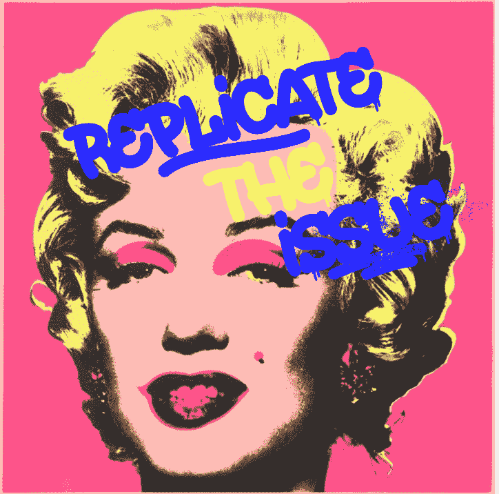
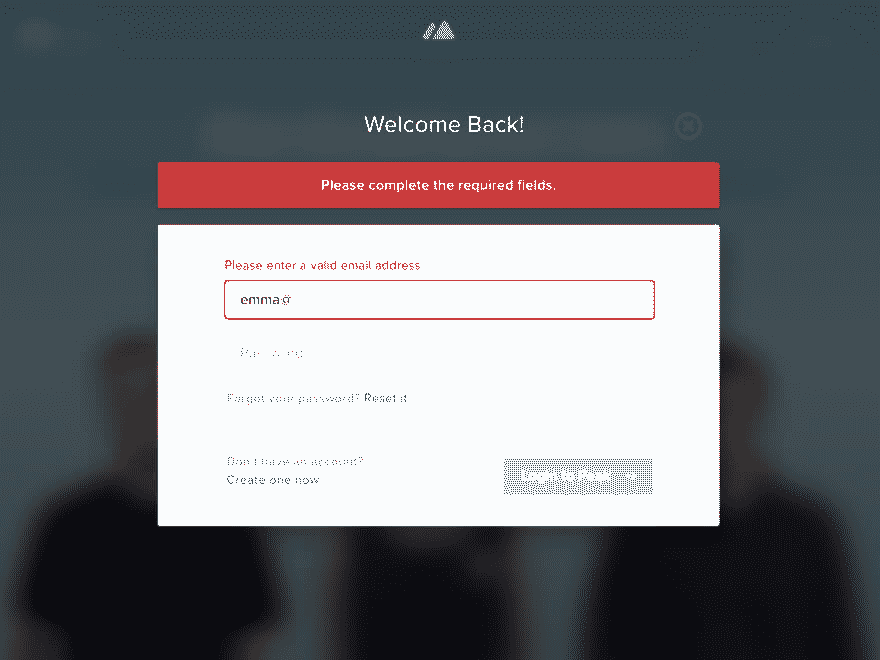
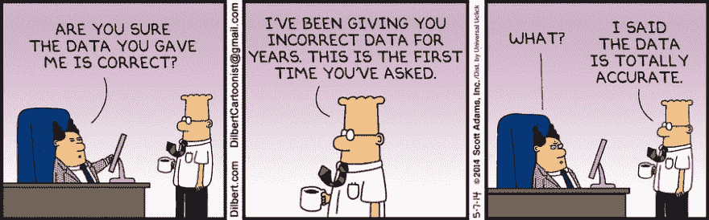
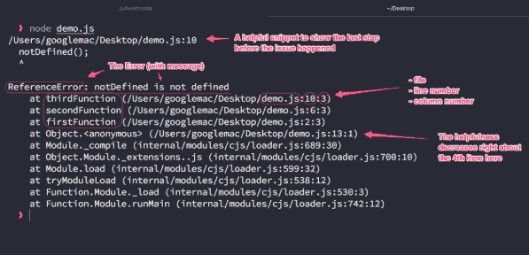

# 调试的艺术

> 原文：<https://dev.to/chris_bertrand/the-art-of-debugging-2nla>

作为一名开发人员，你日常职责的主要部分将需要处理 bug，发现问题，复制它，并修复它。

从头开始写代码要容易得多，**浏览**旧代码，**理解**旧代码并使之变得更好是一个更大的挑战。

我们有教程，教我们语言的最佳实践，如何使用设计模式，处理代码气味，编写精益，可维护的代码；然而，我们职责的这一重要方面经常被忽视。

这篇文章的目的是**而不是**告诉你如何修复你的错误，它是**描述你需要经历的过程**来发现和诊断问题。

> 菲利普·福特斯[@福特斯](https://dev.to/fortes)调试就像是犯罪电影中的侦探，而你同时也是凶手。2013 年 11 月 10 日上午 00:57

这是真的，偶尔你会编写导致问题的代码！是时候调查哪里出错了！如果你写了代码，现在就简单多了，因为你知道去哪里找。

但是如果你没有呢？！

> 提示:你的心态需要像侦探一样。

## 如何知道从哪里开始？

是的，这很难！有人提出问题或发送截图。一个堆栈跟踪进入你的收件箱！这一切意味着什么？如何使用这些信息来确定问题的来源？

让我们看看我会采取的**步骤**。

### 步骤 1:重现问题

您需要做的第一件事是复制错误。记录的大量错误是由于不正确的配置、网络问题或与浏览器相关，所以这是调试不可或缺的一部分。

> 提示:在开始之前获取您需要的所有配置信息，以及重现的步骤！

试图在不重复错误的情况下解决问题是徒劳的。除非你能看到它**不**工作，否则你永远不知道你所做的改变**是否真的能解决它！**

### 第二步:找到切入点

根据你所掌握的信息，试着找到一种方法来进入代码。

#### 问题:表单错误

假设您有一个显示有**错误消息**的**表单**的屏幕截图。你如何利用这一点去你需要去的地方？

<figure> 

<figcaption>一个通用的登录表单错误:[【https://dribbble.com/emmabell】](https://dribbble.com/emmabell)
</figcaption>

</figure>

当调查一个问题时，你需要通过两种途径来询问。在客户端的 JavaScript、CSS 或 HTML 中是否存在问题；或者问题出在**服务器端**；后端代码，您的数据/数据库和基础设施所在的地方。

### 第三步:排除可能性

如果你玩过[猜猜谁](https://www.amazon.co.uk/Hasbro-Gaming-Guess-Classic-Game/dp/B07G446J4V)你会很好地理解我的意思。你有你的嫌疑人，现在是时候削减他们了！

> 提示:这都是关于采取系统的方法。

在这里，我们可能想从**客户端**开始，因为那是我们的入口点，我们可以在那里检查错误。我们想验证这个表单是在浏览器中进行检查，还是向另一边的朋友发送一些信息！

随之而来的是开发者工具，被许多人称为神奇的 **F12** 键！在这里，您可以查看和访问页面上的 DOM、底层 HTML 和 JavaScript。

如果你以前从未使用过开发工具，这里有两个很好的介绍。即使你知道，我也强烈推荐第一个短片，它快速回顾了你可能错过的 12 个技巧。

<figure>

[https://www.youtube.com/embed/nOEw9iiopwI](https://www.youtube.com/embed/nOEw9iiopwI)

<figcaption>A short run through 12 tricks you can use in Chrome Dev Tools</figcaption>

</figure>

<figure>

[https://www.youtube.com/embed/x4q86IjJFag](https://www.youtube.com/embed/x4q86IjJFag)

<figcaption>A more detailed, longer run through all the features available.</figcaption>

</figure>

> 提示:记下可疑标签的 **Id** 和 **CssClass** 名称，并找到它们所在的文件。

使用这种方法会给你一个途径来检查发生了什么，以及下一步你应该把注意力集中在哪里。检查标签和元素，提取 **Id** 和 **CssClass** 名称将意味着您可以在问题发生的精确位置钻研源代码。

### 通用客户端游戏计划

1.  检查**控制台**的错误
2.  检查页面，找到与问题相关的**处理程序**。
3.  添加**断点**，这样您就可以查看正在传递的参数，并查看调用堆栈，以防这些值来自其他地方
4.  在源代码中搜索标签或处理程序，以便能够更改相关文件。添加**测井线**以增加可视性。
5.  **测试**你的变化。
6.  **重复**直到完成。

> 提示:如果使用 Typescript 或者如果你的 Js 是捆绑的，添加一个**调试器；行，这样当你的代码执行时，你的浏览器会自动在那一点中断，这是一个找到那些文件被组合到哪里的好方法。**

### 步骤 4:坏数据输入或坏数据输出。

#### 问题:数据显示错误

如果你的问题在于数据而不是验证，你需要弄清楚数据是被错误地保存还是显示。

例如，如果你的页面上有一个**标签**，它应该显示你的名字，但却显示了你的年龄。

你需要找出你是否使用了**错误的**字段/值来显示标签，或者该值被**正确检索**但是**被错误保存**。

这类问题可能更难查明，因为您不知道数据来自哪里，类似于我们的第一个示例，**找到一个入口点，**并跟踪代码，直到数据被****加载**。现在您可以从源头检查这些数据是否不正确！**

 **> 提示:这可能是一个应用程序生命周期挂钩，比如页面**加载**或**初始化**。

#### 后端游戏计划

1.  查找从哪里检索数据，调用哪个表、过程或函数来显示该值。
2.  使用任何唯一标识符查询数据库以过滤结果。
3.  根据结果，您将有两种可能的途径。
    *   如果你的问题源自别处；当数据被保存时。
    *   或者什么时候播放。
4.  如果显示，循环回到**客户端游戏计划**否则...
5.  找到**所有可能的**路径来将数据插入到表/存储中，并找出导致问题的路径。

#### 问题:堆栈跟踪

## 堆栈跟踪

有时，您会看到一堵巨大的文本墙，也称为堆栈跟踪。堆栈痕迹看起来很可怕，最初可与高耸的波浪相媲美。但是不要担心，因为会有很多关于你不关心的库和二进制文件的信息，可能你从来都不知道它们的存在。在 99%的情况下，这些都不是问题，所以**找到**等同于**代码的行，那就是你的**！

如果您收到堆栈跟踪，您实际上处于非常有利的位置。它告诉你发生了一个错误，并告诉你**错误发生在**的确切位置。这让你的工作容易多了。查找被调用的**方法名**，涉及的**文件**，以及**行号**，以找到问题的根源。然后，根据问题，按照上面列出的相关游戏方案。

> 提示:找到你的代码第一次被调用的地方，并从那里开始。

下面是对堆栈跟踪的复杂性以及如何找到与您相关的位的详细介绍！[https://alligator.io/js/stack-trace/](https://alligator.io/js/stack-trace/)

<figure> 

<figcaption>[栈礼:](https://alligator.io/js/stack-trace/)</figcaption>

</figure>

## 没有进展吗？

> 我是开发者@ iamdeveloper调试就像一个洋葱。这里面有很多层，你越是揭开它们，你就越有可能在不恰当的时候开始哭泣。2019 年 2 月 15 日下午 19:51

如果您已经:

1.  **重复了**的错误？
2.  用谷歌**排除**任何武断的问题？
3.  找到了你"**认为**是导致问题的源代码？
4.  在**中添加调试点，打印语句，console.log** 行来确认你的假设？
5.  做了一些**改动**，bug 还在发生？
6.  **砸**你的**头**对着桌子**多次**？？

好了，现在大概是时候让**找个人来帮助**了。大约一个小时后，如果你正在努力取得进展，找个人一起讨论这个问题，有时仅仅讨论这个问题就会给你新的线索或新的探索之路。

## 艺术来自实践

正如您所看到的，找到问题的根本原因是很难的，有许多潜在的途径，而且经常有许多转移注意力的东西或死胡同。找到解决每个问题的最佳方法是你的一项宝贵技能。久而久之，你会本能地知道从哪里开始搜索，节省一些时间。也就是说，**假设**在研究代码时通常是一件坏事，最好是看看发生了什么，而不是你认为是什么！

我很想知道**你是否有什么建议**给你的开发伙伴？

或者，当你开始考虑提出的问题时，你可能犯的最大错误是什么？

你会编写单元测试来覆盖你遇到的每一个 bug 吗？？？

## 附加阅读

*   [https://simpleprogrammer.com/effective-debugging/](https://simpleprogrammer.com/effective-debugging/)
*   [https://www . code mentor . io/mattgoldspink/how-to-debug-code-efficient-and-effectively-du 107 u 9 JH](https://www.codementor.io/mattgoldspink/how-to-debug-code-efficiently-and-effectively-du107u9jh)
*   [https://hacker noon . com/how-to-debug-any-problem-AC 6 F8 a 867 FAE](https://hackernoon.com/how-to-debug-any-problem-ac6f8a867fae)
*   [https://alligator.io/js/stack-trace/](https://alligator.io/js/stack-trace/)**