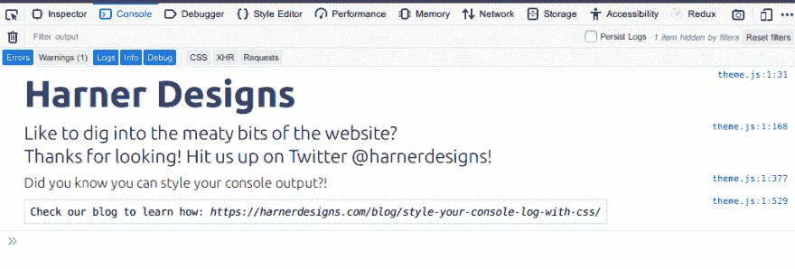

# 变态控制台兄弟！如何用 CSS 样式化你的 console.log

> 原文：<https://dev.to/jackharner/sick-console-bro-how-to-style-your-console-log-with-css-198l>

*最初发布于[哈纳设计](https://harnerdesigns.com/blog/style-your-console-log-with-css/) |照片由[格伦·卡斯滕斯-彼得斯](https://unsplash.com/@glenncarstenspeters?utm_source=unsplash&utm_medium=referral&utm_content=creditCopyText)发布于 Unsplash*

在 Chrome 和 Firefox 中，你可以给你的 console.log()消息添加 CSS 样式。这相当简单明了。

您所需要做的就是在日志消息前包含一个`%c`字符串，然后将 CSS 作为参数传递给 console.log()函数。像这样:

```
console.log("%c{{Log Message}}", "{{CSS}}"); 
```

<svg width="20px" height="20px" viewBox="0 0 24 24" class="highlight-action crayons-icon highlight-action--fullscreen-on"><title>Enter fullscreen mode</title></svg> <svg width="20px" height="20px" viewBox="0 0 24 24" class="highlight-action crayons-icon highlight-action--fullscreen-off"><title>Exit fullscreen mode</title></svg>

例如，这段代码运行在[我的投资组合](https://harnerdesigns.com) :
上

```
console.log("%cHarner Designs", "color:#233E82; font-family:'Ubuntu'; display: block;font-weight:bold; font-size:48px; background:#fff;");
    console.log("%cLike to dig into the meaty bits of the website?\nThanks for looking! Hit us up on Twitter @harnerdesigns!", "color:#222; font-family:'Ubuntu'; font-weight:100; font-size:24px; background:#fff;");
    console.log("%cDid you know you can style your console output?!", "color:#333; font-family:'Ubuntu'; font-weight:100; font-size:18px; background:#fff;");
    console.log("%cCheck our blog to learn how: https://harnerdesigns.com/blog/style-your-console-log-with-css/", "line-height: 3em; padding: 0.5em; text-align: center; border: 1px dotted #aaa; background:#fff; font-size: 14px;"); 
```

<svg width="20px" height="20px" viewBox="0 0 24 24" class="highlight-action crayons-icon highlight-action--fullscreen-on"><title>Enter fullscreen mode</title></svg> <svg width="20px" height="20px" viewBox="0 0 24 24" class="highlight-action crayons-icon highlight-action--fullscreen-off"><title>Exit fullscreen mode</title></svg>

并向控制台输出如下内容:

[](https://res.cloudinary.com/practicaldev/image/fetch/s--IFc6TpQW--/c_limit%2Cf_auto%2Cfl_progressive%2Cq_auto%2Cw_880/https://harnerdesigns.com/wp-content/uploads/2019/06/styled-console-update.png)

## 在一个日志中样式化多个字符串

也有可能[在一个命令中包含多个字符串，并采用不同的样式。来看看:](https://stackoverflow.com/a/13017382/10425698) 

```
console.log("%cString1" + "%cString2", "{{CSS for String1}}", "{{CSS for String2}}"); 
```

<svg width="20px" height="20px" viewBox="0 0 24 24" class="highlight-action crayons-icon highlight-action--fullscreen-on"><title>Enter fullscreen mode</title></svg> <svg width="20px" height="20px" viewBox="0 0 24 24" class="highlight-action crayons-icon highlight-action--fullscreen-off"><title>Exit fullscreen mode</title></svg>

## 跨日志消息重用样式

你也可以存储你想要应用到一个变量的 CSS，然后把它传递给多个控制台

```
var consoleStyle = "{{Reusable CSS}}";
console.log("%cString1", consoleStyle);
console.log("%cString2", consoleStyle); 
```

<svg width="20px" height="20px" viewBox="0 0 24 24" class="highlight-action crayons-icon highlight-action--fullscreen-on"><title>Enter fullscreen mode</title></svg> <svg width="20px" height="20px" viewBox="0 0 24 24" class="highlight-action crayons-icon highlight-action--fullscreen-off"><title>Exit fullscreen mode</title></svg>

## 结论

你会在你的游戏机里留下一些复活节彩蛋吗？你能在自己的项目中看到这样的用例吗？我很想在评论里知道！给我看一些你在控制台消息中发现的很酷的东西的例子。

## 最近的博文

*   [剖析一个 WordPress 主题](https://harnerdesigns.com/blog/anatomy-of-a-wordpress-theme/)
*   [将注销链接添加到账户菜单-big commerce For WordPress](https://harnerdesigns.com/blog/add-logout-link-to-account-menu-bigcommerce-for-wordpress/)
*   [如何在 Illustrator 中测量角度](https://harnerdesigns.com/blog/measure-angles-in-illustrator/)