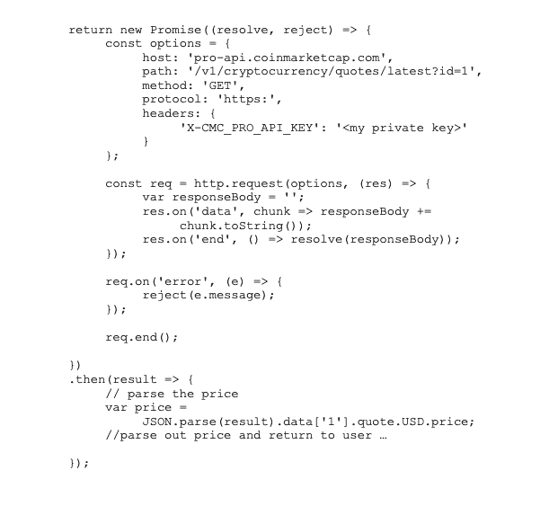
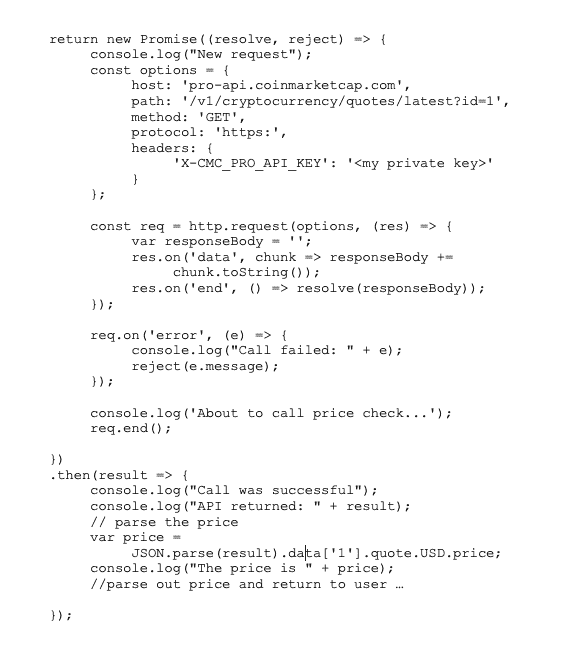
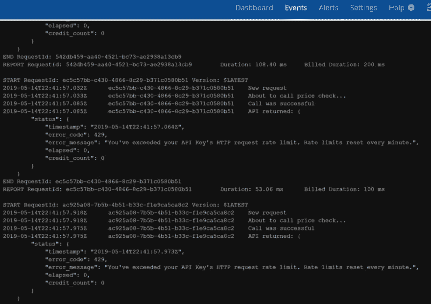
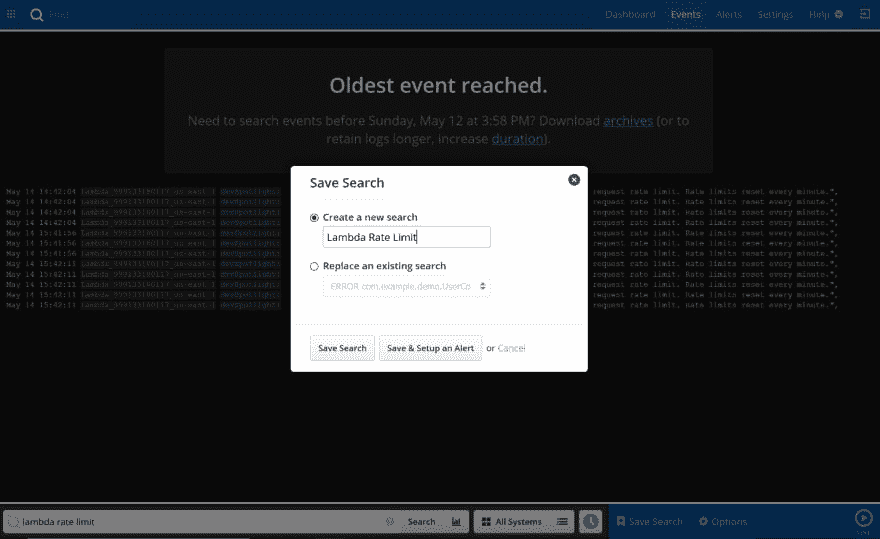
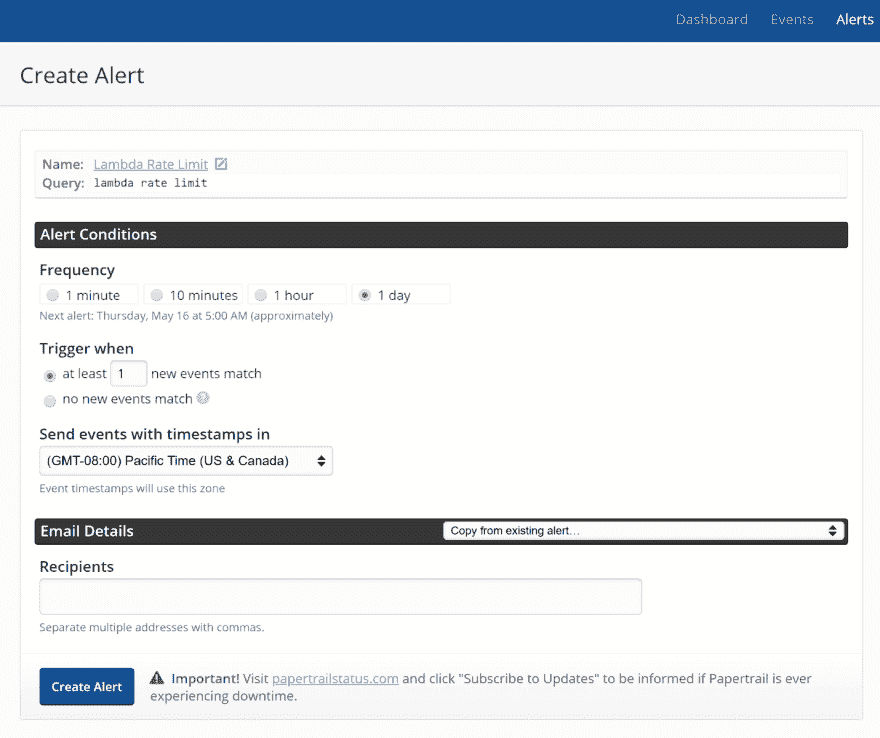

# Lambda 函数更好的日志记录

> 原文：<https://dev.to/mbogan/better-logging-for-lambda-functions-3db>

AWS Lambda 等无服务器架构给代码调试带来了新的挑战。如果没有一个可靠的日志框架，您可能会浪费几个小时，甚至几天的时间来跟踪您的函数中的简单缺陷。战略日志框架可能是追踪和解决 bug 的有力方法。

让我们看看如何最大限度地利用日志记录 Lambda 函数。我们将设置代码并对代码进行故障排除，以找到缺陷的根本原因，查看记录 Lambda 函数的一些最佳实践，并探索设置警报。

## 日志记录对于无服务器功能至关重要

几年前，将日志记录留到事后再考虑是常见的做法，并且通常被视为“足够好”你会把你的代码推向生产，然后等待。当出现问题时，您可以启动调试器，单步调试代码，并跟踪问题。

然而，现在有了 Lambda 函数这样的无服务器架构，逐句通过代码就不是一件简单的任务了。因此，在缺陷发生之前创建一个日志策略是非常必要的。否则，您可能会发现自己浪费了几个小时，甚至几天的时间，试图找出代码不断失败的原因。

## 你需要的不止是 AWS CloudWatch

AWS 为 Lambda 函数内置了日志功能，名为 [CloudWatch](https://aws.amazon.com/cloudwatch/) ，用于基本目的。最近的更新，如 CloudWatch Analytics，使该产品更加有用。您在函数中发送到 console.log()的任何内容都将被发送到 CloudWatch，并通过 AWS 控制台可见。

然而，[像网络安全管理软件产品 Papertrail 这样的日志管理工具](https://papertrailapp.com/solution/log-management)为您提供了 CloudWatch 不支持的功能，例如 live tail 模式(实时查看日志)、[跨所有服务甚至平台和提供商的日志聚合](https://papertrailapp.com/solution/log-aggregator/)，以及您(或您的整个团队)无需生活在 AWS 控制台中即可监控日志的能力。

## 通过 AWS 使用 Papertrail

让我们使用 Papertrail 在 AWS Lambda 函数中设置一个日志记录示例。关于如何将我们的日志发送到 Papertrail，我们有两种选择:我们可以使用[Winston-Papertrail JavaScript 库](https://help.papertrailapp.com/kb/configuration/configuring-centralized-logging-from-nodejs-apps/#send-events-from-nodejs)直接从我们的函数中记录到 Papertrail，或者我们可以创建第二个 Lambda 函数，从 CloudWatch 中提取日志并将它们发送到 paper trail。

对于我们的示例，我们将使用 PaperWatch 工具创建第二个 Lambda 函数，将我们的日志从 CloudWatch 传输到 Papertrail。我们不会在这里讨论细节，但是你可以自己按照 Papertrail 文档中的这些详细说明来做这件事。

## 记录和调试一个 Lambda 函数

让我们来看看我们的 Lambda 函数。我们的函数是用 Node.js 写的，检索比特币的最新价格。

正如你所看到的，我们的函数调用了一个外部 API(coinmarketcap.com)来获取比特币(其 ID 为 1)的最新信息。然后，我们的函数解析响应以获取价格，并将价格返回给用户。

这是相对简单的代码，当我们测试它时，它工作得很好。我们继续将这些代码部署到生产环境中，在最初的几个星期里，没有任何问题。几周后，比特币的价格飙升，我们的功能变得非常受欢迎。突然，我们的用户开始收到间歇性的错误，我们的功能已经停止工作。最糟糕的是，它悄无声息地失败了，似乎是随机的，没有明显的原因。人们在抱怨，我们需要让我们的功能再次工作。

在我们的函数中做一点记录将对调试我们的问题大有帮助。让我们添加我们应该在上线之前添加的日志语句。

现在让我们使用 [live tail mode](https://papertrailapp.com/solution/tail-log-files/) 来重新部署和监控我们的日志，这样我们就可以实时看到当用户调用我们的代码时发生了什么。

*paper trail-Live Tail View*

多亏了日志，这个问题现在很明显了。我们调用的外部函数是有速率限制的，我们已经达到了免费的、无报酬的极限。太多电话打得太快了。因为我们没有编写代码来处理外部调用失败的情况，所以函数失败了。

这将是一个特别难以追踪的缺陷，因为故障条件(重负载)很可能只存在于生产中，并且速率限制每 60 秒重置一次。但是有了适当的日志语句，并且有了在用户调用我们的函数时实时查看日志的能力，查找和解决问题就变得快速而容易了。

## 通过纸质跟踪警报进行主动监控

对于一个更健壮的函数，我们的下一步将是为我们的访问付费，以便去除速率限制，并为我们的外部调用可能返回的各种响应代码添加检查，以便我们适当地处理错误。但是当我们在 Papertrail 中时，让我们继续设置一个警报，以便如果再次发生费率呼叫限制，我们将收到一封电子邮件。

[在 Papertrail 中设置提醒](https://help.papertrailapp.com/kb/how-it-works/alerts)很简单。我们只需搜索想要触发警报的日志条目类型，然后使用“保存&设置警报”来保存搜索结果

*paper trail–预警配置*

现在，我们输入警报的详细信息并保存。

*paper trail–预警配置*

## 包装完毕

用 AWS 和 [Papertrail](https://papertrailapp.com/) 设置日志很简单，但是非常重要。在出现问题之前，日志记录很容易被认为是理所当然的。如果没有日志记录，我们将花费很长时间来找出我们的功能失败的原因。Papertrail 不仅让我们能够轻松地查看日志，还能实时看到故障，让我们能够快速调试、修复和重新部署。