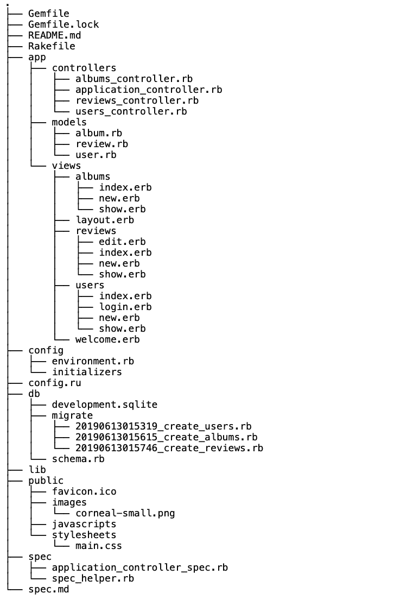

# 创建我的第一个 Sinatra 应用程序

> 原文：<https://dev.to/racheladaw/creating-my-first-sinatra-app-1k08>

Beat Roaster 是一个 Sinatra CRUD 应用程序，允许用户写关于他们最喜欢的音乐专辑的评论。用户可以使用唯一的用户名创建帐户，创建相册进行评论，在数据库中对相册进行评论，编辑自己的评论，以及删除自己的评论。

# 创造基础

我开始使用角膜宝石来创建我的应用程序的基本模板。这个 gem 创建了应用程序的基本文件结构，并添加了有用的 gem。Corneal 还允许你使用生成器来创建模型、控制器等等，但是我没有使用这个功能。

下面你会看到我的应用程序的基本文件树:

[](https://res.cloudinary.com/practicaldev/image/fetch/s--7lHa7I7_--/c_limit%2Cf_auto%2Cfl_progressive%2Cq_auto%2Cw_880/https://thepracticaldev.s3.amazonaws.com/i/9s8hyo387qgi1pnaeyfe.png)

# 型号

我为我的应用程序决定了三种模式:用户、相册和评论。这些关系如下:

*   用户通过评论拥有 _ 多条评论和 _ 多张相册
*   相册有很多评论，通过评论有很多用户
*   查看属于用户和属于相册

我可以只使用 has _ many/owners _ to 关系，但是我想使用 has_many through 关系将用户连接到相册。我发现在现实世界中，用户有很多他们听的专辑，而很多用户都拥有这些专辑，所以这种联系对我来说是最有意义的。

# 验证

关于如何实现验证，我有几个选择:

1.  我可以使用 if 语句在路由中手工编写验证代码。

2.  我可以在我的模型中使用 ActiveRecord 验证。

最后，我使用 ActiveRecord 验证来减少不必要的代码，并验证了我的属性，如下所示:

*   从用户处收集的所有数据都必须存在。空字符串不会保存到数据库中。

*   用户必须有唯一的用户名。

*   用户不能创建与数据库中已有相册同名的相册。

我还使用 bcrypt gem 和‘has _ secure _ password’宏来加密数据库中的密码。

# 路线和控制器

我以如下方式在我的控制器中使用 RESTful 路径:

*   **ApplicationController** 在我的 app 中设置为父控制器。它需要必要的文件并配置视图和会话。这很重要，因为所有其他控制器都继承自 ApplicationController。这个控制器只有一个路由:对主页的 GET 请求。我还在这个控制器中编写了两个助手方法(检查用户是否登录和返回当前用户对象),以便在我的其他控制器中使用。

*   **UsersController** 请求呈现用户索引页面、注册表单、登录表单、用户页面，并注销用户。它有创建用户和登录/验证用户的 POST 请求。

*   **album controller**请求呈现相册索引页面、单个相册的页面以及创建新相册的表单。它有一个创建新相册的 POST 请求。

*   **ReviewsController** 有 GET 请求来呈现评论索引页面、单个评论、创建新评论的表单以及编辑评论的表单。它有创建新评论和删除评论的 POST 请求。该控制器还有一个补丁请求，用于编辑特定的审核。

# 布局中的样式和产量

构建我的应用程序最棘手的部分之一是弄清楚我想如何设计它。我最终使用了几个 CSS 模板，并根据我的应用对它们进行了裁剪。

我将第一个模板直接集成到我的主页、登录页面和显示页面的视图中。这个模板非常简单，只有一个背景图片和一些字体样式。在这些页面的路径中，我必须指定不要用布局文件呈现视图，如下所示:

```
```erb :'/users/new', :layout => false``` 
```

对于其他页面，我使用了一个带有 CSS 模板的 layout.erb 文件，并使用`<%= yield %>`来呈现布局周围的视图。起初，要找出放置收益率的最佳位置非常困难，需要反复试验。

# 把一切都包起来

总的来说，这个项目是值得的，也是有趣的。我学到了很多关于设计应用程序的知识，以及在开始编码之前组织我的待办事项是多么重要。我发现，当我开始没有目标的一天时，我会跳来跳去地实现不同的功能，并在完成应用程序的基础之前花大量时间实现延伸目标。我也努力记住定期提交 github。在未来，我想把我的工作分成具体的功能，每一个都有自己的承诺。

如果我有更多的时间，我想学习更多关于 CSS 的知识来进一步设计我的应用程序。此外，我想在我的模型中编写更多的方法来分析用户数据，例如某个用户给专辑的平均评级或特定专辑的平均评级。

[](https://i.giphy.com/media/3lxD1O74siiz5FvrJs/giphy.gif)

如果你想查看我的应用程序，这里是[链接](https://github.com/racheladaw/sinatra-music-review-app)！