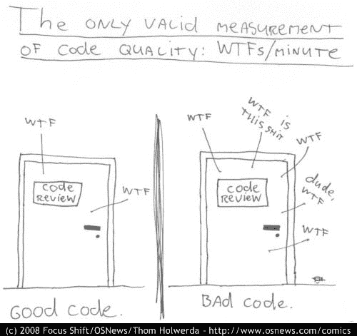
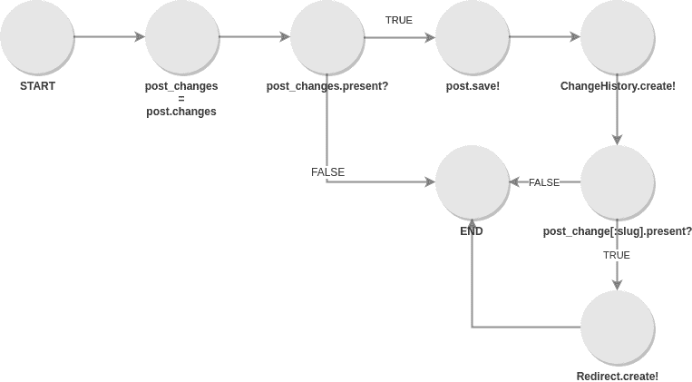
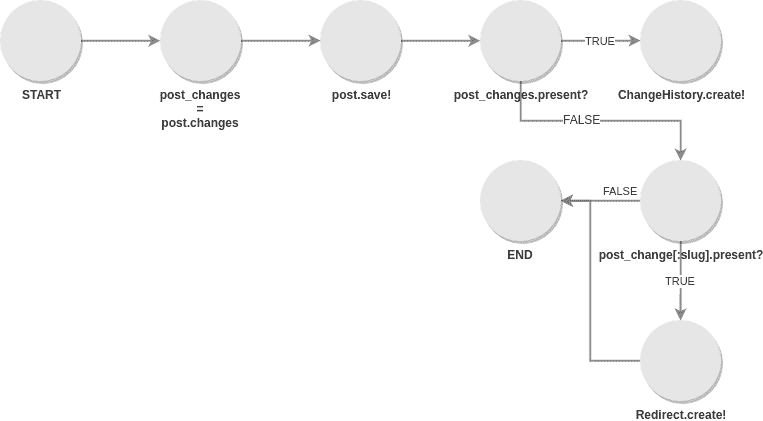

# 衡量代码质量:关于如何开始以及为什么它们很重要的 3 条建议

> 原文：<https://dev.to/sourcelevel/measuring-code-quality-3-suggestions-on-how-to-start-and-why-they-are-important-35ee>

如果我让你告诉我你的代码质量如何，你会怎么回答？没有正确的答案，答案因每个人的资历或过去的经历而异。由于对什么是质量没有共识，这里有一个我认为你的代码必须被认为是好的方面的列表(不一定是这个顺序):

*   它必须工作。无论特性是什么，它应该只做它被设计要做的事情。不多不少。
*   必须有自动化测试来确保它的工作，并描述它是如何工作的。
*   代码有很好的文档记录(至少它需要多少就有多少)。
*   代码很清晰，通过精心选择的变量、方法和类名显示了它的意图。
*   很容易维护，或者换句话说，很容易改变。
*   它没有安全漏洞。
*   它很快(至少对于它的使用来说足够快)。

根据您正在构建的软件类型，可能会添加不同的功能。例如，如果您在银行或保险公司工作，您可能需要您的代码来解决一些法律问题。

## 好了，我们得到了一个好代码的属性。我为什么要测量？

在我看来，衡量是看待现状的最佳方式。倾听开发者和你的资深开发者的感受是必不可少的。他们可能对代码库的健康状态有非常准确的感觉。然而，你不能仅仅依靠它。

开发人员也是人，作为人，他们会受到情绪和自我的影响(你听过类似“我的代码很漂亮，我是艺术家”这样的话吗？)以及他们的经历。

这最后一个方面，体验是最关键的。根据开发人员处理了多少混乱的代码，其对质量的定义会发生变化。这就是衡量如此重要的原因。

> 您获得了代码健康的标准化视图。

关于度量的另一个伟大的事情是查看它的历史来提出问题。例如，如果你的代码数量在 9 月份是 33，10 月份下降到 22，你可以告诉你的团队“我们做了什么？让我们继续这样做，因为它提高了整体代码质量"！或者，在最坏的情况下，问你的团队，*“为什么这个月代码的味道变得这么浓？”*可能会引发重要问题，比如产品团队迫使你的团队越来越快地交付产品而不注重质量。

> 这些数字允许你提问，理解你的过程和你的改变的影响。

## 好吧，我同意测量是必不可少的。我应该衡量什么？

许多公司将 bug 的数量作为质量的指标，但事实是它与过程的质量关系更大，而不是与代码库的健康程度。当然，糟糕的代码会导致更多的错误，但是并不是每个错误都是由糟糕的代码引起的。

对我来说，是的。此外，当团队中没有人寻求质量时，这种情况往往会发生。在编写新特性之前，我们通常不会考虑质量，在完成之后，我们也不会考虑质量。我们只在一个特性的开发过程中考虑质量，在这个过程中，我们会发现很多…让我们说，“什么他妈的。”

这就是软件开发最常见的度量标准是“WTF/分钟”的原因，正如下面这幅由 Thom Holwerda 创作的漫画所示。

[](https://www.osnews.com/story/19266/wtfsm/)

尽管这很有趣，但它提出了一个问题:我该如何衡量质量呢？这个问题没有正确的答案。然而，我们将提出一些想法。

以下是您可以衡量的有用指标列表。它们很容易计算，而且有自动工具来计算它们(如果你谷歌一下，还有很多)。

### 测量代码复杂度

改变的容易程度直接关系到它的质量。因此，第一个健康指标应该与其复杂性相关。计算复杂性可能很难，但是有很多开源工具可以用于这个目的。

它包括计算给定代码段(或整个代码库)在所有可能的安排中可能执行的行数。

公式为*圈复杂度=边-节点+(带退出点的节点* 2)* 。让我们在实践中看到它。给出以下代码，用 *Ruby* 编写，使用*active model*T6】API:

```
post_changes = post.changes || {}
if post_changes.present?
  post.save!
  ChangeHistory.create!(entity: 'Post', entity_id: post.id, changes: post_changes)
  if post_changes[:slug].present?
    Redirect.create!(
      path: post_changes[:slug].first,
      redirect_to: post_changes[:slug].last
    )
  end
end 
```

下图将代码显示为表示其执行路径的图形的节点和边。请注意，它忽略了 bang 方法(以感叹号结尾的方法)可能会引发异常并停止执行的事实。

[](http://sourcelevel.io/wp-content/uploads/2019/06/cyclomatic-complexity-example1.svg)

在这种情况下，复杂度将是:

```
Number of edges (E) = 9
Number of nodes (N) = 8
Nodes with exit points (P) = 3

Applying the formula: N - E + (P * 2)
Cyclomatic Complexity = 9 - 8 + (3 * 2)
Cyclomatic Complexity = 7 
```

好的。现在，让我们通过重构代码来减少这个数字。一个好的策略是减少嵌套 if 的数量，我们可以通过下面的代码实现这个目标:

```
post_changes = post.changes || {}
post.save!

if post_changes.present?
  ChangeHistory.create!(entity: 'Post', entity_id: post.id, changes: post_changes)
end
if post_changes[:slug].present?
  Redirect.create!(
    path: post_changes[:slug].first,
    redirect_to: post_changes[:slug].last
  )
end 
```

仅仅看一下这段代码，你就可以说它更容易理解，修改起来也更舒服。它的意图更简单:保存文章，如果文章属性改变，创建一个 *ChangeHistory* 记录，然后，如果 *slug* 已经改变，创建一个重定向规则。这是图表:

[](http://sourcelevel.io/wp-content/uploads/2019/06/cyclomatic-complexity-example2.svg)

现在让我们来做数学:

```
Number of edges (E) = 8
Number of nodes (N) = 8
Nodes with exit points (P) = 2

Applying the formula: N - E + (P * 2)
Cyclomatic Complexity = 8 - 8 + (2 * 2)
Cyclomatic Complexity = 4 
```

正如我们所看到的，第二段代码虽然做了同样的工作，但没有第一段代码复杂。这就是度量如何帮助你的代码更容易理解:通过知道哪里是最复杂的点。因此，您和您的团队可以继续工作，直到您的规则可以接受为止。是啊，可接受是这个词，因为没有一个神奇的数字。要确定它，你首先需要了解你的背景。

> 一个好的做法是:不管是哪一个数字，尽量减少它。

### 测量码气味

追溯到历史，当我们去树林里收集食物时，上面没有印上食物的有效期，我们必须使用我们的感官。如果你不想食物中毒，你会先闻一下。

这和代码是一样的。它不一定指向一个 bug 或一段腐烂的代码。这只是增加了一种味道，即有些东西可能不太好。它可以是反模式、重复代码、不良实践，任何可能引起开发人员警惕的东西。

静态分析可以自动发现这些气味。有开源的 linters 在寻找它们方面做得非常好。这里的度量是在您的代码中找到的它们的绝对数量。非常容易计算。

### 测量安全问题

好的代码是安全的。这就是为什么运行一个自动化工具来寻找 SQL 注入、数据泄漏和其他在日常开发中常见的潜在安全问题是至关重要的。

自动化工具并不完美，有时会触发误报警报。然而，这不是不运行它们的借口。如果您的代码库有太多的误报警报，您完全应该开始更加认真地对待这些警报。

静态分析软件寻找已知的模式(比如使用 *eval* 或者在插入数据库之前不清理数据)并总结它们。这是度量标准。就这么简单。

## 结论

质量的概念可能因公司、产品阶段甚至个人观点而异。为了保持或提高代码的质量，您需要为您的团队定义什么是质量，并度量它。还有许多其他可用的指标。牢记您的质量定义，并寻找确保您的代码与之匹配的度量标准。已经有许多工具被设计来最大化和参与关于质量的讨论。去找他们！

在这篇博文中，我提出了三个指标，所有这些指标(以及更多)都出现在我们的解决方案中。SourceLevel 为每个打开的 pull 请求自动运行，并保存主分支的历史记录，这样您就可以提出关于您的流程的问题，而不是意见。

免费注册，享受我们 14 天的试用期！

帖子[测量代码质量:关于如何开始以及为什么它们重要的 3 个建议](https://sourcelevel.io/measuring-code-quality-3-suggestions-on-how-to-start-and-why-they-are-important)首先出现在 [SourceLevel](https://sourcelevel.io) 上。