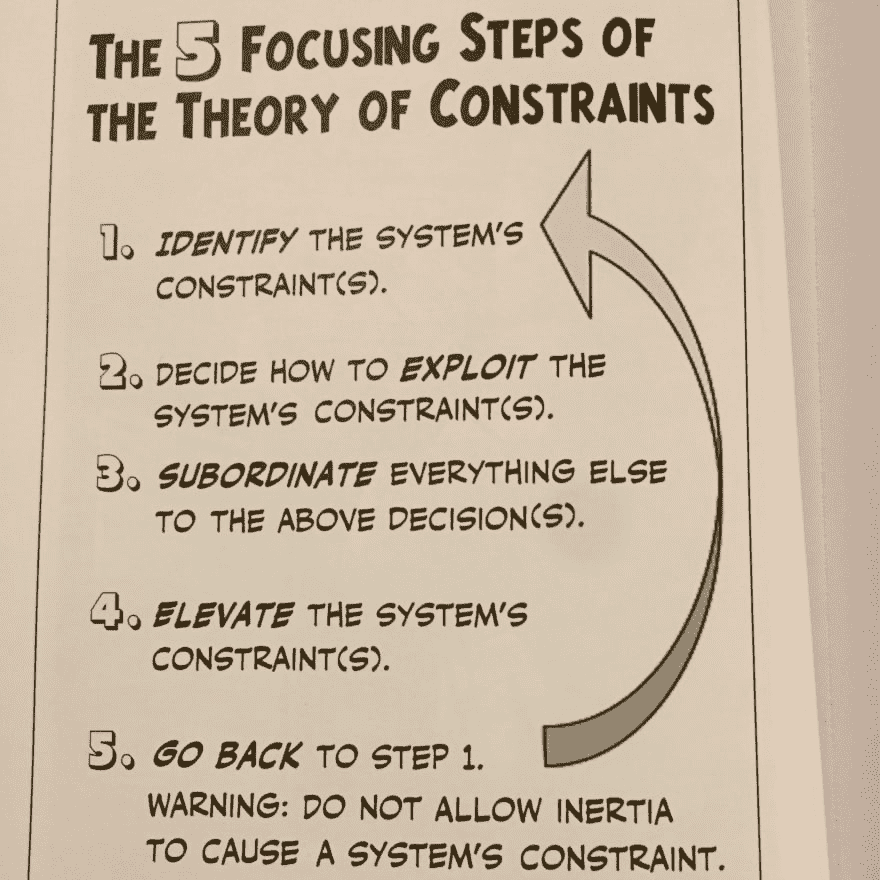

# 目标:一本商业漫画小说

> 原文：<https://dev.to/grepliz/the-goal-a-business-graphic-novel-19d9>

我通常不看漫画书或漫画小说，但我看到了一条关于目标的推文:艾利·M·高德拉特的商业漫画小说，这引起了我的兴趣。这个特别的版本是根据 1984 年出版的原版小说改编的。这部小说通过情节、曲折和浪漫，以令人兴奋和难忘的方式介绍了戈德拉特的约束理论。好吧，没有浪漫，一些故事情节感觉有点做作，但尽管如此，信息是有趣的，并以一种有趣的格式独特地呈现。

这部小说以主角亚历克斯·罗戈开始。亚历克斯是一家制造厂的经理，处于进退两难的境地。工厂的情况很糟糕，他有 3 个月的时间来扭转局面，否则当局就会关闭工厂，解雇所有人。

任何人都可以想象(不管是不是经理)，这是一个相当令人困惑的问题。幸运的是，亚历克斯在这条充满挑战的道路上跋涉时遇到了一位老教授，这位教授给了他智慧的话语。帮助他思考和改进工厂流程以实现“目标”的话。

现在你可能想知道:

"流水线型制造和软件开发有什么关系？"

事实证明相当多。为了生产软件，软件组织由人和过程组成。类似于工厂(也由人和过程组成)生产物理产品的方式。

即使作为独立的软件工程师，我们也有自己的个人流程来完成日常工作。

这本书的一个潜在主题是“链条的强度取决于最薄弱的一环。”或者一个公司的速度取决于它最慢的部门。有多少次，你匆匆忙忙地完成了一些工作，却只能让它在队列中等待下一步。也许你的代码需要通过 QA，而 QA 部门人手不足。不管你写代码的速度有多快，它都不会更快地投入生产。

快点等。

这些问题在所有类型的公司中都是相关的，看到相似之处真的很有趣。

归根结底，这都是关于 POOGI，持续改进的过程，本书分 5 个步骤描述:

因此，为了使这 5 个步骤更加具体，让我们回到我们的 QA 约束示例。

旁注:我不是在挑 QA 组织的毛病。我做了 13 年的 QA 工程师，对他们深表同情和尊重，但也深深理解其中的挑战。

## 标识系统的约束。

QA 部门成为整个软件生产周期的制约因素之一有很多原因。也许这个部门人手不足，或者需要测试自动化，或者更好的测试自动化。

## 决定如何利用系统的约束。

我们如何解决这些限制？如果是资源问题，解决方法可能很简单，就是雇佣更多的人。如果这是测试自动化的需要，也许是留出时间来培训员工来创建自动化。

## 使其他一切服从上述决定。

如果你发现了一个问题并找到了解决方案，如果你不去执行它，这一切都是没有意义的。如果这意味着花费开发人员的时间来培训 QA 人员或帮助自动化，那就去做吧！

## 提升系统的约束。

在这个过程中，QA 部门不再是瓶颈，有助于整个系统的整体效率。

## 回到步骤 1。

迭代，迭代，迭代。

## 结论

这本书里还有许多其他的细节，尽管它们是在产品制造的背景下，我认为从中获得的东西对我们这些软件世界的人来说是无价的。