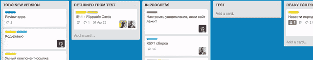

# 如果你必须领导一个远程开发团队...

> 原文：<https://dev.to/rsedykh/if-you-ever-have-to-manage-a-remote-dev-team-2j1g>

对于那些突然不得不领导一个远程团队并对利益相关者负责的开发人员，我编制了一份清单，你和你的队友可以遵循它来拥有一个简单、透明、可预测和无摩擦的工作流程。

我花了几年时间管理远程开发团队。无论你是在为客户的项目工作还是在创业，任何工作流程都有三个支柱:

1.  沟通
2.  任务管理
3.  时间管理

为了掌握这些，我们需要尽可能简单的框架和工具来完成工作，而不分散你创建产品的注意力。虽然我在下面描述了一些框架，但我建议您继续使用 Slack 和 Trello 进行通信。如果你被要求提供时间表或想要表达你的观点，harvest(5+团队，付费)或 tog GL(5–免费)是最好的选择。

* * *

沟通:

1.  使用渠道，**避免直接消息**。这让你的聊天变得透明。一个项目有两个以上的人，你不想陷入“天哪，我们忘记告诉其他人了”的境地。
2.  **开始一个话题**来讨论一个特定的问题。只提*那些需要参与的*。这里有两点:螺纹让通道干净很多；你不会分散任何不直接参与讨论的人的注意力，同时保持他们对信息的访问。
3.  明智地添加与其他工具的集成，如 Github、Trello 和 Sentry，以便在讨论中有**锚点**。
4.  Slack 类似于一个开放空间的工作环境。是的，你需要独处的时间。关闭应用程序是可以的，但要确保每个人都知道如何通过电话或你的私人信使联系你(顺便说一句，永远不要在那里继续工作对话，回到 Slack)。并且，当出现**尽快**的情况时，千万不要松懈。

任务管理:

1.  *团队领导特辑*:订阅公告板，这样你就不会错过重要信息和你项目的大图。通过订阅，您允许 Trello 通过电子邮件向您发送通知。不要查看收件箱里的每封邮件，在每天的**零收件箱例行程序**中查看通知，确保(购买手动存档每封邮件)你不会错过任何重要的事情。
2.  下面是我的框架:用卡片列出清单，描述任务。把优先卡片放在你清单的最上面。然后，从左上方拿起任务，开始将它们从**移到右边**。 *待办事项→进行中→测试→从测试中返回→进行中→测试→准备生产→完成*
3.  将任务分解成子任务:创建“前端”、“后端”、“标记”、“问题”、“等等”清单。你可能想把大任务分成小任务。完成每个小任务都有其独立的价值，例如，您可以将一部分功能部署到生产环境中。
4.  **截止日期**，如果加上到期日，**是真实的**。如果你不确定你能做到，那就设定一个截止日期，这样每个人都能看到并据此行动。不要忘记，测试、修复 bug 以及将一个特性部署到生产环境中可能需要额外的几天时间。
5.  学几个热键(打 *shift +？*在特雷罗)。
6.  使用颜色标签来区分任务。这有助于你直观地评估进度和平衡团队负荷**。你可以发明自己的系统或者用我的:*后端，前端，Bug，ASAP，非科技，科技债，设计，科技专题，讨论，临时标记*。**

时间管理(可选，取决于具体情况):

1.  安装时间跟踪器**浏览器扩展**和桌面应用。为弹出桌面应用程序指定热键。
2.  追踪**与工作**相关的一切:编码、修复、重构、讨论、思考、阅读等。
3.  从 Trello 卡上追踪时间(通过浏览器扩展)，这样你的**记录就会与任务的**联系起来(有助于分析和报告)。
4.  无卡可追踪？创建一个新卡(例如:“更新依赖项”)，这样任务就可以**可见、可测试和可跟踪**。在某些情况下(比如关于项目的一般性谈话),只需跟踪项目的总体时间。
5.  诚实追踪。喝茶时间，边聊天？暂停。忘了停下来？稍后更正。但是**从来不**事后追踪时间。

* * *

这就是我来回奔波后管理远程团队的方式。这里的目标不是成为一个控制纳粹，而是确保过程的透明度和信息的可用性，以实现令人欣慰的工作与生活的平衡。

希望这篇文章能帮助你避免错误。喜欢就分享给队友吧。:-)