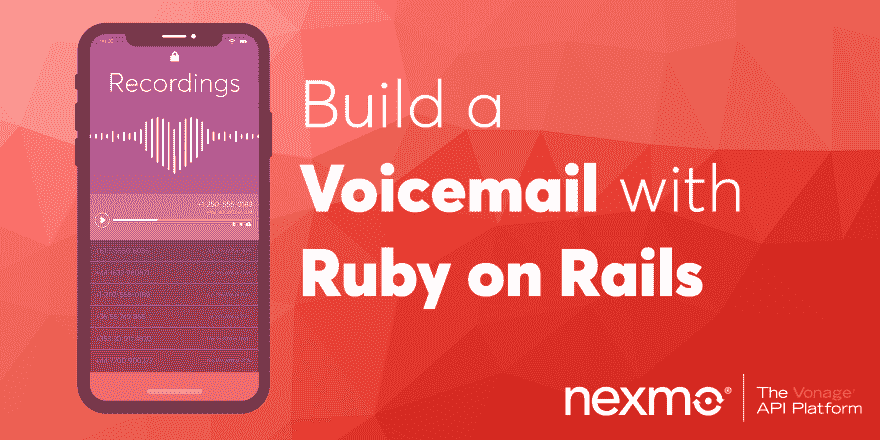
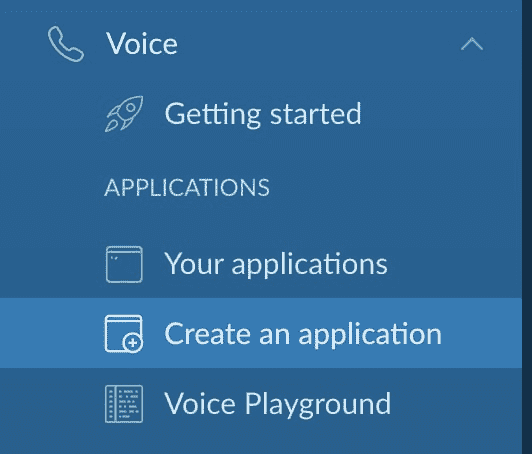
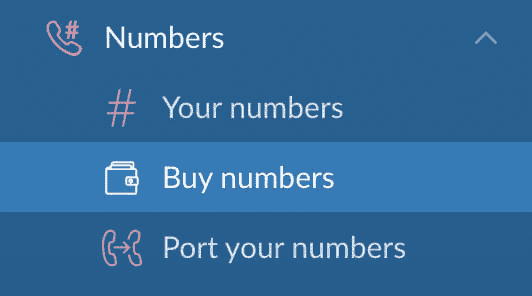
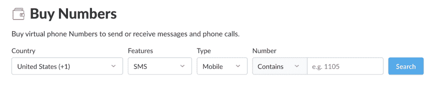
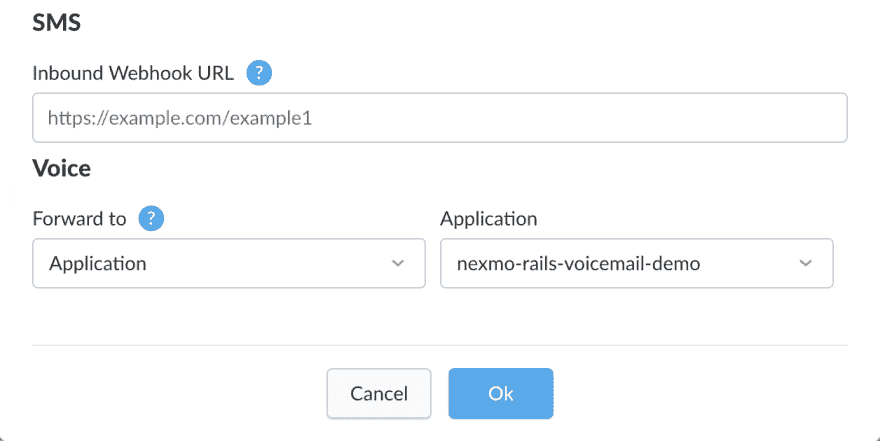

# 用 Ruby on Rails 构建语音邮件应用

> 原文：<https://dev.to/vonagedev/build-a-voicemail-app-with-ruby-on-rails-1oen>

[](https://res.cloudinary.com/practicaldev/image/fetch/s--ZRJlu0qP--/c_limit%2Cf_auto%2Cfl_progressive%2Cq_auto%2Cw_880/https://www.nexmo.com/wp-content/uploads/2019/06/ruby-voicemail.png)

您是否曾经希望能够为客户提供一个电话号码，让他们可以打电话给你并给你留言？您可以创建自己的语音邮件应用程序，由 Nexmo Voice API 和 Ruby on Rails 提供支持。在本教程中，我们将逐步完成启动和运行的步骤。您的应用程序将能够接收电话呼叫，记录语音邮件消息，并有一个 web 界面来显示和播放所有消息。

如果您愿意，也可以在 [GitHub](https://github.com/Nexmo/nexmo-rails-voicemail-demo) 上克隆这个应用程序的完整工作副本。

我们开始吧！

## 先决条件

为了完成本教程，您需要以下内容:

*   Rails 5.2+版本
*   Nexmo 账户
*   ngrok

## 创建语音邮件应用程序

我们将完成以下步骤:

1.  创建新的 Rails 应用程序
2.  建立一个 Nexmo 帐户
3.  Set Up ngrok
4.  设置我们的 Rails 应用程序

一旦我们完成了上述所有步骤，我们就可以调用我们的新应用程序，留下消息，然后从我们的 web 界面播放它。

### 创建新的 Rails 应用程序

从命令行执行以下命令:

```
$ rails new nexmo-rails-voicemail-demo --database=postgresql 
```

<svg width="20px" height="20px" viewBox="0 0 24 24" class="highlight-action crayons-icon highlight-action--fullscreen-on"><title>Enter fullscreen mode</title></svg> <svg width="20px" height="20px" viewBox="0 0 24 24" class="highlight-action crayons-icon highlight-action--fullscreen-off"><title>Exit fullscreen mode</title></svg>

一旦完成，您将拥有一个名为`nexmo-rails-voicemail-demo`的全新 Rails 应用程序，PostgreSQL 被定义为它的数据库。此时，您还需要在 PostgreSQL 中创建开发数据库。您可以通过运行以下命令来实现这一点:

```
$ createdb nexmo-rails-voicemail-demo_development 
```

<svg width="20px" height="20px" viewBox="0 0 24 24" class="highlight-action crayons-icon highlight-action--fullscreen-on"><title>Enter fullscreen mode</title></svg> <svg width="20px" height="20px" viewBox="0 0 24 24" class="highlight-action crayons-icon highlight-action--fullscreen-off"><title>Exit fullscreen mode</title></svg>

既然已经创建了数据库，我们可以创建一个表来存储每个语音邮件记录的信息。我们需要一个表来保存`Conversation`、录音和发送者电话号码的唯一标识符。我们将在讨论创建控制器时定义什么是`Conversation`以及如何使用它。下面的命令将创建我们的表:

```
$ rails generate migration CreateRecordings conversation_uuid:string recording_uuid:string from:numeric 
```

<svg width="20px" height="20px" viewBox="0 0 24 24" class="highlight-action crayons-icon highlight-action--fullscreen-on"><title>Enter fullscreen mode</title></svg> <svg width="20px" height="20px" viewBox="0 0 24 24" class="highlight-action crayons-icon highlight-action--fullscreen-off"><title>Exit fullscreen mode</title></svg>

您可以检查生成器创建的迁移文件，方法是在您喜欢的代码编辑器中打开应用程序，并在`/db/migrate`文件夹中查看该文件。它将被命名为`create_recordings.rb`,前面是您执行上述命令时的时间戳。该文件应该是这样的:

```
class CreateRecordings < ActiveRecord::Migration[5.2]
  def change
    create_table :recordings do |t|
      t.string :conversation_uuid
      t.string :recording_uuid
      t.numeric :from

      t.timestamps
    end
  end
end 
```

<svg width="20px" height="20px" viewBox="0 0 24 24" class="highlight-action crayons-icon highlight-action--fullscreen-on"><title>Enter fullscreen mode</title></svg> <svg width="20px" height="20px" viewBox="0 0 24 24" class="highlight-action crayons-icon highlight-action--fullscreen-off"><title>Exit fullscreen mode</title></svg>

如果迁移文件看起来不错，那么您可以通过从命令行运行`rake db:migrate`来执行迁移。

现在，设置 Rails 应用程序的最后一步是安装依赖项。打开应用程序根文件夹中的`Gemfile`，添加以下内容:

```
# Gemfile

gem 'nexmo_rails'
gem 'dotenv-rails' 
```

<svg width="20px" height="20px" viewBox="0 0 24 24" class="highlight-action crayons-icon highlight-action--fullscreen-on"><title>Enter fullscreen mode</title></svg> <svg width="20px" height="20px" viewBox="0 0 24 24" class="highlight-action crayons-icon highlight-action--fullscreen-off"><title>Exit fullscreen mode</title></svg>

文件保存后，继续从您的终端运行`bundle install`。您已经将`nexmo_rails`初始化器 gem 安装到您的应用程序中，这使我们能够实例化一个有凭证的 Nexmo 客户端。我们将暂时停止运行 Nexmo 初始化器，因为我们首先需要创建我们的 Nexmo 帐户并接收我们的 API 凭证。您还安装了`dotenv-rails` gem，当我们添加我们的 Nexmo API 凭证作为环境变量时，它将帮助我们。

我们现在准备进入下一步，建立我们的 Nexmo 帐户。

### Set Up ngrok

有几种方法可以让我们的本地开发服务器从外部访问，但是最简单的方法之一是使用 ngrok。你可以阅读[这篇文章](https://www.nexmo.com/blog/2017/07/04/local-development-nexmo-ngrok-tunnel-dr/)来获得关于 ngrok 如何工作的更详细的解释。然而，出于我们的目的，我们只需要让它运行并复制它提供给我们的 URL。

为了启动 ngrok，打开一个新的终端窗口，从命令行执行以下命令:

```
$ ngrok http 3000 
```

<svg width="20px" height="20px" viewBox="0 0 24 24" class="highlight-action crayons-icon highlight-action--fullscreen-on"><title>Enter fullscreen mode</title></svg> <svg width="20px" height="20px" viewBox="0 0 24 24" class="highlight-action crayons-icon highlight-action--fullscreen-off"><title>Exit fullscreen mode</title></svg>

现在，您将在终端窗口中看到一个 ngrok 日志记录界面。靠近界面顶部是以`Forwarding`开头的一行，包含两个 URL。第一个是外部可访问的 ngrok URL，以`ngrok.io`结尾，后跟`http://localhost:3000`，这是您的本地开发服务器。现在，当您或 Nexmo 联系到`ngrok.io` URL 时，它会将其转发到您的本地服务器。

确保将`ngrok.io` URL 复制到安全的地方。我们将在下一步设置 Nexmo 帐户、电话号码和语音应用程序时使用它。

### 设置一个 Nexmo 账户

为了让我们的语音应用程序工作，我们需要一个 Nexmo 帐户，一个 Nexmo 提供的电话号码，一个 Nexmo 应用程序，最后，我们需要将我们的应用程序链接到我们的电话号码。

您可以免费创建一个 Nexmo 帐户，作为额外奖励，您的帐户将获得 2 欧元，以开始使用您的新应用程序。在您的网络浏览器中导航至[https://dashboard.nexmo.com/sign-up](https://dashboard.nexmo.com/sign-up)，并完成注册步骤。完成后，您将进入 Nexmo 控制面板。

从左侧菜单中，点击`Voice menu`项。您将在`APPLICATIONS`下看到以下四个选项:

[](https://res.cloudinary.com/practicaldev/image/fetch/s--RgxCHOxc--/c_limit%2Cf_auto%2Cfl_progressive%2Cq_auto%2Cw_880/https://www.nexmo.com/wp-content/uploads/2019/05/create-voice-app.png)

点击`Create an application`选项，您将被引导到一个页面，在这里您可以设置一个新的 Nexmo 应用程序。

用以下内容完成表格:

*   `Application name`文本字段输入`nexmo-rails-voicemail-demo`
*   `Event URL`文本字段输入您的 ngrok URL: `https://[ngrok url here]/event`
*   `Answer URL`文本字段再次输入您的 ngrok URL:`https://[ngrok url here]/webhooks/answer`

完成后，点击蓝色的`Create Application`按钮。

创建应用程序后，您可以生成一个公钥/私钥对。从 API 访问语音邮件录音时，您将需要这些按键。点击`generate public/private key pair`并将自动下载的`private.key`文件移动到我们应用程序的根文件夹中。

如果您还没有这样做，那么现在应该在应用程序的顶层创建一个`.gitignore`文件，并将`./private.key`添加到其中，这样就不会将您的私钥提交给版本控制。

现在，您已经创建了一个 Nexmo 语音应用程序。我们的下一步是购买一个 Nexmo 电话号码，并将其链接到该应用程序。

在 Nexmo 仪表板上，点击左侧菜单上的`Numbers`菜单项。您将看到出现三个选项:

[](https://res.cloudinary.com/practicaldev/image/fetch/s--qvZvNbOK--/c_limit%2Cf_auto%2Cfl_progressive%2Cq_auto%2Cw_880/https://www.nexmo.com/wp-content/uploads/2019/05/numbers.png)

点击`Buy numbers`选项，你将被引导到一个页面，在这里你可以选择一个国家，功能，类型，以及你想要的四位数字。

[](https://res.cloudinary.com/practicaldev/image/fetch/s--Osb4bn2U--/c_limit%2Cf_auto%2Cfl_progressive%2Cq_auto%2Cw_880/https://www.nexmo.com/wp-content/uploads/2019/05/buy-numbers.png)

出于我们的目的:选择您当前所在的国家，以便您可以拨打本地电话；选择`Voice`选择功能，选择手机或座机类型。您不需要为`Number`文本字段输入任何内容。当你点击`Search`，你会看到一个电话号码列表。

点击橙色`Buy`按钮选择一个，在确认提示中再次点击橙色`Buy`按钮。

一旦你拥有了这个号码，你现在就可以将它链接到你的`nexmo-rails-voicemail-demo`语音应用程序。为此，单击电话号码旁边的齿轮图标，您将看到以下菜单:

[](https://res.cloudinary.com/practicaldev/image/fetch/s--Hw5dNM2v--/c_limit%2Cf_auto%2Cfl_progressive%2Cq_auto%2Cw_880/https://www.nexmo.com/wp-content/uploads/2019/06/Screen-Shot-2019-06-14-at-15.12.52.png)

从下拉列表中选择`nexmo-rails-voicemail-demo`应用程序，并点击蓝色`Ok`按钮。您的 Nexmo 电话号码现在已链接到您的语音应用程序，并准备好通过语音代理接受和转发呼入电话。

在准备运行我们的应用程序之前，我们的最后一步是定义我们的 Rails 控制器、视图、模型和路由。

### 设置我们的 Rails 应用程序

在我们开始为我们的模型、视图和控制器编写代码之前，让我们花点时间浏览一下我们希望应用程序做什么。我们的应用程序有两个不同的方面:

*   接听电话并记录信息
*   在网页上显示和访问录制内容

为了完成接收呼叫和记录消息的第一个任务，我们需要一个 webhook 路由，它可以在应答呼叫时接受来自 Nexmo Voice API 的请求，并将指令发送回 API。然后，我们需要一个单独的路由来接受呼叫的状态更新。

我们应用程序的第二个任务需要一个路由，该路由可以接受一个列出所有记录的`GET`请求。此外，因为我们需要列出所有的记录，所以我们需要将每个记录保存到我们之前创建的数据库中。我们还希望保存每个录音本身，以便能够方便地向听众播放。

既然我们已经有了一条前进的道路，让我们开始构建它。

#### 定义我们的路线

在您的代码编辑器中打开`/config/routes.rb`文件，并添加以下路由:

```
# routes.rb

get '/', to: 'voicemail#index'
get '/answer', to: 'voicemail#answer'
post '/event', to: 'voicemail#event'
post '/recording', to: 'voicemail#new' 
```

<svg width="20px" height="20px" viewBox="0 0 24 24" class="highlight-action crayons-icon highlight-action--fullscreen-on"><title>Enter fullscreen mode</title></svg> <svg width="20px" height="20px" viewBox="0 0 24 24" class="highlight-action crayons-icon highlight-action--fullscreen-off"><title>Exit fullscreen mode</title></svg>

我们已经创建了四个独立的路由，它们将把我们应用程序的所有流量定向到我们即将创建的语音邮件控制器中的适当方法。我们创建了两条`GET`请求路线；一个用于处理列出所有记录的顶级请求，另一个用于在电话应答时接收来自 Nexmo 的初始 API 请求。我们还创建了两个`POST`请求；一个用于接收来自 Nexmo 的关于呼叫的状态更新，一个用于在呼叫结束时保存记录。

#### 定义我们的控制器动作

我们创建的路由引用了一个我们尚未创建的控制器，所以我们现在就开始创建吧。从命令行执行以下命令:

```
$ rails generate controller Voicemail 
```

<svg width="20px" height="20px" viewBox="0 0 24 24" class="highlight-action crayons-icon highlight-action--fullscreen-on"><title>Enter fullscreen mode</title></svg> <svg width="20px" height="20px" viewBox="0 0 24 24" class="highlight-action crayons-icon highlight-action--fullscreen-off"><title>Exit fullscreen mode</title></svg>

这将在`/app/controllers`中创建一个名为`voicemail_controller.rb`的文件。我们需要为每条路线创建一个操作。这些操作将包含路由背后的逻辑，并在适当的时候将流量导向适当的视图。这些操作如下:

*   `#index`:包含一个名为`@recordings`的实例变量，它包含所有的语音邮件记录。
*   `#answer`:将 Nexmo 调用控制对象(NCCO)[包含 Nexmo API 指令的 JSON 对象]呈现给 Nexmo API。
*   `#event`:从 Nexmo API 接收更新。当应用程序接收到状态`answered`时，该方法在`Recordings`表中创建一个新条目。
*   `#new`:由 API 在录制完成时访问，并使用`recording_uuid`(录制音频的唯一 ID)更新录制条目。

最后，在定义任何方法之前，我们创建两个常量变量:`NEXMO_NUMBER`和`EXTERNAL_URL`，分别包含我们提供的 Nexmo 电话号码和我们外部可访问的 ngrok URL 的 URL。确保用您的信息在控制器中定义它们。

这是我们的控制器完成后的样子:

```
# voicemail_controller.rb

class VoicemailController < ApplicationController
    skip_before_action :verify_authenticity_token

    NEXMO_NUMBER = YOUR PHONE NUMBER GOES HERE
    EXTERNAL_URL = 'YOUR NGROK URL GOES HERE'

    def index
        @recordings = Recording.all
    end

    def answer
        render json: [
            {
                :action => 'talk',
                :text => 'Leave your message after the beep.'
            },
            {
                :action => 'record',
                :beepStart => true,
                :eventUrl => [ "#{EXTERNAL_URL}/recording" ],
                :endOnSilence => 3
            }
        ]
    end

    def event
        if params['status'] == 'answered'
            Recording.create(conversation_uuid: params['conversation_uuid'], from: params['from'])
        end
    end

    def new
        if params['recording_url']
            recording = Recording.find_by(uuid: params['conversation_uuid'])
            recording.recording_uuid = params['recording_uuid']
            recording.save
            Nexmo.files.save(params['recording_url'], "public/voicemail/#{params['recording_uuid']}.wav")
        end
    end
end 
```

<svg width="20px" height="20px" viewBox="0 0 24 24" class="highlight-action crayons-icon highlight-action--fullscreen-on"><title>Enter fullscreen mode</title></svg> <svg width="20px" height="20px" viewBox="0 0 24 24" class="highlight-action crayons-icon highlight-action--fullscreen-off"><title>Exit fullscreen mode</title></svg>

#### 定义我们的模型

在我们的应用程序中，我们只需要创建一个模型来与数据库中的`Recordings`表进行交互。继续在`/app/models/`中创建一个名为`recording.rb`的文件，你只需要在里面定义它是一个从`ActiveRecord::Base` :
继承的模型

```
# recording.rb

class Recording < ActiveRecord::Base
end 
```

<svg width="20px" height="20px" viewBox="0 0 24 24" class="highlight-action crayons-icon highlight-action--fullscreen-on"><title>Enter fullscreen mode</title></svg> <svg width="20px" height="20px" viewBox="0 0 24 24" class="highlight-action crayons-icon highlight-action--fullscreen-off"><title>Exit fullscreen mode</title></svg>

既然我们已经定义了路线、控制器和模型，接下来我们需要创建一个`#index`视图。我们现在就去做吧。

#### 创建我们的视图

我们需要为我们的应用程序创建一个视图，这将是所有语音邮件记录显示的地方。用户可以点击其中任何一个来播放录音。我们需要在`/app/views/voicemail`中创建一个`index.html.erb`文件。在该文件中，我们希望利用我们在语音邮件控制器`#index`动作中创建的`@recordings`实例变量，该变量包含了`Recordings`表中的所有条目。我们将遍历这些数据，并创建一个 HTML 表来列出所有记录。我们的最终视图将有以下代码:

```
# index.html.erb

<h1>Your Voicemail</h1>

<strong>You have <%= Dir["public/voicemail/*"].length %> messages</strong>

<br /><br />

<table>
    <tr>
        <th>From</th>
        <th>Timestamp</th>
        <th>Conversation UUID</th>
        <th>Recording</th>
    </tr>
    <% @recordings.each do |r| %>
        <tr>
            <td><%= r.from %></td>
            <td><%= r.created_at %></td>
            <td><%= r.conversation_uuid %></td>
            <td><a href="/voicemail/<%= r.recording_uuid %>.wav">Click here to listen</a></td>
        </tr>
    <% end %>
</table> 
```

<svg width="20px" height="20px" viewBox="0 0 24 24" class="highlight-action crayons-icon highlight-action--fullscreen-on"><title>Enter fullscreen mode</title></svg> <svg width="20px" height="20px" viewBox="0 0 24 24" class="highlight-action crayons-icon highlight-action--fullscreen-off"><title>Exit fullscreen mode</title></svg>

除了 HTML 表之外，我们添加到视图中的一个额外项目是语音邮件记录的数量。我们利用 Ruby 中的`#length`方法来计算语音邮件记录本地文件夹中的文件数量，并显示该数量。

随着视图的创建，我们的应用程序现在差不多准备好了。我们需要做的最后一件事是添加我们的 Nexmo API 凭证作为环境变量，并使用 Nexmo Rails 初始化器初始化我们的 Nexmo 客户端。

#### 添加 Nexmo 凭证并初始化 Nexmo 客户端

在本教程的前面，我们安装了`dotenv-rails`和`nexmo_rails`gem 作为依赖项。前者帮助我们管理应用程序中环境变量的使用，而后者包含一个 Rails 生成器来初始化一个 Nexmo 认证的客户端。

要添加我们的 Nexmo 凭证，我们要做的第一件事是打开文件，或者在我们项目的根文件夹中创建文件(如果它还不存在的话)。在`.env`文件中，我们将为我们的 Nexmo API 密钥、秘密、私有密钥文件路径和应用程序 ID 添加凭证。它看起来像下面这样，用您从 Nexmo 仪表板上获得的唯一凭证替换这些值:

```
# .env

NEXMO_API_KEY=your api key
NEXMO_API_SECRET=your api secret
NEXMO_APPLICATION_ID=your application id
NEXMO_PRIVATE_KEY=./private.key 
```

<svg width="20px" height="20px" viewBox="0 0 24 24" class="highlight-action crayons-icon highlight-action--fullscreen-on"><title>Enter fullscreen mode</title></svg> <svg width="20px" height="20px" viewBox="0 0 24 24" class="highlight-action crayons-icon highlight-action--fullscreen-off"><title>Exit fullscreen mode</title></svg>

既然我们的凭证已经作为环境变量添加了，我们就可以运行生成器了。从命令行执行以下命令:

```
$ rails generate nexmo_initializer 
```

<svg width="20px" height="20px" viewBox="0 0 24 24" class="highlight-action crayons-icon highlight-action--fullscreen-on"><title>Enter fullscreen mode</title></svg> <svg width="20px" height="20px" viewBox="0 0 24 24" class="highlight-action crayons-icon highlight-action--fullscreen-off"><title>Exit fullscreen mode</title></svg>

就是这样！您现在拥有了一个功能完整的应用程序。

启动 Rails 服务器，确保 ngrok 正在运行，然后给它打个电话并给自己留言！