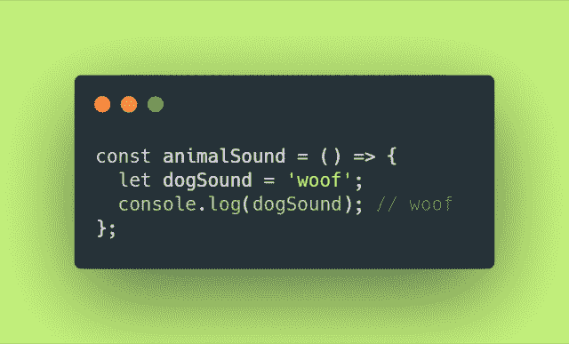
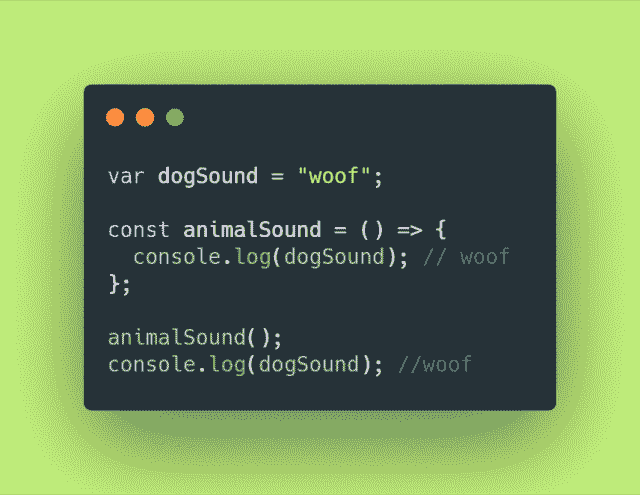
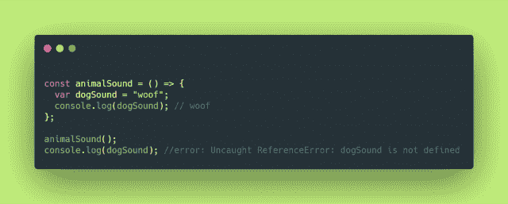
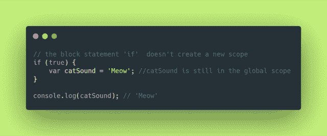
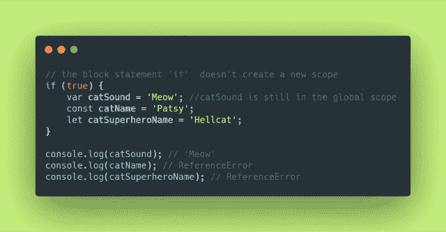

# JS 中的恐怖范围-全局、局部和块范围

> 原文：<https://dev.to/ale3oula/the-hor-r-o-r-scope-global-local-and-block-scope-in-js-37a1>

在编程中，变量的作用域决定了它的*生存期*。作用域描述了一个变量、一个函数或一个对象在运行时是否可以被程序的不同部分访问。在本文中，我们将看到一些例子来简要介绍 JavaScript 中的全局、局部和块作用域。

这些积木是什么？

在深入 JS 中存在的范围类别之前，我们必须首先定义什么是块。块是一组花括号{}内的一段代码，它将代码语句组合在一起。函数就是块的一个例子，如下所示:

**全局范围**

变量存在于块的内部或外部。如果变量在所有函数或花括号({})之外声明，它存在于**全局范围**中。全局变量可以被程序中的任何一行代码*访问，包括程序块内部。*

**局部范围**

与全局变量不同，局部变量只在声明它们的函数中可见。用 JavaScript 编写的每个函数都创建一个新的局部范围，在这个范围内声明的每个变量都是局部变量。这意味着同名的变量可以用在不同的函数中。但是，任何超出局部变量范围的引用都会导致引用错误:

**封锁范围**

到目前为止，我们已经看到了用 var 关键字定义的变量。Var 可以在全局或局部范围内声明变量。在块范围内声明的变量与局部变量相当。它们在它们所定义的块中是可用的。

局部作用域和块作用域的主要区别在于块语句(例如 if 条件或 for 循环)不会创建新的作用域。所以 var 关键字不会有影响，因为变量仍然在同一个范围内。

ES6 通过使用 let 和 const 关键字引入了块范围。这两个关键字的范围在定义的块内。

**为什么要界定范围？**

那么，为什么有作用域和限制变量的可见性呢？首先是安全原因。这些变量只有在需要时才可以访问。其次，作用域解决了名称空间冲突的问题，这种问题发生在同名但作用域不同的变量存在时。最后，它将节省代码中的内存，因为块变量将在块结束运行后停止存在。

**总结**

->只要应用程序在运行，全局变量就会一直存在。
- >只要函数在运行，局部变量就存在。
- > Block 语句不创建新的作用域，Block 作用域不适用于 var 关键字。
- > Const 和 Let 可以定义阻塞语句的范围。

参考资料:

[理解 JS 中的范围](https://scotch.io/tutorials/understanding-scope-in-javascript)

JavaScript:范围的基本指南

[Javascript 中的作用域](https://dev.to/murithi/scope-in-javascript-e5e)

[理解 JavaScript 中的变量、范围和提升](https://www.digitalocean.com/community/tutorials/understanding-variables-scope-hoisting-in-javascript)

[JavaScript 范围和闭包](https://css-tricks.com/javascript-scope-closures/)