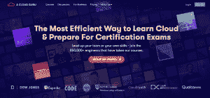
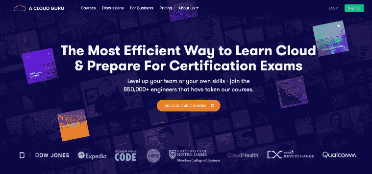
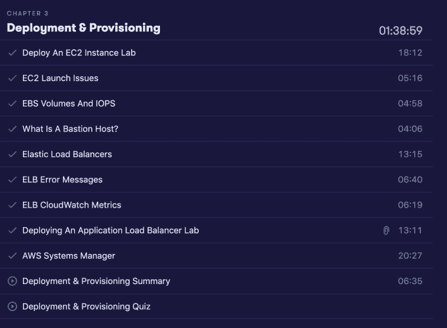

# AWS SysOps 考试准备。

> 原文：<https://dev.to/loujaybee/acloudguru-review-aws-sysops-exam-prep-189g>

你考虑过参加 AWS 认证吗？如果你有，你可能偶然发现了一个叫做 ACloudGuru 的学习平台？

很长一段时间以来，我一直在考虑参加考试，以帮助完成各种项目。但我最终还是找到了时间，目前我正在使用一个名为 ACloudGuru 的网站准备 AWS SysOps 管理员考试。

今天我想和你谈谈我使用 ACloudGuru 产品的一些初步印象以及我参加考试的动机。最后，我会给你一些关于整个过程的见解，以帮助你更好地理解参加 AWS 考试是否适合你，以及一个专家是否会有所帮助。

**今天，我将讲述:**

*   ACloudGuru 是什么(以及您为什么应该关注它)。
*   为什么你应该考虑 AWS 认证(或者至少，为什么我是)。
*   ACloudGuru 是什么样的(以及我的第一印象)。

## **什么是 ACloudGuru？**

首先，让我们快速地了解一下什么是云大师，以防你不熟悉。

ACloudGuru 是一个专注于云技术的在线学习平台。

ACloudGuru 有基于视频的在线课程，教授主要的云平台，如 AWS、GCP 和 Azure。它们涵盖不同的学科，例如:架构、大数据等。为了补充这些课程，他们有一个相当大的在线社区/论坛和许多支持资源，如关于各种云相关主题的视频和文章。

## **我为什么要参加 AWS 认证？**

好了，这就掩盖了什么是“云大师”,下一个问题是:何必呢？

首先，人们可能有很多原因想要参加认证(例如 AWS 认证)。但是我不会给你一大堆参加认证的理由，我会解释我自己的个人动机。而我就从剧透结局开始！

我参加 AWS 认证的主要原因是:**结构**(即学习)。

如果你已经是(或考虑成为)一名软件工程师，你会知道需要多少学习。作为软件工程师，我们在不断地学习。因此，这意味着我们如何有效地利用时间真的会有所不同。如果你和我一样，你会花时间学习。

… *但是*如果我们真的诚实，我们的学习可能(因为没有更好的词)相当随机。

经过几年零星的学习，看视频和阅读文章。我不禁觉得自己的一些知识有漏洞。我的想法是:如果我能经历一个更有条理的学习过程，我就能弥补一些知识缺口。最终，这将给我的工作生活带来更大的信心。

因此，通过参加 AWS 认证，我现在强迫自己从头开始。

## **ACloudGuru 点评**

好了——序言到此为止——让我们进入正题。

一个 CloudGuru 的好与坏(或者说我目前所经历的)。

### ACloudGuru 具体对于 AWS 认证有多好？

在我进入这个问题之前，我应该说 ACloudGuru 不仅仅涵盖 AWS。它们还包括:GCP、Azure 和其他工具，如[无服务器](https://thedevcoach.co.uk/restful-api-serverless-framework/)和 [Docker](https://thedevcoach.co.uk/containers-benefits-business-case/) 等。但是，因为我已经学习了他们的 AWS 课程，所以让我们来关注一下这个问题。

ACloudGuru 的一个很酷的地方是它是如何针对 AWS 考试的。我认为很大程度上从一开始一个云专家就以构建实用的云技能为中心。大多数课程都是*专门为帮助你通过不同的云考试而设计的*。他们甚至有一个准备指南:这基本上是一个元[课程](https://acloud.guru/learn/aws-certification-preparation)，教你关于 AWS 课程。

为了让事情变得更简单(除了重点课程之外), ACloudGuru 还有学习路径。学习路径基本上包括多个 AWS 考试和附加内容，所有这些都用一个漂亮的蝴蝶结绑在一起。他们有一个非常酷的概述页面，显示你的进展。这是 AWS 架构师的学习路线，我也大致遵循了这条路线——你好，甜蜜的结构，我多么爱你！

我觉得产品的重点是它最大的卖点之一。尤其是当你将 ACloudGuru 与其他平台如 [Pluralsight](https://www.pluralsight.com/) 相比较时。Pluralsight 的许多课程可能会让人不知所措，而且它缺乏 ACloudGuru 提供的关注点。这种专注的感觉也体现在授课的方式上。大部分内容是由一个小团队策划的，这使得整个体验感觉更有吸引力，而不是临床。有时候，在线学习平台会让人感觉像一个内容香肠工厂。

### acloud guru 课程是如何架构的？

好吧，我说过结构很重要。但是这里面有很多变量:内容是如何划分的？都是视频内容吗？手上多少钱？

每个视频都很短，有时少则几分钟，多则不超过二十分钟。短视频意味着你可以像在通勤的火车上一样看小视频或做笔记。对我来说，这也对跟踪我的进展产生了很大的影响(不会感到迷失)。ACloudGuru 提供了一些简洁的工具，向您展示您已经完成了多少，浏览一下概述页面并看到所有模块都被勾选是很好的。

## 该不该报名？

而且，就是这样！我真的只是想分享一些关于这个平台和我的经历，希望能让你有足够的好奇心去看看。也许将来当我试用其他平台时，我会做一个比较。一旦我考完试，我一定会回来写一篇文章，告诉你最后会怎样！到目前为止，我的体验似乎还不错。我已经把我学到的很多东西付诸实践了(这才是重点，对吧？)而且我很期待它的发展方向！

你上过网络课程吗？你的体验如何？T3】

* * *

ACloudGuru 评论:AWS SysOps 考试准备。最早出现在[的 Dev 蔻驰](https://www.thedevcoach.co.uk)上。

像您一样加入云原生软件工程师社区。

使用[thedevcoach.co.uk](https://thedevcoach.co.uk)了解最新的云技术，并学习核心云工程主题的基本技能，如:Docker。无服务器和 Linux，等等。[加入我们](https://thedevcoach.co.uk/newsletter)并取得成功！