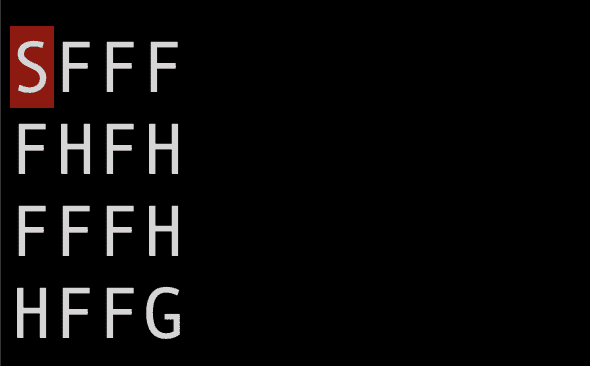
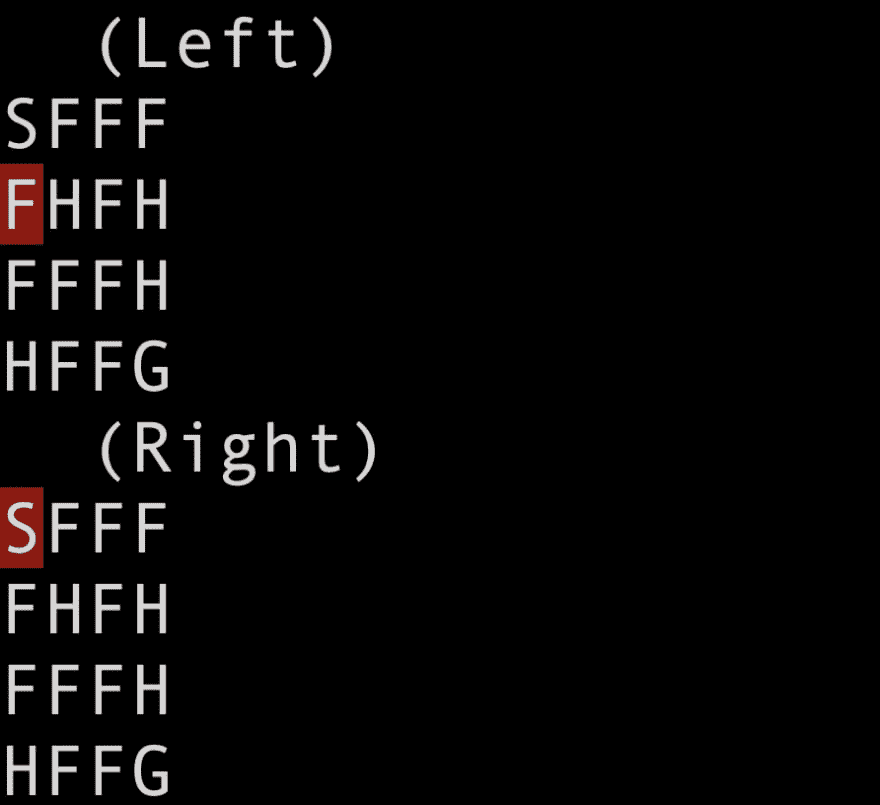
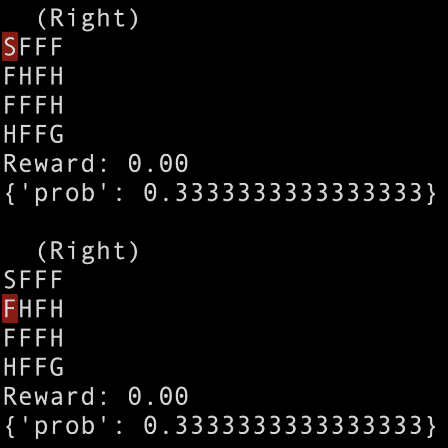
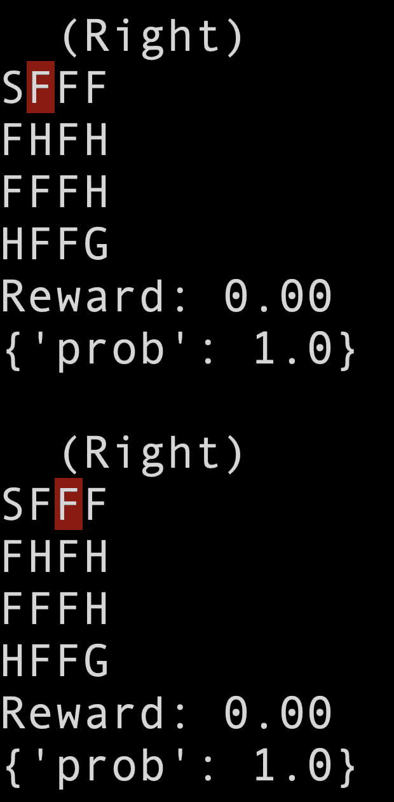

# 健身房教程:冰湖

> 原文：<https://dev.to/rodolfomendes/gym-tutorial-the-frozen-lake-45al>

在本文中，我们将学习如何使用[健身房库](https://gym.openai.com/)来创建和探索冰冻的湖泊环境，这是由 [OpenAI](https://openai.com/) 创建的用于强化学习实验的开源项目。Gym 库为环境定义了一个统一的接口，使得算法和环境之间的集成对于开发者来说更加容易。在许多现成的环境中，默认安装包括一个冰冻湖游戏的文本模式版本，在我们的上一篇文章中用作例子。

## 冰冻的湖泊环境

创建游戏的第一步是导入健身房库并创建环境。下面的代码显示了如何操作:

```
# frozen-lake-ex1.py
import gym # loading the Gym library

env = gym.make("FrozenLake-v0")
env.reset()                    
env.render()
```

第一条指令将 Gym 对象导入到我们当前的名称空间。下一行调用方法 *gym.make()* 来创建冰冻的湖泊环境，然后我们调用方法 *env.reset()* 将其置于初始状态。最后，我们调用方法 *env.render()* 来打印它的状态:

<figure>[](https://res.cloudinary.com/practicaldev/image/fetch/s--qb-mo4Bm--/c_limit%2Cf_auto%2Cfl_progressive%2Cq_auto%2Cw_880/https://launchyourintelligentapphome.files.wordpress.com/2019/06/screen-shot-2019-06-14-at-23.20.33.png) 

<figcaption>输出方法 env.render()</figcaption>

</figure>

因此，我们在[之前的帖子](/2019/06/09/introduction-reinforcement-learning-frozen-lake-example/)中看到的相同网格现在由字符矩阵表示。它们的含义如下:

*   **S** :初始状态
*   **F** :冰湖
*   **H** :孔
*   **G** :目标
*   **红色方块**:表示玩家当前的位置

此外，我们可以检查在环境中可能执行的操作，以及游戏的可能状态:

```
# frozen-lake-ex1.py

print("Action space: ", env.action_space)
print("Observation space: ", env.observation_space)
```

在上面的代码中，我们在控制台上打印了字段 *action_space* 和字段 *observation_space* 。返回的对象属于*离散*类型，它描述了一个大小为 n 的离散空间。例如，冰冻湖泊环境的 *action_space* 是一个具有 4 个值的离散空间，这意味着该空间的可能值为 0(零)、1、2 和 3。然而，*观察空间*是一个 16 个值的离散空间，从 0 到 15。此外，这些对象提供了一些实用方法，比如从空间中返回随机值的 *sample()* 方法。使用这种方法，我们可以很容易地创建一个虚拟代理来随机地玩游戏:

```
# frozen-lake-ex2.py
import gym

MAX_ITERATIONS = 10

env = gym.make("FrozenLake-v0")
env.reset()
env.render()
for i in range(MAX_ITERATIONS):
    random_action = env.action_space.sample()
    new_state, reward, done, info = env.step(
       random_action)
    env.render()
    if done:
        break
```

上面的代码使用来自 *action_space* 对象的 *sample()* 方法选择一个随机动作，最多执行游戏 10 次迭代。然后， *env.step()* 方法将该动作作为输入，在环境上执行该动作，并返回一个包含四个值的元组:

*   **新状态**:环境的新状态
*   **奖励**:奖励
*   **done** :指示返回状态是否为终止状态的布尔标志
*   **info** :具有用于调试目的的附加信息的对象

最后，我们使用方法 *env.render()* 在控制台上打印网格，并使用返回的“done”标志来中断循环。请注意，所选操作与网格一起打印:

<figure>[](https://res.cloudinary.com/practicaldev/image/fetch/s--E1lOfo6b--/c_limit%2Cf_auto%2Cfl_progressive%2Cq_auto%2Cw_880/https://launchyourintelligentapphome.files.wordpress.com/2019/06/screen-shot-2019-06-16-at-08.35.24.png) 

<figcaption>连续调用 env.render()方法输出，选择一个动作后执行</figcaption>

</figure>

## 随机与确定

请注意，在前面的输出中，玩家移动的方向与代理选择的方向不同。这种行为在冰冻的湖泊环境中是完全正常的，因为它模拟了光滑的表面。此外，这种行为代表了现实环境的一个重要特征:对于给定的动作，从一个状态到另一个状态的转换是随机的。例如，如果我们用弓箭射击，既有可能击中目标，也有可能错过。这两种可能性之间的分配将取决于我们的技能和其他因素，比如风向。由于这种概率性质，状态转换的最终结果并不完全取决于所采取的行动。

默认情况下，Gym 中提供的冰湖环境具有状态之间的概率转换。换句话说，即使我们的代理选择向一个方向移动，环境也可以向另一个方向移动:

```
# frozen-lake-ex3.py
import gym

actions = {
    'Left': 0,
    'Down': 1,
    'Right': 2, 
    'Up': 3
}

print('---- winning sequence ------ ')
winning_sequence = (2 * ['Right']) + (3 * ['Down'])
    + ['Right']
print(winning_sequence)

env = gym.make("FrozenLake-v0")
env.reset()
env.render()

for a in winning_sequence:
    new_state, reward, done, info = env.step(actions[a])
    print()
    env.render()
    print("Reward: {:.2f}".format(reward))
    print(info)
    if done:
        break   

print()
```

执行上面的代码，我们可以观察到每次执行的不同结果和路径。此外，使用 step 方法返回的 info 对象，我们可以检查环境用来选择执行的运动的概率:

<figure>[](https://res.cloudinary.com/practicaldev/image/fetch/s--t3-hKVXE--/c_limit%2Cf_auto%2Cfl_progressive%2Cq_auto%2Cw_880/https://launchyourintelligentapphome.files.wordpress.com/2019/06/screen-shot-2019-06-16-at-17.09.04.png) 

<figcaption>人物向所选方向以外的方向移动，概率为 0.3333...</figcaption>

</figure>

然而，冰湖环境也可以用于确定性模式。通过在创建环境时设置属性*is _ slick = False*，光滑表面被关闭，然后环境总是执行代理选择的动作:

```
# frozen-lake-ex4.py
env = gym.make("FrozenLake-v0", is_slippery=False)
```

注意 info 对象中返回的概率总是等于 1.0。

<figure>[](https://res.cloudinary.com/practicaldev/image/fetch/s--jHFf1eIg--/c_limit%2Cf_auto%2Cfl_progressive%2Cq_auto%2Cw_880/https://launchyourintelligentapphome.files.wordpress.com/2019/06/screen-shot-2019-06-16-at-17.16.35.png) 

<figcaption>在确定性模式下，代理总是在选定的方向上移动</figcaption>

</figure>

## 地图大小和自定义地图

默认的 4x4 地图并不是玩冰封湖游戏的唯一选择。此外，我们可以通过两种不同的方式创建 8x8 版本。第一种方法是为 8x8 地图使用特定的环境 id:

```
# frozen-lake-ex5.py
env = gym.make("FrozenLake8x8-v0")
env.reset()
env.render()
```

第二个选项是调用 make 方法，将值“8x8”作为参数传递给 map_name 参数:

```
# frozen-lake-ex5.py
env = gym.make('FrozenLake-v0', map_name='8x8')
env.reset()
env.render()
```

最后，我们可以创建冰封湖游戏的自定义地图，方法是将表示地图的字符串数组作为参数传递给参数 desc:

```
custom_map = [
    'SFFHF',
    'HFHFF',
    'HFFFH',
    'HHHFH',
    'HFFFG'
]

env = gym.make('FrozenLake-v0', desc=custom_map)
env.reset()
env.render()
```

## 结论

在这篇文章中，我们学习了如何使用健身房图书馆创建一个环境来训练强化学习代理。我们把注意力集中在冰湖环境上，这是一个规则简单的文本模式游戏，但它允许我们探索强化学习的基本概念。

## 参考

关于强化学习概念的简要介绍可以在[AI 如何学习玩游戏](/2019/06/03/how-ai-learns-play-games/)中找到。强化学习的冰湖游戏规则和基本概念可以在[强化学习简介:冰湖实例](/2019/06/09/introduction-reinforcement-learning-frozen-lake-example/)中找到。最后，你找到如何安装健身房环境的说明，查看帖子[如何安装健身房](/2019/05/24/how-to-install-openai-gym/)。

最后，这篇帖子的代码示例可以在[https://github . com/rodmsmendes/reinforcementlearning 4 fun/tree/master/gym-tutorial-frozen-lake](https://github.com/rodmsmendes/reinforcementlearning4fun/tree/master/gym-tutorial-frozen-lake)找到。

最初发表于[健身房教程:冰湖](https://reinforcementlearning4.fun/2019/06/16/gym-tutorial-frozen-lake/)