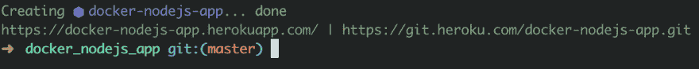
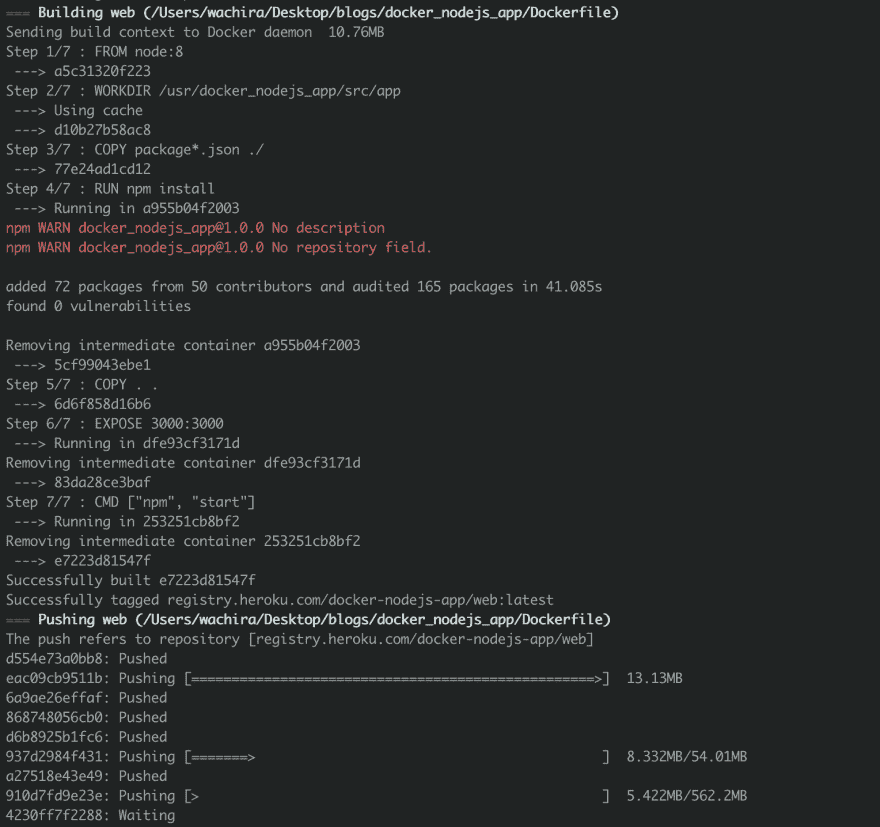
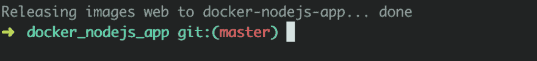

# 如何在 Heroku 上的 Docker 容器中托管您的节点应用程序

> 原文：<https://dev.to/wchr/how-to-host-your-node-app-in-a-docker-container-on-heroku-4ocd>

# 简介

这是 docker meets node.js 系列文章的第三部分

我们必须添加一个 mongo 数据库作为服务，也许你添加了几个端点来测试它，但整个应用程序都在本地运行，你可能想让全世界都有机会测试你的节点应用程序别担心，Werick 在这里。

在这一部分中，我们将在 Heroku 上托管我们的应用程序。

> **注意**:由于我们正在引入一个新的数据库服务，这样做也使我们的节点应用程序成为一个服务
> 
> **注意**:确保你看完了这个系列的[第一部](https://dev.to/tesh254/how-to-create-a-node-app-within-a-docker-container-2kip)和[第二部](https://dev.to/tesh254/how-to-create-a-node-app-within-a-docker-container-with-mongo-5886)。
> 
> **注**:记得在这里克隆`docker_nodejs_app`回购

# 为什么是 Heroku？

你可能会问自己，为什么我选择 Heroku 而不是 Digital Ocean、Linode、GCP 或 AWS...🤔原因是 Heroku 允许您快速启动和运行，并部署您的代码，而不用担心您的基础设施如何运行。

对于其他平台，您将被分配一个 CPU，您将在其中设置整个事情，包括安装软件、库、使用 SSH 保护您的服务器，这将消耗您的大部分时间，您只想托管您的简单快速服务器。

# 入门

足够好的推广让主持人做点什么。首先，你必须在 Heroku 上创建一个帐户

[](https://res.cloudinary.com/practicaldev/image/fetch/s--1UkW7hsv--/c_limit%2Cf_auto%2Cfl_progressive%2Cq_auto%2Cw_880/https://cdn.hashnode.com/res/hashnode/image/upload/v1560675760755/ALCpFLWup.png)

在 Heroku 上创建您的帐户后，您必须安装它的 CLI。Heroku CLI 使直接从终端创建和管理 Heroku 应用程序变得简单。这是使用 Heroku 的重要部分。

### Mac

要在 Mac 上安装 CLI，有两种方法:

*   [下载安装程序](https://cli-assets.heroku.com/heroku.pkg)
*   使用`homebrew` : * `bash $ brew tap heroku/brew && brew install heroku`

### 窗口

要在 Windows 上安装它，你只需要知道哪种型号能与你的电脑兼容，是 [`32-bit`](https://cli-assets.heroku.com/heroku-x86.exe) 还是 [`64-bit`](https://cli-assets.heroku.com/heroku-x64.exe)

### Ubuntu

对于 Ubuntu，你需要安装`snap` :

```
$ sudo snap install --classic heroku 
```

Enter fullscreen mode Exit fullscreen mode

## 让我们开始部署吧

要检查您是否成功地在全球范围内安装了它，请在您的终端中键入以下内容

```
$ heroku --version 
```

Enter fullscreen mode Exit fullscreen mode

到我们的节点应用程序所在的目录中。接下来，我们通过 CLI 登录 Heroku。

```
$ heroku login 
```

Enter fullscreen mode Exit fullscreen mode

按任意键登录，这将启动您的默认浏览器，您将成功登录并返回到您的终端。

您还需要登录到容器注册中心，基本上，这是 Heroku 提供的托管 docker 容器的服务。

```
$ heroku container:login 
```

Enter fullscreen mode Exit fullscreen mode

我们必须创建我们的 Heroku 应用程序，我们的代码将举行和建立。

```
$ heroku create docker-nodejs-app 
```

Enter fullscreen mode Exit fullscreen mode

你应该在你的终端
[](https://res.cloudinary.com/practicaldev/image/fetch/s--HM8tqV1T--/c_limit%2Cf_auto%2Cfl_progressive%2Cq_auto%2Cw_880/https://cdn.hashnode.com/res/hashnode/image/upload/v1560715411125/6TRfqbz3V.png) 上看到类似的东西

在构建和部署我们的应用程序之前，我们需要更改 Express 服务器运行的端口。默认端口是`3000`，但是当我们在 Heroku 上构建和部署我们的应用程序时，我们可能会得到一个关于我们的`PORT`已经被使用的错误，所以我们需要创建一个条件，如果 Heroku 不给我们一个端口，我们就使用默认的 3000。

将您设置端口默认值的行更改为:

```
app.set("port", process.env.PORT || 3000); 
```

Enter fullscreen mode Exit fullscreen mode

您的`app.js`文件应该看起来像这样

```
"use strict"; // Ensures our code is compiled in strict mode

// Lets import our web framework
var express = require("express");
var mongoose = require("mongoose");

// Initialise our app
const app = express();

// Lets set our port
/**
 * The default port number is `3000` if Heroku does not provide us a port
 * Take note on that as we will come to that.
 */
app.set("port", process.env.PORT || 3000);

// Connect to database
mongoose.connect("mongodb://mongo:27017/docker_nodejs_app", {
  useNewUrlParser: true,
  useCreateIndex: true
});

mongoose.connection.on("open", err => {
  if (err) console.log("Error connecting to our mongo database");
  console.log("Connected to mongo database successfully");
});

/**
 * To ensure works as it should we will create a
 * simple endpoint to return a json response
 */

// Define our json response
const data = {
  blog_name: "docker_nodejs_app",
  blog_author: "wachira (tesh254)",
  blog_author_twitter: "@wachira_dev"
};

// Define out GET request endpoint
app.get("/", (req, res) => {
  res.status(200).json(data);
});

// Initialize our server
app.listen(app.get("port"), () => {
  console.log(`Server listening on port ${app.get("port")}`);
}); 
```

Enter fullscreen mode Exit fullscreen mode

接下来，我们将从`build`我们的`image`和`push`到`Container Registry`T4】

```
$ heroku container:push web 
```

Enter fullscreen mode Exit fullscreen mode

您应该会在终端上看到类似的内容

[](https://res.cloudinary.com/practicaldev/image/fetch/s--ydengIq1--/c_limit%2Cf_auto%2Cfl_progressive%2Cq_auto%2Cw_880/https://cdn.hashnode.com/res/hashnode/image/upload/v1560715662523/VvcvksnB5.png)

**后台发生了什么？**

*   首先，我们的整个应用程序是根据`Dockerfile`和`docker-compose.yml`配置构建的。
*   Heroku CLI 通过`git`将我们的`built` `image`推送到我们的**创建的** `app`。

接下来，我们需要发布我们的应用程序，以便全世界都可以访问它。

```
$ heroku container:push web 
```

Enter fullscreen mode Exit fullscreen mode

这应该会出现在您的终端中

[](https://res.cloudinary.com/practicaldev/image/fetch/s--c7M9rlNI--/c_limit%2Cf_auto%2Cfl_progressive%2Cq_auto%2Cw_880/https://cdn.hashnode.com/res/hashnode/image/upload/v1560716666705/UW164w6ja.png)

您已成功在 Heroku 上部署了您的应用🎉🍾🎊🙌

# 总结

总结一下，在这篇精彩的文章中，我们有:

*   成功构建我们的应用并将其部署到 Heroku

# 接下来

在下一部分:

*   把我们的回购推送到码头仓库。

*   Docker 中的其他命令将使您的体验物有所值，例如:

    *   清除容器缓存
    *   删除，停止 Docker 容器

# 加贺

*   指向 repo 的链接[https://github . com/werickblog/docker _ nodejs _ app](https://github.com/werickblog/docker_nodejs_app)

*   链接到应用程序[https://docker-nodejs-app.herokuapp.com/](https://docker-nodejs-app.herokuapp.com/)

*   链接到 https://nodejs.org/en/download/的下载节点

*   链接下载 Docker[https://www.docker.com/get-started](https://www.docker.com/get-started)

*   了解什么是码头工人[https://docs.docker.com/engine/docker-overview/](https://docs.docker.com/engine/docker-overview/)