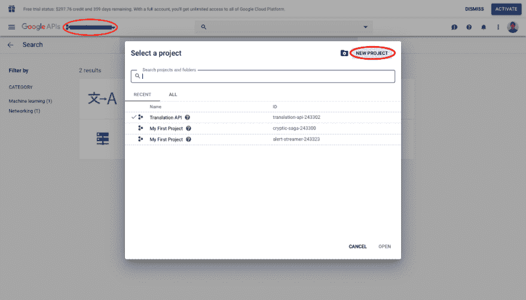
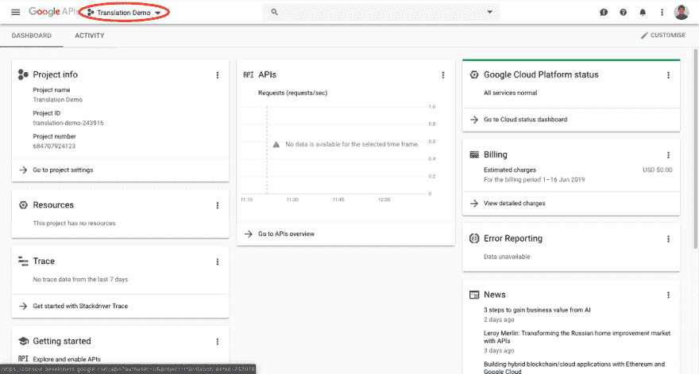
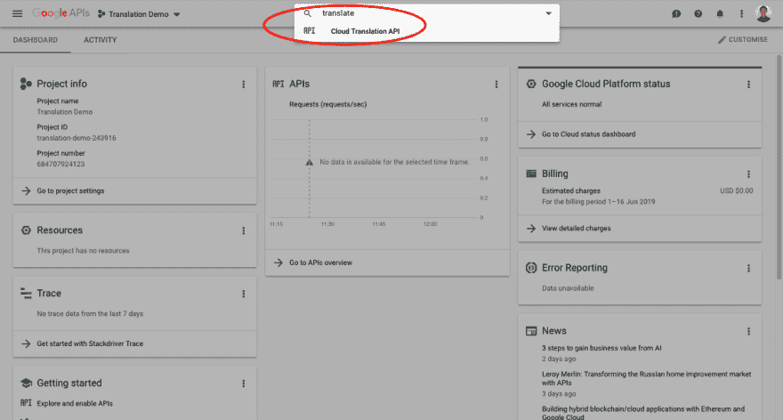
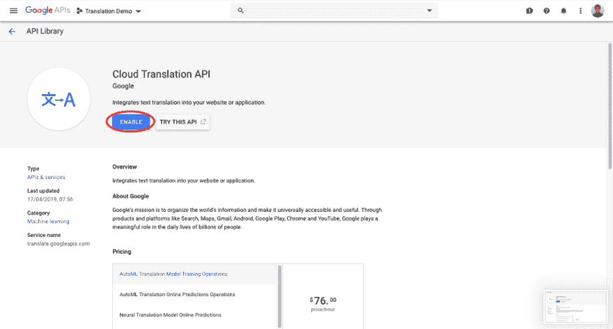
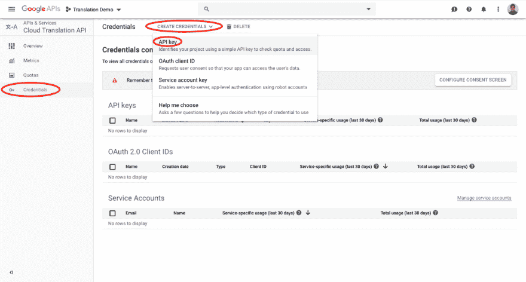

# 如何使用谷歌翻译 API

> 原文：<https://dev.to/robghchen/how-to-use-google-translate-api-27l9>

一个简单的后续教程

先决条件:本教程将需要 [React.js](http://reactjs.org/) 的知识。

[](https://medium.com/@robghchen/how-to-use-google-translate-api-e42e5eb380fb?source=rss-1a2b6738cba4------2)

我们将使用 [google-translate](https://www.npmjs.com/package/google-translate) 库来帮助您的应用程序与 Google Translate API 连接，该库还提供了启动翻译的方法。为了方便用户，我们还将使用 [react-cookies](https://www.npmjs.com/package/react-cookies) 库在浏览器中存储用户选择的语言，并且我们将在 cookie 中存储一些翻译的文本，这样用户每次加载应用程序时就不必重新翻译相同的句子(你必须为每次翻译付费，尽量避免多余的翻译)。

1)让我们开始吧，在终端:

```
create-react-app google-translate-demo
cd google-translate-demo
npm i google-translate
npm i react-cookies 
```

<svg width="20px" height="20px" viewBox="0 0 24 24" class="highlight-action crayons-icon highlight-action--fullscreen-on"><title>Enter fullscreen mode</title></svg> <svg width="20px" height="20px" viewBox="0 0 24 24" class="highlight-action crayons-icon highlight-action--fullscreen-off"><title>Exit fullscreen mode</title></svg>

2)准备好创建您的 API 密钥并隐藏该密钥，以便它不会被推送到互联网上。在终端:

```
touch .env
open .env 
```

<svg width="20px" height="20px" viewBox="0 0 24 24" class="highlight-action crayons-icon highlight-action--fullscreen-on"><title>Enter fullscreen mode</title></svg> <svg width="20px" height="20px" viewBox="0 0 24 24" class="highlight-action crayons-icon highlight-action--fullscreen-off"><title>Exit fullscreen mode</title></svg>

3)使用您的 Gmail 登录 [Google API 控制台](https://accounts.google.com/signin/v2/identifier?service=cloudconsole&passive=1209600&osid=1&continue=https%3A%2F%2Fconsole.developers.google.com%2Fapis%2Fdashboard%3Fauthuser%3D3%26project%3Dtranslation-api-243302&followup=https%3A%2F%2Fconsole.developers.google.com%2Fapis%2Fdashboard%3Fauthuser%3D3%26project%3Dtranslation-api-243302&flowName=GlifWebSignIn&flowEntry=ServiceLogin)，然后创建您的 API 密钥:

[](https://res.cloudinary.com/practicaldev/image/fetch/s--OAQiysDY--/c_limit%2Cf_auto%2Cfl_progressive%2Cq_auto%2Cw_880/https://cdn-images-1.medium.com/max/1200/1%2AdN_aI4p-2Fl9VUNONBI3bg.png)

[](https://res.cloudinary.com/practicaldev/image/fetch/s--ZNdn1Bo5--/c_limit%2Cf_auto%2Cfl_progressive%2Cq_auto%2Cw_880/https://cdn-images-1.medium.com/max/800/1%2AnLLOQP6sI6TZFaw8fhqnhw.png)

[](https://res.cloudinary.com/practicaldev/image/fetch/s--98WlxW7e--/c_limit%2Cf_auto%2Cfl_progressive%2Cq_auto%2Cw_880/https://cdn-images-1.medium.com/max/1200/1%2AOe_rhdEZmLURn5jIug7TMQ.png)

[](https://res.cloudinary.com/practicaldev/image/fetch/s--QjWHjTP7--/c_limit%2Cf_auto%2Cfl_progressive%2Cq_auto%2Cw_880/https://cdn-images-1.medium.com/max/1200/1%2Az7uYiI-P00RkjIrgvj1pqw.png)

[](https://res.cloudinary.com/practicaldev/image/fetch/s--LEl9gM3L--/c_limit%2Cf_auto%2Cfl_progressive%2Cq_auto%2Cw_880/https://cdn-images-1.medium.com/max/1200/1%2AC156oWwlWy9eXba4FRZaiQ.png)

[](https://res.cloudinary.com/practicaldev/image/fetch/s--TmNs3xFa--/c_limit%2Cf_auto%2Cfl_progressive%2Cq_auto%2Cw_880/https://cdn-images-1.medium.com/max/1200/1%2AnRPB2gbG03Zrt5OJE5nbpg.png)

4)创建密钥后，**不要**与任何人分享，并且**绝对不要**将该密钥推送到 GitHub 或在线的任何地方。使用该密钥产生的任何费用都将从您的账户中扣除。我认识一个人，他认识一个欠亚马逊 5 万美元+的人，因为他在不知情的情况下把他的钥匙推到 GitHub 上才 3 天，有人就拿着他的钥匙去疯狂购物了。也就是说，现在我将向您展示如何安全地使用和保护您的密钥。

5)在终端:

```
open .gitignore 
```

<svg width="20px" height="20px" viewBox="0 0 24 24" class="highlight-action crayons-icon highlight-action--fullscreen-on"><title>Enter fullscreen mode</title></svg> <svg width="20px" height="20px" viewBox="0 0 24 24" class="highlight-action crayons-icon highlight-action--fullscreen-off"><title>Exit fullscreen mode</title></svg>

6)将`.env`添加到第 25 行，这告诉 GitHub 忽略在线推送您的`.env`文件。