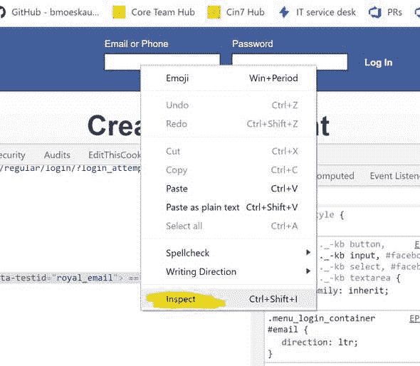
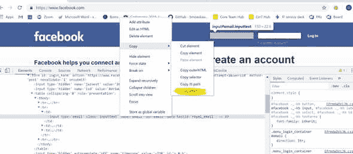
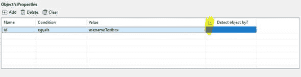
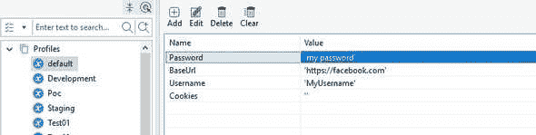
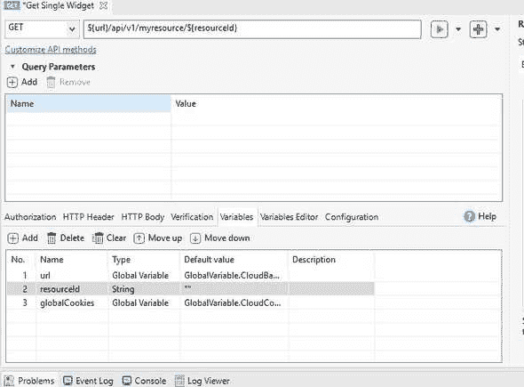
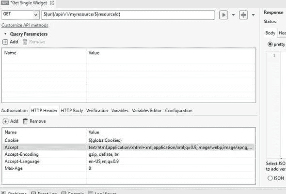
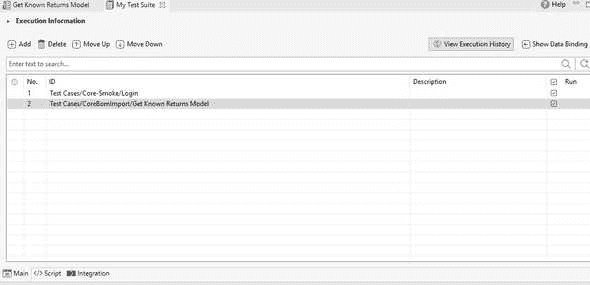

# 如何在 Katalon API 集成测试中使用会话 cookie 认证

> 原文：<https://dev.to/darraghor/how-to-use-session-cookie-authentication-for-katalon-api-integration-tests-gpc>

这篇文章描述了在 Katalon 中自动登录网页获取会话 cookie，然后使用 cookie 进行 API 认证。它展示了如何通过一个全局变量传递 cookie 来进行经过身份验证的 API 调用。

如果您的 API 没有基本的 HTTP 或 OAuth 之类的通用认证系统，这将非常有用。这种技术也可以用于在测试套件中的测试之间传递任何类型的值。

我们将登录常规网站。我们将把 cookies 复制到一个全局变量中。我们将在后续的 API 测试案例中重用这些 cookies。

我们需要创建一个新的浏览器驱动的测试来获得认证 cookie，但是首先我们需要测试用例将使用的对象。

## 创建你需要的对象

首先为每个需要交互的元素创建一个对象。您可能需要用户名文本框、密码文本框和表单本身来提交它。

您将需要为每一个不同的对象。要创建新对象，请使用 Katalon 中的“文件>新建>测试对象”。Katalon 需要知道如何在你的网页上找到对象。你至少可以用两种不同的方法做到这一点。

第一种是通过提供 XPath。XPath 描述元素在 html 文档中的位置。要轻松获得 XPath，您可以使用 web 浏览器。

## 标识一个元素的 XPath

在 Chrome 中，右击元素，选择“检查元素”。这将在 Chrome 中打开开发者控制台，并高亮显示该元素。

[](///static/65bc7c6ba6e0ee8f6b9ceff8afc8d96a/cc6fe/how_to_inspect.jpg)

右键单击突出显示的元素并选择“复制>复制 XPath”。Chrome 会为你挑选最优化的 XPath。然后，您可以将它复制到 Katalon 中的 Path 框中。

[](///static/30598060cf347d99e86de40058a5af89/5313b/copy_x_path.jpg)

*注意:如果元素没有 id，并且在动态页面上，那么 XPath 可能不起作用。*

对于用户名登录文本框，它几乎肯定有一个 id。如果 Chrome 选择的 XPath 不能很好地工作，在 Google 上阅读更多关于 XPath 的信息，找到更好的 XPath。

## 使用一个 ID 来检测元素

帮助 Katalon 找到元素的第二种方法是指定一个惟一的属性，如“id ”,并告诉 Katalon 使用这个属性来检测页面上的元素。

[](///static/6ea6260cd66b8ff7db05138445c7c1ec/222d5/set_use_to_detect_if_attribute.jpg)

对其他元素重复这个过程——表单本身和密码文本框。

## 创建你需要的全局变量

您必须创建我们需要填充用户名和密码以及存储 cookie 字符串的全局变量。在本例中，我们将把它们放在默认配置文件中。

打开配置文件配置并选择“默认”。为“BaseUrl”、“用户名”、“密码”和“Cookies”添加全局变量。

[](///static/592ce60f2bc28336dd65fc7de861962b/bc5dc/setting_up_variables.jpg)

## 创建驱动浏览器的测试用例并获取 cookie

好了，现在我们准备添加一个测试用例来执行登录，并将我们的 cookies 复制到全局变量中。

使用“文件>新建>测试用例”在 Katalon 中添加一个新的测试用例。

在测试用例中，在脚本输入界面中添加以下脚本。请看评论中的解释。

```
// importing some libraries we need
import static com.kms.katalon.core.checkpoint.CheckpointFactory.findCheckpoint
import static com.kms.katalon.core.testcase.TestCaseFactory.findTestCase
import static com.kms.katalon.core.testdata.TestDataFactory.findTestData
import static com.kms.katalon.core.testobject.ObjectRepository.findTestObject
import com.kms.katalon.core.checkpoint.Checkpoint as Checkpoint
import com.kms.katalon.core.cucumber.keyword.CucumberBuiltinKeywords as CucumberKW
import com.kms.katalon.core.mobile.keyword.MobileBuiltInKeywords as Mobile
import com.kms.katalon.core.model.FailureHandling as FailureHandling
import com.kms.katalon.core.testcase.TestCase as TestCase
import com.kms.katalon.core.testdata.TestData as TestData
import com.kms.katalon.core.testobject.TestObject as TestObject
import com.kms.katalon.core.webservice.keyword.WSBuiltInKeywords as WS
import com.kms.katalon.core.webui.keyword.WebUiBuiltInKeywords as WebUI
import internal.GlobalVariable as GlobalVariable
import com.kms.katalon.core.webui.driver.DriverFactory as DriverFactory
import org.openqa.selenium.WebDriver as WebDriver
import org.openqa.selenium.Cookie as Cookie
// open the default web browser at the base url provided
WebUI.openBrowser(GlobalVariable.BaseUrl)
// find the LoginEmail test object and set the text in it to the value in the global variable called "Username"
WebUI.setText(findTestObject('LoginAndSelectCompany/LoginEmail'), GlobalVariable.Username)
// find the LoginPassword test object and set the text in it to the value in the global variable called "Password"
WebUI.setMaskedText(findTestObject('LoginAndSelectCompany/LoginPassword'), GlobalVariable.Password)
// find the form object and submit it
WebUI.submit(findTestObject('LoginAndSelectCompany/LoginForm'))
// wait for the response (if it doesnt load then stop the test and fail)
WebUI.waitForPageLoad(5, FailureHandling.STOP_ON_FAILURE)
// assert that the title of the page returned is what we would expect
titleWindow = WebUI.getWindowTitle()

WebUI.verifyMatch(titleWindow, 'My Site | Homepage', false)
// get a reference to the web driver
WebDriver driver = DriverFactory.getWebDriver()
// create a temp variable to store the cookies
String cookieString = ''
// get all the cookies
Set<Cookie> cookieCollection = driver.manage().getCookies()
// a list of the cookies we want to use in our API calls later (these will get copied) ** must match EXACTLY
def interestingCookies = ['ASP.NETSession', '.AspNetCookies']
// loop through each cookie and append COOKIENAME=COOKIEVALUE; to the temp variable
for (Cookie currentCookie : cookieCollection) {
    if (interestingCookies.contains(currentCookie.getName())) {
        cookieString += (((currentCookie.getName() + '=') + currentCookie.getValue()) + '; ')
    }
}
// print the cookies for debugging
println(cookieString)
// set the cookies to our global variable. This is the most important bit!
GlobalVariable.CloudCookies = cookieString
// done! close the browser
WebUI.closeBrowser() 
```

Enter fullscreen mode Exit fullscreen mode

## 创建使用 cookie 的 API 对象

现在我们需要在 API 定义中使用 cookie 变量。

使用“文件>新建> Web 服务请求”创建一个新的 API 定义。这些将在对象文件夹中创建。

在创建的 Web 服务请求中，您必须在顶部设置 URL 和方法。在给出的例子中，我使用了形式为`${url}`的变量作为基础来创建完整的 url。我还使用一个变量`${resourceId}`来设置要获取的资源的 id。但是这些是从哪里来的？

## 创建局部变量

在 web 服务请求中，您可以创建可在请求中的任何位置使用的变量来替换文本。这包括设置标题和 URL。

[](///static/002efef8beffb7412e6478b42eb5ed75/9eebb/get_single_setting_variables.jpg)

你可以选择从哪里获取数据来填充这些变量，包括全局变量或每个测试用例的集合。如下例所示创建变量。

当您选择“全局变量”类型时，Katalon 将为您提供您之前创建的全局变量的选择。“字符串”类型变量可以在使用 Web 服务请求对象的测试用例中设置。

## 使用变量设置 API 请求头

现在，我们已经创建了变量，并选择了我们希望如何填充它们，我们可以为 API 请求创建所需的 cookie 头了。

[](///static/d93eec2fd3769f029cbecf7c67215bbd/98078/get_single_setting_headers.jpg)

请注意，使用的变量名是局部变量名，而不是全局变量名。

## 在测试用例中使用 API 请求

现在我们将使用 Web 请求对象。

创建一个新的测试用例“文件>新建>测试用例”。

将以下脚本添加到脚本输入区域。

```
import static com.kms.katalon.core.checkpoint.CheckpointFactory.findCheckpoint
import static com.kms.katalon.core.testcase.TestCaseFactory.findTestCase
import static com.kms.katalon.core.testdata.TestDataFactory.findTestData
import static com.kms.katalon.core.testobject.ObjectRepository.findTestObject
import com.kms.katalon.core.checkpoint.Checkpoint as Checkpoint
import com.kms.katalon.core.cucumber.keyword.CucumberBuiltinKeywords as CucumberKW
import com.kms.katalon.core.mobile.keyword.MobileBuiltInKeywords as Mobile
import com.kms.katalon.core.model.FailureHandling as FailureHandling
import com.kms.katalon.core.testcase.TestCase as TestCase
import com.kms.katalon.core.testdata.TestData as TestData
import com.kms.katalon.core.testobject.TestObject as TestObject
import com.kms.katalon.core.webservice.keyword.WSBuiltInKeywords as WS
import com.kms.katalon.core.webui.keyword.WebUiBuiltInKeywords as WebUI
import internal.GlobalVariable as GlobalVariable
// use the Web Request object we created earlier, pass it an id of a resource and set the cookies using the global variable.
response = WS.sendRequest(findTestObject('Get Single Widget', [('url') : GlobalVariable.BaseUrl, ('resourceId') : 'knownResourceId'
            , ('globalCookies') : GlobalVariable.Cookies]))
// assert that we get a 200 response
WS.verifyResponseStatusCode(response, 200, FailureHandling.STOP_ON_FAILURE)
// assert that we have expected data (customise for your own data)
WS.verifyElementsCount(response, 'data', 4, FailureHandling.STOP_ON_FAILURE)
// assert that we have no errors (customise for your own response)
WS.verifyElementsCount(response, 'errors', 0, FailureHandling.STOP_ON_FAILURE) 
```

Enter fullscreen mode Exit fullscreen mode

## 在测试套件中使用登录测试用例和 api 测试用例

创建一个新的测试套件。使用“文件>新建>测试套件”

添加登录测试用例以及获取 Api 测试用例。

[](///static/ee34375606bd6a82fabc81832bbfb390/54254/create_test_suite.jpg)

选择 Chrome 作为默认浏览器，点击“运行”或“播放”按钮

*注意:全局变量的设置只限于一个测试套件，所以您必须在您创建的每个测试套件开始时登录。*