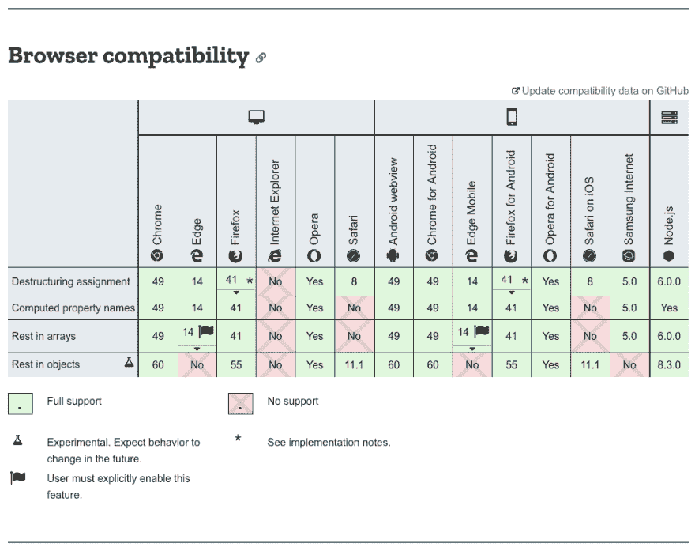

# 像专家一样解构 JavaScript 对象

> 原文：<https://dev.to/willamesoares/destructuring-javascript-objects-like-a-pro-17bg>

你好。

很长一段时间以来，我一直想记下我目前在工作中使用的关于 JavaScript 中析构概念的一些技巧。我觉得，一旦我停止频繁使用，我每天学习和使用的大部分东西都会消失。因此，我决定把这些事情写下来，这样即使我没有每天看着它们，我也能长久地记住它们。我在初中和高中的时候经常这样做，但在我开始上大学后就停止了，现在我感觉到了后果，特别是考虑到我的记忆力很差。

对于那些不熟悉 JavaScript 中析构概念的人来说，下面是对它的一个简要概述。如果你谷歌一下，也有很多关于它的帖子，所以如果对你来说太简短或不够清楚，请随意寻找更多的内容；)

人们并不总是在 JavaScript 中使用析构，这一概念是在 2015 年 6 月与其他一些功能一起引入该语言的，构成了该语言的第 6 版，即众所周知的 ES6 或 ES2015(请查看 [this](https://www.ecma-international.org/ecma-262/6.0/#sec-destructuring-assignment) 以供参考)。
这个想法基本上是允许基于对象属性或数组值以更漂亮的方式分配变量。如果你认为它是构造某物的相反的想法，它确实是，你会得到对象被“分解”成碎片，直到你找到你想要的值，然后用它来创建一个变量。

检查下面的代码，它显示了创建一个变量的方法之一，假设你不知道析构的存在，这个变量应该包含在一个对象中。

<small>*注意`classs`在整个文本中是这样写的，以避免与关键词`class`冲突。*</small>

```
const homoSapiens = {
  kingdom: 'Animalia',
  classs: 'Mammalia',
  family: 'Hominidae',
  genus: 'Homo',
  species: 'H. sapiens'
}

const homoSapiensFamily = homoSapiens.family;

// and if you want to be certain of the type of the variable, you would
// set a default value for it in case the `family` property does not 
// exist in the source object
const safeHomoSapiensFamily = homoSapiens.family || ''; 
```

Enter fullscreen mode Exit fullscreen mode

你可以看到，你必须为你想在对象中使用的每个属性做同样的事情，这并不是一件很痛苦的事情，但是当我们可以利用析构的能力来创建变量并确定它们的类型时，我们为什么要这样做呢？下面是一个使用析构来完成同样任务的代码片段。

```
const { family = '', species = '' } = homoSapiens; 
```

Enter fullscreen mode Exit fullscreen mode

这里我们基于源对象中同名的属性创建了两个变量`family`和`species`。我们还要确保它们是字符串，即使这两个属性不包含在对象中。

你可能会说，如果单独看的话，`family`和`species`并不是真正有意义的变量名。析构还允许我们指定我们想要的变量名(别名),而不是使用对象中的属性名。

```
const {
  family: homoSapiensFamily = '',
  species: homoSapiensSpecies = ''
} = homoSapiens; 
```

Enter fullscreen mode Exit fullscreen mode

这里我们使用和以前一样的值，但是现在我们创建两个变量叫做`homoSapiensFamily`和`homoSapiensSpecies`。更有意义，对吗？

如果你现在已经有了这个想法，我相信你已经注意到你可以为之疯狂，并且析构真正的嵌套对象。

```
const homoSapiens = {
  classs: {
    name: 'Mammalia',
    super: {
      name: 'Tetrapoda'
    },
    sub: {
      name: 'Theria'
    }
  },
  species: 'H. sapiens'
};

const {
  classs: {
    super: {
      name: homoSapiensSuperClass = ''
    }
  }
} = homoSapiens; 
```

Enter fullscreen mode Exit fullscreen mode

这里我们创建了一个名为`homoSapiensSuperClass`的变量，它的值为`Tetrapoda`。

如果我们试图析构一个嵌套对象，而在某个时候我们指定的属性并不存在，该怎么办？

```
// considering the previous homoSapiens object

const {
  classs: {
    infra: {
      name: homoSapiensInfraClass = ''
    }
  }
} = homoSapiens; 
```

Enter fullscreen mode Exit fullscreen mode

如果你尝试这样做，你会看到我们得到一个错误消息:

```
Uncaught TypeError: Cannot destructure property `name` of 'undefined' or 'null'. 
```

Enter fullscreen mode Exit fullscreen mode

发生这种情况是因为在源对象中，`classs`对象下并没有一个名为`infra`的对象。因此，`homoSapiensInfraClass`变量从未被定义过。

为了避免这种情况，你可以在析构一个对象时为你所经历的每个属性设置一个默认值。在这种特定情况下，您可能希望确保那个`infra`属性的默认值是一个对象，这样您就可以在该属性不存在的情况下继续析构它。

```
const {
  classs: {
    infra: {
      name: homoSapiensInfraClass = ''
    } = {}
  } = {}
} = homoSapiens; 
```

Enter fullscreen mode Exit fullscreen mode

这样，即使`homoSapiens`对象不包含一个名为`infra`的属性，你仍将最终定义一个名为`homoSapiensInfraClass`的变量，该变量将接收你设置的默认值，或者如果你没有为它设置默认值，则为`undefined`。

### 同样适用于数组！

这个想法和数组基本上是一样的，除了语法有点不同之外，不同之处在于你不能考虑属性名，而是根据数组中项目的顺序来做事情。

```
const [first, second ] = ['a', 'b'];
// first will be 'a' and second will be 'b'

// you can also set default values
const [safeFirst = 'a', safeSecond = 'b'] = ['a']
// safeSecond here will have a value of 'b' 
```

Enter fullscreen mode Exit fullscreen mode

### 在函数签名中也有效！

您还可以在函数签名中进行析构，以便只将接收到的对象的特定属性公开给函数上下文。

```
const homoSapiens = {
  kingdom: 'Animalia',
  classs: 'Mammalia',
  family: 'Hominidae',
  genus: 'Homo',
  species: 'H. sapiens'
}

function logSpeciesInfo ({ species = '', kingdom = '', classs = '' }) {
  console.log(`The species ${species} belongs to the ${kingdom} kingdom and ${classs} class.' );
}

logSpeciesInfo(homoSapiens);
// Logs "The species H. sapiens belongs to the Animalia kingdom and Mammalia class." 
```

Enter fullscreen mode Exit fullscreen mode

函数体中不存在函数头中未指定的对象的任何其他属性。

## 我可以到处做析构吗？

MDN web docs 的[析构赋值](https://developer.mozilla.org/en-US/docs/Web/JavaScript/Reference/Operators/Destructuring_assignment)页面中有一个非常酷的表格，显示了这种语法的当前浏览器兼容性。你可以看到它得到了广泛的支持，所以兼容性对你来说不是问题，除非...IE 是你的东西:)

[](https://res.cloudinary.com/practicaldev/image/fetch/s--2IHNajDB--/c_limit%2Cf_auto%2Cfl_progressive%2Cq_auto%2Cw_880/https://i.imgur.com/bHeYv00.png)

## 小测验

根据你在这篇文章中学到的知识，你能够使用析构的能力来交换两个变量的值而不使用任何额外的变量吗？*看评论前先试*；)

请在评论中告诉我！如果你有任何其他关于析构的用例，也一定要分享出来，:D

感谢阅读！