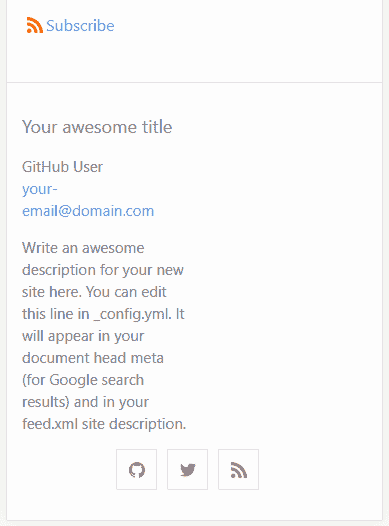
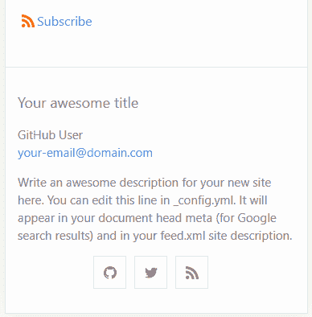

# 您的第一个开源拉取请求:演练

> 原文：<https://dev.to/healeycodes/your-first-open-source-pull-request-a-walkthrough-1omf>

“你应该为开源做出贡献。”⁠—互联网。

也许你见过这个建议。要么来自那些相信自由软件的人——要么作为一个帮助求职的建议。许多人(包括我的一些学员)报告说 GitHub 很可怕。与他们参与的任何团队项目相比，那里的项目都是巨大的。从事这些项目的人都是非常严肃的人。

这是真的，这不是真的。真的没有什么可担心的。我们来谈谈涉及到的内容。我将用我昨天对哲基尔的小小贡献作为例子。有[很多](https://www.firsttimersonly.com/)资源可以找到首次问题，但是这些指南遗漏了一些步骤。

## 发现问题

与快速完成一个你从未听说过的项目相比，在你每天使用的软件中找到(或记住)一个 bug 要容易得多。我们以哲基尔的极简主题为例。很久以前，我希望我的网站看起来不一样，但是我没有时间从头开始写一个主题——所以我已经在这个主题上花了一段时间了。

我就是这样发现这个 bug 的。我进入开发者工具(F12)并将视图大小设置为 *iPhone 5/SE* ，这在现代标准下相对较小，以测试我网站的一个页面。一些开发者不会考虑这种尺寸的设备(但他们应该考虑)。我发现响应页脚显示不正确。不是两个堆叠的柱子，而是两个柱子，一个是空的。

起初，我认为这一定是我的一些黑客行为造成的。所以我去了[杰基尔/迷你](https://jekyll.github.io/minima/)库仔细检查现场演示页面。我发现了同样的问题(注:这个问题现在在 master 上修复了)。这个问题是一个错误的类，它没有做出响应。(我是通过修补一些开发工具发现这一点的)。

它需要一个[媒体询问](https://developer.mozilla.org/en-US/docs/Web/CSS/Media_Queries/Using_media_queries)。媒体查询是我们的网站根据设备设置(如分辨率)改变样式的方式。**你不需要了解你正在修复的项目背后的整个技术体系**。例如，我没怎么用过 Sass，但我知道它的 CSS 变量系统。我四处寻找一个已经在使用的断点变量，它补充了所有大小的页脚列。我选择了`$on-large`——解决了这个问题。

## 分叉树枝

查看投稿指南。这比我能给你的任何建议都重要。对于 jekyll/minima 来说，[指南](https://github.com/jekyll/minima#contributing)非常简单:“欢迎 Bug 报告和 pull 请求”，以及行为准则的链接。它还应该告诉您将您的更改发送到哪个分支。

jekyll/minima 是在`master`开发的，但是通常会有一个 staging 分支供你分叉。在浏览器中打开 GitHub 库，点击 *Fork* 按钮，然后将分支克隆到你的计算机上。社区建议学习 git 交互的命令行工具，但是 [GitHub 桌面](https://desktop.github.com)客户端也工作得很好。如果有测试套件，在改变任何东西之前运行测试，以确保您的环境是稳定的。

## 创建一个拉式请求

进行更改并[编写一个好的提交消息](https://github.com/erlang/otp/wiki/writing-good-commit-messages)。我的是“修复较小视图尺寸的页脚堆叠问题”。把变化推到你的叉子上。有很多方法可以通过命令行创建一个拉请求，但是我访问了我的 fork 的存储库，点击了文件列表右上角的*拉请求*按钮。

我一直认为写一个拉请求和代码一样重要。如果你的团队成员不能在高层次上理解提议的改变，那么他们就不能成功地评论它。这意味着您的拉取请求可能会被拒绝(或者在不应该被接受的时候被接受)。对于 bug，我描述 bug，如果合适的话包括一个图片，然后解释需要做什么改变来修复它。如果有重要的、技术性的实现细节，我会把它们放在最后。

也许最后看一下投稿指南(如果你找不到，请勾选`CONTRIBUTING.md`),然后就该提交了。检查读取、评论和合并 pull 请求的频率。确保你明白需要多长时间才能得到回复，这样才能达到你的期望。(对于我的[小修罗](https://github.com/jekyll/minima/pull/379)来说还不到一天)。

## 处理批评

你可能想要勾选*允许来自维护者的编辑*以使小的风格改变更容易发生。一位 GitHub 用户感谢我的改变，并看到在我工作的领域有进一步的修正。我看了一下，但无法对额外的修复提出一个清晰的解决方案。对于额外的修复，需要一个小的架构重组，我没有时间进一步研究代码库。基本上，说不是没问题的——我们都在自愿贡献我们的时间。

把你自己和你的拉取请求分开。你的代码不代表*你*。例如，您可能不熟悉项目中其他地方使用的设计模式。最糟糕的事情是有人建议你再试一次。你会对开源社区中人们的乐于助人和热情好客感到震惊。

我们希望你成功！如果你正经历拉请求焦虑，在我的一个[玩具项目](https://github.com/healeycodes)上抛出一行变化。我会微笑着迎接你😊。

* * *

加入我的关于编程和个人成长的[时事通讯](https://buttondown.email/healeycodes)的 150 多人注册！

我发关于科技的微博。