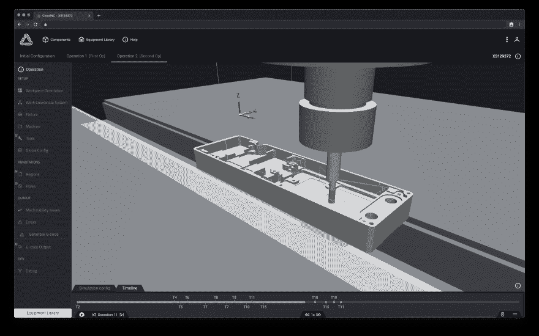
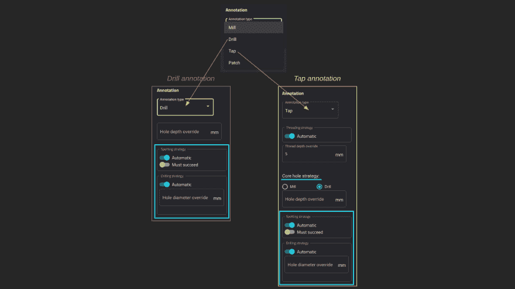
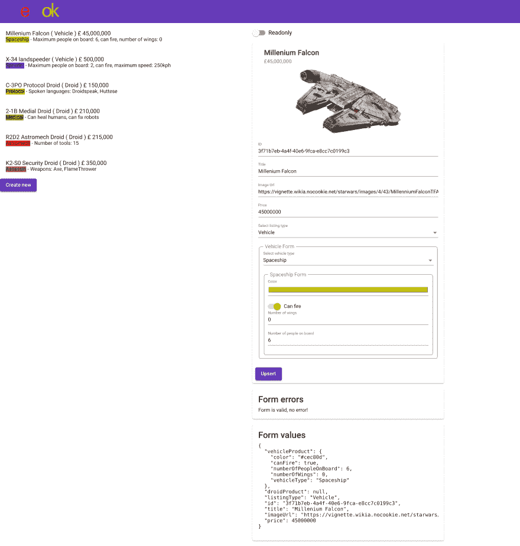
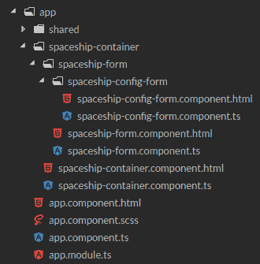

# 构建可伸缩的健壮的类型安全的窗体

> 原文：<https://dev.to/maxime1992/building-scalable-robust-and-type-safe-forms-with-angular-3nf9>

你好👋！

今天我想分享一些我用 Angular 构建(我认为是)大型复杂表单的经验。不过有一点要记住:如果你不担心“可扩展”或“大表单”部分，请注意以下所有内容仍然可以应用于超小表单，你仍然会得到很多好处！

免责声明:我不是唯一一个花费数小时思考处理表单的更好方法的人。扎克·亨利([@扎克](https://twitter.com/zak))和我都想到了我今天要介绍的解决方案，我要感谢他花了这么多时间在设计、编码和进行代码审查上👏 👏 👏。

# 目录

*   [语境](#context)
*   [演示简介，了解我们想要构建的示例](#introduction-the-demo-and-understand-what-we-want-to-build-as-an-example)
*   [反应形式](#reactive-forms)
    *   [一个文件中的所有内容](#everything-in-one-file-fire)
    *   [将表单分解成子组件](#breaking-down-the-form-into-sub-components-thumbsup)
    *   以正确的方式将表单分解成子组件！
    *   [了解 ControlValueAccessor 的威力](#understanding-the-power-of-raw-controlvalueaccessor-endraw-)
*   [Ngx-子表单:将角度表单分解成多个子组件的实用程序库](#ngxsubform-utility-library-to-break-down-an-angular-form-into-multiple-sub-components)
    *   [ngx-子表单必须提供什么](#what-raw-ngxsubform-endraw-has-to-offer)
    *   什么时候应该使用它？
    *   [构建演示](#building-the-demo)
    *   [进一步使用重映射和/或多态性](#going-further-with-remapping-andor-polymorphism)
*   [总结并带走](#summary-and-take-away)
*   [有用的链接](#useful-links)

# 上下文

在我们深入主题之前，让我给你一点背景来解释为什么我在工作中构建大型表单，以及为什么我真的需要找到一个解决方案来做得更好。

我目前在 [CloudNC](https://cloudnc.com) 工作，这是一家位于伦敦的初创公司，我们的目标是使用[数控铣床](https://youtu.be/Dh1eUb_UWUQ?t=8)大大简化、加快和改进加工零件的过程。在我们的应用程序中，我们需要对环境(机器、工具等)建模，作为生成机器运动的算法的输入。这个环境有大量的参数，所以我们有相当多的表单。

[](https://res.cloudinary.com/practicaldev/image/fetch/s--Ap4_oNya--/c_limit%2Cf_auto%2Cfl_progressive%2Cq_auto%2Cw_880/https://thepracticaldev.s3.amazonaws.com/i/sgrwp78td5w2loat4ulj.png)
*3D visualiser 模拟机器将如何切割零件。*

我们表单中的一个很好的例子是当我们想在一个零件上标注一个特定的孔时。我们可以在不同类型的注释中进行选择，并选择特定的行为:

[](https://res.cloudinary.com/practicaldev/image/fetch/s--MzYJW9_8--/c_limit%2Cf_auto%2Cfl_progressive%2Cq_auto%2Cw_880/https://thepracticaldev.s3.amazonaws.com/i/zf5h3re7gnsn7pfgdwdd.png)
*2 种形式注释一个孔的例子。*

在这个例子中，你可以看到我们有两个独立的表单，每个表单由一个下拉菜单选择(这形成了一个多态模型——稍后解释！).每个表单都使用相同的“定位策略”子表单。这甚至还不是我们最复杂的表单，所以您可以开始理解提出一个通用解决方案的动机，将表单分解成容易组合的逻辑组件。

# 介绍演示并理解我们要构建的示例

为了展示构建一个好的表单有多困难，我们开发了一个应用程序。主要想法是:“银河销售”，人们可以决定出售`Droid` ( `Assassin`、`Astromech`、`Medical`、`Protocol`)或`Vehicle` ( `Spaceship`、`Speeder`)。

[](https://res.cloudinary.com/practicaldev/image/fetch/s--BpcR0u8c--/c_limit%2Cf_auto%2Cfl_progressive%2Cq_auto%2Cw_880/https://thepracticaldev.s3.amazonaws.com/i/dpkth2zu4axvrnqh23bn.png)

在左侧，您可以看到一个简单的列表，显示要销售的商品。

在右边，有一个表单显示了被点击的条目(所以可以编辑，把它看作是一个管理视图)。也可以通过点击“新建”按钮来创建一个新条目。

如果你想玩试玩的 **live 版**，你可以试试这里:【https://cloudnc.github.io/ngx-sub-form】

如果你想看看试玩的源代码，你可以试试这里:[https://github.com/cloudnc/ngx-sub-form/tree/master/src/app](https://github.com/cloudnc/ngx-sub-form/tree/master/src/app)

现在让我们仔细看看这些模型(`interfaces`、`enums`等)来构建它的简化版本。足以理解所有概念但避免重复。

A `Listing`是待售商品:

```
// can either be a vehicle or a droid
export enum ListingType {
  VEHICLE = 'Vehicle',
  DROID = 'Droid',
}

export interface BaseListing {
  id: string;
  title: string;
  imageUrl: string;
  price: number;
}

export interface VehicleListing extends BaseListing {
  listingType: ListingType.VEHICLE;
  product: OneVehicle;
}

export interface DroidListing extends BaseListing {
  listingType: ListingType.DROID;
  product: OneDroid;
}

export type OneListing = VehicleListing | DroidListing; 
```

<svg width="20px" height="20px" viewBox="0 0 24 24" class="highlight-action crayons-icon highlight-action--fullscreen-on"><title>Enter fullscreen mode</title></svg> <svg width="20px" height="20px" viewBox="0 0 24 24" class="highlight-action crayons-icon highlight-action--fullscreen-off"><title>Exit fullscreen mode</title></svg>

现在让我们来看看`Vehicle`模型:

```
export enum VehicleType {
  SPACESHIP = 'Spaceship',
  SPEEDER = 'Speeder',
}

export interface BaseVehicle {
  color: string;
  canFire: boolean;
  numberOfPeopleOnBoard: number;
}

export interface Spaceship extends BaseVehicle {
  vehicleType: VehicleType.SPACESHIP;
  numberOfWings: number;
}

export interface Speeder extends BaseVehicle {
  vehicleType: VehicleType.SPEEDER;
  maximumSpeed: number;
}

export type OneVehicle = Spaceship | Speeder; 
```

<svg width="20px" height="20px" viewBox="0 0 24 24" class="highlight-action crayons-icon highlight-action--fullscreen-on"><title>Enter fullscreen mode</title></svg> <svg width="20px" height="20px" viewBox="0 0 24 24" class="highlight-action crayons-icon highlight-action--fullscreen-off"><title>Exit fullscreen mode</title></svg>

这里需要注意的一件重要事情是，`OneListing`是一个多态类型(并且`OneVehicle`也是):

```
export type OneListing = VehicleListing | DroidListing; 
```

<svg width="20px" height="20px" viewBox="0 0 24 24" class="highlight-action crayons-icon highlight-action--fullscreen-on"><title>Enter fullscreen mode</title></svg> <svg width="20px" height="20px" viewBox="0 0 24 24" class="highlight-action crayons-icon highlight-action--fullscreen-off"><title>Exit fullscreen mode</title></svg>

在这里保存值的对象可以是一个`VehicleListing`或者一个`DroidListing`。在这种情况下，Typescript 只能通过查看属性来确保类型安全，但是为了更安全，也为了以后更容易知道对象的类型，我们使用了一个判别属性:`listingType`。

现在让我们进入下一步，理解构建一个可以表示该数据结构的表单的挑战。

# 反应形式

它们在 Angular 的早期版本中被引入，并完全改变了对形式的推理方式。好的方面！我们可以从 Typescript/Components 文件中管理表单的所有逻辑，而不是从模板中管理。另外，我们可以在所有的表单上享受类型安全！

[](https://res.cloudinary.com/practicaldev/image/fetch/s--IiH6J1uC--/c_limit%2Cf_auto%2Cfl_progressive%2Cq_auto%2Cw_880/https://thepracticaldev.s3.amazonaws.com/i/prlx7do0rrb70kpw5tyq.png)

良好的...不完全是。Github 上有一个长期存在的问题。

# [ 反应形式不强烈 #13721](https://github.com/angular/angular/issues/13721) 

[](https://github.com/asfernandes) **[asfernandes](https://github.com/asfernandes)** posted on [<time datetime="2016-12-30T15:14:52Z">Dec 30, 2016</time>](https://github.com/angular/angular/issues/13721)

```
[x] feature request 
```

*   **角版:** 2

反应式表单应该在复杂的表单中使用，但是控件的`valueChanges`是`Observable<any>`，这完全违背了复杂代码的良好实践。

应该有一种创建强类型表单控件的方法。

[View on GitHub](https://github.com/angular/angular/issues/13721)

我邀请你表示一些支持👍以便它最终能被优先处理。

即使我们目前不能真正从类型安全中受益，我们仍然可以使用反应形式来构建它。让我们通过不同的解决方案来实现这一点。

## 一切尽在一档🔥

一种解决方案是将所有东西都放在同一个组件中。可以想象，这远非理想:

*   巨大的文件
*   很难与多个开发人员并行处理同一个文件
*   不要将逻辑分成不同的组，将问题分解成更小的部分
*   不能重复使用表单的子部分(例如，只编辑一个较小的子集)

## 将表单分解成子组件👍

因此，就像您处理任何其他组件或功能一样，您开始考虑如何将其分解为更简单、更小的子组件来处理它们自己的逻辑。从那里，您可能会发现一些博客文章和堆栈溢出问题，建议将表单组实例作为`@Input()`传递，然后从一个子组件动态添加所需的新表单属性。

但有些事感觉不对劲，是吗？如果它不是一个表单，只是一个简单的对象，你会将`Listing`对象传递给一个`Vehicle`组件吗？然后它就可以进入房产`listing.vehicle`，这很好，但也可以进入`listing`本身，这感觉很危险。最糟糕的是，它能够变异`listing.vehicle`(添加/删除属性)。遵循单向数据绑定原则，您意识到这是错误的。我想这也适用于表格。

## 把表单分解成子组件，正确的方式！🎉

[卡拉](https://twitter.com/karaforthewin)在 2017 年 Angular Connect 的这场精彩演讲中谈到了`ControlValueAccessor`:[https://youtu.be/CD_t3m2WMM8](https://youtu.be/CD_t3m2WMM8)

如果您从未听说过`ControlValueAccessor`，它将让您创建一个可以用作`FormControl`的组件。基本上，你可以这样做:

```
@Component({
  selector: 'my-custom-input',
  // ...
  providers: [
    {
      provide: NG_VALUE_ACCESSOR,
      useExisting: forwardRef(() => MyCustomInput),
      multi: true,
    },
  ],
})
export class MyCustomInput implements ControlValueAccessor {
  writeValue(obj: any): void {
    // every time the form control is
    // being updated from the parent
  }
  registerOnChange(fn: any): void {
    // when we want to let the parent
    // know that the value of the
    // form control should be updated
    // call `fn` callback
  }
  registerOnTouched(fn: any): void {
    // when we want to let the parent
    // know that the form control
    // has been touched
    // call `fn` callback
  }
  setDisabledState?(isDisabled: boolean): void {
    // when the parent updates the
    // state of the form control
  }
} 
```

<svg width="20px" height="20px" viewBox="0 0 24 24" class="highlight-action crayons-icon highlight-action--fullscreen-on"><title>Enter fullscreen mode</title></svg> <svg width="20px" height="20px" viewBox="0 0 24 24" class="highlight-action crayons-icon highlight-action--fullscreen-off"><title>Exit fullscreen mode</title></svg>

您能看出传递`FormGroup`实例和使用`ControlValueAccessor`之间的主要区别吗？现在，我们制作一个愚蠢的组件时使用的模式几乎是一样的！

以下是 Angular 中没有的东西，但只是为了说明我的观点，你可以这样想

```
 @Input() set value(obj: any) {}
  @Input() set disabledState(isDisabled: boolean): void {}

  @Output() updated: EventEmitter<any> = new EventEmitter();
  @Output() touched: EventEmitter<any> = new EventEmitter(); 
```

<svg width="20px" height="20px" viewBox="0 0 24 24" class="highlight-action crayons-icon highlight-action--fullscreen-on"><title>Enter fullscreen mode</title></svg> <svg width="20px" height="20px" viewBox="0 0 24 24" class="highlight-action crayons-icon highlight-action--fullscreen-off"><title>Exit fullscreen mode</title></svg>

请注意:

*   单向数据流受到重视
*   子组件不能访问整个表单

如果你看一下 Angular Material 源代码，你会注意到许多组件(作为输入)是如何构建的！例如，[选择](https://github.com/angular/components/blob/c3eac1759c80a6cb34dc1d74215fce97b81316d7/src/material/select/select.ts#L228)，[单选](https://github.com/angular/components/blob/c3eac1759c80a6cb34dc1d74215fce97b81316d7/src/material/radio/radio.ts#L98)，[滑动切换](https://github.com/angular/components/blob/c3eac1759c80a6cb34dc1d74215fce97b81316d7/src/material/slide-toggle/slide-toggle.ts#L104)，[滑块](https://github.com/angular/components/blob/c3eac1759c80a6cb34dc1d74215fce97b81316d7/src/material/slider/slider.ts#L149)，...

## 了解`ControlValueAccessor`的力量

在写前面的例子时，我创建了一个实现`ControlValueAccessor`的空类，然后我的 IDE 生成了所需的方法。但是让我们仔细看看其中的一个:

```
writeValue(obj: any): void 
```

<svg width="20px" height="20px" viewBox="0 0 24 24" class="highlight-action crayons-icon highlight-action--fullscreen-on"><title>Enter fullscreen mode</title></svg> <svg width="20px" height="20px" viewBox="0 0 24 24" class="highlight-action crayons-icon highlight-action--fullscreen-off"><title>Exit fullscreen mode</title></svg>

你注意到参数的名字了吗？`obj`。那很有趣🤔。

可以传递任何种类的对象给`writeValue`！你不局限于像`string`或`number`这样的原始类型。你可以传递一个对象，一个数组，...开始构建**深度嵌套表单**所需的一切。

因此，假设我们想要构建一个表单来处理下面的对象:

```
export interface Spaceship {
  name: string;
  builtInYear: number;
  config: {
    maxSpeed: number;
    nbCanons: number;
  };
} 
```

<svg width="20px" height="20px" viewBox="0 0 24 24" class="highlight-action crayons-icon highlight-action--fullscreen-on"><title>Enter fullscreen mode</title></svg> <svg width="20px" height="20px" viewBox="0 0 24 24" class="highlight-action crayons-icon highlight-action--fullscreen-off"><title>Exit fullscreen mode</title></svg>

我们可以:

*   创建一个`SpaceshipForm`组件
*   这个组件将只处理原始值(这里是`name`和`builtInYear`)，并从另一个组件请求配置
*   创建一个子组件`SpaceshipConfigForm`，它本身只处理原始值(在这种情况下是所有的原始值)

但是让我们来看看第一级组件(`SpaceshipForm`)，看看为什么在每个子组件上这样做负担很小:

```
@Component({
  selector: 'my-custom-input',
  // ...
  providers: [
    {
      provide: NG_VALUE_ACCESSOR,
      useExisting: forwardRef(() => MyCustomInput),
      multi: true,
    },
  ],
})
export class MyCustomInput implements ControlValueAccessor, OnInit, OnDestroy {
  private onChange: (value: any) => void;
  private onTouched: () => void;
  private onDestroy$: Subject<void> = new Subject();

  public internalFormGroup: FormGroup = new FormGroup({
    name: new FormControl(),
    builtInYear: new FormControl(),
    config: new FormControl(),
  });

  public ngOnInit(): void {
    this.internalFormGroup.valueChanges
      .pipe(
        tap(value => {
          this.onChange(value);
          this.onTouched();
        }),
        takeUntil(this.onDestroy$),
      )
      .subscribe();
  }

  public ngOnDestroy(): void {
    this.onDestroy$.next();
    this.onDestroy$.complete();
  }

  writeValue(obj: any): void {
    // every time the form control is
    // being updated from the parent

    this.internalFormGroup.setValue(obj, { emitEvent: false });

    this.internalFormGroup.markAsPristine();
    this.internalFormGroup.markAsUntouched();
  }
  registerOnChange(fn: any): void {
    // when we want to let the parent
    // know that the value of the
    // form control should be updated

    this.onChange = fn;
  }
  registerOnTouched(fn: any): void {
    // when we want to let the parent
    // know that the form control
    // has been touched

    this.onTouched = fn;
  }
  setDisabledState?(isDisabled: boolean): void {
    // when the parent updates the
    // state of the form control

    if (isDisabled) {
      this.internalFormGroup.disable();
    } else {
      this.internalFormGroup.enable();
    }
  }
} 
```

<svg width="20px" height="20px" viewBox="0 0 24 24" class="highlight-action crayons-icon highlight-action--fullscreen-on"><title>Enter fullscreen mode</title></svg> <svg width="20px" height="20px" viewBox="0 0 24 24" class="highlight-action crayons-icon highlight-action--fullscreen-off"><title>Exit fullscreen mode</title></svg>

逻辑本身并不复杂，但有一点是肯定的:**它很冗长**。这只是一个很小的例子，你可以把事情做得更进一步。但是已经~75 行了。对我来说，仅仅处理来自那个组件的 2 个输入似乎太多了🤷‍♂️.

希望你能发现为什么写这篇博客(是时候了吧？)以及如何更好地处理上述代码。

# Ngx-子表单:将一个角度表单分解成多个子组件的实用程序库

正如那篇文章的上下文部分简要解释的那样，我们已经在 [CloudNC](https://cloudnc.com) 开发了一个库，它将为您处理所有的样板文件，并为您提供一些很好的帮助。它叫 [`ngx-sub-form`](https://github.com/cloudnc/ngx-sub-form) 。

这个库被发布在 Github 和 T2 NPM 上，并获得了麻省理工学院的许可，已经可以使用了。我们在 Github 库上做了一个完整的例子/演示，也经过了很好的测试(包括 E2E 和集成)。我们也用它重写了很多我们自己的表单，我们相信它现在足够稳定，可以被其他人使用，所以请在您自己的项目中尝试一下吧！

## `ngx-sub-form`能提供什么

*   用最少的样板文件轻松创建子表单或自定义`ControlValueAccessor`
*   在组件的`.ts`和`.html`文件中键入 safety
*   访问表单的所有值，甚至是嵌套的值
*   访问表单的所有错误，甚至是嵌套的错误(这在`FormGroup` s 上不是本地支持的，参见[https://github.com/angular/angular/issues/10530](https://github.com/angular/angular/issues/10530)
*   您应该能够处理大部分同步值，而不必处理流
*   将原始数据重新映射到每个窗体/子窗体所需的形状(并保持其类型安全)
*   以一种简单的方式处理表单中的多态数据

## 应该什么时候用？

你有表格吗？

> 是

那就用吧。

> 我的表单很小而且非常简单，我不确定它是否值得

你将得到类型安全，更少的样板文件和一些免费的助手。

除非你真的只有一个`FormControl`来处理一个搜索输入，你应该使用它。

[](https://res.cloudinary.com/practicaldev/image/fetch/s--s7TlxUCy--/c_limit%2Cf_auto%2Cfl_progressive%2Cq_auto%2Cw_880/https://thepracticaldev.s3.amazonaws.com/i/dknl4ccqo9ikw2v60vie.png)

> 话够了，给我看看代码！

## 构建演示

我们现在将重构前面的组件，只是这一次，我们将构建整个表单(包括配置！).

这里有一个接口作为提醒:

*我现在已经把它分解成了 2 个，就像我们通常会/应该做的那样！*

```
export interface SpaceshipConfig {
  maxSpeed: number;
  nbCanons: number;
}

export interface Spaceship {
  name: string;
  builtInYear: number;
  config: SpaceshipConfig;
} 
```

<svg width="20px" height="20px" viewBox="0 0 24 24" class="highlight-action crayons-icon highlight-action--fullscreen-on"><title>Enter fullscreen mode</title></svg> <svg width="20px" height="20px" viewBox="0 0 24 24" class="highlight-action crayons-icon highlight-action--fullscreen-off"><title>Exit fullscreen mode</title></svg>

看着界面，我们可以很容易地猜到我们想要什么样的架构:

*   **spaceship-container** :智能组件，当表单有效且正在发送时，它将注入一个服务来检索或保存一艘飞船
*   **飞船表单**:顶层表单的哑组件，负责处理`Spaceship`的第一个值
*   **spaceship-config-form** :哑组件，是一个子表单，只负责配置部分

[](https://res.cloudinary.com/practicaldev/image/fetch/s--om7l9prY--/c_limit%2Cf_auto%2Cfl_progressive%2Cq_auto%2Cw_880/https://thepracticaldev.s3.amazonaws.com/i/f8x6ojs1xaaui965q8h4.png)

我们将从底部组件开始，然后从那里向上。下面是我将要介绍的内容的现场演示:[https://stackblitz.com/edit/ngx-sub-form-basics](https://stackblitz.com/edit/ngx-sub-form-basics)

当您想在上下文中查看代码时，可以使用 Stackblitz 并跟随它。

[https://stackblitz.com/edit/ngx-sub-form-basics?embed=1&view=preview&](https://stackblitz.com/edit/ngx-sub-form-basics?embed=1&view=preview&)

**飞船-配置-表单.组件. ts** :

```
@Component({
  selector: 'app-spaceship-config-form',
  templateUrl: './spaceship-config-form.component.html',
  providers: subformComponentProviders(SpaceshipConfigFormComponent),
})
export class SpaceshipConfigFormComponent extends NgxSubFormComponent<SpaceshipConfig> {
  protected getFormControls(): Controls<SpaceshipConfig> {
    return {
      maxSpeed: new FormControl(),
      nbCanons: new FormControl(),
    };
  }
} 
```

<svg width="20px" height="20px" viewBox="0 0 24 24" class="highlight-action crayons-icon highlight-action--fullscreen-on"><title>Enter fullscreen mode</title></svg> <svg width="20px" height="20px" viewBox="0 0 24 24" class="highlight-action crayons-icon highlight-action--fullscreen-off"><title>Exit fullscreen mode</title></svg>

如您所见，这是一个子表单组件，样板文件很少。

首先，我们来看一下线

```
providers: subformComponentProviders(SpaceshipConfigFormComponent), 
```

<svg width="20px" height="20px" viewBox="0 0 24 24" class="highlight-action crayons-icon highlight-action--fullscreen-on"><title>Enter fullscreen mode</title></svg> <svg width="20px" height="20px" viewBox="0 0 24 24" class="highlight-action crayons-icon highlight-action--fullscreen-off"><title>Exit fullscreen mode</title></svg>

当构建一个`ControlValueAccessor`时，如果希望能够处理验证，您至少需要提供`NG_VALUE_ACCESSOR`并通过`NG_VALIDATORS`。它通常看起来如下:

```
{
  // ...
  providers: [
    {
      provide: NG_VALUE_ACCESSOR,
      useExisting: forwardRef(() => component),
      multi: true,
    },
    {
      provide: NG_VALIDATORS,
      useExisting: forwardRef(() => component),
      multi: true,
    },
  ];
} 
```

<svg width="20px" height="20px" viewBox="0 0 24 24" class="highlight-action crayons-icon highlight-action--fullscreen-on"><title>Enter fullscreen mode</title></svg> <svg width="20px" height="20px" viewBox="0 0 24 24" class="highlight-action crayons-icon highlight-action--fullscreen-off"><title>Exit fullscreen mode</title></svg>

所有这些都被简化为一行实用函数`subformComponentProviders`,您只需要提供当前的类。它还可以与 AoT 编译器一起工作。

然后，注意这一行:

```
export class SpaceshipConfigFormComponent extends NgxSubFormComponent<SpaceshipConfig> 
```

<svg width="20px" height="20px" viewBox="0 0 24 24" class="highlight-action crayons-icon highlight-action--fullscreen-on"><title>Enter fullscreen mode</title></svg> <svg width="20px" height="20px" viewBox="0 0 24 24" class="highlight-action crayons-icon highlight-action--fullscreen-off"><title>Exit fullscreen mode</title></svg>

通过这样做，你可以接触到很多

**属性**:

*   `formGroup`:实际的表单组，用于定义视图的绑定`[formGroup]="formGroup"`
*   `formControlNames`:表单中所有可用的控件名称。当定义一个`formControlName`时使用它，比如:`<input [formControlName]="formControlNames.yourControl">`，如果你改变一个接口，它会在编译时(用 AOT)捕捉错误！
*   `formGroupControls`:你的窗体的所有控件，有助于避免做`formGroup.get(formControlNames.yourControl)`；相反只是做`formGroupControls.yourControl`
*   `formGroupValues`:直接访问你的表单的所有值，不需要做`formGroup.get(formControlNames.yourControl).value`，只需要做`formGroupValues.yourControl`(就能正确输入了！)
*   `formGroupErrors`:当前表格**的所有错误，包括**子错误(如果有)。用`formGroupErrors`或者`formGroupErrors?.yourControl`就可以了。注意`formGroupErrors?.yourControl`中的问号，如果没有错误**将返回`null`**

**方法**:

*   钩子:允许你在表单被修改时做出反应。不用订阅`this.formGroup.valueChanges`或`this.formControls.someProp.valueChanges`，你不必处理任何异步的事情，也不必担心订阅和内存泄漏。只需实现方法`onFormUpdate(formUpdate: FormUpdate<FormInterface>): void`，如果您需要知道哪个属性发生了变化，请进行如下检查:`if (formUpdate.yourProperty) {}`。请注意，只有当窗体发生本地更改或子窗体发生更改时，才会调用此方法。如果父方法调用了`setValue`或`patchValue`，这个方法将不会被调用
*   `getFormGroupControlOptions` hook:允许您定义内部`FormGroup`构造的控制选项。使用它来定义`FormGroup`级验证器
*   `handleEmissionRate` hook:允许您定义一个自定义排放率(顶层或任何子层)

现在你一定认为它开始变得很多了，希望在那之后我们不会增加太多。在这种情况下，你会很高兴地知道，这涵盖了大部分的`ngx-sub-form`，其余的现在会感觉似曾相识。

**spaceship-config-form.component.html**:

```
<fieldset [formGroup]="formGroup">
  <legend>Config</legend>

  Maximum speed
  <input type="number" [formControlName]="formControlNames.maxSpeed" />

  Number of canons
  <input type="number" [formControlName]="formControlNames.nbCanons" />
</fieldset> 
```

<svg width="20px" height="20px" viewBox="0 0 24 24" class="highlight-action crayons-icon highlight-action--fullscreen-on"><title>Enter fullscreen mode</title></svg> <svg width="20px" height="20px" viewBox="0 0 24 24" class="highlight-action crayons-icon highlight-action--fullscreen-off"><title>Exit fullscreen mode</title></svg>

我认为不需要进一步的解释。

现在，让我们转到顶级表单。

**飞船-表单.组件. ts** :

```
@Component({
  selector: 'app-spaceship-form',
  templateUrl: './spaceship-form.component.html',
})
export class SpaceshipFormComponent extends NgxRootFormComponent<Spaceship> {
  @DataInput()
  @Input('spaceship')
  public dataInput: Spaceship | null | undefined;

  @Output('spaceshipUpdated')
  public dataOutput: EventEmitter<Spaceship> = new EventEmitter();

  protected getFormControls(): Controls<Spaceship> {
    return {
      name: new FormControl(),
      builtInYear: new FormControl(),
      config: new FormControl(),
    };
  }
} 
```

<svg width="20px" height="20px" viewBox="0 0 24 24" class="highlight-action crayons-icon highlight-action--fullscreen-on"><title>Enter fullscreen mode</title></svg> <svg width="20px" height="20px" viewBox="0 0 24 24" class="highlight-action crayons-icon highlight-action--fullscreen-off"><title>Exit fullscreen mode</title></svg>

该组件的目的不是像以前的组件一样绑定到`FormControl`,而是:

*   能够从一个`Input` ( `dataInput`，你当然可以重命名)更新表单
*   一旦表单有效并保存(通过`Output` `dataOutput`，也可以重命名)，就能够共享(发出)新值

注意:使用`NgxRootFormComponent`、`dataInput`时**是否需要**配合`@DataInput()`装饰器使用。背后的原因很简单:`ngx-sub-form`没有办法知道你将如何重命名你的输入，它确实需要一个钩子在值改变时得到警告。我们用[装饰器](https://github.com/cloudnc/ngx-sub-form/blob/master/projects/ngx-sub-form/src/lib/ngx-sub-form.decorators.ts)来处理所有的事情，而不是让你从`ngOnChanges`钩子中调用一个方法，或者在输入上创建一个 setter 并调用相同的方法。

让我们快速浏览一下风景。

**spaceship-form.component.html**:

```
<form [formGroup]="formGroup">
  <fieldset>
    <legend>Spaceship</legend>
    Name
    <input type="text" [formControlName]="formControlNames.name" />

    Built in year
    <input type="number" [formControlName]="formControlNames.builtInYear" />

    <app-spaceship-config-form [formControlName]="formControlNames.config"></app-spaceship-config-form>

    <button (click)="manualSave()">Save</button>
  </fieldset>
</form>

<pre>{{ formGroup.value | json }}</pre> 
```

<svg width="20px" height="20px" viewBox="0 0 24 24" class="highlight-action crayons-icon highlight-action--fullscreen-on"><title>Enter fullscreen mode</title></svg> <svg width="20px" height="20px" viewBox="0 0 24 24" class="highlight-action crayons-icon highlight-action--fullscreen-off"><title>Exit fullscreen mode</title></svg>

没什么特别新的，但是注意我们可以通过使用`formGroup.value`来显示整个表单值(这里是为了调试目的),并且为了保存表单，我们在使用`NgxRootFormComponent`时简单地调用`ngx-sub-form`提供的`manualSave`方法。

一旦我们调用`manualSave`，如果表单有效，它将通过输出发出表单的值。这样，父对象可以简单地检索一个新的`Spaceship`对象并对其进行处理(将它放入本地存储，将其传递给一个服务以便用它进行 HTTP 调用，等等)。但是**表单只对表单本身负责**，智能组件(父)甚至不知道表单。它只是知道有新的值可用。

说到这里，我们来看看父组件。

**飞船-容器.组件. ts**

```
// only to demo that passing a value as input will update the form
// but this info might come from a server for example when you want to
// edit an existing value
const getDefaultSpaceship = (): Spaceship => ({
  name: 'Galactico',
  builtInYear: 2500,
  config: {
    maxSpeed: 8000,
    nbCanons: 10,
  },
});

@Component({
  selector: 'app-spaceship-container',
  templateUrl: './spaceship-container.component.html',
})
export class SpaceshipContainerComponent {
  public spaceship$: Subject<Spaceship> = new Subject();

  public preFillForm(): void {
    this.spaceship$.next(getDefaultSpaceship());
  }

  public spaceshipUpdated(spaceship: Spaceship): void {
    // from here, you can pass that value to a
    // service to save/update it on a backend for example
    console.log(spaceship);
  }
} 
```

<svg width="20px" height="20px" viewBox="0 0 24 24" class="highlight-action crayons-icon highlight-action--fullscreen-on"><title>Enter fullscreen mode</title></svg> <svg width="20px" height="20px" viewBox="0 0 24 24" class="highlight-action crayons-icon highlight-action--fullscreen-off"><title>Exit fullscreen mode</title></svg>

有趣的是，当保存表单时，检索数据填充表单并收集表单新值的智能组件只有**和**处理类型为`Spaceship`的对象。没有一个`FormGroup`实例或`FormControl`被声明/使用。我们只是将这一职责委托给`SpaceshipFormComponent`。这真的很方便，因为如果以后我们想在应用程序中显示一个`Spaceship`，我们可以重用这个表单并禁用它，所以它是只读的。为什么`NgxRootFormComponent`和`NgxAutomaticRootFormComponent`都有可选的输入属性`disabled`。简单地绑定一个布尔值，当值为`true`时，表单将是只读的。更具体地说，整个表单将是只读的，也包括所有子表单组件👍。

这里的视图非常简单，但为了完整起见:

**spaceship-container.component.html**T2】

```
<button (click)="preFillForm()">Pre fill form (demo)</button>

<app-spaceship-form [spaceship]="spaceship$ | async" (spaceshipUpdated)="spaceshipUpdated($event)"></app-spaceship-form> 
```

<svg width="20px" height="20px" viewBox="0 0 24 24" class="highlight-action crayons-icon highlight-action--fullscreen-on"><title>Enter fullscreen mode</title></svg> <svg width="20px" height="20px" viewBox="0 0 24 24" class="highlight-action crayons-icon highlight-action--fullscreen-off"><title>Exit fullscreen mode</title></svg>

## 进一步使用重映射和/或多态

到目前为止，我们已经看到了如何将表单分解成更小的组件。现在剩下的最后一点是发现如何处理带有多态数据的表单。

先来个关于`polymorphism` ( [维基百科](https://en.wikipedia.org/wiki/Polymorphism_(computer_science)))的小提醒:

> 在编程语言和类型理论中，多态性是指为不同类型的实体提供一个接口，或者使用一个符号来表示多个不同的类型。

本文开头使用接口的例子:

```
export type OneListing = VehicleListing | DroidListing; 
```

<svg width="20px" height="20px" viewBox="0 0 24 24" class="highlight-action crayons-icon highlight-action--fullscreen-on"><title>Enter fullscreen mode</title></svg> <svg width="20px" height="20px" viewBox="0 0 24 24" class="highlight-action crayons-icon highlight-action--fullscreen-off"><title>Exit fullscreen mode</title></svg>

一个类型为`OneListing`的对象既可以是`VehicleListing`也可以是`DroidListing`。

即使它可能不是你在表单中一直使用的那种结构，但它是一个相当常见的用例，`ngx-sub-form`提供了一个专门的类来处理它:`NgxSubFormRemapComponent<ControlInterface, FormInterface>`。

*注意`NgxRootFormComponent`和`NgxAutomaticRootFormComponent`都使用`NgxSubFormRemapComponent`作为基类，所以你也可以使用提供的方法在它们之间重新映射。*

从这里开始，我们将为表单的这一部分创建一个新的界面，它将具有:

*   一个条目，了解当前选择的类型
*   每种可能的类型都有不同的条目

我们的例子:

```
export type OneListing = VehicleListing | DroidListing;

export enum OneListingType {
  VEHICLE = 'Vehicle',
  DROID = 'Droid',
}

export interface OneListingForm {
  listingType: OneListingType | null;
  vehicle: VehicleListing | null;
  droid: DroidListing | null;
} 
```

<svg width="20px" height="20px" viewBox="0 0 24 24" class="highlight-action crayons-icon highlight-action--fullscreen-on"><title>Enter fullscreen mode</title></svg> <svg width="20px" height="20px" viewBox="0 0 24 24" class="highlight-action crayons-icon highlight-action--fullscreen-off"><title>Exit fullscreen mode</title></svg>

然后我们可以像下面这样创建我们的组件:

```
@Component({
  selector: 'app-one-listing-form',
  templateUrl: '...',
})
export class OneListingForm extends NgxRootFormComponent<OneListing, OneListingForm> {
  // note that we use `NgxRootFormComponent` as it extends `NgxSubFormRemapComponent`
  // and this is the top level form; that's why we will be using `NgxRootFormComponent`
  // ...
} 
```

<svg width="20px" height="20px" viewBox="0 0 24 24" class="highlight-action crayons-icon highlight-action--fullscreen-on"><title>Enter fullscreen mode</title></svg> <svg width="20px" height="20px" viewBox="0 0 24 24" class="highlight-action crayons-icon highlight-action--fullscreen-off"><title>Exit fullscreen mode</title></svg>

此时，Typescript 将显示一个错误，并告诉您需要正确实现该类。

```
@Component({
  selector: 'app-one-listing-form',
  templateUrl: '...',
})
export class OneListingForm extends NgxSubFormRemapComponent<OneListing, OneListingForm> {
  @DataInput()
  @Input('listing')
  public dataInput: OneListing | null | undefined;

  @Output('listingUpdated')
  public dataOutput: EventEmitter<OneListing> = new EventEmitter();

  public OneListingType: typeof OneListingType = OneListingType;

  protected getFormControls(): Controls<OneListingForm> {
    return {
      listingType: new FormControl(null, { validators: [Validators.required] }),
      vehicle: new FormControl(null),
      droid: new FormControl(null),
    };
  }

  protected transformToFormGroup(obj: OneListing): OneListingForm {
    return {
      listingType: obj.listingType,
      vehicle: obj.listingType === OneListingType.VEHICLE ? obj : null,
      droid: obj.listingType === OneListingType.DROID ? obj : null,
    };
  }

  protected transformFromFormGroup(formValue: OneListingForm): OneListing | null {
    switch (formValue.listingType) {
      case OneListingType.VEHICLE:
        return formValue.vehicle;
      case OneListingType.DROID:
        return formValue.droid;
      case null:
        return null;
      default:
        throw new UnreachableCase(formValue.listingType);
    }
  }
} 
```

<svg width="20px" height="20px" viewBox="0 0 24 24" class="highlight-action crayons-icon highlight-action--fullscreen-on"><title>Enter fullscreen mode</title></svg> <svg width="20px" height="20px" viewBox="0 0 24 24" class="highlight-action crayons-icon highlight-action--fullscreen-off"><title>Exit fullscreen mode</title></svg>

您可能已经注意到，我们使用了两种新方法来处理多态数据:

*   `transformToFormGroup`:将写在该子组件上的值作为参数传递(或者如果使用顶级组件，则通过`dataInput`),并将该值重新映射到一个内部值，该值将多态对象分割成单独的实体
*   `transformFromFormGroup`:传递表单的值，并期望输出一个与原始接口匹配的对象

在`transformToFormGroup`方法中，如果你的不同对象有一个**鉴别器**属性，这将非常简单。在我们的例子中，它们是:

```
export interface VehicleListing extends BaseListing {
  listingType: ListingType.VEHICLE; // discriminator
  product: OneVehicle;
}

export interface DroidListing extends BaseListing {
  listingType: ListingType.DROID; // discriminator
  product: OneDroid;
}

export type OneListing = VehicleListing | DroidListing; 
```

<svg width="20px" height="20px" viewBox="0 0 24 24" class="highlight-action crayons-icon highlight-action--fullscreen-on"><title>Enter fullscreen mode</title></svg> <svg width="20px" height="20px" viewBox="0 0 24 24" class="highlight-action crayons-icon highlight-action--fullscreen-off"><title>Exit fullscreen mode</title></svg>

`listingType`属性是`VehicleListing`和`DroidListing`共有的，但是在两种情况下都被设置为一个明确定义的值。这允许我们做一个非常简单的检查，如下:

```
protected transformToFormGroup(obj: OneListing): OneListingForm {
  return {
    listingType: obj.listingType,
    vehicle: obj.listingType === OneListingType.VEHICLE ? obj : null,
    droid: obj.listingType === OneListingType.DROID ? obj : null,
  };
} 
```

<svg width="20px" height="20px" viewBox="0 0 24 24" class="highlight-action crayons-icon highlight-action--fullscreen-on"><title>Enter fullscreen mode</title></svg> <svg width="20px" height="20px" viewBox="0 0 24 24" class="highlight-action crayons-icon highlight-action--fullscreen-off"><title>Exit fullscreen mode</title></svg>

如果你的属性没有鉴别器，你需要根据其他属性来区分它们，但是我强烈建议你添加一个鉴别器，如果你能控制界面的话，因为这将使事情变得更容易，不仅仅是对你的表单。

`transformFromFormGroup`方法也很简单——基于表单值`listingType`,我们将从表单中返回适当的值:

```
protected transformFromFormGroup(formValue: OneListingForm): OneListing | null {
  switch (formValue.listingType) {
    case OneListingType.VEHICLE:
      return formValue.vehicle;
    case OneListingType.DROID:
      return formValue.droid;
    case null:
      return null;
    default:
      throw new UnreachableCase(formValue.listingType);
  }
} 
```

<svg width="20px" height="20px" viewBox="0 0 24 24" class="highlight-action crayons-icon highlight-action--fullscreen-on"><title>Enter fullscreen mode</title></svg> <svg width="20px" height="20px" viewBox="0 0 24 24" class="highlight-action crayons-icon highlight-action--fullscreen-off"><title>Exit fullscreen mode</title></svg>

抛出错误的代码行不应该发生，这里主要是因为类型安全的原因，因为它会强迫你实现所有的情况:

```
throw new UnreachableCase(formValue.listingType); 
```

<svg width="20px" height="20px" viewBox="0 0 24 24" class="highlight-action crayons-icon highlight-action--fullscreen-on"><title>Enter fullscreen mode</title></svg> <svg width="20px" height="20px" viewBox="0 0 24 24" class="highlight-action crayons-icon highlight-action--fullscreen-off"><title>Exit fullscreen mode</title></svg>

如果您自己的项目中没有类似的东西，您可以将以下内容放在一个共享文件夹中

```
export class UnreachableCase {
  constructor(payload: never) {}
} 
```

<svg width="20px" height="20px" viewBox="0 0 24 24" class="highlight-action crayons-icon highlight-action--fullscreen-on"><title>Enter fullscreen mode</title></svg> <svg width="20px" height="20px" viewBox="0 0 24 24" class="highlight-action crayons-icon highlight-action--fullscreen-off"><title>Exit fullscreen mode</title></svg>

如果将来我们向`OneListingType`枚举添加或移除其中一个值，Typescript 将抛出一个错误，并确保我们不会忘记任何用例。

# 汇总并取走

这篇文章现在即将结束，我希望你喜欢这个(新？)处理表单的方式。然而，由于我们已经非常深入地了解了细节，并且这是一个将近 20 分钟的阅读，我想对您应该记住的重要内容做一个小总结:

*   分解你的表格，这会让事情更容易推理和处理
*   更喜欢一个`ControlValueAccessor`，而不是将你的`FormGroup`或`FormControl`作为输入传递给一个子组件
*   戴上手套、盔甲和头盔，盯着你的终端看几秒钟，然后运行`yarn install ngx-sub-form`以避免创建自定义`ControlValueAccessor`的样板文件(另外，享受一些不错的助手和类型安全！)
*   如果您正在构建一个顶级表单组件，请在`NgxRootFormComponent`和`NgxAutomaticRootFormComponent`之间做出选择(手动保存或一旦有更改就立即保存)
*   如果您正在构建子表单组件，根据您是否需要重新映射数据，在`NgxSubFormComponent`和`NgxSubFormRemapComponent`之间进行选择
*   享受

感谢你的阅读，这是我的第一篇博文，所以请让我知道你是如何发现的，这样我就可以在接下来的文章中改进了！我们可能在某些问题上有分歧，或者我解释得不够清楚。无论哪种方式我都想知道，所以请不要害羞，分享你不喜欢的，我可以跳过的，如果太长，不够详细，等等。

如果你有其他改进`ngx-sub-form`的想法，请随意访问 Github 项目，或者写一个问题或者提出一个请求🔥。

# 有用的链接

*   Github 库:[https://github.com/cloudnc/ngx-sub-form](https://github.com/cloudnc/ngx-sub-form)
*   一个具有多态数据的表单的现场演示，该表单已被分解成不同的子组件:[https://cloudnc.github.io/ngx-sub-form](https://cloudnc.github.io/ngx-sub-form)
*   现场演示的源代码:[https://github.com/cloudnc/ngx-sub-form/tree/master/src/app](https://github.com/cloudnc/ngx-sub-form/tree/master/src/app)
*   我们在本文中构建的演示的 stack blitz:[https://stackblitz.com/edit/ngx-sub-form-basics](https://stackblitz.com/edit/ngx-sub-form-basics)

* * *

*   在推特上关注我:[https://twitter.com/maxime1992](https://twitter.com/maxime1992)(我分享关于 Angular 的事情🌈)
*   在 Github 上关注我:[https://github.com/maxime1992](https://github.com/maxime1992)(我尝试开源尽可能多的东西，大部分时间围绕着 Typescript、Node、Angular、NestJs)

* * *

*   扎克的推特:[https://twitter.com/zak](https://twitter.com/zak)
*   扎克的 Github 页面:[https://github.com/zakhenry](https://github.com/zakhenry)

* * *

*   CloudNC 网站:[https://cloudnc.com](https://cloudnc.com)(如果你感兴趣的话，伦敦有很多[的工作](https://cloudnc.com/careers)！)
*   CloudNC 的 Github 页面:[https://github.com/cloudnc](https://github.com/cloudnc)(我们几乎没有其他为图标和网络工作者准备的库)

再次感谢阅读！