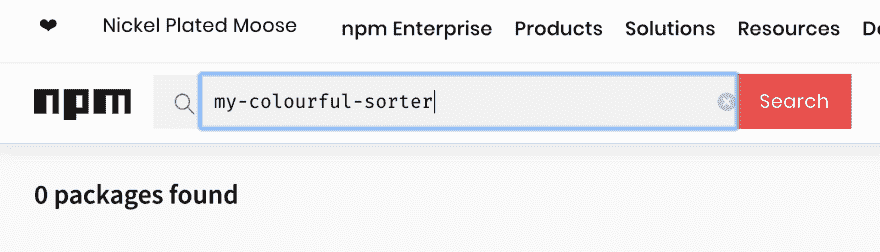

# (npm)出版，该死的！

> 原文：<https://dev.to/mlennox/npm-publish-and-be-damned-140o>

这篇文章是从我的个人博客交叉发布的

我最近[发表了我的第一个 npm 包](https://www.webpusher.ie/2019/05/04/eslint-npm-package)，我的同事[阿提拉·瓦戈](https://medium.com/@attilavago)建议我写一些关于这个过程的笔记。我要指出我不是这方面的专家(我甚至没有在电视上玩过！)所以你应该对此半信半疑。

我将概述为什么您可能想要发布 npm 包，然后向您展示它有多简单，最后，概述您需要了解的配置选项。

## 动机——你为什么要发布一个 npm 包？

**好玩！**

[](https://res.cloudinary.com/practicaldev/image/fetch/s--h5BKrGFR--/c_limit%2Cf_auto%2Cfl_progressive%2Cq_66%2Cw_880/https://thepracticaldev.s3.amazonaws.com/i/b44n21elt1bx67ugfdwl.gif)

学起来很有趣！

**派生现有包**

也许现有的软件包不能满足您的需求。也许它已经被遗弃了。也许您需要添加一些新的配置，同时将其移植到 es6。不管什么原因，你想要吗？你可以重建它。你有技术。

**代码共享**

您可能希望在自己的项目之间共享一些代码。将它发布为 npm 包会使这变得更容易。如果您需要限制对您发布的库的访问，您也可以将您的包发布到一个私有注册表，这样只有您和您的团队可以安装它——并不是所有的选项都要花钱。

## 通过三个简单的步骤发布您的包

让我们直接跳进来吧！

发布一个 npm 包实际上非常容易。我将首先向您展示如何做到这一点，然后向您展示如何正确地配置您的软件包，以便您只发布您想要的文件，并提供如何安装和使用您的软件包的详细描述。

### 1。从终端登录到您的 npm 帐户

你需要有一个帐户，如果你没有，访问[https://www.npmjs.com/signup](https://www.npmjs.com/signup)创建一个。

在终端上登录很简单

```
$ npm login
# prompts you for your email and password 
```

您只需在启动/重启终端后登录一次。

### 2。增加包的版本

除非这是您第一次发布，否则您必须增加软件包的版本，否则 npm 会拒绝它，因为它希望您每次发布时都有更新的版本。

```
{
  "version": "1.0.0" // increment to 1.0.1
} 
```

### 3。发布！

下面的命令将发布您的包

```
$ npm publish

# npm notice 
# npm notice 📦  my-colourful-sorter@1.0.1
# npm notice === Tarball Contents === 
# npm notice 1.5kB package.json 
# npm notice 1.1kB LICENSE 
# npm notice 2.0kB README.md 
# npm notice 1.5kB src/sort.js 
# npm notice 865B  src/fuzzy.js
# npm notice === Tarball Details === 
# npm notice name:          my-colourful-sorter 
# npm notice version:       1.0.1 
# npm notice package size:  3.1 kB 
# npm notice unpacked size: 6.9 kB 
# npm notice shasum:        d2ffe8d1c9f8f284319efca30e610edee091d993
# npm notice integrity:     sha512-zbG1FeJIr3Ec1[...]EZaLTYm8TKaEg==
# npm notice total files:   5 
# npm notice 
# + my-colourful-sorter@1.0.1 
```

恭喜你！我告诉过你这很容易。

现在来看看稍微难一点的配置。

## 配置-包. json

这就是奇迹发生的地方。`package.json`文件包含 npm 将您的库正确打包并发布到 npm 所需的所有细节，然后在开发人员选择使用时安装到他们的项目中。

除了依赖项之外，发布 package.json 文件真正需要的前三个属性是:

*   文件
*   名字
*   版本

除了简单的包之外，还有一些可选但通常是必需的属性:

*   描述
*   关键词
*   主/浏览器

最后，还有一些不太重要的领域也很有用——我不会在这里讨论它们:

*   发动机
*   主页
*   疯狂的
*   许可证

### 配置——三是幻数

#### 文件

这是可选的，但是我认为*是 package.json 中最重要的字段，这就是为什么我把它放在这个列表的第一位。顾名思义，该属性决定了 npm 包中将包含哪些文件。你会看到很多建议使用`.npmignore`将你做的*不想要的文件列入黑名单——你可能根本就不应该使用它。反正 npm 推荐使用`files`字段[。](https://blog.npmjs.org/post/165769683050/publishing-what-you-mean-to-publish)**

`files`字段允许您通过直接引用*或使用 [globbing 模式](https://commandbox.ortusbooks.com/usage/parameters/globbing-patterns)将*文件列入白名单。这些将覆盖你的`.gitignore`和`.npmignore`文件中的内容。举个例子:

```
// package.json
{
  "files": [
    "src/**/*.js",
  ],
} 
```

将包含`src`目录的根目录和子目录中的所有 js 文件。`**`模式匹配任何子目录路径。

这些模式不仅仅是白名单，您还可以排除文件，这使得`files`字段非常强大。举个例子，我喜欢把我的单元测试和我的源文件放在同一个文件夹中，这些可以通过使用:

```
// package.json
{
  "files": [
    "src/**/*.js",
    "!src/**/*.test.js"
  ],
} 
```

不管`files`字段中有什么，这些文件总是包括在内:

*   package.json
*   自述文件
*   变更/变更日志/历史记录
*   执照/许可证
*   通知；注意
*   您在`main`字段中指定的文件(见下文)

#### 名称

这是包名，也是用来将你的包`import`放入一个模块的名称，所以最好保持它的简短和易记。它还需要是唯一的，但你应该在[https://npmjs.com](https://npmjs.com)上搜索，以检查你的套餐名称是否已被占用。

[](https://res.cloudinary.com/practicaldev/image/fetch/s--2GJi4_NM--/c_limit%2Cf_auto%2Cfl_progressive%2Cq_auto%2Cw_880/https://thepracticaldev.s3.amazonaws.com/i/nhty4eadv1mgfzfq4npj.png)

如果你用你自己的 npm 用户名*限定*你的包名，你可以有一个更短的包名。如果你想调用你的 npm 包`colors`——一个已经存在的包——你可以，如果你使用一个作用域包名的话。

```
@paddingtonbear/colors 
```

在项目中安装它也同样简单。

```
$ npm install @paddingtonbear/colors 
```

#### 版本

这是永远符合 T4 标准的。简单点，从`1.0.0`开始。每次您将您的包发布到 npm 时，您都需要增加版本——您可以使用方便的`npm version`命令来完成。如果有疑问，每次发布时增加`patch`号。

```
$ npm version patch 
```

这将使您的版本`1.0.0`包增加到版本`1.0.1`。

```
// package.json
{
  "version": "1.0.1"
} 
```

有 npm 库帮助你发布到 npm - [优秀的 np，例如](https://github.com/sindresorhus/np) -但是我不会在这里讨论它们。

### 可选配置

#### 描述

你的包裹的[电梯间距](https://www.dictionary.com/browse/elevator-pitch)。保持简短扼要，这就是出现在 npmjs.com 搜索结果中的内容。

描述应该准确地告诉你这个包解决了什么问题。

这是一个不好的例子。

> 一个超级大的 npm 包，我喜欢写，希望你会喜欢用它来排序丰富多彩的和其他类型的列表

啊，现在这正是我的壁纸数据库项目所需要的！

> 可配置的列表分类器，允许按颜色分类

#### 关键词

您提供的任何关键字都将用于改善搜索结果。尝试包含有用的关键字——例如，node 和 nodej 不会有帮助。在我们假设的例子中，这些可能是一个好的选择

```
{
  "keywords": [
    "color",
    "sort",
    "rainbow",
    "color-blind",
    "protanomaly",
    "deuteranomaly",
    "tritanomaly"
  ]
} 
```

#### 主/浏览器

当您的 npm 包被导入到一个模块中时,`main`字段定义了返回的内容。

例如，如果您如下定义`main`

```
// package.json
{
  "name": "my-colourful-sorter"
  "main": "src/sort.js"
} 
```

npm 包中的`src/sort.js`文件在哪里

```
// src/sort.js
export default function doIt() { /* magic happens */ } 
```

如果您将您的包安装在一个项目中，并将其导入到该项目的一个模块中，那么导入将是来自`src/sort.js`文件的`doIt`方法:

```
// wallpapers/index.js
import colourfulSorter from 'colourful-sorter';
    :
colourfulSorter(someList); // this will execute the `doIt` function in your src/sort.js file 
```

`browser`属性本质上与`main`相同，但它是为将在 UI 中使用的库而设计的。

## 自述

您的`readme`文件是您的 npm 包的重要组成部分。它帮助开发者决定你的包是否值得安装。至少它应该描述你的软件包做什么，如何安装，以及如何使用它。此外，它是可选的，但通常包括徽章，突出您的 CI 渠道的状态。

### 描述

包含名称并引用 package.json 中的描述不会出错。添加一小段扩展描述，就大功告成了。

```
Configurable list sorter that allows sorting by colour.

This sorter allows sorting colour names based on the hue 
of the colour they represent. It can be configured to sort 
in reverse order and can sort based on hues as affected 
by colour-blindness - protanomaly, deuteranomaly, or tritanomaly. 
```

### 安装及要求

开发人员需要知道是否需要 nodejs 的某个版本，以及该包是最好用作生产还是开发依赖项。

```
Requires Node 8 or higher. 

npm install --save @paddingtonbear/colors 
```

### 如何使用

您应该给出一些工作示例来强调如何配置和使用您的 npm 包。

```
import colorsort from `@paddingtonbear/colors`;

const colorList = ['mango', 'chartreuse', 'vermillion', 'cyan', 'lavender'];

// ['vermillion', 'mango', 'chartreuse', 'cyan', 'lavender']
const result = colorsort(colorList, { order: colorsort.reverse }); 
```

### API

使用部分应该强调一些使用 npm 包的不同方法，即使你只有少量的选项，你也应该包括一个 API 部分来解释它们。下面是一个不完整的例子。

```
colorsort(array, [options])
Returns an array of colours sorted in rainbow order.

options
Should be provided as an object literal. The properties and 
values are listed below

order
Can be `colorsort.normal` or `colorsort.reverse`

etc. 
```

### 作者

你应该提供你的名字，非私人邮箱，twitter，linkedin，博客等。

```
Author
Michelin Mann <mich@tires.fr>
- [@tirechap](https://twitter.com/tirechap) 
```

### 牌照

最后，你应该列出你申请回购的许可证-如果你不确定使用什么，麻省理工学院的许可证是一个不错的选择。

**如何？**
Github 允许你在创建回购协议时添加许可。这将向您的 repo 添加一个包含标准 MIT 许可证文本的`LICENCE`文件。

[Github 有更多关于选择和申请许可证的信息](https://help.github.com/en/articles/licensing-a-repository)

### 自述模板

我已经提供了一个模板 README.md 文件，你可以下载并在你自己的项目中使用。