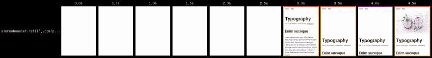
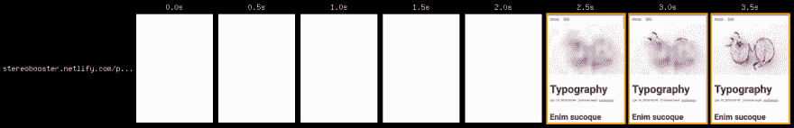

# 雨果的回应图像

> 原文：<https://dev.to/stereobooster/responsive-images-for-hugo-dn9>

这里的演示是[这里的](https://stereobooster.netlify.com/posts/typography/)。源代码是[这里的](https://github.com/stereobooster/hugo-pipes-parcel/tree/basic-theme)。

## 根据视口调整大小

我们不需要太多来建立一个基本的响应图像。

```
 
```

Enter fullscreen mode Exit fullscreen mode

```
img {
  width: 100%;
  height: auto;
} 
```

Enter fullscreen mode Exit fullscreen mode

图像将占用所有给定的空间，并根据视窗按比例调整大小，

## 尺寸

在不知道图像浏览器的尺寸(比例)的情况下，浏览器最初会以高度 0 绘制图像，然后一旦图像加载，它会以适当的高度重新绘制图像，页面会不愉快地“跳跃”。为了避免这种情况，我们需要提供宽度和高度

```
 
```

Enter fullscreen mode Exit fullscreen mode

在 Hugo 中，我们需要使用 [`imageConfig`](https://kodify.net/hugo/functions/imageconfig-function/) :

```
{{ $img := imageConfig (path to file) }} 
```

Enter fullscreen mode Exit fullscreen mode

## `srcset`

当前的实现是响应性的，因为图像的大小随着屏幕的大小而变化，但是调整大小是由浏览器完成的。相反，我们可以提供多种尺寸的图像，以便较小屏幕的客户端(最有可能是移动设备)可以通过下载较小的图像来减少流量。

为此我们可以使用 [`srcset`](https://developer.mozilla.org/en-US/docs/Web/HTML/Element/img#attr-srcset) img 属性和 Hugo 内置功能来调整图像大小。比如像在[这条](https://laurakalbag.com/processing-responsive-images-with-hugo/) :

```
{{ $src := .Page.Resources.GetMatch (printf "*%s*" (image path)) }}

{{ $tiny := $src.Resize $tinyw }}
{{ $small := $src.Resize $smallw }}
{{ $medium := $src.Resize $mediumw }}
{{ $large := $src.Resize $largew }}


  
  `
中提供默认的 img 来解决这个问题

```
<noscript>
  
  
  
  <noscript>
    
  </noscript>
</div> 
```

Enter fullscreen mode Exit fullscreen mode

用法，而不是:

```
 
```

Enter fullscreen mode Exit fullscreen mode

我们需要写

```
 
```

Enter fullscreen mode Exit fullscreen mode

## PS

之前:

[](https://res.cloudinary.com/practicaldev/image/fetch/s--jcBIXpYg--/c_limit%2Cf_auto%2Cfl_progressive%2Cq_auto%2Cw_880/https://thepracticaldev.s3.amazonaws.com/i/yebs9vhpimw86he88bzu.png)

之后:

[](https://res.cloudinary.com/practicaldev/image/fetch/s--yR1DplWU--/c_limit%2Cf_auto%2Cfl_progressive%2Cq_auto%2Cw_880/https://thepracticaldev.s3.amazonaws.com/i/om6rvgokhp2z6937ba3l.png)

令人难过的是，没有 markdown 预处理程序允许我使用传统的图像语法来代替短代码😞。

我不能在主题文件中使用短代码，因此我将代码从短代码复制粘贴到主题文件中😞。