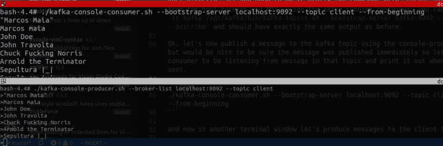

# 一个人管理他们所有人

> 原文：<https://dev.to/thegroo/one-to-run-them-all-1mg6>

在这篇文章中，我们将介绍如何运行 Kafka 来本地开发我们的应用程序，这将有助于运行未来的示例，并可用作基本参考，我将尝试与这种方法保持一致。

在本地运行 Kafka 进行开发有许多可能的方法，其中最常见的可能是:

*   手动下载 Kafka 和 Zookeeper 并在本地运行，
*   直接从命令行使用 Docker，
*   使用 docker-compose 文件，
*   使用汇合的 CLI 命令，
*   在云上运行它们。

在所有的可能性中，我发现在项目开发中使用 docker-compose 更直观、更容易维护。我使用过不同的方法，包括过去基于 VM 的解决方案，但是使用 docker-compose 带来了更好的开发者体验。所以我会在我的帖子里坚持这一点。

> 如果你还没有安装 docker 和 docker-compose，请查看我之前的帖子，我在那里指出了在你自己的环境中安装 docker 和 docker-compose 的正确文档。

Docker compose 使用一个简单的 YAML 文件，如果您需要更多地控制您在项目中构建的图像，也可以从 Docker 文件构建一些更高级的设置。Compose 还使您能够设置配置参数，并与其他团队成员共享存储库中的这些更改，如果您愿意，还可以重用它作为一个 [Swarm Cluster](https://docs.docker.com/engine/swarm/) 运行，因此我们将在这里主要介绍 docker-compose，因为这是我的偏好，我将提供一些提示和文档链接，介绍如何使用其他方法来完成它。

> 我认为有必要澄清一下，我并不主张在开发过程中在 docker 中运行所有的应用程序，它应该是你可能需要的依赖和模仿。在开发过程中，您可以直接从您选择的 IDE 中运行您的单元测试和应用程序，以更快的反馈周期获得更好的开发人员体验，这一点非常重要。

## 从 docker-compose 文件运行卡夫卡

Kafka 和 Zookeeper 有很多可用的 docker 镜像，你也可以使用它们的二进制文件来打包你自己的 docker 镜像。在这里，我将分享来自 [docker-hub](https://hub.docker.com/) 的几个现有选项的配置。

*   [wurstmeister 卡夫卡和动物园管理员 docker 形象](https://hub.docker.com/u/wurstmeister)。
*   融合的卡夫卡和动物园管理员形象。

本文中使用的合成文件的源代码是可用的，您可以使用:
克隆这个库

```
git clone git@github.com:stockgeeks/docker-compose.git 
```

Enter fullscreen mode Exit fullscreen mode

在您喜欢的 IDE 中打开克隆的项目。这篇文章的源代码在 one-to-run-them-all 文件夹下。在命令提示符下导航到该文件夹，运行接下来显示的 docker-compose 命令。如果您在运行这些命令时遇到问题，请确保按照上面共享的链接中的说明安装 docker 和 docker-compose，并检查这个兼容性列表。

> 在本例中运行 kafka 时，请注意项目上的配置，特别是 listener 和 advertised.listener 和 advertised.hostname，因为它们是理解我们如何将从 IDE 运行的应用程序连接到本文中运行的本地 kafka 开发代理的关键。

### kafa 香肠大师形象

对于这个初始示例，我们将使用来自 [wurstmeister](https://github.com/wurstmeister) 的最新 Kafka docker 图像，它可以在 [docker hub 这里](https://hub.docker.com/r/wurstmeister/kafka/)获得。

在这篇文章中，我们不会讨论像模式注册表这样的组件，我们的想法是保持它的简单性，专注于运行 Kafka，同时学习一些使用 docker 和 docker-compose 与它交互的方法。

让我们首先让它在后台运行，从项目中 one-to-run-them-all 文件夹内的一个 shell】

```
docker-compose up -d 
```

Enter fullscreen mode Exit fullscreen mode

然后，您可以使用`docker ps`来检查运行中的容器。如果你习惯使用多个命令行 shells，你可以在开发的时候[连续观看](https://en.wikipedia.org/wiki/Watch_(Unix)#See_also)其中一个 docker 容器，我通常是这样做的:`watch docker ps`当你想停止观看的时候用`CTRL + C`敲击键盘。

> 如果您使用的是 Mac 或 Windows，也可以安装并使用 watch 命令。或者，如果您有其他 docker 容器正在运行，您也可以只查看合成文件中的容器，从合成文件所在的目录:`watch docker-compose ps`

在另一个终端窗口中检查和跟踪容器日志，始终与 docker-compose 文件在同一文件夹级别:

```
docker-compose logs -f 
```

Enter fullscreen mode Exit fullscreen mode

现在 Kafka 已经在本地运行了，让我们发出一些命令来测试我们的设置，首先进入正在运行的 Kafka docker 容器:

```
docker exec -it kafka /bin/bash 
```

Enter fullscreen mode Exit fullscreen mode

现在您在运行 Kafka 容器的内部，并且可以访问在命令行中的`/opt/kafka/bin`下可用的 Kafka 支持脚本，让我们开始创建一个名为 client with 1 partition and replication factor 1 的主题。

```
./kafka-topics.sh --bootstrap-server kafka:9092 --create --topic client --partitions 1 --replication-factor 1 
```

Enter fullscreen mode Exit fullscreen mode

接下来让我们列出主题:

```
./kafka-topics.sh --bootstrap-server kafka:9092 --list 
```

Enter fullscreen mode Exit fullscreen mode

你应该看到`client`，因为这是我们刚刚创建的主题，但是让我们用`describe` :
获得更多的细节

```
./kafka-topics.sh --bootstrap-server kafka:9092 --topic client --describe 
```

Enter fullscreen mode Exit fullscreen mode

现在，您应该可以获得更多详细信息，如分区、领导者、副本和同步副本，在这种情况下，它们都与我们在创建主题时设置的 1 相同。

> 通过 docker 命令的一个小变化，您可以直接从主机执行相同的 kafka 命令，您所需要做的就是在命令前加上前缀`docker exec -it kafka`，这样从主机而不是 kafka 运行容器中，您可以运行:`docker exec -it kafka /opt/kafka/bin/kafka-topics.sh --bootstrap-server kafka:9092 --topic client --describe`，并且应该有与之前完全相同的输出。

好了，现在让我们使用 kafka 的控制台生成器向 kafka 主题发布一条消息，但最好确保消息立即发布，因此让我们启动一个消费者来监听该主题中的消息，并在发送新消息时将其打印出来。

```
./kafka-console-consumer.sh --bootstrap-server localhost:9092 --topic client --from-beginning 
```

Enter fullscreen mode Exit fullscreen mode

现在，在另一个终端窗口中，让我们向客户端发送消息主题:

```
./kafka-console-producer.sh --broker-list localhost:9092 --topic client 
```

Enter fullscreen mode Exit fullscreen mode

您的终端将处于等待状态，见下面的截图，用一个`>`，键入行并按回车键，消息将被产生给 Kafka，并由消费者终端中的客户端接收。

[](https://res.cloudinary.com/practicaldev/image/fetch/s--t8Lm38vz--/c_limit%2Cf_auto%2Cfl_progressive%2Cq_auto%2Cw_880/https://thepracticaldev.s3.amazonaws.com/i/rjqtzn8b0n6z2jiad1mt.png)

现在我们已经运行了 kafka，并且生成和使用了一些消息，
让我们检查 docker-compose 文件:

```
version: '3.2'

services:
  # https://github.com/wurstmeister/zookeeper-docker
  zookeeper:
    container_name: zookeeper
    image: wurstmeister/zookeeper:latest
    environment:
      ZOOKEEPER_CLIENT_PORT: 2181
    ports:
    - "2181:2181"

  # https://hub.docker.com/r/confluentinc/cp-kafka/
  kafka:
    container_name: kafka
    image: wurstmeister/kafka:2.12-2.2.1
    environment:
      ## the >- used below infers a value which is a string and properly 
      ## ignore the multiple lines resulting in one long string: 
      ## https://yaml.org/spec/1.2/spec.html
      KAFKA_ADVERTISED_LISTENERS: >- 
        LISTENER_DOCKER_INTERNAL://kafka:19092, 
        LISTENER_DOCKER_EXTERNAL://${DOCKER_HOST_IP:-kafka}:9092

      KAFKA_LISTENERS: >-
        LISTENER_DOCKER_INTERNAL://:19092,
        LISTENER_DOCKER_EXTERNAL://:9092

      KAFKA_LISTENER_SECURITY_PROTOCOL_MAP: >- 
        LISTENER_DOCKER_INTERNAL:PLAINTEXT,
        LISTENER_DOCKER_EXTERNAL:PLAINTEXT

      KAFKA_INTER_BROKER_LISTENER_NAME: LISTENER_DOCKER_INTERNAL
      KAFKA_ZOOKEEPER_CONNECT: zookeeper:2181
      KAFKA_OFFSETS_TOPIC_REPLICATION_FACTOR: 1
      KAFKA_LOG4J_LOGGERS: >- 
        kafka.controller=INFO,
        kafka.producer.async.DefaultEventHandler=INFO,
        state.change.logger=INFO

    ports:
    - 9092:9092
    depends_on:
    - zookeeper
    volumes:
    - /var/run/docker.sock:/var/run/docker.sock 
```

Enter fullscreen mode Exit fullscreen mode

要停止 kafka 和 Zookeeper，从合成文件所在的同一个文件夹中，使用命令行:`docker-compose down -v`这也将清理重新设置 Kafka 主题的已挂载卷，如果您想保留现有消息，可以从命令中删除-v。

### 融合的卡夫卡与动物园管理员形象

让我们现在运行卡夫卡[汇合码头工人形象](https://hub.docker.com/r/confluentinc/cp-kafka/)。
在项目的“one-to-run-them-all”文件夹下，有一个名为`docker-compose-confluent.yml`的 [second docker-compose](https://github.com/stockgeeks/docker-compose/blob/master/one-to-run-them-all/docker-compose-confluent.yml) 文件，要运行它，我们可以发出与之前相同的命令，在想要运行时使用选项`-f`指定文件名，但在我们这样做之前，请确保之前的容器已停止，如果没有，请从命令行运行:`docker-compose down -v`，这将停止我们之前启动的容器。

```
docker-compose -f docker-compose-confluent.yml up -d 
```

Enter fullscreen mode Exit fullscreen mode

检查容器是否正在运行，并像之前一样放置一个`watch docker ps`以确保带有 zookeeper 和 kafka 的汇合容器正在运行。如果是，让我们像以前一样执行相同的命令，主要区别是合流 kafka 有它自己的安装标准，因此 Kafka 脚本在`/usr/bin`下，这基本上允许从容器内的 shell 中的任何地方访问它们，所以继续并重复为上一个示例发出的相同命令以进入容器 shell `docker exec -it docker /bin/bash`，并且列出、发布、消费的命令几乎是相同的:

进入卡夫卡容器:

```
docker exec -it kafka /bin/bash 
```

Enter fullscreen mode Exit fullscreen mode

启动消费

```
kafka-console-consumer --bootstrap-server localhost:9092 --topic client 
```

Enter fullscreen mode Exit fullscreen mode

启动制作人

```
kafka-console-producer --broker-list kafka:9092 --topic client 
```

Enter fullscreen mode Exit fullscreen mode

> 默认情况下，对于使用该映像的开发，当客户端尝试使用或生成主题时，会自动创建主题，在生产环境中应该禁用这一功能。

## 命令行使用 docker 图片

这个选项只需要你安装了 docker，而不是 docker-compose，你将从命令行运行 Kafka 和 zookeeper 的 Docker 镜像，就这样。确保你已经安装了 Docker。棘手的部分是挑选 docker 图像，有许多可用的。我认为最流行的(需要进一步研究来证实)是:

*   wurstmeister
*   融合的卡夫卡意象

> 如果你喜欢任何其他卡夫卡的形象，请留下评论。

## 命令行使用二进制

这种方法在 Apache Kafka 官方文档[快速入门](https://kafka.apache.org/documentation/#quickstart)一节中有很好的记录，提供了下载二进制文件所需的所有链接。

## 汇合 cli 工具

Confluent 提供了一种非常用户友好的方式来运行本地 kafka 进行开发，如果它的平台包括许多额外的功能，包括管理和监控工具等等。

如果你使用融合堆栈，这可能是一个很好的选择。他们的网页上有非常详细的文档:

*   [融合 CLI](https://docs.confluent.io/current/cli/index.html)
*   [Docker 开发者指南](https://docs.confluent.io/current/installation/docker/development.html)

### 托管云中的卡夫卡

如果您计划在完全自动化的云中运行 kafka 集群，有几个选项，最自然的是[融合云](https://www.confluent.io/confluent-cloud/)因为它是由许多 Kafka 核心贡献者及其创造者组成的团队管理的，目前您可以将融合管理的 Kafka 集群部署到 Google Cloud 或 AWS。

其他可能的选项包括:

[IBM Event Streams for IBM Cloud](https://www.ibm.com/cloud/event-streams-for-cloud)是由 IBM 提供的一个完整的自动化 Kafka 托管服务。

对于 Azure，请查看他们的[快速入门文章](https://docs.microsoft.com/en-us/azure/hdinsight/kafka/apache-kafka-get-started)和这篇文章中的更多[细节，以及额外的链接和详细信息。](https://azure.microsoft.com/en-us/blog/processing-trillions-of-events-per-day-with-apache-kafka-on-azure/)

对于 AWS，有 AWS 官方服务 [MSK](https://aws.amazon.com/msk/) ，但你也会发现不同的选项和公司通过 AWS 提供 Kafka 托管集群服务。

对于谷歌云，建议使用上面提到的[融合提议](https://console.cloud.google.com/marketplace/details/confluent-saas/confluent-cloud?pli=1)。

### Kubernetes 或 Swarm 版本

我在这里没有任何经验，但在 Kubernetes 有一些专门针对运行卡夫卡的讲座。一些链接:

*   [在 Kubernetes 实用指南中运行卡夫卡](https://www.confluent.io/kafka-summit-lon19/running-kafka-in-kubernetes-practical-guide)
*   [在 Kubernetes 运行生产 Kafka 集群](https://www.confluent.io/kafka-summit-lon19/running-production-kafka-clusters-kubernetes)

## 接下来是什么

所以在这篇文章中，我试着介绍了如何在本地开发 kafka 基础设施。这是即将发布的帖子的基础，在这些帖子中，我们将看到更多使用 Springboot 开发 Kafka 应用程序的内容。