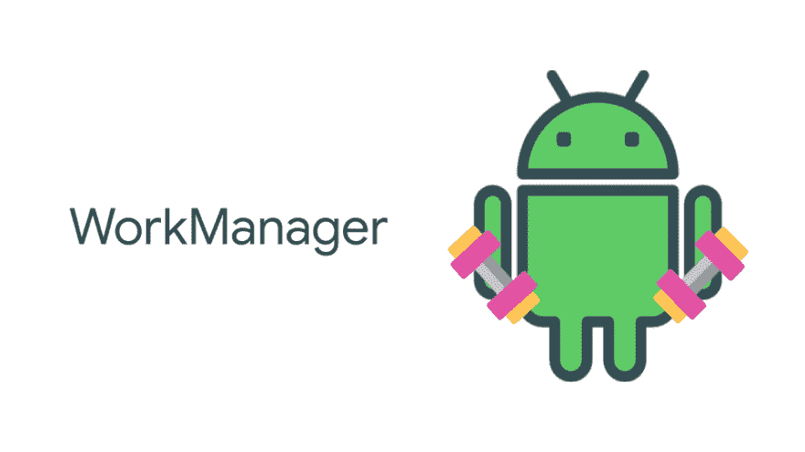
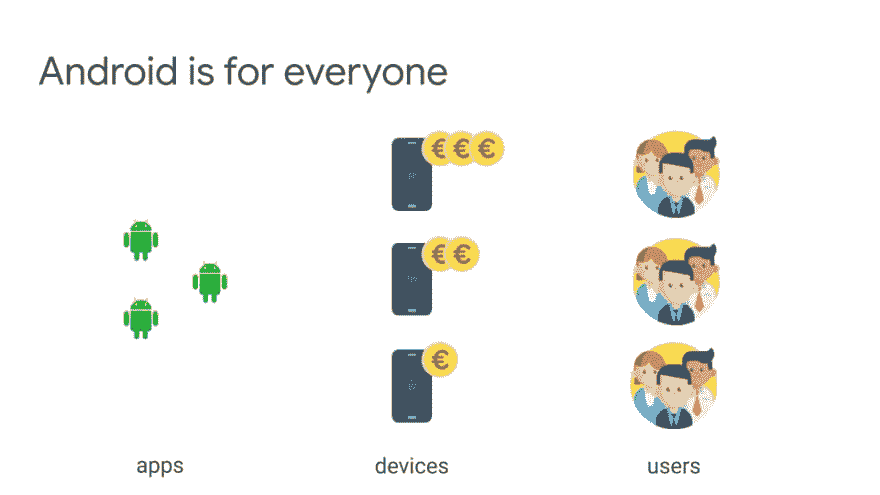
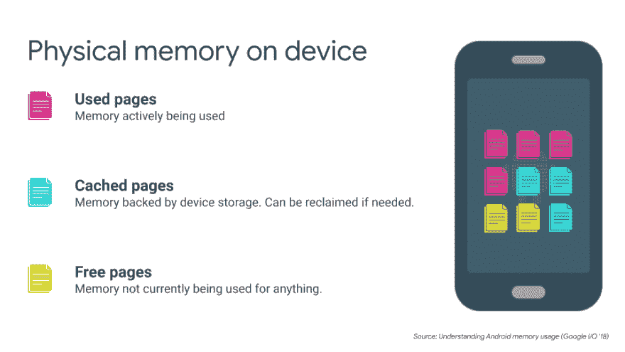
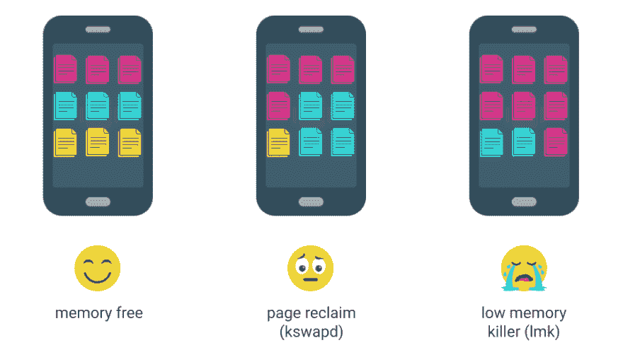
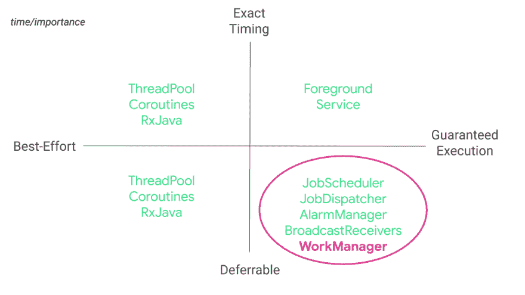

# 使用 WorkManager 锻炼您的任务—简介

> 原文：<https://dev.to/magdamiu/workout-your-tasks-with-workmanager-intro-17na>

### 使用工作管理器完成任务—简介

直到现在，为了在 Android 中执行后台工作，开发人员必须在多个执行选项之间进行选择。在 Google I/O 2018 上，Android 团队推出了作为 Android Jetpack 一部分的 [*WorkManager*](https://developer.android.com/topic/libraries/architecture/workmanager) 。

这个库提供了一个简单明了的接口来指定可推迟的异步任务以及它们应该何时运行。这篇博文是关于*工作管理器*的新系列的第一篇。该系列将概述 Android 内存模型、现有的后台解决方案、幕后发生的事情以及我们为什么以及何时应该使用*工作管理器*。

此外，我们将发现关于*工作管理器*库的架构的细节，以及关于它的主要组件(*工人*、*工作请求*、*工作管理器*、*工作信息*)的细节。最后，我们将重点介绍如何使用*工作管理器*处理以指定顺序运行的链式任务序列、唯一命名序列、传递和返回值的任务，以及如何应用约束来决定何时运行任务。

在这篇博文中，我将介绍:

*   Android 内存模型
*   Android 电池优化
*   当前后台处理解决方案
*   工作管理器放在后台工作模式的什么位置

在移动世界里， *app 性能*对*用户留存*有重要影响。但是有哪些问题会让用户不高兴呢？就我个人而言，我发现了两个可能让用户不高兴的主要问题:

*   快速耗尽的电池
*   内存不足的电话

研究表明，大约:

*   **53%** 的用户卸载或移除了存在严重问题(如崩溃、死机或出错)的移动应用，以及
*   **36%** 会因为大量使用电池而停止使用手机应用。

这就是为什么要重视手机 app 性能的原因。❗️❗️❗️

### T2】📑安卓内存型号

作为一名 android 开发人员，我知道当我开发一个应用程序时，它不是关于我，而是关于将与我构建的应用程序交互的用户。所以这完全是关于 android 生态系统的，因为*Android 面向所有人*。我说的 Android 生态系统是什么意思？

*   应用程序
*   设备
*   用户

就设备而言，它们可以根据其配置分为 3 个主要类别。因此，我们有入门级设备、中端设备和高端设备。

当我们谈论内存可用性和使用时，我们应该更多地关注入门级设备，因为高端和中端设备具有良好的内存配置。如果我们不开发能够在入门级设备上正常工作的应用，那么这些设备将停止生产，基于此，我们的大部分用户也将消失。这不是一件好事。那些用户会失望的。

在一个设备上，物理内存是按页组织的，每页大约有 4 千字节。这些页面可以有三种主要状态:已用、缓存和自由页面。

如果我们在开始的时候给设备施加内存压力，我们会有一些空闲内存可用，所以我们有一个快乐的设备，因为如果一个应用程序需要内存，我们有足够的内存。随着时间的推移，因为我们使用了更多的内存，所以空闲内存会减少，在这种情况下，linux 内核有一种称为 ***kswapd*** 的机制，它的工作是找到更多的空闲内存。该进程完成的主要操作是回收缓存的页面。此操作需要一些时间来重新加载缓存的页面，但是对用户不可见。

我们继续使用设备内存，缓存页面的数量也开始下降，系统开始崩溃，这是一件坏事。这时 ***低内存杀手*** 出现，开始杀死正在运行的进程。这对内存来说是一件好事，但它可能会影响用户当前使用的应用程序。

### T2】📑安卓电池优化

关于电池优化，Android 在最新版本中提供了电池节省功能，如:

*   在 *Marshmallow* 中引入了深度睡眠模式——设备在不移动的情况下进入深度睡眠——关闭后台活动
*   在*Nougat*——移动中打瞌睡——让设备进入较浅的睡眠状态，并更频繁地醒来检查是否有未完成的任务要做(关闭一部分后台工作)
*   在奥利奥，他们被介绍了后台服务的限制
*   而在*安卓派*——基于应用待机的自适应电池——应用分 4 个桶移动(*活跃、工作集、频繁*和*稀有*)

### T2】📑后台处理解决方案

多年来，Google 为开发人员提供了各种方法来帮助他们在后台完成或安排工作。

*   JobScheduler 是一个很棒的新 API，但是只支持 Android Lollipop (API 21)和更高版本
*   Firebase JobDispatcher 向后兼容冰激凌三明治(API 15)——但它需要 Google Play 服务，这种服务又大又重，在中国还不可用。从明年 4 月 20 日起，它也将被归档。目前它已被弃用。
*   *AlarmManager* 在所有 API 级别上工作，但需要 *BroadcastReceiver* 在设备重启后仍然存在，并且还受到一些电源管理器的限制，这是在 Android Pie 中引入的。

因此，看起来我们有两个选择，要么排除旧设备，要么花几个小时从头开始构建。

组织后台解决方案的一个好方法是根据时间和重要性来拆分它们:

*   纵轴是工作的时间:工作应该在指定的时间完成，或者可以等待一段时间。
*   横轴代表工作的重要程度。应该在 app 前台的时候或者需要在某个点的时候做。

### 📑工作管理器

***工作管理器*** 是第四类可推迟但需要执行的任务的一部分。

> " WorkManager 是一个用于管理可推迟和有保证的后台工作的库."

**可推迟工作**:任务可以稍后运行，仍然有用(上传日志 vs 发送消息)

**保证**:即使应用程序关闭或设备重启，任务也会运行(将映像备份到服务器)

### **❓** 为什么要使用工作管理器？

*   **向后兼容**不同的操作系统版本(API 级别 14+)
*   遵循系统健康状况**最佳实践**
*   支持**一次性**和**周期性任务**
*   支持**带输入/输出**的链式任务
*   定义任务运行时的**约束**
*   **保证任务执行**，即使 app 或设备**重启**

### ❓When 要用工作管理器？

*   定期提取数据
*   将图像/文件上传到服务器
*   在应用程序和服务器之间同步数据
*   向服务器发送日志
*   对数据执行昂贵的操作

在下一篇文章的[中，我们将深入研究每个工作管理器实体，并检查它们如何在我们的代码中应用。敬请期待！](https://medium.com/@magdamiu/workout-your-tasks-with-workmanager-main-components-1c0c66317a3e)

暂时就这些了，希望有帮助！如果有不清楚的地方或有问题，请尽情享受，并随时发表评论。感谢您的阅读！🙌🙏😍✌

* * *