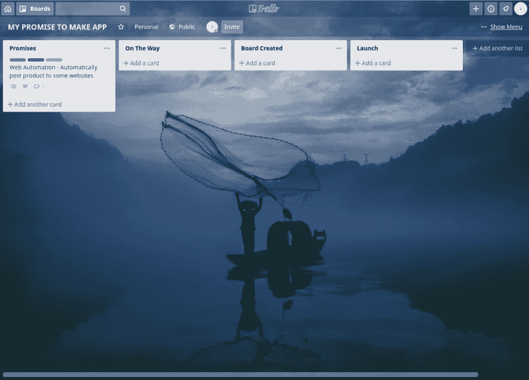
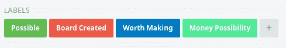

# 我决定列出我所有非开发者朋友的想法

> 原文：<https://dev.to/mandaputtra/i-decided-to-list-all-my-non-developer-friend-s-idea-3np8>

我没有很多*开发者/程序员朋友*我的大部分朋友大多是正常人。所以像这样的事情可能会发生。有时候作为一名开发人员，你会有一两个朋友告诉你他们需要的东西。

这里常见的搭讪台词:

*   “嘿，你能开发这个应用吗？我可能会付给你……”

*   “嘿，我的钱不够，但我可以帮你卖这个应用”

*   “这个 app 你能做出来吗？但是加上这些选项……”

虽然我忙于为别人工作，但我认为我仍然有机会结交那些朋友。我是认真的，我为它创建了一个 Trello 板。

如果你想知道这里的标签是什么，那就是:

## 可能

你朋友的想法有可能实现。这不是一个黑脸书或 Instagram 账户的应用程序(我们都有过“你能黑他的 Instagram 账户吗，他似乎在欺骗我”)。

我总是，总是，总是这样对我的朋友说，“如果你能解释它是如何工作的或者如何做的，我也许能做出那些应用”。所以当他们问“你能开发一个可以黑掉脸书账户的应用吗？”我会回答“先告诉我如何黑掉脸书，然后也许我们能成功”

## 值得制造

真的，这款应用值得一做。这是一件超出你舒适区的事情，一件具有挑战性的事情！

## 金钱可能性

你可能不想免费工作，可能你的朋友想付钱给你，或者这些想法可以成为一个产品或创业！

## 板已创建

你已经把那个想法当真了！也许这只是一个愚蠢的应用程序，或者没有那么大的东西，但你已经有时间并对应用程序进行了一些研究，所以你创建了一个董事会，并告诉你的朋友“嘿，你告诉我的那个应用程序，我正在制作它的路上，可能花了很长时间，也可能没有:)

只要做个笔记，因为每个想法都值得一听。