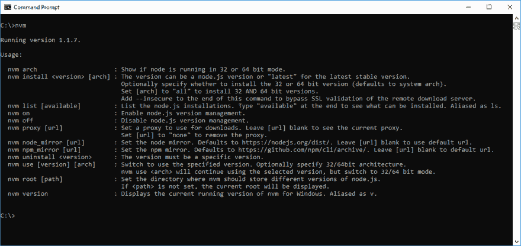

# 如何在 Windows 上使用 node 的多个版本

> 原文：<https://dev.to/hadrysmateusz/how-to-use-multiple-versions-of-node-on-windows-1op9>

无论您是 linux 用户，还是 node 新手。在某些时候，您可能需要使用 node 的多个版本。无论您是在多个项目上工作，还是希望它用于测试目的，节点版本管理器都是非常有用的工具。在 linux 上很简单，只需安装 nvm 就可以了。在 windows 上没那么简单...或者是？

### nvm-windows 来救援了！

这是一个功能齐全的 Windows 命令行节点版本管理器。它甚至附带了一个简单的 gui 安装程序，这很棒。

### 以下是启动和运行 nvm-windows 的步骤

1.  如果您已经安装了任何版本的 node，请确保首先卸载它。确保也删除任何剩余的节点和 npm 目录(例如“C:\Program Files\nodejs”和“C:\ Users<user_name>\ AppData \ Roaming \ NPM”)</user_name>
2.  从发布页面获取安装程序:[https://github.com/coreybutler/nvm-windows/releases](https://github.com/coreybutler/nvm-windows/releases)
3.  完成安装过程，nvm 将自动添加到您的路径中
4.  运行 cmd 或您可能正在使用的任何终端模拟器
5.  使用命令`nvm install version_number`，其中版本号是您要安装的节点版本(例如 8 或 10)
6.  对您需要的每个版本重复上面的命令
7.  最后，运行`nvm use full_version_number`，其中完整版本号是您当前想要使用的节点的完整版本(例如 8.16.0 或 10.0.0)

### nvm-windows 可以用 Yarn 吗？

是...但是...不幸的是，在 nvm-windows 上使用 yarn 存在一些问题。基本上，如果你想在 nvm-windows 上使用 yarn，你必须卸载 yarn(如果你使用 gui 安装程序安装的话)。那么你将不得不在每次切换节点版本时使用`npm install --global yarn`来安装它。使用 yarn([https://stack overflow . com/questions/43108816/can-yarn-and-nvm-coexist-on-windows](https://stackoverflow.com/questions/43108816/can-yarn-and-nvm-coexist-on-windows))全局安装软件包时也会出现问题，因此您可能必须使用 npm。

### WSL 呢？

如果您来自 linux，您可能会尝试在 WSL 上运行常规的 nvm。它可能对你有用，但是我个人有很多问题，所以我不推荐它。WSL2 可能会解决这些问题，所以祈祷吧。

### 更多信息

如果你需要更多的信息，运行不带任何参数的`nvm`来显示可用命令的列表，或者访问项目的 GitHub 页面:[https://github.com/coreybutler/nvm-windows](https://github.com/coreybutler/nvm-windows)

### 感谢阅读

当我第一次发现 nvm-windows 时，我认为它会很难安装，但它让我感到惊讶，所以我决定写这篇文章向其他人展示 windows 上的节点版本管理实际上是多么容易。

### 你可能喜欢的其他文章

 [## 在 JavaScript 中获取字符串中所有字符的 4 种方法

### 马太福音 17 章 20 节 2 分钟

#javascript #webdev #beginners #programming](/hadrysmateusz/how-to-get-all-characters-in-a-string-57c7) [## 使用现代 CSS 的漂亮的自定义列表样式

### 马太福音 12 章 20 节 7 分钟

#css #tutorial #webdev #design](/hadrysmateusz/custom-list-styles-using-marker-before-4gi4)