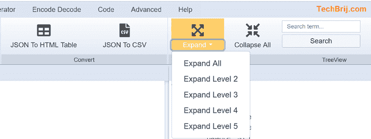

# 面向开发人员的最佳在线 JSON 浏览器工具

> 原文：<https://dev.to/techbrij/best-online-json-viewer-tool-for-developers-3nll>

如果您是一名 web 开发人员，那么您可能需要在日常工作中使用 JSON。浏览器开发工具对于普通的 JSON 检查是很好的，但是对于大型 JSON，您可能需要一些工具。BrijPad 是一款面向 web 开发者的在线免费工具，它包含了针对不同操作的 JSON tab。

## 快速演示

[https://www.youtube.com/embed/nOgU_JFkK1s](https://www.youtube.com/embed/nOgU_JFkK1s)

## 特性

*   酷炫的 UI，MS Office 的外观和感觉
*   将输入和输出并排可视化
*   树视图来表示 JSON 并遍历属性。
*   展开折叠功能。还允许您将 TreeView 扩展到特定级别。
*   搜索功能
*   过滤 JSON 字段
*   具有不同缩进选项的 JSON 格式
*   JSON 缩小
*   JSON 到 CSV 导出
*   JSON 到 HTML 表格导出

## 截图

## 有用的链接

工具: [BrijPad](https://techbrij.com/brijpad/)
文档/更多功能: [BrijPad 文档](https://techbrij.com/category/products/brijpad)