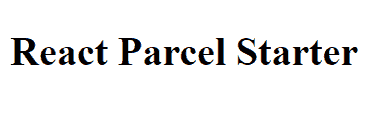

# 使用 Parcel.js 快速入门

> 原文：<https://dev.to/akhilaariyachandra/getting-started-in-react-with-parcel-js-4k3k>

> PS——这最初发布在我的[博客](https://akhilaariyachandra.com/getting-started-in-react-with-parcel-js/)上。如果您想了解 React 和 JavaScript 的更多信息，请查看它！

**TL；dr**——克隆并运行[源代码](https://github.com/akhila-ariyachandra/react-parcel-starter)。

通常当开始一个 React 项目时，开发人员会使用 **create-react-app** 。虽然这在很多情况下是一个很好的选择，但我觉得它有点太臃肿了，尤其是在**弹出**它之后。我还发现手动设置和维护一个 **webpack** 配置需要一些工作。[package](https://parceljs.org/)非常适合与 React 一起使用，因为在设置时不需要进行任何配置。这也有助于在 Parcel 中构建应用程序，速度也非常快。

首先让我们用`yarn`或`npm`初始化一个项目。我将使用`yarn`。

```
yarn init --yes 
```

Enter fullscreen mode Exit fullscreen mode

然后，让我们安装包作为一个开发依赖。

```
yarn add parcel-bundler -D 
```

Enter fullscreen mode Exit fullscreen mode

之后，让我们通过安装开发依赖项并创建`.babelrc`文件
来设置**巴别塔**

```
yarn add @babel/core @babel/preset-env @babel/preset-react @babel/plugin-proposal-class-properties -D 
```

Enter fullscreen mode Exit fullscreen mode

安装完依赖项后，使用下面的代码在项目根目录下创建`.babelrc`文件。

```
{  "presets":  ["@babel/preset-env",  "@babel/preset-react"],  "plugins":  ["@babel/plugin-proposal-class-properties"]  } 
```

Enter fullscreen mode Exit fullscreen mode

这是 Parcel 使用 React 所需的所有设置。现在让我们设置反应。首先，我们需要反应依赖关系。

```
yarn add react react-dom 
```

Enter fullscreen mode Exit fullscreen mode

如果你想在你的代码中使用 ***async/await*** ，需要一个额外的依赖项。

```
yarn add @babel/polyfill 
```

Enter fullscreen mode Exit fullscreen mode

接下来，我们需要一个应用程序的入口点。关于 Parcel 的好处是条目文件不必是 JavaScript 文件。在我们的例子中，它将是一个 HTML 文件。
创建一个名为`src`的文件夹。这个文件夹将包含所有的源代码。在`src`文件夹中创建`index.html`文件，这将是应用程序的入口点，并添加以下代码。

```
<!DOCTYPE html>
<html lang="en">
  <head>
    <meta charset="UTF-8" />
    <meta
      name="viewport"
      content="minimum-scale=1, initial-scale=1, width=device-width, shrink-to-fit=no"
    />

    React Parcel Starter
  </head>
  <body>
    <div id="root"></div>
    <script src="index.js"></script>
  </body>
</html> 
```

Enter fullscreen mode Exit fullscreen mode

之后，我们将创建`index.js`文件(也在`src`中)，它将把根 React 组件连接到`index.html`文件。

```
// src/index.js
import React from "react";
import ReactDOM from "react-dom";
import App from "./App.js";
import "@babel/polyfill";

ReactDOM.render(<App />, document.getElementById("root")); 
```

Enter fullscreen mode Exit fullscreen mode

接下来，让我们在`App.js`文件中创建根组件。

```
// src/App.js
import React from "react";

const App = () => {
  return (
    <div>
      <h1>React Parcel Starter</h1>
    </div>
  );
};

export default App; 
```

Enter fullscreen mode Exit fullscreen mode

最后剩下要做的就是添加脚本来运行应用程序。在`package.json`文件中添加以下内容。

```
"scripts":  {  "dev":  "parcel ./src/index.html",  "build":  "parcel build ./src/index.html"  } 
```

Enter fullscreen mode Exit fullscreen mode

`dev`将用于运行开发的 app。不要担心在运行时修改代码后重新启动服务器，因为 Parcel 会自动完成这项工作。`build`用于在项目根目录下的`dist`文件夹中制作 app 的量产版。
让我们通过运行`dev`命令来检查是否一切都设置正确。

```
yarn dev 
```

Enter fullscreen mode Exit fullscreen mode

当您在浏览器中访问`localhost:1234`时，您应该会看到

[](https://res.cloudinary.com/practicaldev/image/fetch/s--QL_z2gv6--/c_limit%2Cf_auto%2Cfl_progressive%2Cq_auto%2Cw_880/https://res.cloudinary.com/dv1ustbp5/image/upload/v1560588436/blog/react%2520parcel%2520starter/react-parcel-starter_hfbes2.png)

现在，您可以像往常一样从这里继续创建 React 应用程序。这里所做的一切的源代码都可以在 [GitHub](https://github.com/akhila-ariyachandra/react-parcel-starter) 中找到。