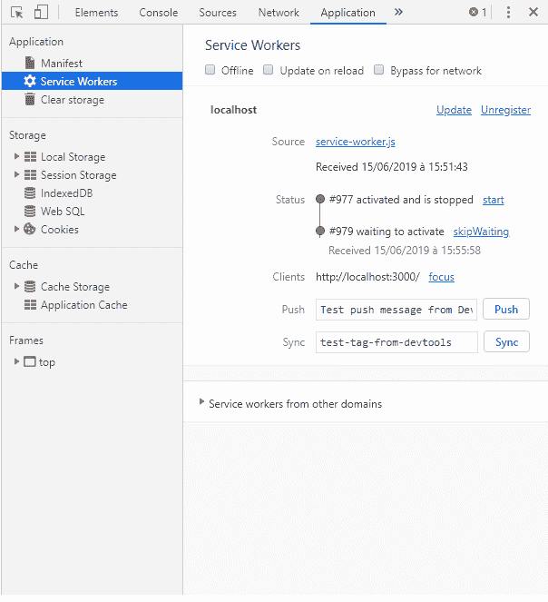
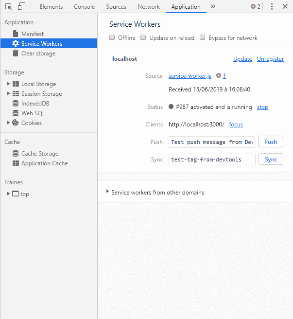
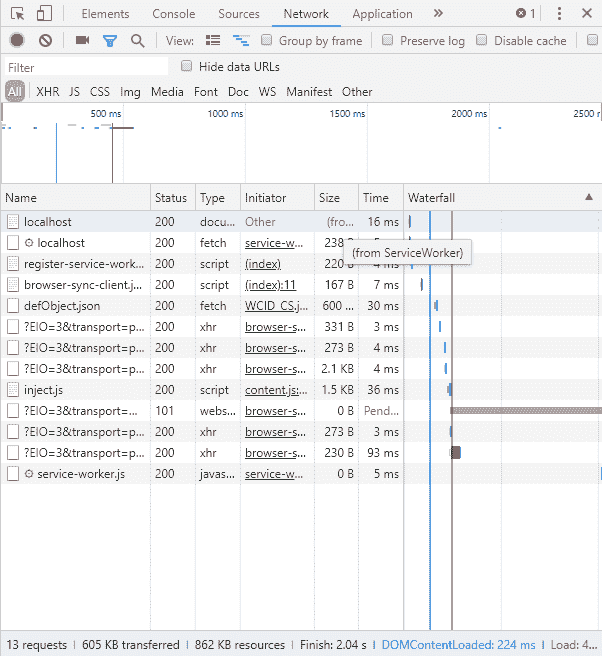
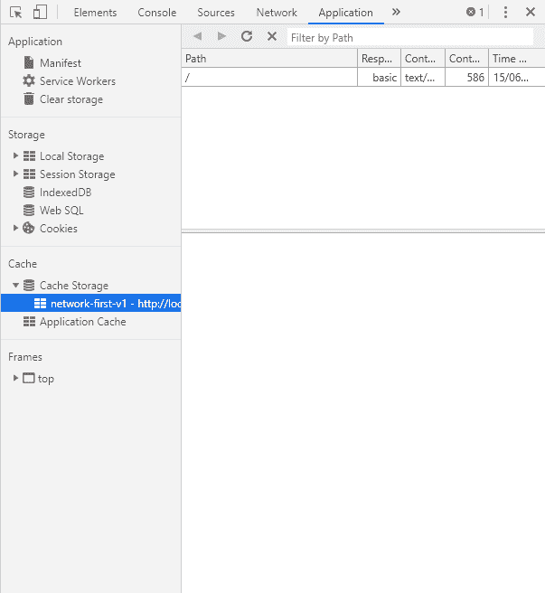

# 浏览器工作者-服务工作者变得简单

> 原文：<https://dev.to/khalyomede/browserworker-service-workers-made-easy-2dc4>

欢迎大家！

我很高兴向你展示我的最新项目 [BrowserWorker](https://github.com/khalyomede/browser-worker) 。这个库的目标是帮助您更容易地建立一个服务工作者，而不是必须处理大量冗长的语法或复制/粘贴来使用特定的缓存策略。

在我写这篇文章的时候，这个库还处于早期开发阶段，只能通过 WebPack、Browserify 或者其他任何为浏览器传输代码的工具来使用。在未来的版本中，您将能够从 CDN 中使用它。

如果你喜欢这个库的想法，让我们看看如何使用它！

[](https://i.giphy.com/media/4GXUa4U05Q0JAM972c/giphy.gif)

## 安装

在一个新的文件夹中，初始化一个节点项目。对于本主题的其余部分，我将使用`yarn`，但是您可以使用任何您喜欢的依赖管理器。

```
yarn init --yes 
```

*我使用`--yes`跳过填充配置。*

然后，我们将安装  。

```
yarn add --dev @khalyomede/browser-worker 
```

我将安装的其余工具是为了能够创建一个浏览器兼容的代码。如果您已经使用了 WebPack 或 Rollup 之类的工具，可以跳过这一步，跳到下一节。

为了继续，我将添加`gulp`、`gulp-bro`、【browserify】、`gulp-plumber`(不在第一次出错时终止我的构建)、`@babel/core`、`@babel/preset-env`(传输 ES6 语法)、`@babel/register`(能够在我的`gulpfile.js`中使用 ES6)、`babelify`(将其传递给`gulp-bro`、`browser-sync`(当文件被更改和保存时重新加载我们的页面)。

```
yarn add --dev gulp gulp-bro gulp-plumber @babel/core @babel/preset-env @babel/register babelify 
```

然后，我将创建一个`gulpfile.babel.js`来使用 gulp recipes，以便生成一个浏览器兼容的代码。

```
// your-app/gulpfile.babel.js

import { src, dest, watch, series } from "gulp";
import browserify from "gulp-bro";
import plumber from "gulp-plumber";
import browserSync from "browser-sync";

const browser = browserSync.create();

const js = () =>
  src("src/**/*.js")
    .pipe(plumber())
    .pipe(browserify({ transform: ["babelify"] }))
    .pipe(dest("dist"))
    .pipe(browser.stream());

const reload = done => {
  browser.reload();

  done();
};

const start = () => {
  browser.init({
    server: {
      baseDir: "dist"
    }
  });

  watch("src/**/*.js", series(js, reload));
};

export { start }; 
```

我需要更新我的`package.json`,以便能够使用一个`start`命令，它将调用`gulp watch`,并在文件发生变化时传输我的文件。

```
...
"scripts": {
  "start": "gulp start"
}
... 
```

我还需要一个`.babelrc`文件来设置我的预置:

```
{
  "presets": ["@babel/preset-env"]
} 
```

我们可以走了！您现在可以运行 start 命令了。

```
yarn start 
```

您将看到您的浏览器将打开，页面将显示 404。这完全没问题，我们将很快创建 html 文件。

## 设置

首先，我们将创建服务工作者本身，然后创建将注册它的脚本。

在文件`src/service-worker.js`中，添加这段代码。

```
// your-app/src/service-worker.js
import { BrowserWorker } from "@khalyomede/browser-worker";

BrowserWorker.enableDebug(); 
```

在保存时，您应该看到已经生成了一个新文件`dist/service-worker.js`。不敢看，年轻的傻瓜！它是由黑魔法和年轻的实习蟒蛇的血液制成的。

上面的代码将由服务人员运行，但是在我们注册它之前它不能运行。

在另一个文件`register-service-worker.js`中，添加这段代码。

```
// your-app/src/js/register-service-worker.js
import { BrowserWorker } from "@khalyomede/browser-worker";

BrowserWorker.enableDebug();

BrowserWorker.setServiceWorkerPath("/service-worker.js").registerServiceWorker(); 
```

同样，保存这个文件应该会创建它的 dist 副本文件。

这段代码负责在您的页面上注册您的服务人员。

最后，为了查看这个设置的结果，我们将创建一个 HTML 文件来引用我们的`register-service-worker.js`文件。在 dist 文件中创建它**(虽然有点脏，但对这个展示来说很好)。** 

```
<!DOCTYPE html>
<html lang="en">
  <head>
    <meta charset="UTF-8" />
    <meta name="viewport" content="width=device-width, initial-scale=1.0" />
    <meta http-equiv="X-UA-Compatible" content="ie=edge" />
    Document
    <script type="text/javascript" src="/js/register-service-worker.js" async></script>
  </head>
  <body>
    <h1>Hello from the index HTML</h1>
  </body>
</html> 
```

现在你可以回到你的浏览器，重新加载页面`http://localhost:3000`来查看页面。

打开 developper 控制台，您应该会看到以下消息:

```
[BrowserWorker][15:51:43.598] service worker registered (scope: http://localhost:3000/). 
```

如果您重新加载您的页面，您将看到您的服务人员现在在线。

[](https://res.cloudinary.com/practicaldev/image/fetch/s--dN9OXpgh--/c_limit%2Cf_auto%2Cfl_progressive%2Cq_auto%2Cw_880/https://thepracticaldev.s3.amazonaws.com/i/rbtt3sw62c76lahei87v.png)

因为你在`Application`面板上(在 Chrome 上)，试着检查`Offline`选项并重新加载你的页面...是的，它完全搞糟了你的应用程序，一只野生恐龙出现了！

[](https://i.giphy.com/media/s239QJIh56sRW/giphy.gif)

## 设置缓存策略

因为您没有告诉您的服务人员处理请求，所以什么也没有发生。让我们通过在主页上使用网络优先策略来解决这个问题。

像这样更新你的`service-worker.js`文件。

```
import { BrowserWorker, CacheStrategy } from "@khalyomede/browser-worker";

BrowserWorker.enableDebug();

BrowserWorker.setCacheStrategy(CacheStrategy.NETWORK_FIRST)
  .setCacheName("network-first-v1")
  .addRoute("/");

BrowserWorker.listenRequests(); 
```

现在，保存文件后，您应该在控制台中看到类似这样的内容。

```
[BrowserWorker][16:05:26.652] service worker registered (scope: http://localhost:3000/).
[BrowserWorker][16:05:28.457] waiting for others instances before installing (if you want to skip waiting, use BrowserWorker.disableWaitingOtherInstances()) 
```

在您的应用程序面板中，您可以看到您的新服务人员正在等待另一个服务人员终止安装(“等待激活”)。要解决这个问题，请在启用调试模式后添加这一行。

```
import { BrowserWorker, CacheStrategy } from "@khalyomede/browser-worker";

BrowserWorker.enableDebug();
BrowserWorker.disableWaitingOtherInstances(); // this one

BrowserWorker.setCacheStrategy(CacheStrategy.NETWORK_FIRST)
  .setCacheName("network-first-v1")
  .addRoute("/");

BrowserWorker.listenRequests(); 
```

现在你应该在你的控制台上看到更好的结果:

```
[BrowserWorker][16:08:38.669] service worker registered (scope: http://localhost:3000/).
[BrowserWorker][16:08:40.637] skipped waiting for other instances to finish.
[BrowserWorker][16:08:41.653] cleaned old caches. 
```

在您的应用面板中，不再有服务人员等待安装。

[](https://res.cloudinary.com/practicaldev/image/fetch/s--z5Jy7Ie2--/c_limit%2Cf_auto%2Cfl_progressive%2Cq_auto%2Cw_880/https://thepracticaldev.s3.amazonaws.com/i/f0xd8i2eip9hfel5am1e.png)

重新加载你的浏览器，看看网络面板。

[](https://res.cloudinary.com/practicaldev/image/fetch/s--lR0LLmGR--/c_limit%2Cf_auto%2Cfl_progressive%2Cq_auto%2Cw_880/https://thepracticaldev.s3.amazonaws.com/i/lfuehezeg4hmpzlhhpbw.png)

你的主页似乎已经被你的服务人员处理过了，恭喜你！因为您要求您的服务人员首先从网络获取它，所以它也很好地将您的响应放在缓存中。

再次打开应用程序面板，检查“缓存”部分。

[](https://res.cloudinary.com/practicaldev/image/fetch/s--9dLf5vlT--/c_limit%2Cf_auto%2Cfl_progressive%2Cq_auto%2Cw_880/https://thepracticaldev.s3.amazonaws.com/i/1d04vdfgy4rcw7tcv5qv.png)

你知道这意味着什么吗？哦，是的，你知道这意味着什么！

[](https://i.giphy.com/media/H0EBDM4Vk6880/giphy.gif)

再次选中“离线”复选框并重新加载页面:离线 web 应用程序！

## 结论

在第一次介绍如何使用 BrowserWorker 之后，我们成功地使用了缓存策略来响应在线和离线网络条件。

服务人员正在变得成熟，这就是为什么我想创建这个库来帮助你在应用程序中使用它。

如果你注意到一些问题，请随意制造问题。这个图书馆的一些部分仍未被测试，所以在丛林中要小心。

最后但同样重要的是，确保您阅读了 README 的`Advice`部分，它包含了宝贵的信息，即使您想在没有这个库的情况下自己尝试 Service Worker。

如果你想更多地使用这个库，比如能够提前缓存一个资源来重新创建“以后脱机阅读”的特性，等等，一定要查看文档中的自述:[https://www.npmjs.com/package/@khalyomede/browser-worker](https://www.npmjs.com/package/@khalyomede/browser-worker)

我希望你能像我一样玩得开心，学到东西，也许想在你的应用程序中尝试这项技术。

快乐缓存！

[](https://i.giphy.com/media/3og0IzFCXnbb5uURH2/giphy.gif)