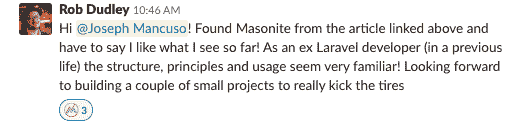

# Masonite 2.2 发布——现代 Python Web 框架！

> 原文：<https://dev.to/masonite/masonite-2-2-released-the-modern-python-web-framework-2034>

# 简介

作为 Masonite 的创建者和超级快速发展的 Masonite 社区的一员，我非常兴奋地将它作为 Masonite 的下一个主要版本发布给全世界。

很多人都为这个版本付出了很多努力。我不能把这次发布完全归功于我。无数个小时编写新功能，提取旧功能，在闲聊中简单地谈论新功能。

Masonite 在过去一年半的时间里成长了很多。我可以发表一篇完整的帖子来介绍使用 Masonite 的所有特性和好处，所以下面只是关于该社区和这个特定版本的一些最新亮点:

# 发布亮点:

*   GitHub 上现在有将近 1000 颗星星

*   Masonite Slack channel 中的 230 多人

*   上百页的文件。

*   我专门为 Masonite 构建了一个非常棒的新验证库，我在 2.2 中经常使用它。

*   Masonite 的全新测试模块。

*   添加了一种更好的方法来测试数据库和创建集成测试。

*   Masonite 2.1 上的几十项生活质量改进

*   通常向后兼容 Masonite 2.1。一些升级的小改动。

# 社区

这是社区在 Slack 聊天中谈论 Masonite 的一小部分。我真的很荣幸能够成为建设共济会的一份子。在 Python 社区中，我们有一些最热情的欢迎者，这太棒了。喜欢看到开发人员帮助其他开发人员。请务必使用帖子底部的链接加入。

# 了解更多

要了解有关该框架的更多信息并开始使用它，以下是一些帮助链接:

松弛:[http://slack.masoniteproject.com/](http://slack.masoniteproject.com/)

文件:[http://docs.masoniteproject.com](http://docs.masoniteproject.com)

人们选择 Masonite 而不是 Django 的 5 个原因:[https://dev . to/mason ite/5-reasons-why-people-is-choose-mason ite-over-Django-ic3](https://dev.to/masonite/5-reasons-why-people-are-choosing-masonite-over-django-ic3)

2.2 新增功能:[https://docs . masonite project . com/v/v 2.2/whats-New/masonite-2.2](https://docs.masoniteproject.com/v/v2.2/whats-new/masonite-2.2)

推特:[https://twitter.com/masoniteproject](https://twitter.com/masoniteproject)

泥瓦匠:[https://github.com/masoniteframework/masonite](https://github.com/masoniteframework/masonite)

梅森奈特芯:[https://github.com/masoniteframework/core](https://github.com/masoniteframework/core)

牛逼的泥瓦匠:[https://awesome.masoniteproject.com/](https://awesome.masoniteproject.com/)