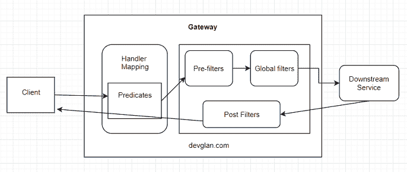

# Spring 云网关简介

> 原文：<https://dev.to/only2dhir/an-introduction-to-spring-cloud-gateway-3o89>

一个 API 网关为所有运行在下游的微服务提供了一个入口点。有许多网关解决方案可用，如 Zuul、Linkerd、Nginx 等。但是在本文中，我们将专门讨论 Spring Cloud Gateway——一个基于 Project Reactor、Spring WebFlux 和 Spring Boot 2.0 构建的反应式网关。

## Zuul Vs 春云网关

[春云网关](https://www.devglan.com/spring-cloud/spring-cloud-gateway)为非阻塞网关，而 Zuul1 为阻塞网关。在非阻塞的情况下，主线程总是可以为请求提供服务，其他多线程在后台异步处理这些请求，一旦请求被完全处理，就返回响应。因此，与阻塞网关相比，非阻塞模式需要更少的资源来服务相同数量的请求。

虽然 Zuul2 也是一个非阻塞网关，但是 Spring Cloud 不提供与 Zuul2 的现成集成，并且 spring cloud gateway 中有许多功能是 Zuul2 中不公开提供的，例如请求限制。

## 春云网关架构

[](https://res.cloudinary.com/practicaldev/image/fetch/s--lEGOwJ8r--/c_limit%2Cf_auto%2Cfl_progressive%2Cq_auto%2Cw_880/https://i.imgur.com/2N8AgtH.png) 
一旦请求到达网关，网关做的第一件事就是根据定义的谓词将请求与每条可用路由匹配。一旦路由与请求匹配，就移动到 web 处理程序，过滤器将应用于请求。网关本身提供了许多现成的过滤器来修改请求头和请求体。预过滤器专门应用于路由，而全局过滤器可应用于所有路由请求。可以应用全局过滤器在一个地方执行所有请求的认证和授权。

## 春云网关中的路由定义

路由网关的基本构造块。它由一个 ID、一个目的地 URI、一组谓词和一组过滤器定义。如果聚合谓词为真，则匹配路由。

下面是一个路由示例，它定义了一个谓词，用/api/v1/queue/**匹配所有请求 URL，并应用预过滤器来重写路径。还应用了另一个过滤器来修改请求头，然后将请求路由到负载平衡的优先服务。

```
builder.routes()
                .route(r -> r.path("/api/v1/first/**")
                        .filters(f -> f.rewritePath("/api/v1/first/(?.*)", "/${remains}")
                                        .addRequestHeader("X-first-Header", "first-service-header")
                        )
                        .uri("lb://FIRST-SERVICE/") //downstream endpoint  lb - load balanced
                        .id("queue-service"))

                .build(); 
```

下面是等价的。yaml 配置。

```
spring:
  cloud:
    gateway:
      routes:
      - id: first-service
        uri: lb://FIRST-SERVICE
        predicates:
        - Path=/api/v1/first/**
        filters:
        - RewritePath=/api/v1/first/(?.*), /$\{remains}
        - AddRequestHeader=X-first-Header, first-service-header 
```

## Spring 云网关中的 WebSocket 连接

客户机和服务器之间的实时双向通信能力是大多数现代 web 应用程序的一个关键特性。正如我们所知，Zuul 1 不支持 WebSocket 连接，而 Spring Cloud Gateway 为 WebSockets 提供了优秀且易于配置的[支持。](https://www.devglan.com/spring-cloud/spring-cloud-gateway-websockets)

下面是负载平衡 WebSockets 的路由定义。对于通知服务，我们配置了一个路由，任何与路径/websocket 匹配的请求都将被路由到通知服务。

```
.route(r -> r.path("/websocket/**")
                        .filters(f -> f.rewritePath("/websocket/(?.*)", "/${remains}"))
                        .uri("lb://NOTIFICATION-SERVICE/")
                        .id("notification-service")) 
```

Spring Cloud Gateway 提供了大量现成的功能。你可以从 Spring Cloud Gateway 上的这个[例子入手，了解 Spring Cloud Gateway 的所有特性。](https://www.devglan.com/spring-cloud/spring-cloud-gateway-example)