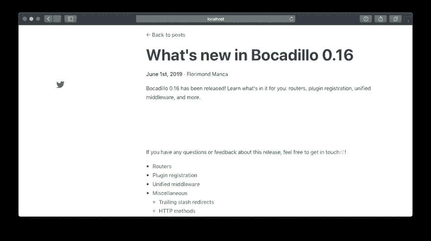

# 如何将您的 VuePress 网站升级到 1.0 版

> 原文：<https://dev.to/florimondmanca/how-to-upgrade-your-vuepress-site-to-v1-0-4lgi>

*最初发布于[blog . flori mond . dev](https://blog.florimond.dev/vuepress-upgrade-1-0)T3】*

* * *

*免责声明:我不是 VuePress 维护人员，这也不是官方指南。*

VuePress 是一款 Vue 供电的静态现场发电机。它非常适合编写技术文档，自 2018 年 12 月以来，我一直在为 [Bocadillo docs 网站](https://bocadilloproject.github.io)制作文档时使用它。

我最近得知 [VuePress v1.0 现已退出测试](https://medium.com/@_ulivz/intro-to-vuepress-1-x-7e2b7885f95f)！有许多令人兴奋的新功能。我最兴奋的是新的**插件架构**。还有一个全新的[博客主题](https://github.com/ulivz/vuepress-theme-blog)！

无论如何，这意味着是时候升级了！但是…怎么做？嗯，你很幸运！今天我们将一起探讨如何将您的 VuePress 网站从 0.x 升级到 1.x。🚀

*这篇文章是基于我为 Bocadillo 文档将 VuePress 从 0.14 升级到 1.0.1 的经验。*

## 1。阅读官方公告

ulivz(vue press 目前的维护者)发表了一篇全面的博文:[vue press 1 . x 简介](https://medium.com/@_ulivz/intro-to-vuepress-1-x-7e2b7885f95f)。它包含了很多关于 1.x 新特性的有趣信息，所以我强烈建议您先浏览一下。希望它能给你更多升级的理由！

[](https://medium.com/@_ulivz/intro-to-vuepress-1-x-7e2b7885f95f) [## VuePress 1.x. TL 简介；博士:这篇文章是尤利维兹的演讲记录

### ULIVZ<time datetime="2019-06-13T04:43:25.508Z">2019 年 6 月 13 日</time>T3】中](https://medium.com/@_ulivz/intro-to-vuepress-1-x-7e2b7885f95f) 

## 2。阅读迁移指南

VuePress 团队还在官方文档网站上发布了一份[迁移指南](https://v1.vuepress.vuejs.org/miscellaneous/migration-guide.html)。我也建议你浏览一下，尽管我们稍后会讨论主要的变化。

## 3。准备你的回购

假设您的项目已经在 Git 中签入，那么创建一个新的分支来探索 VuePress 的升级是一个好主意。你永远不知道事情是否会出错，但更重要的是，你可以通过打开一个 PR 来回顾这些变化。

所以，继续吧:

```
git checkout -b upgrade/vuepress-1.0 
```

<svg width="20px" height="20px" viewBox="0 0 24 24" class="highlight-action crayons-icon highlight-action--fullscreen-on"><title>Enter fullscreen mode</title></svg> <svg width="20px" height="20px" viewBox="0 0 24 24" class="highlight-action crayons-icon highlight-action--fullscreen-off"><title>Exit fullscreen mode</title></svg>

## 4。升级 VuePress

已经够了，该升级了！您可以使用
安装 VuePress 1.x

```
npm install vuepress@^1.0 
```

<svg width="20px" height="20px" viewBox="0 0 24 24" class="highlight-action crayons-icon highlight-action--fullscreen-on"><title>Enter fullscreen mode</title></svg> <svg width="20px" height="20px" viewBox="0 0 24 24" class="highlight-action crayons-icon highlight-action--fullscreen-off"><title>Exit fullscreen mode</title></svg>

它应该用`"vuepress": "^1.0.1"`或类似的东西更新`package.json`，也更新`package-lock.json`。

## 5。使用新的插件

VuePress 1.x 的主要新特性之一是[插件架构](https://v1.vuepress.vuejs.org/plugin/)。许多内置功能被重构为插件，所以我们需要更新 VuePress 的配置。

### 谷歌分析

谷歌分析之前可以通过配置对象中的`ga`选项进行配置(参见 [0.x 文档](https://vuepress.vuejs.org/config/#ga))。现在由[谷歌分析](https://v1.vuepress.vuejs.org/plugin/official/plugin-google-analytics.html)插件处理:

*   安装插件:

```
npm install @vuepress/plugin-google-analytics 
```

<svg width="20px" height="20px" viewBox="0 0 24 24" class="highlight-action crayons-icon highlight-action--fullscreen-on"><title>Enter fullscreen mode</title></svg> <svg width="20px" height="20px" viewBox="0 0 24 24" class="highlight-action crayons-icon highlight-action--fullscreen-off"><title>Exit fullscreen mode</title></svg>

*   用以下内容编辑`.vuepress/config.js`:

```
module.exports = { - ga: 'UA-12345678-9' + plugins: [
+   [
+     '@vuepress/google-analytics',
+     { ga: 'UA-12345678-9' }
+   ]
+ ] } 
```

<svg width="20px" height="20px" viewBox="0 0 24 24" class="highlight-action crayons-icon highlight-action--fullscreen-on"><title>Enter fullscreen mode</title></svg> <svg width="20px" height="20px" viewBox="0 0 24 24" class="highlight-action crayons-icon highlight-action--fullscreen-off"><title>Exit fullscreen mode</title></svg>

(改编自[迁移指南](https://v1.vuepress.vuejs.org/miscellaneous/migration-guide.html#ga)的说明)。

### `markdown.config`

如果您使用 [`markdown.config`配置选项](https://vuepress.vuejs.org/config/#markdown-config)来定制`markdown-it`实例，那么您现在应该使用`extendMarkdown`选项:

*   用以下内容编辑`.vuepress/config.js`:

```
module.exports = { - markdown: {
-   config(md) {
-     // ...
-   }
- } + extendMarkdown(md) {
+   // ...
+ } } 
```

<svg width="20px" height="20px" viewBox="0 0 24 24" class="highlight-action crayons-icon highlight-action--fullscreen-on"><title>Enter fullscreen mode</title></svg> <svg width="20px" height="20px" viewBox="0 0 24 24" class="highlight-action crayons-icon highlight-action--fullscreen-off"><title>Exit fullscreen mode</title></svg>

(改编自[迁移指南](https://v1.vuepress.vuejs.org/miscellaneous/migration-guide.html#markdown-config)的说明)。

然而，所有其他[降价选项](https://v1.vuepress.vuejs.org/config/#markdown)仍然有效。

### 服务人员

VuePress 的一个杀手锏是内置的服务人员支持。它允许用户在第一次访问网站后离线访问网站。

以前这是通过 [`serviceWorker`选项](https://vuepress.vuejs.org/config/#serviceworker)启用的，但是现在有了一个专用的 [pwa](https://v1.vuepress.vuejs.org/plugin/official/plugin-pwa.html) 插件:

*   安装插件:

```
npm install @vuepress/plugin-pwa 
```

<svg width="20px" height="20px" viewBox="0 0 24 24" class="highlight-action crayons-icon highlight-action--fullscreen-on"><title>Enter fullscreen mode</title></svg> <svg width="20px" height="20px" viewBox="0 0 24 24" class="highlight-action crayons-icon highlight-action--fullscreen-off"><title>Exit fullscreen mode</title></svg>

*   用以下内容编辑`.vuepress/config.js`:

```
module.exports = { - serviceWorker: true, + plugins: ['@vuepress/pwa'] } 
```

<svg width="20px" height="20px" viewBox="0 0 24 24" class="highlight-action crayons-icon highlight-action--fullscreen-on"><title>Enter fullscreen mode</title></svg> <svg width="20px" height="20px" viewBox="0 0 24 24" class="highlight-action crayons-icon highlight-action--fullscreen-off"><title>Exit fullscreen mode</title></svg>

(改编自[迁移指南](https://v1.vuepress.vuejs.org/plugin/official/plugin-pwa.html#migration-from-0-x)的说明)。

`pwa`插件有很多新特性，你可以在 [pwa 插件文档](https://v1.vuepress.vuejs.org/plugin/official/plugin-pwa.html)中了解到。

## 6。更新样式

VuePress 允许你将[自定义样式](https://v1.vuepress.vuejs.org/config/#styling)应用到你的网站上，这对于使用品牌颜色和全局 CSS 来说是很棒的。

以前，这可以使用`.vuepress/override.styl`(自定义颜色)和`.vuepress/style.styl`(任意 CSS)来完成。

VuePress 1.x 现在分别在`.vuepress/styles/palette.styl`和`.vuepress/styles/index.styl`中寻找这些(参见[迁移指南](https://v1.vuepress.vuejs.org/miscellaneous/migration-guide.html#default-theme-config))。升级仅仅是移动和重命名现有文件的问题！

注意:自定义主题现在也可以有自己的副本，如[写主题](https://v1.vuepress.vuejs.org/theme/writing-a-theme.html#directory-structure)中所述。

* * *

以上几点已经包含在官方的迁移指南中。这篇文章的其余部分着重于我必须遵循的额外步骤，以成功地将 Bocadillo 文档升级到使用 VuePress 1.x。

## 7。更新组件导入

VuePress 的另一个伟大的特性是它允许你在 Markdown 中[使用 Vue 组件，包括在`.vuepress/components`中注册你自己的组件。](https://v1.vuepress.vuejs.org/guide/using-vue.html)

默认主题附带了一堆我在自定义组件中重用的组件。

默认主题的文件结构发生了变化，所以我需要修复这些内置组件的导入。例如:

```
- import NavLink from "@theme/NavLink.vue"; + import NavLink from "@theme/components/NavLink.vue"; 
```

<svg width="20px" height="20px" viewBox="0 0 24 24" class="highlight-action crayons-icon highlight-action--fullscreen-on"><title>Enter fullscreen mode</title></svg> <svg width="20px" height="20px" viewBox="0 0 24 24" class="highlight-action crayons-icon highlight-action--fullscreen-off"><title>Exit fullscreen mode</title></svg>

我现在留意一下 [`theme-default`](https://github.com/vuejs/vuepress/tree/master/packages/%40vuepress/theme-default) 文件夹，看看可以使用`@theme/*`导入的所有内容。

## 8。修复自定义布局

VuePress 中的默认主题允许您对特定页面使用[定制布局](https://v1.vuepress.vuejs.org/theme/default-theme-config.html#custom-layout-for-specific-pages)，即使用定制组件替换负责渲染页面的 Vue 组件。为此，您在`.vuepress/components`中创建一个 Vue 组件，并在 frontmatter 中指定`layout`选项。

我一直用它来设计[新闻](https://bocadilloproject.github.io/news/)版块
中的博客文章

```
# docs/news/some-post.md
---
layout: Post
--- 
```

<svg width="20px" height="20px" viewBox="0 0 24 24" class="highlight-action crayons-icon highlight-action--fullscreen-on"><title>Enter fullscreen mode</title></svg> <svg width="20px" height="20px" viewBox="0 0 24 24" class="highlight-action crayons-icon highlight-action--fullscreen-off"><title>Exit fullscreen mode</title></svg>

当我升级到 1.x 时，布局被打破了。我有各种与默认 CSS 变化相关的布局问题，但更具体地说，导航条不再显示了！

<figure>

[](https://res.cloudinary.com/practicaldev/image/fetch/s--iIWmHOyv--/c_limit%2Cf_auto%2Cfl_progressive%2Cq_auto%2Cw_880/https://thepracticaldev.s3.amazonaws.com/i/uw54ywlgd1bximslwup0.png)

<figcaption>Ugh! The layout is off, and… where is my navbar?</figcaption>

</figure>

这是因为**赋予`layout`的组件现在完全取代了页面**(包括包含导航条、侧边栏等的基础`Layout`组件。).在这里，看看[的医生](https://v1.vuepress.vuejs.org/theme/default-theme-config.html#custom-layout-for-specific-pages)是怎么说的:

> 如果你想用一个完全定制的组件来代替页面，你可以使用 YAML 前台来指定要使用的组件:

如果我们想再次包含基底`<Layout>`，我们需要显式地将自定义布局组件包装在其中，并使用可用的[插槽](https://vuejs.org/v2/guide/components-slots.html)(参见 [Layout.vue](https://github.com/vuejs/vuepress/blob/master/packages/%40vuepress/theme-default/layouts/Layout.vue) )。

这就是`Post.vue`现在的样子:

```
<template>
  <Layout>
    <template slot="page-top">
      <!-- Page content… -->
    </template>
  </Layout>
</template>

<script>
import Layout from "@theme/layouts/Layout.vue";

export default {
  components: { Layout }
  // ...
};
</script> 
```

<svg width="20px" height="20px" viewBox="0 0 24 24" class="highlight-action crayons-icon highlight-action--fullscreen-on"><title>Enter fullscreen mode</title></svg> <svg width="20px" height="20px" viewBox="0 0 24 24" class="highlight-action crayons-icon highlight-action--fullscreen-off"><title>Exit fullscreen mode</title></svg>

一旦我解决了这个问题，导航条又回来了！

## 9。考虑主题继承

VuePress 有一个内置的默认主题，但之前定制它很困难，而且你经常不得不退出。这是不切实际的，因为你现在有很多文件不会再用新版本的 VuePress 更新了。

为了解决这个问题，VuePress 1.x 提供了一个出色的新功能，叫做[主题继承](https://v1.vuepress.vuejs.org/theme/inheritance.html)。

实际上，这意味着我们可以构建一个自定义主题，通过创建一个带有
的`.vuepress/theme/index.js`文件来扩展默认主题

```
module.exports = {
  extends: "@vuepress/default-theme"
}; 
```

<svg width="20px" height="20px" viewBox="0 0 24 24" class="highlight-action crayons-icon highlight-action--fullscreen-on"><title>Enter fullscreen mode</title></svg> <svg width="20px" height="20px" viewBox="0 0 24 24" class="highlight-action crayons-icon highlight-action--fullscreen-off"><title>Exit fullscreen mode</title></svg>

然后[通过将一组特定的组件](https://v1.vuepress.vuejs.org/theme/inheritance.html#override-components)放到`.vuepress/theme/components`中来覆盖它们。它们将在`@theme`别名下可用，就像它们来自默认主题一样！

**注意**:除此之外，Vue 本身还允许你[扩展组件](https://alligator.io/vuejs/composing-components/#extends)，这对于基于默认主题中包含的一个组件(或者其他组件，真的)创建一个定制组件非常有用。

我自己在升级 Bocadillo docs 时没有用过这个，所以我不能说得更详细，但我认为这个新特性绝对值得分享！

## 10。最终检查

一旦你完成了上面的步骤，你应该确保你的网站在投入生产之前能够正确地运行和构建。

例如，您可以:

*   运行`vuepress dev`来启动 dev 服务器，然后四处查看是否有任何异常或损坏的东西。
*   运行`vuepress build`以确保构建顺利运行。
*   为建好的网站服务，确保没有最终的裂缝。这个我喜欢用 Python:`$ python -m http.server -d path/to/.vuepress/dist`。

## 结论

就是这个！你的 VuePress 网站现在应该升级到 1.x 了。希望这对你从 0.x 升级有用，也许你已经了解了 1.x 中的新功能。

如果你对我的升级感兴趣，你可以看看 Bocadillo docs 网站的 [Pull 请求](https://github.com/bocadilloproject/bocadillo/pull/309/files)。

升级快乐！