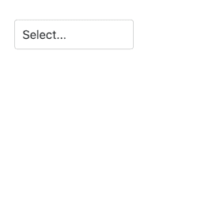
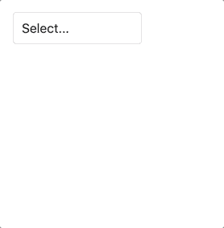

# Elm 中的键盘可访问下拉菜单

> 原文：<https://dev.to/margaretkrutikova/keyboard-accessible-dropdown-in-elm-5gh5>

<sup>*——还有我是怎么发现浏览器很牛逼的！*😍</sup>
这是我上一篇文章的后续，在那篇文章中我展示了如何[解码来自事件对象的 DOM 节点](https://dev.to/margaretkrutikova/elm-dom-node-decoder-to-detect-click-outside-3ioh)来检测外部点击。我将使用这个技巧和更多的技巧来创建一个下拉菜单，它可以只使用键盘。

我将解释如何正确处理键盘和焦点事件，这将为可访问的下拉菜单打下良好的基础。然而，我不会讨论可访问性的另一个重要方面——ARIA 属性。最终版本会是这样的:
[](https://res.cloudinary.com/practicaldev/image/fetch/s--K369LDUd--/c_limit%2Cf_auto%2Cfl_progressive%2Cq_66%2Cw_880/https://thepracticaldev.s3.amazonaws.com/i/irrxkspelmt5fj6tty3b.gif)

所有源代码都在我的 [github](https://github.com/MargaretKrutikova/elm-accessible-dropdown) 和[艾莉](https://ellie-app.com/5PvmxZtNYw9a1)上。

## 要求

让我们正式定义我们想要的功能。用户应该能够:

*   按 tab 键进入下拉菜单，
*   用回车键或空格键打开它，
*   使用箭头键⬆️和⬇️导航时的焦点选项，
*   用 Enter/Space 选择当前聚焦的选项，
*   用 Escape 键或 tab 键退出来关闭下拉菜单。

实施包括:

*   订阅`keydown`事件，
*   解码被按下的键，
*   根据按下的键更新模型，
*   使用箭头键导航时将焦点设置在选项上，
*   处理焦点入/出以打开/关闭下拉菜单。

## HTML 结构

让我们为打开的下拉列表添加一些`HTML`来更好地理解它的结构:

```
<div id="dropdown">
  <button id="dropdown-button">Select option</button>
  <div>
    <ul id="dropdown-list">
      <li id="option_1">Option 1</li>
      <li id="option_2">Option 2</li>
      ...
    </ul>
  </div>
</div> 
```

Enter fullscreen mode Exit fullscreen mode

这里我们想为根节点`div`(id 为`dropdown`)附加一个自定义事件监听器`keydown`，并根据按下的键，根据我们上面定义的需求更新模型。

## 型号

为了使用向上/向下箭头导航选项列表，我们需要跟踪当前聚焦的项目。我们还需要知道
下拉列表是否打开，选择的选项 id，以及要显示的选项列表:

```
type alias Model =
    { open : Bool
    , selectedId : Maybe String
    , focusedId : Maybe String
    , options : List String
    } 
```

Enter fullscreen mode Exit fullscreen mode

## 附加自定义按键事件

Elm 允许附加自定义事件侦听器，并从事件对象中解码属性。`Html.Events`暴露 [`on`](https://package.elm-lang.org/packages/elm/html/latest/Html-Events#on) ，它接受事件名称和一个`JSON`解码器。

然而，如果我们只是用`on`听`keydown`，并尝试按下向上/向下箭头，我们将看到整个页面滚动，因为这是默认的浏览器行为(你可以在这个小[艾莉](https://ellie-app.com/5PvvT7pXfwBa1)中自己检查)。

我们可以通过在附加事件监听器时使用 [`preventDefaultOn`](https://package.elm-lang.org/packages/elm/html/latest/Html-Events#preventDefaultOn) 而不是`on`来解决这个问题。`preventDefaultOn`需要一个消息的元组解码器和一个布尔值，指示是否阻止默认。让我们在视图中将其与`keydown`事件的消息一起使用:

```
import Html.Events as Events

type KeyPressed
    = Up
    | Down
    | Escape
    | Enter
    | Space
    | Other

type Msg  =
    ...
    | KeyPress KeyPressed

viewDropdown : Model -> Html Msg
viewDropdown model =
    div
        [ id "dropdown"
        , Events.preventDefaultOn "keydown" keyDecoder
        ]
        [...] 
```

Enter fullscreen mode Exit fullscreen mode

让我们实现`keyDecoder`来接收事件对象，解码它，分派`KeyPress`并阻止默认的滚动行为。为了提取按下的键，我们可以从事件对象中使用 [`event.key`](https://developer.mozilla.org/en-US/docs/Web/API/KeyboardEvent/key) ，并将其转换为我们的自定义类型`KeyPressed` :

```
keyDecoder : Decode.Decoder ( Msg, Bool )
keyDecoder =
    Decode.field "key" Decode.string
        |> Decode.map toKeyPressed
        |> Decode.map
            (\key ->
                ( KeyPress key, preventDefault key )
            )

preventDefault key =
    key == Up || key == Down

toKeyPressed : String -> KeyPressed
toKeyPressed key =
    case key of
        "ArrowUp" -> Up

        "ArrowDown" -> Down

        "Escape" -> Escape

        "Enter" -> Enter

        " " -> Space

        _ -> Other 
```

Enter fullscreen mode Exit fullscreen mode

*注意:这不是 elm 格式化程序的原始格式，为了节省屏幕空间，去掉了一些额外的换行符。*

处理键盘事件的类似方法记录在 [elm 键盘注释](https://github.com/elm/browser/blob/master/notes/keyboard.md)中。

## 更新功能

在更新功能中，我们可以处理`KeyPress`并根据下拉菜单当前是关闭还是打开对一组特定的键做出反应。让我们看看开放状态下的实现是什么样子:

```
handleKeyWhenOpen : Model -> KeyPressed -> ( Model, Cmd Msg )
handleKeyWhenOpen model key =
    case key of
        Enter ->
            ( { model | selectedId = model.focusedId }, Cmd.none )
        Space ->
            ( { model | selectedId = model.focusedId }, Cmd.none )
        Up ->
            ( { model | focusedId = getPrevId model }, Cmd.none )
        Down ->
            ( { model | focusedId = getNextId model }, Cmd.none )
        Escape ->
            ( { model | open = False }, Cmd.none )
        Other ->
            ( model, Cmd.none ) 
```

Enter fullscreen mode Exit fullscreen mode

这里`getPrevId`和`getNextId`从聚焦的项目中找到左边和右边的项目。你可以在我的 [github](https://github.com/MargaretKrutikova/elm-accessible-dropdown/blob/master/src/AccessibleDropdown.elm#L408) 上查看他们的实现。

让我们看看目前为止我们有什么:

[](https://res.cloudinary.com/practicaldev/image/fetch/s--DWaYE4p9--/c_limit%2Cf_auto%2Cfl_progressive%2Cq_66%2Cw_880/https://thepracticaldev.s3.amazonaws.com/i/6h6ipcc99kiwdd2jsuws.gif)

哦哦...列表不会滚动到聚焦的选项中，并且会从可见区域中消失。因此，当焦点项改变时，我们需要更新滚动位置。为了解决这个问题，我首先卷起袖子，使用`Dom.getViewportOf`、`Dom.getElement`、`Dom.setViewportOf`并计算偏移位置，提出了自己的实现。🤯

我为我的*智能*解决方案感到非常自豪，后来才发现浏览器对聚焦元素有这种内置的行为**。😲🤦‍♀️**

从 [MDN 文档中的](https://developer.mozilla.org/en-US/docs/Web/API/HTMLElement/focus)，`focus`元素上的方法:

> 将元素滚动到浏览器窗口的可见区域

<sup>**哇！浏览器太牛了！**💪</sup>
通过在用键导航时将焦点设置在选项上，我们将自动获得想要的滚动行为，让我们就这么做吧！

## 聚焦导航选项

`Browser.Dom`暴露 [`focus`](https://package.elm-lang.org/packages/elm/browser/latest/Browser-Dom#focus) 接受元素的 id 并试图聚焦它。我们将使用 [`Task.attempt`](https://package.elm-lang.org/packages/elm/core/latest/Task#attempt) 将从`focus`返回的`Task`转换成命令:

```
import Task

type Msg
    = KeyPress KeyPressed
    | NoOp

focusOption : String -> Cmd Msg
focusOption optionId =
    Task.attempt (\_ -> NoOp) (Dom.focus optionId) 
```

Enter fullscreen mode Exit fullscreen mode

让我们每次使用箭头键
导航时都使用`focusOption`

```
handleKeyWhenOpen model key =
    case key of
        Up ->
            navigateWithKey model (getPrevId model)
        Down ->
            navigateWithKey model (getNextId model)
        ...

navigateWithKey : Model -> Maybe String -> ( Model, Cmd Msg )
navigateWithKey model focusedId =
    ( { model | focusedId = focusedId }
    -- here we use focusOption
    , focusedId |> Maybe.map focusOption |> Maybe.withDefault Cmd.none
    ) 
```

Enter fullscreen mode Exit fullscreen mode

要做到这一点，我们的`html`中的每个`li`都需要有一个 id 和标签索引才能被聚焦。因此，让我们相应地修改我们的观点:

```
import Html.Attributes exposing (id, tabindex)

viewOption : Model -> Option -> Html Msg
viewOption model option =
    li
        [ id option.id, tabindex -1 ]
        [ text option.label ] 
```

Enter fullscreen mode Exit fullscreen mode

我在这里也做了一点手脚，在我的`css`中添加了`scroll-behavior: smooth;`来使滚动看起来更好，因为为什么不呢？

现在，我们还有一件事要做——关闭焦点上的下拉菜单。

## 把手聚焦出去

在我之前的中，我展示了如何解码事件对象以在点击外部时关闭下拉菜单。简而言之，解码器使用`event.target`，遍历 DOM 树，检查每个元素的 id 是否与下拉列表的 id 相匹配，如果找到匹配的话——事件发生在下拉列表内部。

让我们使用同样的方法，但是对于事件对象上的`focusout`事件和`relatedTarget`属性。 [`relatedTarget`](https://developer.mozilla.org/en-US/docs/Web/API/MouseEvent/relatedTarget) 在这种情况下将该元素接收焦点。我们将使用来自`Browser.Events` :
的`on`附加一个自定义事件监听器

```
viewDropdown : Model -> Html Msg
viewDropdown model =
    div
        [ id "dropdown"
        , Events.preventDefaultOn "keydown" keyDecoder
        , Events.on "focusout" (onFocusOut "dropdown")
        ]
        [...]

onFocusOut : String -> Decode.Decoder Msg
onFocusOut id =
    outsideTarget "relatedTarget" id 
```

Enter fullscreen mode Exit fullscreen mode

这里的`outsideTarget`是一个解码器，它将回答这个问题:**是下拉列表之外的一个元素接管了焦点吗？**发送关闭下拉菜单的消息。[这里的](https://github.com/MargaretKrutikova/elm-accessible-dropdown/blob/master/src/AccessibleDropdown.elm#L320)是解码器的源代码。

## 大结局

我们现在已经为下拉菜单实现了键盘支持。剩下来要满足可访问性需求的就是添加适当的`ARIA`属性，并用屏幕阅读器测试下拉菜单。

对于下拉菜单的实现，我参考了以下关于可访问性的资源，这些资源可能有助于进一步改进它:

*   [列表框的键盘交互](https://developer.mozilla.org/en-US/docs/Web/Accessibility/ARIA/Roles/listbox_role#Keyboard_interactions)，
*   [咏叹调练习，可折叠下拉菜单](https://www.w3.org/TR/wai-aria-practices/examples/listbox/listbox-collapsible.html)。

* * *

谢谢你的来访！💨